# AWCMS-Micro Project Skills

Skill Claude Code tingkat-proyek untuk AWCMS-Micro. Setiap skill meng-encode standar dari `docs/awcms-micro/` sehingga coding agent menerapkannya secara konsisten. Skill dipanggil otomatis oleh model saat relevan, atau manual via `/<nama-skill>`.

> Baca [`../../AGENTS.md`](../../AGENTS.md) lebih dulu untuk aturan wajib & alur kerja.

## Katalog

| Skill                                                    | Kapan dipakai                                                                                                                                                                            | Sumber docs                                                  |
| -------------------------------------------------------- | ---------------------------------------------------------------------------------------------------------------------------------------------------------------------------------------- | ------------------------------------------------------------ |
| `awcms-micro-implement-issue`                            | Orkestrator: kerjakan satu issue/sprint atomic end-to-end                                                                                                                                | 06, 11, 12                                                   |
| `awcms-micro-new-module`                                 | Scaffold modul baru di `src/modules/`                                                                                                                                                    | 10, 11                                                       |
| `awcms-micro-module-management`                          | Kelola/konsumsi sistem Module Management (registry, lifecycle, settings, health)                                                                                                         | module-management/README.md                                  |
| `awcms-micro-new-migration`                              | Buat/ubah migration SQL (tabel, index, RLS)                                                                                                                                              | 04, 10                                                       |
| `awcms-micro-new-endpoint`                               | Tambah/ubah endpoint REST + OpenAPI                                                                                                                                                      | 05, 10                                                       |
| `awcms-micro-new-event`                                  | Tambah/ubah domain event + AsyncAPI                                                                                                                                                      | 05                                                           |
| `awcms-micro-idempotency`                                | Mutation high-risk anti double-submit                                                                                                                                                    | 10                                                           |
| `awcms-micro-abac-guard`                                 | Kontrol akses default-deny + RLS                                                                                                                                                         | 03, 10                                                       |
| `awcms-micro-audit-log`                                  | Audit aksi high-risk + redaction                                                                                                                                                         | 03, 10                                                       |
| `awcms-micro-observability`                              | Correlation ID otomatis, retensi/purge audit log, extension point log/audit                                                                                                              | 10, 16, 20                                                   |
| `awcms-micro-new-migration` + `awcms-micro-new-endpoint` | Soft delete/restore/purge resource deletable                                                                                                                                             | 04, 05, 10, 16                                               |
| `awcms-micro-sensitive-data`                             | Normalize/hash/mask identifier sensitif                                                                                                                                                  | 04                                                           |
| `awcms-micro-sync-hmac`                                  | Sync push/pull bertanda HMAC + anti-replay                                                                                                                                               | 08, 10                                                       |
| `awcms-micro-security-review`                            | Review keamanan modul                                                                                                                                                                    | 12, 13                                                       |
| `awcms-micro-codeql-triage`                              | Triase & perbaiki temuan CodeQL code scanning (termasuk katalog false-positive)                                                                                                          | 20                                                           |
| `awcms-micro-pr-review`                                  | Review pull request terhadap DoD                                                                                                                                                         | 09, 10, 12                                                   |
| `awcms-micro-testing`                                    | Tulis test berlapis (unit→security)                                                                                                                                                      | 07                                                           |
| `awcms-micro-browser-test`                               | E2E browser sungguhan (Playwright + Bun) — puncak piramida testing                                                                                                                       | 07, browser-test/SKILL.md                                    |
| `awcms-micro-production-preflight`                       | Preflight & go-live readiness                                                                                                                                                            | 07, 12                                                       |
| `awcms-micro-deploy`                                     | Pilih & jalankan profil deployment (LAN-first vs registry/Coolify)                                                                                                                       | 18, deploy-coolify.md                                        |
| `awcms-micro-ui-screen`                                  | Implementasi layar/komponen UI sesuai design system                                                                                                                                      | 14, 15                                                       |
| `awcms-micro-wizard-form`                                | Form multi-step (reusable wizard pattern)                                                                                                                                                | wizard-form-pattern.md                                       |
| `awcms-micro-form-drafts`                                | Server-side draft persistence (resume lintas sesi/perangkat)                                                                                                                             | form-drafts/README.md                                        |
| `awcms-micro-email`                                      | Kirim email transaksional (provider-neutral, template management, outbox)                                                                                                                | email/README.md                                              |
| `awcms-micro-i18n`                                       | String UI `.po` gettext & konten multi-bahasa                                                                                                                                            | 14, 04, 19                                                   |
| `awcms-micro-release`                                    | Rilis versi via Changesets (bump, CHANGELOG, tag)                                                                                                                                        | 09                                                           |
| `awcms-micro-legacy-migration`                           | Migrasi data legacy aman (dry-run, backfill)                                                                                                                                             | 07, 06                                                       |
| `awcms-micro-blog-content`                               | Kerjakan bagian mana pun epic blog_content (Issue #537-#543)                                                                                                                             | blog-content/README.md                                       |
| `awcms-micro-tenant-domain-routing`                      | Kerjakan bagian mana pun epic online public routing & tenant domain (Issue #556-#567)                                                                                                    | tenant-domain-routing/SKILL.md                               |
| `awcms-micro-auth-online-hardening`                      | Kerjakan bagian mana pun epic full-online auth security hardening (Issue #587-#593)                                                                                                      | auth-online-hardening/SKILL.md                               |
| `awcms-micro-visitor-analytics`                          | Kerjakan bagian mana pun epic visitor analytics (Issue #617-#624)                                                                                                                        | visitor-analytics/SKILL.md                                   |
| `awcms-micro-news-portal`                                | Kerjakan bagian mana pun epic news_portal full-online R2-only media (Issue #631-#642, #649)                                                                                              | news-portal/SKILL.md                                         |
| `awcms-micro-idn-admin-regions`                          | Kerjakan bagian mana pun epic master data wilayah administratif Indonesia (Issue #655-#664)                                                                                              | idn-admin-regions/SKILL.md                                   |
| `awcms-micro-social-publishing`                          | Kerjakan bagian mana pun epic social_publishing auto-posting outbox foundation (Issue #643-#647)                                                                                         | social-publishing/SKILL.md                                   |
| `awcms-micro-data-lifecycle`                             | Daftarkan tabel bervolume tinggi ke registry retensi/partisi/arsip/legal hold/purge (Issue #745)                                                                                         | data-lifecycle/README.md, data-lifecycle.md                  |
| `awcms-micro-erp-extension-readiness`                    | Konsumsi/evolusikan kontrak kesiapan ekstensi ERP — business transaction, posting, period-lock, item/currency/UoM, inventory movement, reconciliation, reporting projection (Issue #755) | erp-extension-readiness/SKILL.md, erp-extension-contracts.md |
| `awcms-micro-document-infrastructure`                    | Kerjakan bagian mana pun modul document_infrastructure — registry dokumen generik, versioning, classification, numbering (Issue #751)                                                    | document-infrastructure/SKILL.md                             |
| `awcms-micro-integration-hub`                            | Kerjakan bagian mana pun modul integration_hub — inbound webhook, outbound subscription, adapter health, SSRF guard (Issue #754)                                                         | integration-hub/SKILL.md                                     |
| `awcms-micro-workflow-approval`                          | Kerjakan bagian mana pun modul workflow_approval — graph engine, quorum, delegation, escalation (Issue 11.1, evolved #747)                                                               | workflow-approval/SKILL.md                                   |
| `awcms-micro-profile-identity`                           | Kerjakan bagian mana pun modul profile_identity — party CRUD, dedup, merge workflow, cross-tenant guard (Issue 2.2, dilengkapi #748)                                                     | profile-identity/SKILL.md                                    |

## Katalog peningkatan (improvement/hardening)

Skill di bawah bersifat **peningkatan** — menilai & menaikkan mutu artefak yang sudah ada, bukan membangunnya dari nol. Pakai setelah fitur jalan, saat audit, atau menjelang go-live.

| Skill                            | Kapan dipakai                                                           | Sumber docs |
| -------------------------------- | ----------------------------------------------------------------------- | ----------- |
| `awcms-micro-ux-review`          | Audit & naikkan mutu UI/UX yang sudah ada (usability, a11y AA, i18n)    | 14, 15, 19  |
| `awcms-micro-performance`        | Tuning performa aplikasi & database (query, index, pagination, pool)    | 16, 07      |
| `awcms-micro-integration`        | Kerasan backend & integrasi eksternal (outbox, retry, webhook, kontrak) | 16, 05, 10  |
| `awcms-micro-security-hardening` | Audit keamanan berbasis standar (OWASP Top 10, ASVS, ISO 27001)         | 20, 10, 13  |

## Katalog maintenance/tooling

Skill di bawah bukan build fitur maupun audit — murni menjaga artefak
mekanis (docs snapshot, dsb.) tetap sinkron dengan state eksternal.

| Skill                         | Kapan dipakai                                                                                     | Sumber docs             |
| ----------------------------- | ------------------------------------------------------------------------------------------------- | ----------------------- |
| `awcms-micro-github-snapshot` | Refresh `docs/awcms-micro/github/` setelah issue/label/milestone/security alert berubah di GitHub | github/README.md        |
| `awcms-micro-repo-inventory`  | Regenerate `docs/awcms-micro/repo-inventory.md` setelah menambah modul/migration/tabel/test/route | repo-inventory/SKILL.md |

## Peta pemakaian

```mermaid
flowchart TD
  II[awcms-micro-implement-issue] --> NM[awcms-micro-new-module]
  NM --> MM[awcms-micro-module-management]
  MM --> ABAC
  II --> MIG[awcms-micro-new-migration]
  II --> EP[awcms-micro-new-endpoint]
  II --> EV[awcms-micro-new-event]
  II --> TST[awcms-micro-testing]
  TST --> BRT[awcms-micro-browser-test]
  EP --> ABAC[awcms-micro-abac-guard]
  EP --> IDEM[awcms-micro-idempotency]
  ABAC --> AUD[awcms-micro-audit-log]
  AUD --> OBS[awcms-micro-observability]
  EP --> OBS
  EP --> SD[awcms-micro-sensitive-data]
  EV --> SYNC[awcms-micro-sync-hmac]
  II --> UI[awcms-micro-ui-screen]
  UI --> I18N[awcms-micro-i18n]
  UI --> WIZ[awcms-micro-wizard-form]
  WIZ --> IDEM
  WIZ --> I18N
  WIZ --> DRAFT[awcms-micro-form-drafts]
  DRAFT --> IDEM
  DRAFT --> ABAC
  II --> LEG[awcms-micro-legacy-migration]
  II --> BLOG[awcms-micro-blog-content]
  BLOG --> EP
  BLOG --> MIG
  II --> TDR[awcms-micro-tenant-domain-routing]
  TDR --> EP
  TDR --> MIG
  TDR --> NM
  TDR --> BLOG
  TDR --> MM[awcms-micro-module-management]
  II --> AOH[awcms-micro-auth-online-hardening]
  AOH --> EP
  AOH --> IDEM
  AOH --> ABAC
  AOH --> AUD
  AOH --> SD
  II --> VA[awcms-micro-visitor-analytics]
  VA --> MIG
  VA --> NM
  VA --> EP
  VA --> UI
  VA --> SD
  II --> PR[awcms-micro-pr-review]
  PR --> SEC[awcms-micro-security-review]
  PR --> CQ[awcms-micro-codeql-triage]
  SEC --> PF[awcms-micro-production-preflight]
  PF --> DEP[awcms-micro-deploy]
  DEP --> REL[awcms-micro-release]

  UI --> UXR[awcms-micro-ux-review]
  EP --> PERF[awcms-micro-performance]
  EP --> INT[awcms-micro-integration]
  INT --> OBS
  SEC --> HARD[awcms-micro-security-hardening]
  HARD --> OBS
  PERF --> PF
  HARD --> PF
  EP --> EMAIL[awcms-micro-email]
  EMAIL --> INT
  EMAIL --> SD
  II --> DL[awcms-micro-data-lifecycle]
  DL --> MIG
  DL --> NM
  DL --> EP
  DL --> ABAC
  DL --> AUD
  DL --> IDEM
  II --> ERPX[awcms-micro-erp-extension-readiness]
  ERPX --> IDEM
  ERPX --> EV
  II --> DOCI[awcms-micro-document-infrastructure]
  DOCI --> MIG
  DOCI --> EP
  DOCI --> ABAC
  DOCI --> AUD
  DOCI --> IDEM
  II --> IH[awcms-micro-integration-hub]
  IH --> MIG
  IH --> EP
  IH --> ABAC
  IH --> AUD
  IH --> INT
  II --> WF[awcms-micro-workflow-approval]
  WF --> MIG
  WF --> EP
  WF --> ABAC
  WF --> AUD
  WF --> IDEM
  WF --> EV
  II --> PI[awcms-micro-profile-identity]
  PI --> MIG
  PI --> EP
  PI --> ABAC
  PI --> AUD
  PI --> SD
```

## Subagents (`.claude/agents/`)

Selain skill, tersedia **subagent** untuk delegasi kerja penuh:

| Agent                          | Peran                                               | Tools     |
| ------------------------------ | --------------------------------------------------- | --------- |
| `awcms-micro-coder`            | Implementasi issue end-to-end (Prompt Induk doc 12) | Semua     |
| `awcms-micro-reviewer`         | Review PR/diff terhadap DoD (read-only)             | Read-only |
| `awcms-micro-security-auditor` | Audit keamanan modul, verdict go-live (read-only)   | Read-only |

Pola pakai: `awcms-micro-coder` mengerjakan issue → `awcms-micro-reviewer` mereview → modul sensitif diaudit `awcms-micro-security-auditor`.

## Konvensi

- Nama skill: `awcms-micro-<area>`; folder `<nama>/SKILL.md`.
- Frontmatter `description` memuat pemicu (kapan dipakai) agar model memilih dengan tepat.
- Skill merujuk ke `docs/awcms-micro/*` sebagai sumber kebenaran, bukan menduplikasi seluruh isinya.
