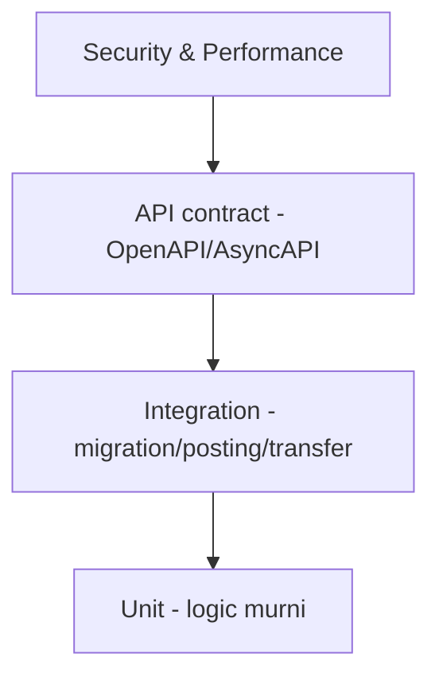

# AWCMS-Micro — Testing Strategy

Ikuti `docs/awcms-micro/07_sprint_testing_production_readiness.md`. Jalankan dengan `bun test`.

## Piramida

## Target unit test

ABAC evaluator · profile resolver · soft delete/restore guard · product price selection · stock movement calc · checkout total · idempotency service · posting guard · VAT calc · warehouse transfer state machine · cycle count variance · HMAC signature · AI tool policy.

## Target integration test

Migration dari DB kosong · setup wizard · login owner/operator · product create/soft-delete/restore · opening stock · checkout/posting · stok berkurang · receipt PDF · sync outbox event · VAT draft · warehouse transfer · ABAC & RLS.

## API contract test

OpenAPI valid · success/error schema standar · tenant header ada · idempotency header ada · pagination konsisten · includeDeleted/restore/purge contract konsisten · sensitive data tidak tampil penuh.

## Security test

Tenant A tidak baca Tenant B · archive view butuh permission · operator tidak export Coretax · operator tidak assign role · customer hanya receipt miliknya · password/token/API key tidak di response/log · NPWP/NIK/phone/email masked · sync HMAC invalid ditolak · AI raw PII/SQL ditolak · **rute publik/tanpa-sesi tidak pernah membocorkan konten non-publik** (draft/review/scheduled-future/archived/private/unlisted/deleted) — reusable untuk modul apa pun yang punya split visibilitas publik vs privat (mis. `blog_content`, epic #536, Issue #540): sentralisasi satu predicate visibilitas dan tes predicate itu sendiri secara exhaustive, jangan andalkan filter query yang tersebar per-endpoint.

## Content sanitization test (modul dengan rich/structured content)

Untuk modul yang menyimpan konten terstruktur milik pengguna yang di-render ke HTML (mis. blog post body) — bukan sekadar string biasa: reject/strip `<script>`, inline `on*=` handler, `javascript:` URL, `<iframe>`/embed tak tepercaya saat validasi input **dan** saat render (dua lapis, jangan andalkan salah satu saja). Simpan JSON terstruktur (blok konten bertipe) sebagai sumber kebenaran, bukan HTML mentah dari klien.

## Performance target awal

Product search < 300ms · add item < 300ms · post transaksi < 1.5s · receipt PDF < 3s · sales daily report < 2s · pool acquire critical < 500ms · sync push small batch < 2s.

## Lokasi

Konvensi nyata repo ini (bukan sub-folder per domain): file **flat** langsung di `tests/`, satu file per area — `<area>.test.ts` (unit, tanpa DB) dan `tests/integration/<area>.integration.test.ts` (butuh `DATABASE_URL`, di-skip otomatis tanpanya — **jangan asumsikan `bun test` tanpa `DATABASE_URL` berarti semua test lulus**, integration test-nya cuma dilewati diam-diam). Contoh: `tests/access-control.test.ts`, `tests/module-management-tenant-lifecycle.test.ts`, `tests/integration/module-tenant-lifecycle.integration.test.ts`.

## Aturan

- Setiap fitur baru minimal punya unit test logic + satu integration/contract test.
- Test tenant-scoped memakai tenant context; jangan bergantung data global.

## Gotcha integration test (real-handler, `tests/integration/*.integration.test.ts`)

Dari #271/#272/#273 (harness `tests/integration/harness.ts`) — hemat re-investigasi:

- **Dua client, jangan tertukar**: `getAdminSql()` = privileged (BYPASS RLS) — HANYA untuk seeding/truncation. `getTestSql()` = least-priv `awcms_micro_app` setelah `provisionAppRole()` (FORCE RLS aktif) — dipakai handler & SEMUA assertion. **Negatif cross-tenant WAJIB lewat `getTestSql()`**; `count==0` di query yang TIDAK punya predikat `tenant_id` sendiri itulah yang membuktikan RLS (bentuk kuat). Selalu pasangkan tiap negatif dengan positif di role yang sama (RLS misconfigured pun bisa lolos negatif "kosong").
- **`src/middleware.ts` TIDAK bisa di-import di `bun test`** (import virtual module `astro:middleware`). Test security-header harus assert `buildSecurityHeaders(...)` di atas Response handler nyata, bukan menjalankan middleware. `Content-Security-Policy` = fitur Astro `security.csp` (build+browser saja), TIDAK pernah di `buildSecurityHeaders` — jangan klaim CSP diuji di integration.
- **`invoke`/`invokeRaw` BYPASS middleware** → `meta.correlationId` tidak di-inject in-process (prod middleware yang inject). Body anti-enumeration sudah bebas correlationId lewat harness; tetap normalisasi (`.replace(/"correlationId":"[^"]*"/,…)`) sebelum bandingkan byte — jangan bandingkan seluruh body mentah (kalau ada correlationId, mustahil identik).
- **Rate-limit bucket bersama**: `resolveClientIp` kembali `"unknown"` tanpa `X-Forwarded-For`/`clientAddress` → SEMUA call in-process berbagi SATU bucket (fixed window 1 jam). Suite apa pun yang memukul route ber-rate-limit (mis. `POST /newsletter/subscribe`, cap 30) WAJIB `resetRateLimitStoreForTests()` (dari `src/lib/security/rate-limit`) di `beforeEach`, atau flake 429 di belakang suite lain yang menembak route sama.
- **Tenant bare vs setup-wizard**: tenant yang di-seed langsung (tanpa wizard) TIDAK lolos gate route publik blog/news (`isLegacyTenantRouteEnabled`, `checkBlogContentAndRouteGate`). Render publik POSITIF harus bootstrap via wizard; tenant bare hanya untuk assertion NEGATIF (404/absen) + surface service-level (site_search/comments/newsletter/seo redirect+sitemap) yang lewati gate. Lock singleton = tabel `awcms_micro_setup_state` saja, bukan keberadaan tenant.
- **Flaky Quality**: kaskade ~20 suite tak-terkait yang timeout serempak `5000–5001ms` = kontensi/saturasi pool, BUKAN bug logika. Perubahan test-only string tak mungkin menyebabkannya. Ambil data point kedua (`gh run rerun <id> --failed`) sebelum menyalahkan diff.
- `DATABASE_URL` di sandbox lokal sering tak reachable (host→container diblokir) → integration/E2E hanya jalan di CI; verifikasi lokal: `bunx tsc --noEmit` + prettier, lalu andalkan CI. Reproduksi SQL cepat via `docker exec <pg-container> psql`.
