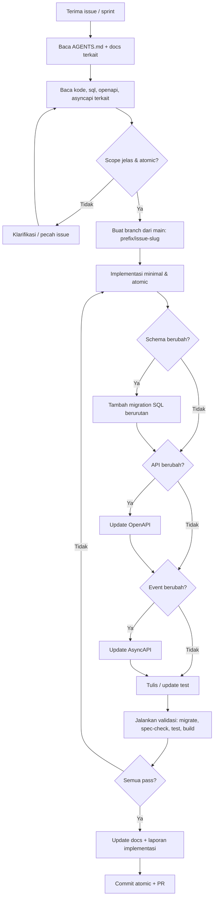
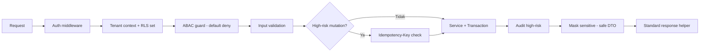
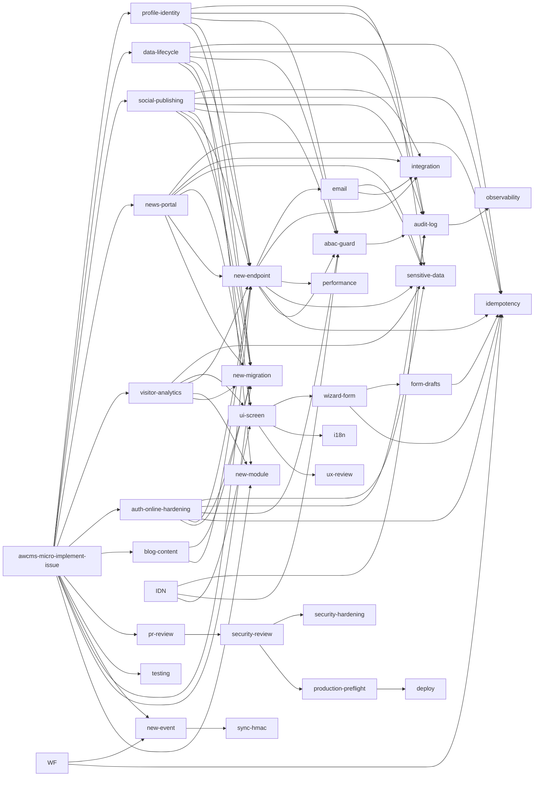
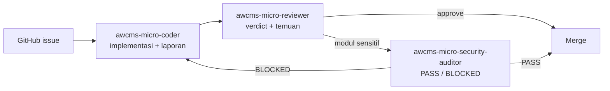

# AGENTS.md — Panduan Agent & Kontributor AWCMS-Micro

Dokumen ini adalah **kontrak kerja** untuk coding agent (Claude Code, Codex, dsb.) maupun developer manusia yang mengimplementasikan AWCMS-Micro. Setiap sesi implementasi **wajib membaca file ini terlebih dahulu**, lalu dokumen terkait di `docs/awcms-micro/`.

> **Konteks keluarga produk:** kontrak repository ini (AGENTS.md, README.md, CONTRIBUTING.md, `derived-application-guide.md`, dan skill proyek) menjadi **sumber utama** bagi [`docs/Pedoman_Penggunaan_Agent_Keluarga_AWCMS_v1.0.pdf`](docs/Pedoman_Penggunaan_Agent_Keluarga_AWCMS_v1.0.pdf) — pedoman penggunaan agent yang berlaku lintas keluarga produk (AWCMS, AWCMS-Mini, AWCMS-Micro, dan software turunannya). Bila ada perbedaan, dokumen repository ini (AGENTS.md, ADR, kontrak) tetap sumber kebenaran paling spesifik untuk repo ini.

> ## ⚠️ BACA INI LEBIH DULU — TEMPLATE website dipakai langsung
>
> **AWCMS-Micro adalah template full-online website yang dipakai LANGSUNG** — bukan basis-turunan-wajib yang di atasnya harus dibangun aplikasi terpisah. Konvensinya **diwarisi** dari standar [`ahliweb/awcms-mini`](https://github.com/ahliweb/awcms-mini) (asal-usul historis), sejajar dengan lineage ERP `ahliweb/awcms`. Keputusan reposisi: **[ADR-0034](docs/adr/0034-template-repositioning-online-store-scope-and-derived-app-deprecation.md)** (men-supersede sebagian [ADR-0025](docs/adr/0025-website-scope-derivation-from-awcms-mini.md)) — wajib dibaca sebelum menambah/menghapus modul.
>
> **Scope = full-online website hingga TOKO ONLINE (e-commerce).** Spektrum membentang sampai katalog produk, etalase, keranjang & **checkout online** — semuanya permukaan **website publik**, arah ekstensi in-scope. **Bukan POS in-store** (kasir fisik/offline-first/struk/Coretax/ops gudang) — itu lineage ERP `awcms`. Registry base = **22 modul**: fondasi (`tenant_admin`, `profile_identity`, `identity_access`, `logging`, `module_management`), layanan platform (`sync_storage`, `media_library`, `domain_event_runtime`, `data_lifecycle`, `reporting`, `email`, `form_drafts`), website (`tenant_domain`, `blog_content`, `news_portal`, `social_publishing`, `visitor_analytics`, `seo_distribution`, `theming`, `site_search`, `comments`, `newsletter`). Lihat `src/modules/index.ts` untuk daftar & jumlah yang selalu terkini.
>
> **Tujuh modul upstream TIDAK diport** — `workflow`, `organization_structure`, `document_infrastructure`, `data_exchange`, `integration_hub`, `reference_data`, `idn_admin_regions`. Jangan "memperbaiki" rujukan ke modul-modul itu dengan menghidupkannya kembali; itu keputusan scope, bukan kelalaian — mereka milik lineage ERP `awcms`. Fitur **website/toko-online** baru ditambahkan **langsung di registry base ini** lewat admission ADR (ADR-0025 §6), bukan lewat jalur aplikasi-turunan (yang kini di-deprecate, ADR-0034 §3).
>
> **Alur porting.** Repo ini bukan tempat merintis perbaikan fondasi dari nol. Perbaikan pada lapisan standar (auth, RLS, `withTenant`, migration runner, gate CI) diuji lebih dulu di `awcms-mini`, baru diport ke sini — pola yang sama dipakai repo `awcms`. Fitur yang murni scope website (SEO, media, theming, comments) memang dirintis di sini.
>
> **Tabel & modul yang sudah ada JANGAN dibangun ulang** — tenant/auth/RBAC/sync/logging/blog/news/analytics sudah ada dan berjalan.
>
> ### Sumber kebenaran saat dokumen bertentangan
>
> Paket dokumen `docs/awcms-micro/` diwarisi dari upstream dan **belum seluruhnya dirapikan** — doc 04 (ERD), 08 (SOP), 20 (threat model), dan 21 (module admission governance) masih memuat bagian yang menjelaskan modul ERP yang tidak diport, dan ADR-0016–0021 dipertahankan hanya sebagai rujukan historis (lihat banner di masing-masing).
>
> Maka urutan otoritas di repo ini: **`src/` + `sql/` + gate `bun run check`** > **ADR-0025** > **AGENTS.md ini** > `docs/awcms-micro/`. Kalau sebuah dokumen menjanjikan modul/tabel/endpoint yang tak ada di registry atau `sql/`, **dokumen itu yang salah** — perlakukan sebagai spesifikasi target upstream, jangan implementasikan hanya karena tertulis di sana. Ini utang yang diakui sadar (ADR-0025 §Konsekuensi), bukan undangan menambah drift baru.

## Ringkasan proyek

| Aspek             | Keputusan                                                                                   |
| ----------------- | ------------------------------------------------------------------------------------------- |
| Produk            | Platform **website online penuh** multi-tenant                                              |
| Basis standar     | Turunan `ahliweb/awcms-mini` (ADR-0025) — sejajar `ahliweb/awcms` yang scope ERP            |
| Runtime           | Bun                                                                                         |
| Backend platform  | **Bun-only**; Node.js dilarang kecuali pengecualian terdokumentasi                          |
| Web framework     | Astro 7 (SSR, `@astrojs/node` standalone, dijalankan `bun ./dist/server/entry.mjs`)         |
| Database          | PostgreSQL + RLS                                                                            |
| Arsitektur        | Modular monolith, microservice-ready                                                        |
| Mode operasi      | **Full online** — target deployment Bun + PostgreSQL + Docker (bukan Cloudflare Workers/D1) |
| Security baseline | RBAC + ABAC + PostgreSQL RLS + Audit Log                                                    |
| API contract      | OpenAPI                                                                                     |
| Event contract    | AsyncAPI                                                                                    |
| Bahasa dokumen    | Indonesia (teknis)                                                                          |

## Alur kerja wajib setiap task



## Aturan wajib (non-negotiable)

1. **Baca dulu** README, `docs/awcms-micro/`, `package.json`, `sql/`, `src/modules/`, `openapi/`, `asyncapi/` sebelum mengedit.
2. **Atomic** — kerjakan satu issue/sprint; jangan ubah file yang tidak berkaitan.
3. **Migration** — setiap perubahan schema harus migration SQL baru yang berurutan (tidak me-rename migration lama yang sudah rilis).
4. **OpenAPI** — setiap API baru/berubah harus diperbarui di `openapi/`. Sejak Issue #695, `openapi/awcms-micro-public-api.openapi.yaml` adalah artefak GENERATED (jangan edit langsung) — edit fragment sumber (`openapi/awcms-micro-public-api.src.yaml` + `openapi/modules/*.yaml`), jalankan `bun run openapi:bundle`, lalu commit fragment DAN hasil bundle bersamaan; lihat `openapi/README.md`.
5. **AsyncAPI** — setiap domain event baru/berubah harus diperbarui di `asyncapi/`.
6. **Idempotency** — mutation high-risk wajib `Idempotency-Key` (lihat daftar di doc 05 & 10).
7. **Tenant safety** — data tenant-scoped wajib tenant context + ABAC + RLS.
8. **Audit** — high-risk action wajib audit log.
9. **Masking** — data sensitif (password, token, NPWP, NIK, phone, email, receipt token) wajib dimask/redact; jangan pernah masuk response/log/audit mentah.
10. **No secret** — jangan commit `.env`, token, dump DB, backup, atau data customer asli.
11. **Provider eksternal** (R2, WhatsApp, email, AI) **tidak boleh** jadi dependency transaksi operasional dan **tidak boleh** dipanggil di dalam DB transaction.
12. **Immutable** — dokumen/data yang sudah posted (bila aplikasi turunan memilikinya, mis. transaksi domain) bersifat append-only; koreksi lewat reversal/adjustment, bukan overwrite/delete.
13. **Soft delete** — master/config/draft tenant-scoped yang bisa dihapus wajib memakai soft delete (`deleted_at`, `deleted_by`, `delete_reason`) dengan filter default `deleted_at IS NULL`; restore/purge hanya untuk role berizin, diaudit, dan tidak berlaku untuk dokumen posted immutable.
14. **Backend Bun-only** — backend, scripts, test, migration, build, dan tooling repository wajib memakai `bun`. Dilarang menambah runtime/tooling Node.js (`node`, `npm`, `npx`, `pnpm`, `yarn`, server adapter Node.js, atau package yang memaksa runtime Node.js) kecuali Bun belum mendukung kebutuhan teknis tersebut. Pengecualian wajib mendapat izin eksplisit dari maintainer, mencatat alasan/masa berlaku/alternatif Bun yang dicoba di docs terkait, dan menambahkan entry di `docs/awcms-micro/AUDIT_STANDAR_PENGEMBANGAN_2026-07-04.md`.

## Guardrail keamanan (ringkas dari doc 10 & 13)



- **Default deny**, deny overrides allow.
- RLS tetap wajib walau ABAC sudah cek (defense in depth).
- Query list/detail default menyembunyikan soft-deleted record; akses arsip/restore/purge butuh permission eksplisit.
- Error response standard, tidak expose stack trace.
- Provider secret hanya dari environment variable.

## Skill proyek (`.claude/skills/`)

AWCMS-Micro menyediakan **skill Claude Code tingkat-proyek** yang meng-encode standar dokumen agar diterapkan konsisten. Model memanggilnya otomatis saat relevan, atau kamu panggil manual via `/<nama-skill>`. Katalog lengkap: [`.claude/skills/README.md`](.claude/skills/README.md).

| Butuh…                                                                                               | Skill                               |
| ---------------------------------------------------------------------------------------------------- | ----------------------------------- |
| Kerjakan issue/sprint atomic (orkestrator)                                                           | `awcms-micro-implement-issue`       |
| Scaffold modul baru                                                                                  | `awcms-micro-new-module`            |
| Kelola/konsumsi sistem Module Management (registry, lifecycle, health)                               | `awcms-micro-module-management`     |
| Migration SQL (tabel/index/RLS)                                                                      | `awcms-micro-new-migration`         |
| Endpoint REST + OpenAPI                                                                              | `awcms-micro-new-endpoint`          |
| Domain event + AsyncAPI                                                                              | `awcms-micro-new-event`             |
| Idempotency mutation high-risk                                                                       | `awcms-micro-idempotency`           |
| ABAC default-deny + RLS                                                                              | `awcms-micro-abac-guard`            |
| Audit high-risk + redaction                                                                          | `awcms-micro-audit-log`             |
| Correlation ID otomatis, retensi/purge log, metrics port                                             | `awcms-micro-observability`         |
| Masking data sensitif                                                                                | `awcms-micro-sensitive-data`        |
| Sync HMAC + anti-replay                                                                              | `awcms-micro-sync-hmac`             |
| Review keamanan modul                                                                                | `awcms-micro-security-review`       |
| Triase & perbaiki temuan CodeQL code scanning                                                        | `awcms-micro-codeql-triage`         |
| Review pull request                                                                                  | `awcms-micro-pr-review`             |
| Tulis test berlapis                                                                                  | `awcms-micro-testing`               |
| E2E browser sungguhan (Playwright + Bun)                                                             | `awcms-micro-browser-test`          |
| Preflight & go-live                                                                                  | `awcms-micro-production-preflight`  |
| Pilih & jalankan profil deployment (LAN-first vs registry/Coolify)                                   | `awcms-micro-deploy`                |
| Layar/komponen UI sesuai design system                                                               | `awcms-micro-ui-screen`             |
| Form multi-step (reusable wizard pattern)                                                            | `awcms-micro-wizard-form`           |
| Server-side draft persistence (resume lintas sesi/perangkat)                                         | `awcms-micro-form-drafts`           |
| Kirim email transaksional (provider-neutral, template, outbox)                                       | `awcms-micro-email`                 |
| String UI `.po` gettext & konten multi-bahasa                                                        | `awcms-micro-i18n`                  |
| Rilis versi (Changesets, tag, CHANGELOG)                                                             | `awcms-micro-release`               |
| Kerjakan bagian mana pun epic blog_content (Issue #537-#543)                                         | `awcms-micro-blog-content`          |
| Epic online public routing & tenant domain (Issue #556-#567)                                         | `awcms-micro-tenant-domain-routing` |
| Epic full-online auth security hardening (Issue #587-#593)                                           | `awcms-micro-auth-online-hardening` |
| Epic visitor analytics (Issue #617-#624)                                                             | `awcms-micro-visitor-analytics`     |
| Epic news_portal full-online R2-only media (Issue #631-#642, #649)                                   | `awcms-micro-news-portal`           |
| Epic social_publishing auto-posting outbox foundation (Issue #643-#647)                              | `awcms-micro-social-publishing`     |
| Registry retensi/partisi/arsip/legal hold/purge tabel bervolume tinggi (Issue #745)                  | `awcms-micro-data-lifecycle`        |
| Modul profile_identity — party CRUD, merge workflow, cross-tenant guard (Issue 2.2, dilengkapi #748) | `awcms-micro-profile-identity`      |

**Peningkatan (audit & hardening artefak yang sudah ada):**

| Butuh…                                | Skill                            |
| ------------------------------------- | -------------------------------- |
| Audit & naikkan mutu UI/UX yang ada   | `awcms-micro-ux-review`          |
| Tuning performa aplikasi & database   | `awcms-micro-performance`        |
| Kerasan backend & integrasi eksternal | `awcms-micro-integration`        |
| Audit keamanan OWASP/ASVS/ISO         | `awcms-micro-security-hardening` |

**Maintenance/tooling (jaga artefak mekanis tetap sinkron):**

| Butuh…                                                    | Skill                         |
| --------------------------------------------------------- | ----------------------------- |
| Refresh snapshot docs GitHub (issue/label/milestone)      | `awcms-micro-github-snapshot` |
| Regenerate inventori modul/migration/tabel-RLS/test/route | `awcms-micro-repo-inventory`  |



Skill merujuk `docs/awcms-micro/*` sebagai sumber kebenaran; bila standar berubah, perbarui doc **dan** skill terkait.

## Subagents (`.claude/agents/`)

Untuk delegasi kerja penuh, tersedia subagent yang memetakan prompt di doc 12:

| Agent                          | Peran                                  | Prompt asal (doc 12)     | Tools     |
| ------------------------------ | -------------------------------------- | ------------------------ | --------- |
| `awcms-micro-coder`            | Implementasi issue end-to-end          | Prompt Induk / Per Issue | Semua     |
| `awcms-micro-reviewer`         | Review PR/diff terhadap DoD            | Prompt Review PR         | Read-only |
| `awcms-micro-security-auditor` | Audit keamanan modul + verdict go-live | Prompt Security Review   | Read-only |



Aturan: reviewer & auditor **read-only** (temuan dikembalikan ke coder); auditor memberi verdict go-live — critical finding = BLOCKED (gate doc 07).

## Perintah yang sudah tersedia sekarang

Base generik selesai (v0.23.5) — semua skrip di bawah ini nyata dan
berjalan, bukan target/rencana:

```bash
bun install
bun run check                    # gate lengkap: lint + check:docs + api:spec:check + api:docs:check + repo:inventory:check + modules:dag:check + modules:compose:check + modules:composition:inventory:check + media-library:consistency:check + scope:consistency:check + extension:check + data-lifecycle:registry:check + reporting:projections:registry:check + identity-access:sod-registry:check + i18n:pot:check + i18n:parity:check + config:docs:check + logging:lint:check + db:work-class:check + typecheck + test + build
bun run dev                      # bun --bun astro dev
bun run build                    # bun --bun astro build
bun run preview                  # bun --bun astro preview
bun run start                    # bun ./dist/server/entry.mjs (SSR di atas Bun)
bun run db:migrate               # Bun.SQL PostgreSQL migration runner
bun run api:spec:check           # validasi OpenAPI/AsyncAPI baseline (route parity, operationId unik, path parameter, standard error schema, security metadata, bundle freshness)
bun run openapi:bundle           # generate openapi/awcms-micro-public-api.openapi.yaml dari fragment openapi/awcms-micro-public-api.src.yaml + openapi/modules/*.yaml (Issue #695) — jalankan sebelum commit tiap kali fragment sumber berubah
bun run api:docs:generate        # generate docs/awcms-micro/api-reference.md (referensi API & event manusiawi) dari kontrak OpenAPI/AsyncAPI ter-bundle (Issue #700) — jalankan sebelum commit tiap kali kontrak ter-bundle berubah
bun run api:docs:check           # validasi docs/awcms-micro/api-reference.md tidak stale relatif kontrak ter-bundle (read-only, bagian dari `bun run check`, Issue #700)
bun run repo:inventory:generate  # generate docs/awcms-micro/repo-inventory.md (modul, migration, tabel/RLS, test) dari registry/sql/tests/kontrak ter-bundle (Issue #688, epic #679) — jalankan sebelum commit tiap kali modul/migration/test/route berubah
bun run repo:inventory:check     # validasi docs/awcms-micro/repo-inventory.md tidak stale relatif regenerasi (read-only, bagian dari `bun run check`, Issue #688)
bun run lint                     # prettier --check
bun run format                   # prettier --write
bun run check:docs               # validasi mermaid, tautan internal, penamaan
bun run typecheck                # tsc --noEmit
bun test                         # unit + integration test (bun:test) di tests/
bun run test:coverage            # bun test --coverage
bun run changeset                # tambah changeset (versioning)
bun run changeset:version        # konsumsi changeset -> bump versi + CHANGELOG
bun run changeset:status         # cek changeset pending
bun run changeset:tag            # tag rilis dari changeset
bun run db:pool:health           # cek kesehatan pool DB
bun run security:readiness       # cek security readiness
bun run config:validate          # validasi env/config sebelum apapun jalan
bun run config:docs:check        # validasi src/lib/config/registry.ts <-> .env.example <-> doc 18 sinkron (bagian dari `bun run check`, Issue #689)
bun run logging:lint:check       # gate: larang console.error/warn dengan raw error/error.message/error.stack tanpa sanitasi di src/pages/admin, src/pages/api/v1, scripts/ (bagian dari `bun run check`, Issue #687)
bun run production:preflight     # preflight read-only sebelum go-live (config -> security -> connectivity -> spec -> test -> build -> pool -> migration:plan); apply migrasi terpisah & bergerbang (--apply-migrations --backup-verified --acknowledge-target=<APP_ENV>, Issue #684)
bun run resilience:dr-drill      # failure-injection & DR verification (safety interlock default-deny target produksi; tier safe default, --full menambah restore-drill.sh; Issue #699)
bun run performance:suite        # performance suite representatif: seed fixture sintetik + skenario load/soak/saturasi-recovery (safety interlock sama dengan dr-drill; tier safe default, --full menambah skala large + soak-stability; Issue #744)
bun run performance:query-plan:check # budget regresi query-plan versioned (RLS/pagination, search, outbox-claim, retention-purge, reporting) terhadap fixture skala safe (Issue #744)
bun run email:provider:health    # cek kesehatan provider email (Mailketing)
bun run sync:objects:dispatch    # job terjadwal: dispatch antrian sync object R2
bun run logs:audit:purge         # job terjadwal: purge audit log kedaluwarsa
bun run email:dispatch           # job terjadwal: dispatch outbox email
bun run email:templates:seed-defaults # seed template email default
bun run form-drafts:purge        # job terjadwal: purge form draft kedaluwarsa
bun run blog:publish:scheduled   # job terjadwal: publish blog post scheduled yang sudah due
bun run analytics:rollup         # job terjadwal: rollup visitor analytics harian per tenant/area
bun run analytics:purge          # job terjadwal: purge/anonymisasi visitor analytics kedaluwarsa
bun run modules:sync             # sinkronisasi descriptor modul ke awcms_micro_modules
bun run modules:dag:check        # validasi seluruh registry adalah DAG valid (bagian dari `bun run check`)
bun run modules:compose:check    # validasi registry base + application-registry.ts terkomposisi valid (bagian dari `bun run check`, Issue #740)
bun run modules:composition:inventory:generate # generate docs/awcms-micro/module-composition-inventory.json dari registry terkomposisi (Issue #740) — jalankan sebelum commit tiap kali registry/capability/migration-namespace berubah
bun run modules:composition:inventory:check    # validasi module-composition-inventory.json tidak stale (read-only, bagian dari `bun run check`, Issue #740)
bun run extension:check          # validasi extension.manifest.json (bila ada) + komposisi registry — jalan identik di repo base ini & repo turunan (bagian dari `bun run check`, `ci.yml`, dan `production:preflight`, Issue #741/ADR-0015)
bun run domain-events:dispatch   # job terjadwal: claim/eksekusi/finalize domain event deliveries (outbox generik multi-consumer, Issue #742)
bun run i18n:extract             # generate ulang i18n/messages.pot dari scan t("...") di src/ (mutasi file, TIDAK di `bun run check` — Issue #694)
bun run i18n:pot:check           # validasi i18n/messages.pot identik dengan hasil i18n:extract (read-only, bagian dari `bun run check`, Issue #694)
bun run i18n:parity:check        # validasi key + placeholder en.po/id.po/messages.pot sinkron, plus guard msgid_plural belum didukung (bagian dari `bun run check`, Issue #685/#694)
bun run github:snapshot:refresh  # refresh docs/awcms-micro/github/ dari state GitHub live
```

Tooling saat ini (`scripts/`) sudah punya unit test di `tests/`; tambahkan test
untuk setiap kode baru sesuai doc 07 §Testing Strategy dan doc 10.

**Belum diimplementasikan** (bukan di `package.json`/`scripts/`, jangan
jalankan/sarankan sebagai perintah nyata): `api:contract:test` (live
contract test terhadap server berjalan, dibedakan dari `api:spec:check`
yang hanya memvalidasi bentuk file spec OpenAPI/AsyncAPI itu sendiri).
Kalau issue butuh ini, buat `scripts/api-contract-test.ts` + entry
`package.json` baru sebagai bagian dari issue itu, jangan berasumsi sudah
ada.

## Struktur repository (target)

```text
awcms-micro/
├── AGENTS.md                # file ini
├── CHANGELOG.md             # versioning (Changesets)
├── .changeset/              # config + changeset entries
├── .claude/skills/          # 45 skill proyek (implement-issue, new-migration, dst.)
├── .claude/agents/          # subagents (coder, reviewer, security-auditor)
├── README.md
├── package.json
├── astro.config.mjs
├── tsconfig.json
├── .env.example
├── .gitignore
├── docker-compose.yml
├── src/
│   ├── lib/                 # db, logging, auth, files, errors, i18n
│   ├── modules/             # modular monolith (lihat daftar modul)
│   └── pages/               # api/v1, admin
├── sql/                     # migration NNN_awcms_micro_<area>_<desc>.sql
├── scripts/                 # db-migrate, api-spec-check, dst.
├── openapi/                 # kontrak REST (src.yaml + modules/*.yaml = sumber; awcms-micro-public-api.openapi.yaml = bundle GENERATED, Issue #695)
├── asyncapi/                # kontrak event
├── docs/awcms-micro/         # paket dokumen 01–20
├── docs/adr/                # architecture decision records
├── deploy/                  # systemd, nginx, pgbouncer, backup
├── tests/
└── fixtures/
```

## Peta modul

Modul **base generik** yang terdaftar di registry (`src/modules/index.ts` `listModules()`, lihat juga inventori GENERATED `docs/awcms-micro/repo-inventory.md` §Modules untuk daftar hidup key/versi/status):

**Fondasi:** `tenant-admin` (`tenant_admin`), `profile-identity` (`profile_identity`), `identity-access` (`identity_access`), `logging` (`logging`), `module-management` (`module_management`).

**Layanan platform:** `sync-storage` (`sync_storage` — object queue-nya adalah jalur unggah media ke R2/S3; sync LAN node-to-node bukan scope website), `domain-event-runtime` (`domain_event_runtime`, `type: system` — outbox/dispatcher domain event multi-consumer transaksional, lihat `src/modules/domain-event-runtime/README.md`), `data-lifecycle` (`data_lifecycle`, `type: system` — retensi/arsip/legal hold/purge), `reporting` (`reporting` — proyeksi & export terjadwal; dependency terdeklarasi `visitor_analytics`), `email` (`email`), `form-drafts` (`form_drafts`).

**Scope website (alasan repo ini ada):** `tenant-domain` (`tenant_domain`, `type: system` — domain/subdomain kustom per tenant, ADR-0010), `blog-content` (`blog_content`, `type: domain` — post/page/term/revision/menu/widget/ad, ADR-0009), `news-portal` (`news_portal`, `type: domain` — portal berita + media R2), `social-publishing` (`social_publishing`, `type: domain`), `visitor-analytics` (`visitor_analytics`, `type: system` — **scope inti**, bukan opsional: website online tanpa pengukuran pengunjung tidak lengkap).

**Tidak diport dari upstream (ADR-0025 §3):** `workflow`, `organization_structure`, `document_infrastructure`, `data_exchange`, `integration_hub`, `reference_data`, `idn_admin_regions`. Rujukan ke modul-modul ini masih tersisa di sebagian `docs/awcms-micro/` — itu drift yang diakui, bukan pekerjaan yang tertinggal.

`_shared` (`src/modules/_shared`) bukan modul terdaftar — berisi kontrak/tipe bersama (`module-contract.ts`, dsb.) yang dipakai seluruh modul lain.

Sejumlah concern lintas-modul (i18n/localization, observability wiring, database pooling, komponen UI, production/security readiness) **tidak** punya direktori `src/modules/` sendiri — mereka hidup di `src/lib/` (`i18n/`, `observability/`, `database/`, `security/`, dst.), `src/components/ui/`, dan `scripts/` (mis. `security-readiness.ts`, `production-preflight.ts`). Jangan cari/tambahkan direktori modul untuk concern ini; ikuti struktur yang sudah ada.

Fitur **website / toko online** (mis. katalog produk, halaman etalase, keranjang & checkout online) adalah **arah ekstensi in-scope** template ini — ditambahkan **langsung di registry base** lewat admission ADR (ADR-0025 §6, ADR-0034 §2), bukan lewat jalur aplikasi-turunan. Sebaliknya, modul **back-office ERP / POS in-store** (kasir fisik, gudang, pajak/Coretax, akuntansi, CRM operasional) **bukan bagian repo ini** — itu lineage ERP `ahliweb/awcms`. Menambah modul ERP ke registry base di sini melanggar ADR-0025 §2.

Modul website di bawah ini terdaftar **langsung** di registry base — di upstream mereka "contoh referensi", di sini mereka **produk utamanya** (lihat kolom Type di `docs/awcms-micro/repo-inventory.md` §Modules untuk status hidup):

- `blog-content` (`blog_content`, `type: domain`) — epic #536, Issue #537 dst., `docs/adr/0009-public-tenant-scoped-routes.md`.
- `news-portal` (`news_portal`, `type: domain`) — epic #631-#642, #649.
- `social-publishing` (`social_publishing`, `type: domain`) — epic #643-#647.
- `tenant-domain` (`tenant_domain`, `type: system`) — epic #555 tenant domain routing, `docs/adr/0010-public-host-tenant-routing.md`.
- `visitor-analytics` (`visitor_analytics`, `type: system`) — epic #617-#624.
- `data-lifecycle` (`data_lifecycle`, `type: system`) — Issue #745, epic #738 platform-evolution Wave 1, ADR-0013 §1 (System Foundation) — registry tabel bervolume tinggi kontribusi-modul dan mesin lifecycle (retensi/partisi/arsip/legal hold/purge), lihat `.claude/skills/awcms-micro-data-lifecycle/SKILL.md`.

Struktur tiap modul: `module.ts`, `domain/`, `application/`, `infrastructure/`, `api/`, `README.md`.

## Urutan implementasi (jangan dilompati)

```mermaid
flowchart LR
  F[Foundation 0.1-0.3] --> S[Setup Wizard 12.1]
  S --> T[Tenant/Office 2.1]
  T --> P[Profile 2.2]
  P --> A[Identity 2.3]
  A --> R[RBAC/ABAC 2.4]
  R --> OBS[Logging/Pooling/Security 10.1-10.3]
  OBS --> SY[Sync Storage 6.1-6.3]
  SY --> UI[UI Shell/Reporting 8.1 . 9.1]
  UI --> WEB[Website: Blog . News . Domain . Social . Analytics]
  WEB --> DEP[Deployment 12.2]
```



Alasan urutan: aplikasi turunan tidak aman tanpa tenant/auth/profile/access; observability/pooling/security readiness disiapkan sebelum modul lain bergantung padanya; provider eksternal (sync/R2) menyusul; production diaktifkan hanya setelah security readiness pass.

## Konvensi commit

```text
<type>(<scope>): <summary>
```

Types: `feat`, `fix`, `docs`, `test`, `refactor`, `chore`, `security`, `perf`, `ci`, `build`.
Scopes: `foundation`, `db`, `api`, `auth`, `access`, `profile`, `tenant`, `sync`, `ui`, `logging`, `pooling`, `reporting`, `security`, `docs`. Aplikasi turunan menambah scope domainnya sendiri (mis. `pos`, `inventory`, `warehouse`, `tax`, `crm`).

Branch: `feature/<issue>-<name>`, `fix/<issue>-<name>`, `docs/<topik>`, `release/vX.Y.Z`, `hotfix/vX.Y.Z-<name>`. **Buat branch dari `main` yang up-to-date SEBELUM mengedit file apa pun** (`git switch main && git pull --ff-only && git switch -c <prefix>/<issue>-<slug>`) — `main` dilindungi dan setiap perubahan wajib lewat PR (`Closes #NNN`). Satu issue = satu branch = satu PR.

## Definition of Done

- Scope sesuai issue, tidak ada unrelated change.
- Migration jika schema berubah; OpenAPI jika API berubah; AsyncAPI jika event berubah.
- Input validation, Auth/ABAC/RLS, audit high-risk, sensitive masking.
- Soft delete diterapkan untuk resource yang deletable; dokumen posted tetap immutable dan tidak di-soft-delete.
- Test relevan pass; build pass.
- Docs diperbarui.
- **Changeset** ditambahkan (`bun run changeset`) bila perubahan mempengaruhi perilaku; docs-only/chore boleh tanpa.
- Laporan implementasi disertakan.

## Template laporan implementasi

```text
Summary:
Files changed:
Commands run:
Test results:
Security notes:
Documentation updates:
Remaining limitations:
Next recommended step:
```

## Peta dokumen (baca sesuai kebutuhan task)

| Butuh memahami…                                                                               | Baca                                                         |
| --------------------------------------------------------------------------------------------- | ------------------------------------------------------------ |
| Arsitektur & fase                                                                             | `docs/awcms-micro/01_canvas_induk.md`                        |
| Kebutuhan produk                                                                              | `docs/awcms-micro/02_prd_detail_per_modul.md`                |
| Spesifikasi teknis                                                                            | `docs/awcms-micro/03_srs_detail_per_modul.md`                |
| Database/ERD/RLS                                                                              | `docs/awcms-micro/04_erd_data_dictionary.md`                 |
| Kontrak API/event                                                                             | `docs/awcms-micro/05_openapi_asyncapi_detail.md`             |
| Issue atomic                                                                                  | `docs/awcms-micro/06_github_issues_detail.md`                |
| Sprint/testing/go-live                                                                        | `docs/awcms-micro/07_sprint_testing_production_readiness.md` |
| SOP operasional                                                                               | `docs/awcms-micro/08_sop_operasional_user_guide.md`          |
| Roadmap repo/commit                                                                           | `docs/awcms-micro/09_roadmap_repository_commit.md`           |
| Coding standard                                                                               | `docs/awcms-micro/10_template_kode_coding_standard.md`       |
| Blueprint skeleton                                                                            | `docs/awcms-micro/11_implementation_blueprint.md`            |
| Prompt eksekusi                                                                               | `docs/awcms-micro/12_generator_prompt.md`                    |
| Master index/traceability                                                                     | `docs/awcms-micro/13_final_master_index_traceability.md`     |
| UI/UX, design token, layar                                                                    | `docs/awcms-micro/14_ui_ux_design_system.md`                 |
| Frontend & integrasi, offline-first                                                           | `docs/awcms-micro/15_frontend_architecture_integration.md`   |
| Data access, pooling, RLS, outbox                                                             | `docs/awcms-micro/16_backend_data_access_integration.md`     |
| Role default, permission, ABAC seed                                                           | `docs/awcms-micro/17_default_seed_rbac_abac.md`              |
| Env, feature flag, deployment                                                                 | `docs/awcms-micro/18_configuration_env_reference.md`         |
| Glossary & terminologi                                                                        | `docs/awcms-micro/19_glossary_terminology.md`                |
| Threat model & arsitektur keamanan                                                            | `docs/awcms-micro/20_threat_model_security_architecture.md`  |
| Keputusan arsitektural (ADR)                                                                  | `docs/adr/README.md`                                         |
| Tata kelola, kontribusi, keamanan repo                                                        | `GOVERNANCE.md`, `CONTRIBUTING.md`, `SECURITY.md`            |
| Snapshot GitHub issue aktual, label, milestone, dan proses refresh                            | `docs/awcms-micro/github/README.md`                          |
| Inventori GENERATED modul/migration/tabel-RLS/test/route                                      | `docs/awcms-micro/repo-inventory.md`                         |
| Tata kelola pemakaian AI agent lintas keluarga produk (AWCMS/AWCMS-Micro/AWCMS-Micro/turunan) | `docs/Pedoman_Penggunaan_Agent_Keluarga_AWCMS_v1.0.pdf`      |

## Mulai dari sini

Base generik sudah selesai (v0.23.5, lihat blockquote status di atas) — tidak ada lagi "Issue 0.1" untuk dikerjakan sebagai pekerjaan baru. Untuk kontribusi baru:

- **Menambah modul website ke template ini** (mis. katalog produk & etalase toko online, landing, direktori, portal) — dikerjakan **langsung di dalam repo ini** (bukan aplikasi-turunan terpisah; jalur turunan di-deprecate, ADR-0034 §3) → mulai dengan skill `awcms-micro-new-module`, lalu `awcms-micro-new-migration` → `awcms-micro-new-endpoint` → `awcms-micro-new-event` → `awcms-micro-testing` → `awcms-micro-security-review` → `awcms-micro-production-preflight`. Orkestrasi penuh: skill `awcms-micro-implement-issue`. Lihat panduan lengkap di [`docs/awcms-micro/README.md`](docs/awcms-micro/README.md) §Langkah berikutnya.
- **Perawatan / peningkatan base** (performa, UX, integrasi, keamanan, observability) → pakai skill peningkatan terkait (`awcms-micro-performance`, `awcms-micro-ux-review`, `awcms-micro-integration`, `awcms-micro-security-hardening`, `awcms-micro-observability`) dan catat di §Perawatan pasca-backlog pada `AUDIT_STANDAR_PENGEMBANGAN_2026-07-04.md`.

Pertahankan lapisan reusable base; ganti/ tambah hanya lapisan spesifik domain. Doc 09 dan doc 12 tetap acuan konvensi commit/roadmap/generator, bukan urutan pengerjaan issue foundation yang sudah selesai.
