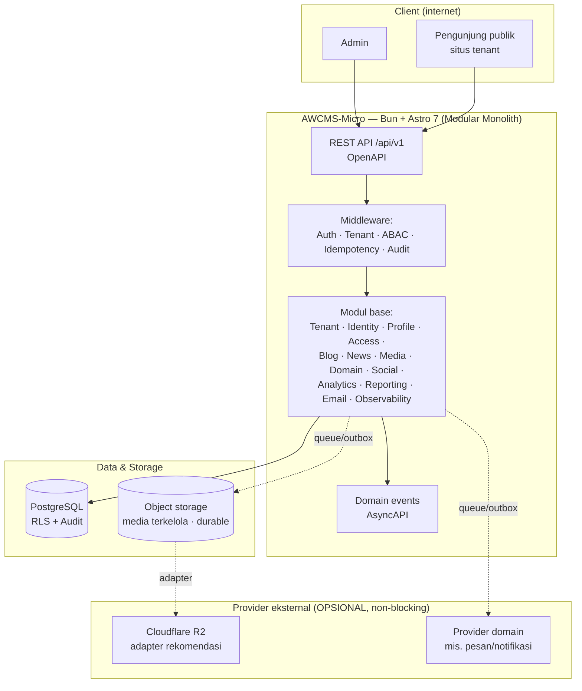
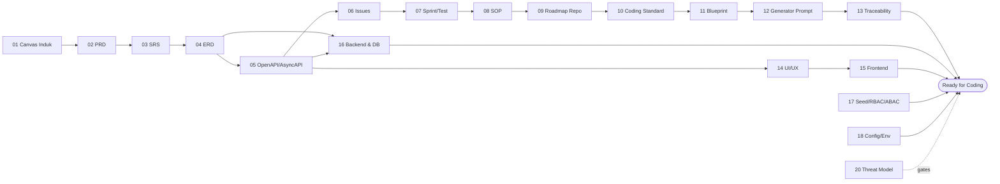

# AWCMS-Micro — Full Online Website (Modular Monolith Standard)

AWCMS-Micro adalah platform **website online penuh** multi-tenant AhliWeb berbasis **Bun + Astro 7 + PostgreSQL**: konten & blog, portal berita, media, domain kustom per tenant, publikasi sosial, dan analitik pengunjung — di atas fondasi multi-tenant ber-RLS dengan RBAC/ABAC default-deny, audit trail, dan kontrak OpenAPI/AsyncAPI.

## Posisi dalam keluarga AWCMS

Repositori ini **bukan** basis standar tersendiri. Ia **turunan scope website** dari standar [`ahliweb/awcms-mini`](https://github.com/ahliweb/awcms-mini), sejajar dengan [`ahliweb/awcms`](https://github.com/ahliweb/awcms) yang merupakan turunan scope ERP:

| Repositori        | Peran                                                                  | Scope                    |
| ----------------- | ---------------------------------------------------------------------- | ------------------------ |
| `awcms-mini`      | **Basis standar** — modular monolith, RLS, RBAC/ABAC, kontrak, gate CI | Fondasi reusable         |
| `awcms`           | Turunan                                                                | ERP / solusi bisnis      |
| **`awcms-micro`** | **Turunan (repo ini)**                                                 | **Website online penuh** |

Seluruh konvensi mini berlaku utuh di sini: Bun-only (ADR-0002), PostgreSQL + RLS wajib (ADR-0003), RBAC/ABAC default-deny (ADR-0004), capability ports (ADR-0011), registry statis tepercaya (ADR-0012), komposisi build-time (ADR-0014). Yang berbeda hanya **scope**: tujuh modul ERP milik upstream (`workflow`, `organization_structure`, `document_infrastructure`, `data_exchange`, `integration_hub`, `reference_data`, `idn_admin_regions`) **tidak diport**. Alasan, konsekuensi, dan aturan turunannya dicatat di **[ADR-0025](docs/adr/0025-website-scope-derivation-from-awcms-mini.md)** — baca itu lebih dulu sebelum menambah/menghapus modul.

> **Status.** Registry base berisi **18 modul**: fondasi (`tenant_admin`, `profile_identity`, `identity_access`, `logging`, `module_management`), layanan platform (`sync_storage`, `media_library`, `domain_event_runtime`, `data_lifecycle`, `reporting`, `email`, `form_drafts`), dan scope website (`tenant_domain`, `blog_content`, `news_portal`, `social_publishing`, `visitor_analytics`, `seo_distribution`). `bun run check` — 20 gate berurutan, termasuk typecheck, test, dan build — hijau penuh.
>
> **Belum ada:** modul website yang menuntut scope ini dan belum ada di upstream — SEO/distribusi (sitemap, RSS, canonical/OG, JSON-LD, redirect), theming/template, site search, comments, newsletter. (Media library sudah diadmisi dan aktif sejak ADR-0026, 2026-07-17 — bukan lagi bagian daftar ini.) Masing-masing akan diadmisi lewat ADR sebelum baris kode pertamanya (ADR-0025 §6).
>
> **Utang dokumentasi yang diakui:** paket dokumen `docs/awcms-micro/` masih memuat bagian yang menjelaskan modul ERP yang tidak diport (terutama doc 04 ERD, 08 SOP, 20 threat model, 21 module admission governance). Sampai dirapikan, **`src/`, `sql/`, dan gate CI adalah sumber kebenaran** (ADR-0025 §Konsekuensi).

Kontributor & coding agent **wajib membaca [`AGENTS.md`](AGENTS.md) lebih dulu**.

## Daftar isi

- [Arsitektur tingkat tinggi](#arsitektur-tingkat-tinggi)
- [Stack](#stack)
- [Prinsip utama](#prinsip-utama)
- [Paket dokumen](#paket-dokumen)
- [Untuk kontributor](#untuk-kontributor)
- [Keamanan](#keamanan)
- [Tata kelola & komunitas](#tata-kelola--komunitas)
- [Versioning](#versioning)
- [Lisensi](#lisensi)

## Arsitektur tingkat tinggi

Media terkelola disimpan di **object storage yang durable** lewat kontrak provider-neutral (Cloudflare R2 = adapter rekomendasi pertama, bukan wajib). Provider eksternal terhubung lewat **outbox/queue** di luar transaksi DB — alur transaksional tetap jalan saat koneksi provider bermasalah. Profil deployment, tujuan `sync_storage` (object queue/outbox, **bukan** sinkronisasi data bisnis offline), dan aturan durable storage didefinisikan di **[ADR-0027](docs/adr/0027-full-online-deployment-and-durable-storage-profiles.md)**.

## Stack

- Runtime: **Bun** ([ADR-0002](docs/adr/0002-bun-only-runtime.md) — Bun-only; Node.js hanya lewat pengecualian tertulis)
- Web framework: **Astro 7** (SSR di atas Bun)
- Database: **PostgreSQL** dengan **RLS** ([ADR-0003](docs/adr/0003-postgresql-rls-multi-tenant.md))
- Arsitektur: **Modular monolith, microservice-ready** ([ADR-0001](docs/adr/0001-modular-monolith-architecture.md))
- Mode operasi: **Full online** — profil `development` / `full_online_single_host` / `full_online_production` ([ADR-0027](docs/adr/0027-full-online-deployment-and-durable-storage-profiles.md))
- Storage media terkelola: **object storage provider-neutral**, durable; **Cloudflare R2** adapter rekomendasi pertama (bukan wajib)
- Outbox transaksional + sync HMAC untuk delivery provider & object queue ([ADR-0006](docs/adr/0006-offline-first-sync-outbox.md), diamandemen ADR-0027)
- Security baseline: **RBAC + ABAC + PostgreSQL RLS + Audit Log** ([ADR-0004](docs/adr/0004-rbac-abac-default-deny.md))
- Kontrak: **OpenAPI** + **AsyncAPI** ([ADR-0007](docs/adr/0007-openapi-asyncapi-contracts.md))

## Prinsip utama

1. Platform **full online**: media terkelola pada profil produksi wajib di object storage durable, tidak boleh mengandalkan filesystem container ephemeral ([ADR-0027](docs/adr/0027-full-online-deployment-and-durable-storage-profiles.md)).
2. Provider eksternal (R2, pesan, dsb.) tidak boleh menjadi dependency alur kritikal dan tidak boleh dipanggil di dalam DB transaction.
3. Data yang sudah posted (bila aplikasi turunan memilikinya) bersifat immutable, idempotent, atomic, dan audit-ready.
4. Multi-tenant wajib memakai `tenant_id`, RLS, tenant context, dan ABAC.
5. Data sensitif (password, token, NPWP, NIK, email, nomor HP) wajib di-hash/mask/redact.
6. Master/config/draft yang bisa dihapus memakai **soft delete**; list default menyembunyikan `deleted_at`, restore/purge harus berizin dan diaudit ([ADR-0005](docs/adr/0005-soft-delete-and-immutability.md)).
7. Dokumentasi, migration, API contract, test, dan SOP mengikuti implementasi nyata.
8. Backend **Bun-only**; pengecualian Node.js hanya dengan izin maintainer + catatan docs.

## Paket dokumen

Paket dokumen master ada di [`docs/awcms-micro/`](docs/awcms-micro/README.md). Rantai dari kebutuhan sampai siap koding:

- **01–13** perencanaan → kontrak → eksekusi; **14–18** desain teknis; **19** glossary; **20** threat model & arsitektur keamanan.
- **Catatan penting:** dokumen **02–19** memakai domain retail/POS (gaya AWPOS) sebagai **contoh ilustratif** — polanya reusable, entitas/endpoint/layarnya adalah ilustrasi domain yang diganti aplikasi turunan. Lihat [`docs/awcms-micro/README.md`](docs/awcms-micro/README.md) §Reusable vs domain turunan.
- **Keputusan arsitektural** dicatat di [`docs/adr/`](docs/adr/README.md).
- **Snapshot GitHub issue** aktual di [`docs/awcms-micro/github/`](docs/awcms-micro/github/README.md).
- **Tata kelola pemakaian agent lintas keluarga produk** (AWCMS, AWCMS-Micro, AWCMS-Micro, dan software turunannya) ada di [`docs/Pedoman_Penggunaan_Agent_Keluarga_AWCMS_v1.0.pdf`](docs/Pedoman_Penggunaan_Agent_Keluarga_AWCMS_v1.0.pdf) — AWCMS-Micro (AGENTS.md, README.md, CONTRIBUTING.md, `derived-application-guide.md`, skill proyek) adalah sumber utama pedoman ini.

## Untuk kontributor

1. Baca [`AGENTS.md`](AGENTS.md) — kontrak kerja, aturan wajib, guardrail keamanan.
2. Baca [`CONTRIBUTING.md`](CONTRIBUTING.md) — alur kontribusi, setup, konvensi commit, Definition of Done.
3. Gunakan **skill proyek** di [`.claude/skills/`](.claude/skills/README.md) agar standar diterapkan konsisten.
4. Kerjakan **atomic** per issue; migration bila schema berubah, OpenAPI bila API berubah, AsyncAPI bila event berubah.
5. Validasi (`bun run check` — gate CI utama; rantai sub-check lengkap dan urutannya didokumentasikan di [`CONTRIBUTING.md`](CONTRIBUTING.md#validasi-sebelum-pr) dan `package.json`'s `check` script, jangan diduplikasi di sini agar tidak drift) sebelum PR. Untuk perubahan UI non-trivial, tambahkan/jalankan E2E browser sungguhan secara terpisah — `bun run test:e2e` (Playwright + Bun, skill `awcms-micro-browser-test`), butuh app+`DATABASE_URL` hidup, belum bagian dari `bun run check`.

### Mulai dari

Backlog base generik ada di [`docs/awcms-micro/06_github_issues_detail.md`](docs/awcms-micro/06_github_issues_detail.md) — **seluruh 18 issue-nya kini tuntas**: foundation (**0.1-0.3**), epic M2 Tenant/Identity/Profile (**2.1-2.4**), **12.1** (setup wizard), epic M5 Sync Storage (**6.1-6.3**), epic M7 UI/UX & Reporting (**8.1**, **9.1**), dan epic M8 Security/Performance/Production (**10.1-10.3**, **11.1**, **12.2**). Base ini siap dipakai sebagai fondasi aplikasi turunan — panduan langkah-demi-langkah (9 langkah berbasis skill nyata, 5 contoh aplikasi ilustratif, checklist keamanan): [`docs/awcms-micro/derived-application-guide.md`](docs/awcms-micro/derived-application-guide.md).

## Keamanan

- Kebijakan pelaporan kerentanan: [`SECURITY.md`](SECURITY.md) (gunakan private vulnerability reporting — **jangan** issue publik).
- Model ancaman & arsitektur keamanan: [`docs/awcms-micro/20_threat_model_security_architecture.md`](docs/awcms-micro/20_threat_model_security_architecture.md).
- Automasi: Dependabot, CodeQL, secret scanning, CI hygiene (Bun-only + no-`.env`).

## Tata kelola & komunitas

| Dokumen                                                                                                          | Isi                                                      |
| ---------------------------------------------------------------------------------------------------------------- | -------------------------------------------------------- |
| [`CONTRIBUTING.md`](CONTRIBUTING.md)                                                                             | Cara berkontribusi                                       |
| [`CODE_OF_CONDUCT.md`](CODE_OF_CONDUCT.md)                                                                       | Standar perilaku komunitas                               |
| [`GOVERNANCE.md`](GOVERNANCE.md)                                                                                 | Peran, pengambilan keputusan, rilis                      |
| [`SUPPORT.md`](SUPPORT.md)                                                                                       | Kanal bantuan                                            |
| [`SECURITY.md`](SECURITY.md)                                                                                     | Kebijakan keamanan                                       |
| [`docs/adr/`](docs/adr/README.md)                                                                                | Architecture Decision Records                            |
| [`docs/Pedoman_Penggunaan_Agent_Keluarga_AWCMS_v1.0.pdf`](docs/Pedoman_Penggunaan_Agent_Keluarga_AWCMS_v1.0.pdf) | Pedoman penggunaan AI agent lintas keluarga produk AWCMS |

## Versioning

**Semantic Versioning** + **[Changesets](.changeset/README.md)**; riwayat di [`CHANGELOG.md`](CHANGELOG.md). Setiap PR yang mengubah perilaku wajib menyertakan changeset. Versi saat ini **`0.2.0`** (belum dirilis) — refaktor penuh menjadi turunan scope website dari standar AWCMS-Mini ([ADR-0025](docs/adr/0025-website-scope-derivation-from-awcms-mini.md)). Rilis terakhir garis keturunan lama (basis kode `emdash`/Cloudflare-D1, sudah dihapus) adalah tag `0.1.32`; penomoran dilanjutkan ke `0.2.0` karena dalam SemVer 0.x bump minor adalah sinyal breaking change yang tepat untuk penggantian basis kode total — bukan mengikuti `0.24.0` milik upstream, yang nomor rilis repositori lain.

**Kebijakan versi independen** ([ADR-0008](docs/adr/0008-independent-contract-and-module-versioning.md)): versi rilis (`package.json`) terpisah dari versi kontrak (`info.version` OpenAPI/AsyncAPI) dan versi/status tiap module descriptor — masing-masing punya aturan bump sendiri.

## Lisensi

Dilisensikan di bawah lisensi **MIT** — lihat [`LICENSE`](LICENSE). Audit standar pengembangan terakhir: [`docs/awcms-micro/AUDIT_STANDAR_PENGEMBANGAN_2026-07-04.md`](docs/awcms-micro/AUDIT_STANDAR_PENGEMBANGAN_2026-07-04.md).
