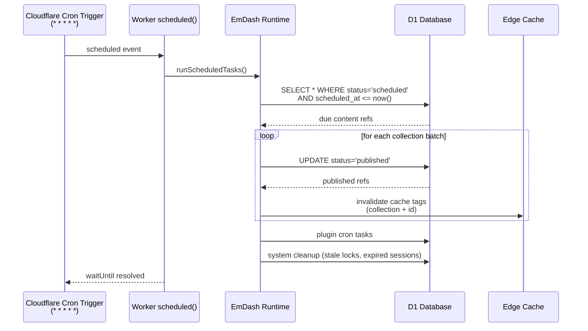
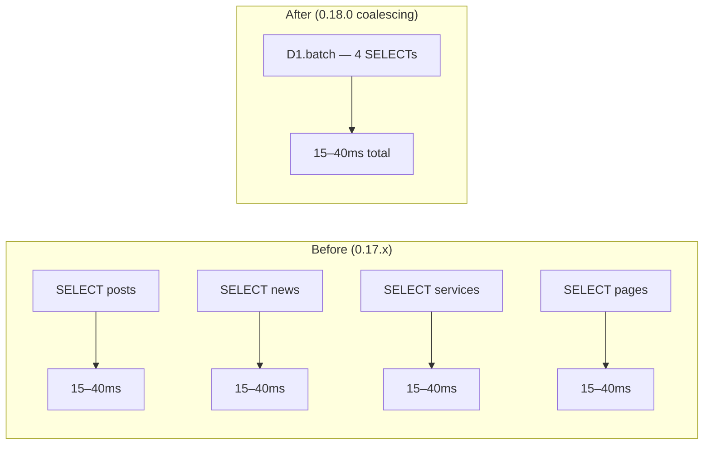
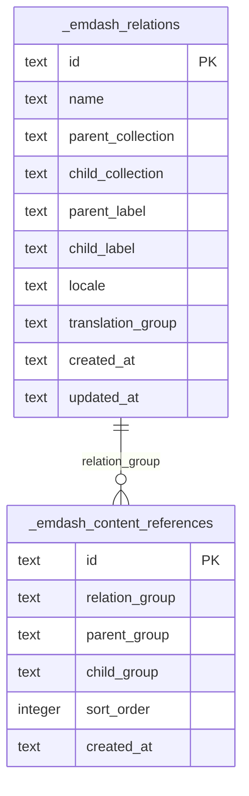
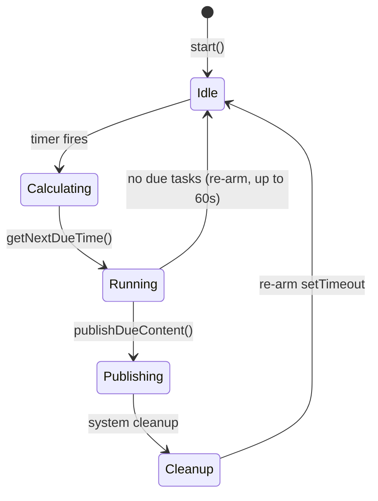

# Scheduled Publishing Architecture

EmDash 0.18.0 introduces a production-ready scheduled publishing pipeline. This document explains the architecture and how AWCMS-Micro's Cloudflare template integrates with it.

## How It Works

Content marked `scheduled` with a future `scheduled_at` timestamp is auto-published when the deadline passes. On Cloudflare Workers, a **Cron Trigger** fires the sweep every minute; on Node.js, a `setTimeout`-based scheduler polls every 1–60 seconds.



## Worker Entry Point

The Cloudflare template `src/worker.ts` re-exports the complete worker from `@emdash-cms/cloudflare/worker`:

```typescript
export { default, PluginBridge } from "@emdash-cms/cloudflare/worker";
```

This single re-export provides:
- `default` — the Astro SSR handler for HTTP requests
- `scheduled()` — the cron handler that drives publishing, plugin cron, and system cleanup
- `PluginBridge` — the Durable Object re-exported so the sandbox binding resolves

## Wrangler Configuration

`wrangler.jsonc` must include a Cron Trigger so Cloudflare fires the `scheduled()` handler:

```jsonc
"triggers": {
    "crons": ["* * * * *"]
}
```

Without this trigger, scheduled content never auto-publishes on Cloudflare Workers.

## D1 Batch Coalescing (0.18.0)

The same Cloudflare package now ships an opt-in coalescing D1 driver. SELECT queries issued in the same event-loop turn are batched into one `D1.batch()` call, replacing N sequential round trips with one:



## Content References Schema (Migration 043)

Migration 043 (auto-runs on next boot) adds the foundation for typed content-to-content relationships:



Both tables are locale-aware and use `translation_group` ULIDs to link content across locales without SQL foreign keys, following the same pattern as taxonomy edges.

## Node.js Dev Environment

In the Node template, `NodeCronScheduler` (new in 0.18.0) polls every 1–60 seconds using `setTimeout`. The cap is 60 seconds to match Cloudflare Cron Trigger cadence:



## References

- EmDash PR #1312 — scheduling heartbeat driver (32 files)
- EmDash commit `c39789c` — `fix(scheduling): drive scheduled publishing from a real heartbeat`
- New file: `packages/cloudflare/src/worker.ts`
- New file: `packages/core/src/scheduled-publish.ts`
- New file: `packages/core/src/plugins/scheduler/node.ts`
- GitHub issue [#201](https://github.com/ahliweb/awcms-micro/issues/201) — adopt new worker.ts pattern
- GitHub issue [#202](https://github.com/ahliweb/awcms-micro/issues/202) — content references planning
