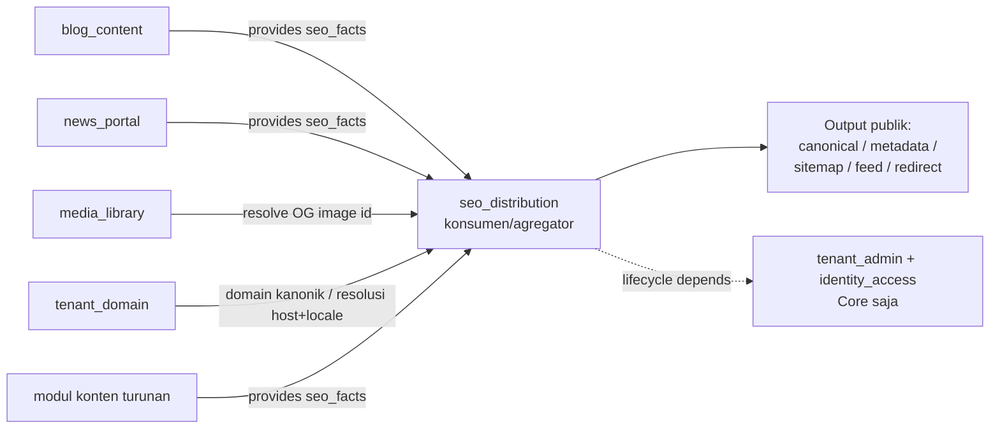
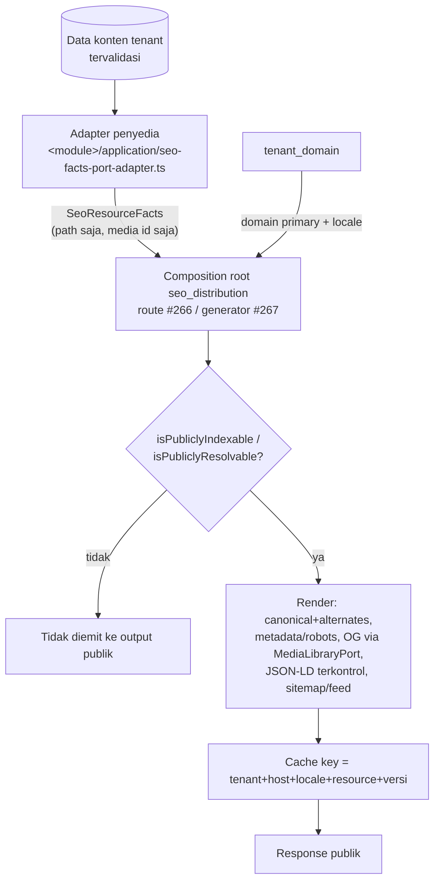
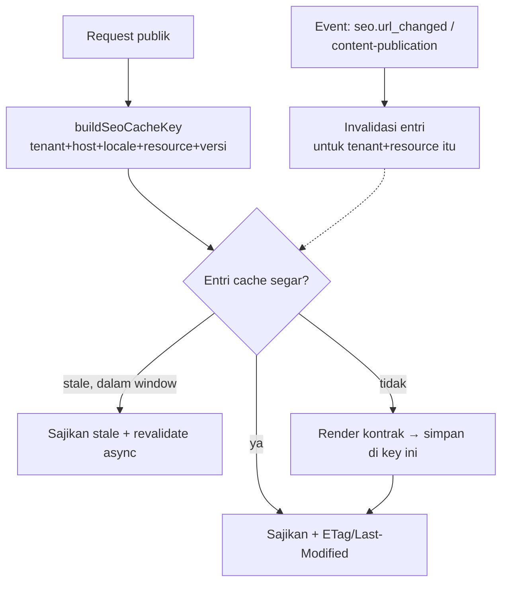

# ADR-0028 — Admission `seo_distribution` (Official Optional Module) lewat contribution contract, sebelum baris kode runtime pertama

- **Status:** Accepted
- **Tanggal:** 2026-07-19
- **Pengambil keputusan:** @ahliweb
- **Terkait:** ADR-0025 (turunan scope website — §Konteks mendaftar SEO/distribusi sebagai modul yang dituntut website, satu ADR admission per modul sebelum baris kode pertama), ADR-0011 (capability ports), ADR-0012 (module admission & trusted registry boundary), ADR-0013 §1/§6 (lapisan ekstensi — modul tidak menulis ke tabel modul lain; kolaborasi lewat kontrak yang dideklarasikan modul pemilik), ADR-0009 (rute publik tenant-scoped lewat path segment), ADR-0010 (routing tenant berbasis host/domain + `awcms_micro_tenant_domains`), ADR-0026 (admission `media_library`), `docs/awcms-micro/21_module_admission_governance.md` (§3 pohon keputusan, §4.3 SEO sebagai contoh Official Optional Module, §5 required vs optional capability, §9 kontrak murni tetap butuh ADR penuh), `docs/awcms-micro/templates/module-proposal-template.md`, epic #261 (website-platform), issue #265 (ADR ini), dan child runtime `#266` (metadata render), `#267` (sitemap/robots/feeds), `#268` (redirect/URL-change/404)

## Konteks

ADR-0025 §Konteks menuliskannya eksplisit: scope website menuntut modul **SEO/distribusi** (sitemap, RSS, canonical/OG, JSON-LD, redirect) yang "akan diadmisi lewat jalur normal ADR-0012/§21 module admission governance — satu ADR admission per modul, sebelum baris kode pertamanya ditulis." ADR ini adalah admission itu. `media_library` (ADR-0026) sudah menutup satu dari daftar tersebut; SEO/distribusi adalah berikutnya.

**Kenapa admission harus mendahului kode, dan kenapa ini bukan formalitas.** Perilaku SEO hari ini tersebar sebagai fakta laten di enam tempat sekaligus: konten (`blog_content`), portal berita (`news_portal`), media (`media_library` — sumber gambar OG), pemetaan domain (`tenant_domain`), rute publik (`/news`, `/blog/{tenantCode}`), dan pratinjau sosial (`social_publishing`). Bila #266–#268 mulai menambahkan kode sitemap/feed/metadata/redirect **tanpa** kepemilikan yang eksplisit lebih dulu, tiap modul akan menumbuhkan versi canonical/robots/JSON-LD-nya sendiri — persis drift lintas-modul yang ADR-0025 §5 melarang dan yang ADR-0026 baru saja bersusah payah membalik untuk media. Keputusan yang harus mengikat **sebelum** kode: siapa yang memiliki output publik, ke arah mana dependency mengalir, dan lewat seam apa modul konten menyumbang fakta tanpa saling impor.

Beberapa fakta grounding yang sudah ada dan **tidak** ditulis ulang oleh modul ini:

- `tenant_domain` (ADR-0010, migration 031) sudah memiliki `awcms_micro_tenant_domains` dengan `is_primary`/`redirect_to_primary`/`route_mode (canonical|legacy_blog)`/`domain_type (subdomain|custom_domain)`/`status`. Domain kanonik sebuah tenant **sudah** merupakan fakta yang dimiliki `tenant_domain` dan diturunkan di server (`resolvePublicTenantFromRequest`, `PUBLIC_TRUST_PROXY`, lookup `SECURITY DEFINER` sempit `sql/033`). SEO mengonsumsinya, bukan memodelkannya ulang.
- ADR-0010 §Alternatif secara eksplisit **menunda** "redirect otomatis dari `/blog/{tenantCode}` ke `/news`" sebagai "kemungkinan issue lanjutan" karena butuh keputusan produk soal precedence dan kebocoran `tenantCode`. Itu justru teritori `seo_distribution` (#268).
- `PublicContentPort` (`_shared/ports/public-content-port.ts`) sudah membedakan **existence** dari **public-visibility** ("a not-yet-published post ... render-time re-resolution enforces visibility separately"). SEO mewarisi semantik visibilitas itu alih-alih menebak ulang status publikasi.
- `MediaLibraryPort` sudah me-resolve id media ke URL publik + alt text same-tenant, verified — persis yang dibutuhkan gambar Open Graph.

## Keputusan

Kami mengadmisi **`seo_distribution`** sebagai **Official Optional Module** (kategori doc 21 §4.3, yang memang sudah menyebut "SEO/metadata & sitemap" sebagai contoh kanonik kategori ini), **provider-neutral**, dan mewujudkan kolaborasinya lewat **contribution contract** (ports-and-adapters, ADR-0011) — **bukan** impor internal lintas-modul dan **bukan** tulisan langsung ke shared table (ADR-0013 §6).

Arah kepemilikan dinyatakan tegas: **modul konten adalah PENYEDIA "SEO facts"; `seo_distribution` adalah KONSUMEN/agregator.** Tidak ada modul yang sudah ada dibuat bergantung pada `seo_distribution`, dan `seo_distribution` tidak mengambil lifecycle dependency apa pun ke modul konten (hanya ke Core) — sehingga graf tetap DAG-safe dan tidak ada modul base yang bergantung pada modul turunan.

Keputusan ini adalah **admission + kontrak**, bukan implementasi runtime. Rendering metadata (#266), generasi sitemap/robots/feed (#267), dan tabel/resolusi redirect (#268) **tidak** dikerjakan di sini; masing-masing mendarat sebagai PR runtime tersendiri yang **hanya boleh merge setelah ADR ini Accepted**. Doc 21 §9 sudah menetapkan pola ini: "kontrak murni (tanpa modul baru) tetap butuh ADR penuh" untuk keputusan arah kepemilikan/dependensi yang mengikat lintas dokumen.

### 1. Parameter admission (mengisi `module-proposal-template.md`)

| Parameter                                      | Nilai                                                                                                                                                                                                                                                     |
| ---------------------------------------------- | --------------------------------------------------------------------------------------------------------------------------------------------------------------------------------------------------------------------------------------------------------- |
| Nama                                           | SEO & Distribution                                                                                                                                                                                                                                        |
| `key`                                          | `seo_distribution`                                                                                                                                                                                                                                        |
| Kategori (doc 21 §2)                           | **Official Optional Module** — fitur produk generik lintas domain website (brosur korporat, portal berita, blog, situs komunitas), opt-in per tenant, bernilai produk langsung (temukan/dibagikan di mesin telusur & sosial), bukan sekadar infrastruktur |
| `type` di kode                                 | `domain` (sama seperti `blog_content`/`news_portal`/`social_publishing`)                                                                                                                                                                                  |
| `isCore`                                       | tidak                                                                                                                                                                                                                                                     |
| `status` saat descriptor mendarat (#266)       | `active` — lihat §Keputusan pendaftaran descriptor untuk mengapa descriptor TIDAK didaftarkan di ADR ini                                                                                                                                                  |
| Lifecycle `dependencies`                       | `["tenant_admin", "identity_access"]` **saja** — tidak ke `tenant_domain`/`blog_content`/`news_portal`/`media_library`                                                                                                                                    |
| Capability `consumes` (semua `optional: true`) | `seo_facts` dari `blog_content`, `news_portal`, `media_library`, `tenant_domain`, dan modul konten turunan mana pun                                                                                                                                       |
| Kelas kompatibilitas (doc 21 §6)               | Metadata/canonical/sitemap/feed dari DB lokal = **offline-lan-safe**; integrasi CDN/edge cache = **full-online-only** opt-in yang tidak boleh mendegradasi profil offline saat off                                                                        |
| Pemilik                                        | @ahliweb (`.github/CODEOWNERS`)                                                                                                                                                                                                                           |

Bukti "bukan Derived Application" (doc 21 §3 node Q3): SEO/discoverability adalah kebutuhan **setiap** situs publik lintas vertikal — bukan spesifik retail/POS/pajak. Ia lolos kriteria generik yang sama yang membuat `blog_content`/`news_portal` layak base.

### 2. Arah dependency — kenapa panah menunjuk ke DALAM (DAG-safe)

| Modul                | Peran terhadap SEO                                          | Lifecycle `dependencies`                                  |
| -------------------- | ----------------------------------------------------------- | --------------------------------------------------------- |
| `blog_content`       | **penyedia** `seo_facts` (artikel/halaman/kategori publik)  | tidak berubah — tidak menambah edge ke `seo_distribution` |
| `news_portal`        | **penyedia** `seo_facts` (post berita, homepage sections)   | tidak berubah                                             |
| `media_library`      | **penyedia** (gambar OG/Twitter same-tenant, verified)      | tidak berubah                                             |
| `tenant_domain`      | **penyedia** (domain kanonik/primary, resolusi host/locale) | tidak berubah                                             |
| modul konten turunan | **penyedia** (lewat adapter port yang sama)                 | tidak berubah                                             |
| `seo_distribution`   | **konsumen/agregator**                                      | `["tenant_admin", "identity_access"]`                     |

Diagram arsitektur — panah kapabilitas (`provides` → `consumes`) menunjuk ke DALAM ke `seo_distribution`; tidak ada satu pun panah balik, jadi tidak ada modul yang bergantung padanya:



Yang membuat ini aman dan **bukan** pelanggaran aturan "System/Optional tidak boleh bergantung pada Optional lain" (doc 21 §4.2/§4.3): `capabilities.consumes` **bukan** lifecycle `dependencies`. `module-contract.ts` menegaskannya — "a module can consume another's capability while still declaring `[]` `dependencies`" — dan validator DAG (`module-management/domain/module-dependency-graph.ts`, `bun run modules:dag:check`) hanya membaca `dependencies`, bukan `capabilities`. Preseden hidup: `blog_content` mengonsumsi kapabilitas `news_portal`/`social_publishing` **tanpa** edge `dependencies` (keputusan Issue #632, masih berlaku). `seo_distribution` mengikuti pola itu persis: ia mengonsumsi `seo_facts` secara **optional** dari tiap penyedia, terdegradasi anggun (kontributor yang tenant-nya tidak aktifkan hanya tidak menyumbang URL/fakta apa pun) — tanpa memaksa satu pun modul konten menyala.

**Invariant yang dikunci (AC #265):** tidak ada modul yang sudah ada yang `dependencies`- atau `consumes`-nya menyebut `seo_distribution`. Arah kontribusi dibalik dari desain naif "SEO mengimpor tiap modul konten": kalau `seo_distribution` yang mengonsumsi port milik `blog_content` (gaya `news_portal` → `public_content`), agregator akan menyeret dependency ke **setiap** modul konten dan pecah begitu satu di antaranya tidak ada di deployment turunan. Dengan membalik arah — konten **menyediakan** `seo_facts`, SEO menemukannya lewat composition root — `seo_distribution` tetap ignorant terhadap modul konten mana pun secara spesifik, dan modul konten tetap ignorant terhadap internal SEO.

### 3. Contribution contract — seam "SEO facts"

Seam-nya adalah satu port netral, **`SeoFactsSource`** (`src/modules/_shared/ports/seo-facts-port.ts`, didefinisikan oleh ADR ini). Aturan port `_shared` yang sama berlaku: file port tidak meng-import apa pun dari modul mana pun; modul konten menaruh **adapter** konkretnya sendiri (`<module>/application/seo-facts-port-adapter.ts`, mendarat di #266) di modulnya sendiri; **composition root** (route handler renderer #266, generator sitemap/feed #267) yang meng-import adapter dan menyuntikkannya sebagai parameter fungsi biasa.

Kontrak membawa, untuk setiap **resource publik** milik tenant, satu `SeoResourceFacts`: identitas resource (`resourceType`+`resourceId`, generik — sama pola `owner_resource_type` media_library), status publikasi, canonical + locale alternates, metadata (title/description/robots), Open Graph/Twitter, JSON-LD (schema terkontrol), sitemap entry, dan (opsional) feed entry. Modul konten **tidak pernah** menulis ke tabel milik `seo_distribution`, dan `seo_distribution` **tidak pernah** menulis ke tabel modul konten — kolaborasi hanya lewat port ini plus (untuk invalidasi, #267/#268) domain event.

Data-flow — dari data konten sampai output publik, tanpa impor lintas-modul di `application`/`domain`:



Poin desain yang mengikat #266–#268:

- **Base + derived lewat kontrak yang SAMA.** Sebuah artikel base (`blog_content`), sebuah halaman base, dan sebuah tipe konten **turunan** (mis. `product` milik aplikasi turunan) semuanya mengalir sebagai `SeoResourceFacts` yang identik bentuknya — tanpa `seo_distribution` mengetahui tipe konten apa pun secara spesifik. Fixture kontrak (#265, `tests/unit/seo-facts-contract.test.ts`) membuktikan ketiganya dengan `resourceType` sembarang tanpa mengimpor internal modul mana pun.
- **Server-derived, bukan tenant-authored.** Nilai `SeoResourceFacts` diturunkan modul penyedia dari data tenant yang sudah tervalidasi — bukan string mentah yang tenant tempel. JSON-LD memakai union tipe schema terkontrol, bukan blob HTML.
- **Contract version.** `seo_facts` akan didaftarkan di `CAPABILITY_CONTRACT_VERSIONS` (`1.0.0`) di PR yang sama yang menambahkan `provides: ["seo_facts"]` ke `module.ts` penyedia pertama (#266) — aturan ADR-0015 "add the version entry in the same PR as the `provides` string". Belum didaftarkan oleh ADR ini (lihat §Keputusan pendaftaran descriptor).

### 4. Kontrak output publik (yang wajib dihormati #266–#268)

| Output                                | Kepemilikan & invariant                                                                                                                                                                                                                                                                                                |
| ------------------------------------- | ---------------------------------------------------------------------------------------------------------------------------------------------------------------------------------------------------------------------------------------------------------------------------------------------------------------------- |
| **Canonical URL + locale alternates** | Canonical = `https://{primary-domain-tenant}/{path-lokalisasi}`, host **selalu** dari domain primary tenant (`tenant_domain`), **tidak pernah** dari header `Host` request. `hreflang` alternates hanya untuk locale yang benar-benar dipublikasikan; menyertakan `x-default`. Satu canonical per resource per locale. |
| **Title/description/robots**          | Diturunkan penyedia; `robots` = `index,follow` hanya untuk resource yang benar-benar publik & indexable (lihat §6), selain itu `noindex`.                                                                                                                                                                              |
| **Open Graph / Twitter**              | `og:url` = canonical; `og:image`/`twitter:image` di-resolve lewat `MediaLibraryPort` (same-tenant, verified) — id media mentah tidak pernah dipercaya lintas tenant.                                                                                                                                                   |
| **JSON-LD graph**                     | Union tipe schema.org terkontrol (mis. `Article`/`WebPage`/`BreadcrumbList`/`Organization`); nilai string di-escape; tidak menerima markup mentah. Injeksi diblok oleh tipe, bukan oleh sanitasi ad-hoc.                                                                                                               |
| **Sitemap index + URL entries**       | Hanya resource publik & indexable; index dipaginasi (batas URL per file); `lastmod` dari `updated_at` konten. Per tenant + per domain.                                                                                                                                                                                 |
| **RSS/Atom/JSON Feed**                | Hanya item publik; batas jumlah item; canonical link per item; per tenant + per locale.                                                                                                                                                                                                                                |
| **Redirect resolution**               | Lihat §8. Target hanya same-tenant + same-registered-host; rantai dicegah (#268).                                                                                                                                                                                                                                      |
| **Event: URL-change**                 | Dipublikasikan saat sebuah resource berubah slug/URL atau redirect dibuat — memicu invalidasi cache & (opsional) auto-redirect capture. Channel `awcms-micro.seo.*` (#268).                                                                                                                                            |
| **Event: content-publication**        | Dikonsumsi (bukan dimiliki) — perubahan status publikasi konten memicu invalidasi sitemap/feed/cache. Sumbernya event konten yang sudah ada / port; SEO tidak memaksa modul konten menerbitkan skema baru selain yang disepakati di #267.                                                                              |

### 5. Resolusi tenant/domain/locale + kanonikalisasi default-domain

Diturunkan **di server**, mengonsumsi `tenant_domain` (ADR-0009/0010) — tidak ada mekanisme resolusi tenant baru:

1. `tenant_id` di-resolve dari request seperti rute publik lain (`resolvePublicTenantFromRequest`; host hanya dipercaya bila `PUBLIC_TRUST_PROXY=true` di belakang proxy tepercaya).
2. **Domain kanonik** = domain `is_primary=true` milik tenant di `awcms_micro_tenant_domains`. Bila request tiba di domain non-primary yang `redirect_to_primary=true`, canonical tetap menunjuk primary (dan #268 boleh menerbitkan redirect 301 ke primary). Canonical **tidak pernah** dibangun dari `Host`/`X-Forwarded-Host` mentah — itulah pertahanan host-header poisoning.
3. **Locale** dari normalisasi route/middleware yang sudah ada (bukan dari header `Accept-Language` mentah untuk canonical). Alternates hanya untuk locale yang dipublikasikan.
4. Deployment tanpa `tenant_domain` aktif / tanpa domain primary: SEO terdegradasi ke basis path tenant-scoped yang ada (`/blog/{tenantCode}`) dan **tidak** mengarang host — offline-lan-safe.

### 6. Perilaku draft/scheduled/archived/deleted/noindex/private/unpublished

Aturan tunggal: **hanya resource yang benar-benar terlihat publik yang muncul di output publik mana pun** (canonical milik orang lain, sitemap, feed, JSON-LD, OG). Diwarisi dari semantik visibilitas `PublicContentPort` ("existence ≠ visibility"), bukan ditebak ulang.

| Status                   | Sitemap/feed                     | Metadata halaman (bila diakses langsung)                              |
| ------------------------ | -------------------------------- | --------------------------------------------------------------------- |
| `draft`                  | tidak muncul                     | 404/akses ditolak seperti hari ini; tidak ada metadata publik         |
| `scheduled` (masa depan) | tidak muncul sampai waktu terbit | idem                                                                  |
| `archived`               | tidak muncul                     | boleh 410/redirect (#268), tidak indexable                            |
| `deleted` (soft)         | tidak muncul                     | 404/410; tidak pernah bocor                                           |
| `noindex`                | tidak muncul di sitemap          | halaman boleh tetap ada tetapi `robots: noindex`; canonical boleh ada |
| `private`                | tidak muncul                     | butuh auth; tidak ada metadata publik                                 |
| `unpublished`            | tidak muncul                     | idem draft                                                            |

Ini pertahanan **unpublished-content leakage**: sumber kebenaran visibilitas adalah penyedia (dievaluasi ulang saat resolve, bukan dicache dari daftar kurasi), dan `seo_distribution` tidak punya jalur untuk menampilkan resource yang penyedianya nyatakan tidak publik.

### 7. Kebijakan cache

- **Cache key WAJIB memuat** `tenant_id` + host/domain ter-resolve + `locale` + identitas resource + versi kontrak. Karena `tenant_id` adalah komponen kunci, output satu tenant **secara struktural tidak mungkin** tersaji ke tenant lain — pertahanan cache-poisoning & cross-tenant. Helper murni `buildSeoCacheKey` (didefinisikan ADR ini, `seo-facts-port.ts`) menolak menyusun key tanpa ketiga komponen tenant/host/locale, sehingga implementasi #266–#268 mewarisi invariant ini sebagai kompilasi, bukan konvensi.
- **ETag** = hash konten kontrak ter-render; **Last-Modified** dari `max(updated_at)` fakta yang berkontribusi.
- **Invalidasi** dipicu event URL-change + content-publication (§4). **Stale-while-revalidate** dibatasi waktu.
- **CDN/edge**: integrasi opt-in (full-online-only) yang HARUS mengunci pada tuple key yang sama; saat off, perilaku offline-lan tidak berubah.

Diagram cache/invalidasi — key selalu tenant-first; event konten yang mengubah URL/publikasi meng-invalidasi entri, bukan sebaliknya:



### 8. Precedence redirect

Urutan evaluasi **wajib** (dari paling awal), sehingga redirect tidak pernah bisa mengalahkan isolasi tenant atau membuka rute admin:

```mermaid
flowchart TD
  A[Request masuk] --> B{Resolusi tenant/domain\n(tenant_domain, ADR-0010)}
  B -->|tenant tidak resolve| Z[404 generik — tidak ada lookup redirect]
  B -->|resolved| C{Rute auth/admin/API?\n(/admin, /api)}
  C -->|ya| D[Ditangani modul masing-masing —\nSEO redirect TIDAK berlaku]
  C -->|tidak| E{Rute Astro nyata\nuntuk halaman publik ada?}
  E -->|ya| F[Render halaman — SEO menyisipkan\ncanonical/metadata, tanpa redirect]
  E -->|tidak| G{Normalisasi locale\nmengubah path?}
  G -->|ya| H[Redirect normalisasi locale]
  G -->|tidak| I{Ada redirect SEO terdaftar\nuntuk path publik ini?}
  I -->|ya| J{Target same-tenant &\nsame-registered-host?}
  J -->|tidak| Z2[Tolak — bukan open redirect,\nbukan lintas tenant]
  J -->|ya| K[301/302 ke target,\nrantai dicegah #268]
  I -->|tidak| L[404 governance #268]
```

Poin kunci: (a) tenant di-resolve **sebelum** lookup redirect apa pun; (b) rute auth/admin/API tidak pernah ditangani redirect SEO; (c) route Astro nyata menang atas redirect (redirect hanya untuk URL yang sudah tidak punya halaman); (d) target redirect **hanya** same-tenant + same-registered-host — pertahanan open-redirect & cross-tenant; (e) rantai redirect dicegah (#268).

### 9. Retensi, audit, permission, abuse control, runbook

- **Permission (didaftarkan #266+):** `seo_distribution.config.{read,update}`, `seo_distribution.redirects.{read,create,update,delete}`, `seo_distribution.sitemap.read`. Aktivitas `config`/`redirects` terpisah — beda radius ledakan (mengubah surface URL publik vs membaca).
- **Audit (skill `awcms-micro-audit-log`):** create/update/delete redirect dan perubahan config SEO adalah high-risk (mengubah surface URL publik & indeksabilitas) → wajib audit log, aktor teridentifikasi.
- **Retensi (skill `awcms-micro-data-lifecycle`):** riwayat URL-change/tabel redirect yang tumbuh besar didaftarkan sebagai `HighVolumeTableDescriptor` di `module.ts` `seo_distribution` saat tabel itu lahir (#268) — bukan di ADR ini.
- **Abuse control:** batas jumlah URL per file sitemap + paginasi index (**sitemap amplification**), batas jumlah item feed, batas jumlah redirect per tenant, dan rate limit pada endpoint publik.
- **Runbook (#267/#268):** membangun ulang sitemap, purge redirect usang, dan invalidasi cache didokumentasikan sebagai runbook operasional saat mesinnya mendarat.

## Threat model (bagian dari acceptance)

| Ancaman                            | Kontrol yang mengikat #266–#268                                                                                                                                                                                      |
| ---------------------------------- | -------------------------------------------------------------------------------------------------------------------------------------------------------------------------------------------------------------------- |
| **Open redirect**                  | Target redirect divalidasi same-tenant + same-registered-host (§8); helper klasifikasi murni menolak host eksternal/lintas-tenant; rantai dicegah.                                                                   |
| **Host-header poisoning**          | Canonical/OG `url`/sitemap host **selalu** dari domain primary tenant (`tenant_domain`), tidak pernah dari `Host`/`X-Forwarded-Host` mentah; host request hanya dipercaya bila `PUBLIC_TRUST_PROXY=true` (ADR-0010). |
| **Cache poisoning / cross-tenant** | Cache key wajib memuat `tenant_id`+host+locale (§7); `buildSeoCacheKey` menolak menyusun key tanpa mereka.                                                                                                           |
| **JSON-LD injection**              | JSON-LD dari union tipe schema terkontrol + escaping; string bidang tidak menerima markup/script mentah; tenant tidak bisa menyuntik `<script>`.                                                                     |
| **Unpublished-content leakage**    | Visibilitas dievaluasi ulang oleh penyedia saat resolve (§6); tidak ada jalur menampilkan draft/private/deleted/scheduled/noindex di output publik.                                                                  |
| **Sitemap amplification**          | Batas URL per file + paginasi index + batas item feed + batas redirect per tenant (§9).                                                                                                                              |

## Strategi kepemilikan OpenAPI/AsyncAPI + generated-doc

- **REST admin/config** (`/api/v1/seo/*`, mis. kelola redirect & config) hidup di kontrak monolitik tunggal `openapi/awcms-micro-public-api.openapi.yaml` — sama seperti **setiap** modul repo ini (17/17 `module.ts` memakai file yang sama; tidak ada `openapi/modules/*.yaml` terpakai). Ditambahkan di #266+ saat endpointnya benar-benar ada.
- **Output publik non-JSON** (`sitemap.xml`, `robots.txt`, RSS/Atom/JSON feed, tag canonical/metadata pada halaman) adalah **route Astro yang me-render XML/teks/HTML**, bukan REST-JSON — jadi **tidak** masuk OpenAPI, persis seperti halaman HTML `/news` tidak masuk OpenAPI. `api:spec:check`'s route-parity mengecualikan permukaan non-API ini seperti halaman publik lain.
- **Event** (`awcms-micro.seo.url_changed`, `awcms-micro.seo.*`) hidup di AsyncAPI monolitik `asyncapi/awcms-micro-domain-events.asyncapi.yaml`, ditambahkan di #267/#268 saat event benar-benar dipublikasikan.
- **Generated doc** `docs/awcms-micro/api-reference.md` diregenerasi (`bun run api:docs:generate`) dari bundle OpenAPI + AsyncAPI di PR yang menambah path/channel — **tidak** diedit tangan.
- **ADR ini menambah NOL path/channel** → `api:spec:check`, `api:docs:check`, dan `scope:consistency:check` tetap hijau tanpa perubahan kontrak.

## Keputusan pendaftaran descriptor — registry tetap 17

**ADR ini admission-only. Descriptor `seo_distribution` TIDAK didaftarkan di `src/modules/index.ts` oleh PR ini; `EXPECTED_BASE_MODULE_COUNT` tetap 17; inventori generated tidak berubah.** Descriptor `seo_distribution` + port adapter `seo_facts` + entri `CAPABILITY_CONTRACT_VERSIONS` + naik hitungan ke **18** + regenerasi inventori (`repo:inventory:generate`, `modules:composition:inventory:generate`, anchor count) semuanya mendarat **bersama** di **#266** (issue runtime pertama), atomik.

Alasan memilih admission-only alih-alih mendaftarkan descriptor "proposed/experimental" sekarang:

1. **Descriptor tanpa kode adalah placeholder yang justru dilarang semangat gate repo ini.** `media-library:consistency:check` sengaja menolak frasa `experimental`/`owns no code`/`no code yet`/`placeholder` untuk `media_library` — modul harus dideskripsikan afirmatif atas kode nyatanya. Mendaftarkan `seo_distribution` tanpa satu baris runtime menaruh entri registry yang tidak bisa dideskripsikan afirmatif.
2. **Menaikkan hitungan modul harus terikat pada kejadian nyata.** `scope:consistency:check` menuntut bump `EXPECTED_BASE_MODULE_COUNT` "in the same PR" saat modul base baru **benar-benar** masuk. Modul base baru "masuk" ketika kodenya ada — bukan ketika ADR-nya Accepted. Memindahkan bump ke #266 menjaga anchor drift-guard tetap bermakna (naik saat kode naik).
3. **Menghindari descriptor mengklaim kapabilitas yang belum bisa diimplementasi.** Ini pelajaran langsung ADR-0026 langkah 3–4: sebuah descriptor yang "menyediakan"/"mengonsumsi" kapabilitas sebelum adapternya ada adalah kontrak yang bohong. `seo_facts` baru punya penyedia nyata di #266.
4. **Kontras dengan ADR-0026 yang mendaftarkan descriptor segera** — karena di sana **kode sudah ada** (ekstraksi registry media yang hidup). Di sini belum ada kode SEO sama sekali, jadi jalur governance yang benar adalah admission-only (doc 21 §9: keputusan arah kepemilikan/dependensi yang mengikat ditulis sebagai ADR penuh **tanpa** mendaftarkan modul di registry).

Yang **mendarat sekarang** (kontrak, bukan runtime): **file port TYPE** `src/modules/_shared/ports/seo-facts-port.ts` (netral, belum di-wire) + helper murni invariant kontrak (`buildSeoCacheKey`, prediket visibilitas, klasifikasi target redirect, guard JSON-LD terkontrol) + **fixture kontrak** yang membuktikan base article/page + tipe konten turunan lewat kontrak yang sama. Preseden port didefinisikan mendahului wiring: `_shared/ports/legal-hold-guard-port.ts` dan `party-directory-port.ts` sama-sama ada sebagai TYPE tanpa consumer/provider ter-wire dan **tanpa** entri `CAPABILITY_CONTRACT_VERSIONS` (entri versi baru dipasangkan dengan `provides` sebuah modul — kejadian #266).

## Konsekuensi

**Positif.** Kepemilikan SEO eksplisit **sebelum** #266–#268 menulis kode, sehingga tidak ada tiga versi canonical/robots/JSON-LD tumbuh di tiga modul. Contribution contract membuat tipe konten base **dan** turunan menyumbang lewat satu seam tanpa `seo_distribution` mengenal satu pun secara spesifik — dan tanpa modul konten mengenal internal SEO. DAG tetap aman (SEO bergantung hanya pada Core; kontribusi lewat `consumes` optional). Fakta domain/visibilitas/media diturunkan server dari pemiliknya yang sudah ada, bukan dimodelkan ulang. Fixture kontrak mengunci bentuk & invariant keamanan sejak hari nol, jadi #266–#268 mewarisi spesifikasi alih-alih menemukannya ulang.

**Negatif / trade-off yang diterima.** Contribution contract menambah satu tingkat tak-langsung (port + adapter + composition root) dibanding "tiap modul render SEO-nya sendiri" — biaya yang disengaja demi satu sumber kebenaran. Karena descriptor ditunda ke #266, ada window di mana ADR ini Accepted tetapi modul belum muncul di registry/inventori — itu **sesuai desain** (admission-only), dan #266 wajib membawa bump-hitungan + regenerasi inventori sebagai satu paket atomik.

**Netral.** `seo_distribution` akan menyentuh permukaan yang sama dengan `tenant_domain` (domain kanonik) dan `visitor_analytics` (URL publik) — koordinasi lintas-modul itu lewat port/event, bukan tabel bersama. Auto-redirect `/blog/{tenantCode}` → `/news` yang ADR-0010 tunda kini punya rumah (#268), tetapi keputusan produk soal kebocoran `tenantCode` sesaat tetap harus diambil di sana.

## Alternatif yang dipertimbangkan

- **Menjadikan `seo_distribution` modul System, bukan Official Optional Module.** Ditolak: doc 21 §4.3 sudah mengklasifikasikan SEO/metadata sebagai Official Optional Module (opt-in per tenant, nilai produk langsung). Klasifikasi System juga akan memicu larangan "System bergantung pada Optional" seandainya arah dependency naif dipakai — sedangkan arah kontribusi yang dipilih membuat isu itu moot ke dua arah.
- **`seo_distribution` mengonsumsi port modul konten secara langsung (gaya `news_portal` → `public_content`), sehingga SEO bergantung pada `blog_content`/`news_portal`.** Ditolak: membuat agregator menyeret dependency ke setiap modul konten dan pecah saat salah satunya absen di deployment turunan; juga menaruh pengetahuan "modul konten mana yang ada" di dalam SEO. Arah kontribusi (konten menyediakan `seo_facts`) menjaga keduanya saling ignorant.
- **Membiarkan tiap modul konten me-render canonical/sitemap/feed-nya sendiri.** Ditolak: duplikasi, drift antar-modul, tidak ada satu otoritas redirect, dan tidak ada satu cache key konsisten lintas modul — persis yang ADR-0025 §5 larang.
- **Mendaftarkan descriptor `seo_distribution` (proposed/experimental) sekarang.** Ditolak — lihat §Keputusan pendaftaran descriptor (placeholder terlarang, bump hitungan lepas dari kejadian nyata, risiko descriptor mengklaim kapabilitas kosong).
- **Modul konten menulis "SEO facts" ke satu tabel bersama yang `seo_distribution` baca.** Ditolak: melanggar ADR-0013 §6 (tanpa shared-table write); port + event adalah seam yang benar, sama seperti `data_lifecycle`/`reference_data`/reporting-projection memakai descriptor + `listModules()` alih-alih tulisan silang.
