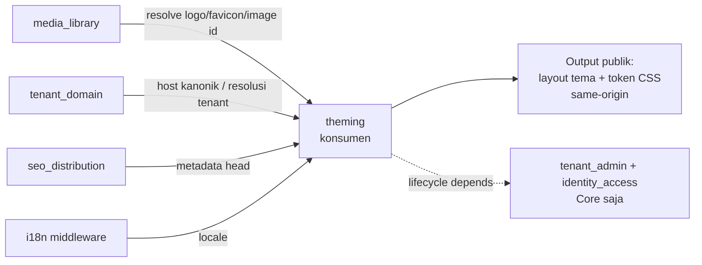

# ADR-0029 — Admission `theming` (Official Optional Module): tenant-selectable presentation via reviewed build-time themes + bounded data-only configuration

- **Status:** Accepted
- **Tanggal:** 2026-07-19
- **Pengambil keputusan:** @ahliweb
- **Terkait:** ADR-0025 (turunan scope website — presentasi/tema situs adalah kebutuhan setiap website publik), ADR-0011 (capability ports), ADR-0012 (module admission & trusted registry boundary), ADR-0013 §1/§5/§6/§9 (lapisan ekstensi — modul turunan menyumbang lewat seam build-time, tidak mengedit registry base, tidak menulis tabel modul lain), ADR-0009/0010 (routing tenant lewat path segment / host + `awcms_micro_tenant_domains`), ADR-0026 (admission `media_library`), ADR-0028 (admission `seo_distribution` — modul yang tema ini konsumsi untuk metadata), Issue #437 (CSP lewat `astro.config.mjs` `security.csp`, `src/lib/security/security-headers.ts`), `docs/awcms-micro/21_module_admission_governance.md` (§3 pohon keputusan, §4.3 kategori Official Optional Module, §9 kontrak murni tetap butuh ADR penuh), epic #261 (website-platform), dan issue #269 (ADR ini + runtime).

## Konteks

Scope website (ADR-0025) menuntut sebuah tenant bisa **memilih dan mengkonfigurasi tampilan** situsnya — tema, warna brand, tipografi, tata letak header/footer, urutan section — **tanpa** membuka pintu bagi tenant mengunggah kode server, template arbitrer, atau CSS/JS/HTML mentah. Ini adalah permukaan berisiko-tinggi yang klasik: sebuah "theme builder" naif berakhir mengeksekusi template tenant-authored (SSTI), menyuntik CSS/URL berbahaya (CSS injection, `url(javascript:…)`, exfiltrasi lewat `background:url()`), melemahkan header keamanan (CSP), atau membocorkan pratinjau ke indeks/cache publik.

AWCMS-Micro sudah punya **satu** hal yang mirip nama tapi bukan modul ini: kolom `awcms_micro_tenants.default_theme` (migration 002) — sebuah **mode warna** `light`/`dark`/`system` yang dikelola `tenant_admin`/`blog_content`. Itu **bukan** yang diadmisi di sini dan **tidak** ditulis ulang: `theming` adalah lapisan presentasi yang jauh lebih kaya (design token semantik, slot layout, pemilihan tema), ortogonal terhadap mode warna itu. `theming` memakainya sebagai sinyal default color-scheme, tidak menggantinya.

Keputusan yang harus mengikat **sebelum** kode: apa itu "tema" (dan siapa yang boleh menulisnya), ke arah mana dependency mengalir, lewat seam apa repo turunan menyumbang tema, dan — yang paling penting — **tulang punggung keamanan**: bagaimana nilai design-token tenant divalidasi sehingga tidak pernah bisa menjadi CSS/URL/skrip berbahaya, dan bagaimana pratinjau diisolasi dari indeks & cache publik.

Beberapa fakta grounding yang **tidak** ditulis ulang modul ini:

- **Rendering hanya lewat komponen/layout Astro tepercaya yang ada saat build.** Tidak ada template eksekutabel tersimpan di DB. Ini bukan fitur baru — ini invariant `blog-content`'s whitelist block renderer (ADR-0009, "no raw HTML") diperluas ke lapisan tema.
- **CSP dihitung Astro** (`astro.config.mjs` `security.csp`, Issue #437): `default-src 'self'`, tanpa `unsafe-inline` untuk style. Konsekuensi desain yang mengikat: nilai token tenant **tidak boleh** diemit sebagai `<style>` inline per-request (Astro tak bisa menghitung hash-nya → CSP memblokirnya). Token disajikan sebagai **stylesheet same-origin eksternal** (`/theming/tokens.css`) yang `style-src 'self'` izinkan — CSP tidak dilemahkan sama sekali.
- **Host kanonik & resolusi tenant** = `tenant_domain` (ADR-0010). Media (logo/favicon/OG) = `media_library` (id media, bukan URL). Metadata halaman = `seo_distribution` (ADR-0028). Locale = middleware yang ada. `theming` mengonsumsi semuanya, tidak memodelkan ulang.

## Keputusan

Kami mengadmisi **`theming`** sebagai **Official Optional Module** (doc 21 §4.3), **`type: "domain"`**, `isCore: false`, dengan **kontribusi tema lewat seam registry build-time** (bukan tabel DB, bukan unggahan runtime), dan **konfigurasi tenant lewat DATA saja** (design token dari allow-list/bounded, pilihan slot, id media) yang tervalidasi, tenant-scoped, RLS-protected, dan **immutable saat dipublikasikan**.

Keputusan ini **admission + kontrak + runtime dalam satu PR** (kontras ADR-0028 yang admission-only). Alasannya: berbeda dengan `seo_distribution` yang perilakunya sudah tersebar sebagai fakta laten di enam modul (butuh ADR mendahului kode untuk mencegah drift), `theming` adalah **kapabilitas baru tanpa perilaku laten** — tak ada tiga versi "tema" tumbuh di modul lain untuk dikonsolidasi. Descriptor `theming` karena itu didaftarkan **bersama kode nyatanya** di PR ini (menaikkan registry base 18 → **19**), persis aturan `scope:consistency:check`: hitungan naik saat **kode** masuk, dan descriptor mendeskripsikan kode nyata secara afirmatif (bukan placeholder yang gate `media-library:consistency:check` larang).

### 1. Parameter admission (mengisi `module-proposal-template.md`)

| Parameter                                      | Nilai                                                                                                                                                                                               |
| ---------------------------------------------- | --------------------------------------------------------------------------------------------------------------------------------------------------------------------------------------------------- |
| Nama                                           | Theming                                                                                                                                                                                             |
| `key`                                          | `theming`                                                                                                                                                                                           |
| Kategori (doc 21 §2)                           | **Official Optional Module** — presentasi tenant-selectable adalah fitur produk generik lintas domain website (brosur, portal berita, blog, komunitas), opt-in per tenant, bernilai produk langsung |
| `type` di kode                                 | `domain`                                                                                                                                                                                            |
| `isCore`                                       | tidak                                                                                                                                                                                               |
| `status` saat descriptor mendarat (#269)       | `active` — kode nyata (registry tema + validasi + versi + API + rendering + preview) mendarat di PR yang sama                                                                                       |
| Lifecycle `dependencies`                       | `["tenant_admin", "identity_access"]` **saja** — tidak ke `tenant_domain`/`media_library`/`seo_distribution`/konten                                                                                 |
| Capability `consumes` (semua `optional: true`) | `media_library` (resolusi logo/favicon/gambar) — satu-satunya capability port yang dikonsumsi; SEO/tenant_domain/i18n dikonsumsi lewat composition root, bukan port berversi                        |
| Capability `provides`                          | **tidak ada** — `theming` adalah leaf; tidak ada modul yang bergantung padanya, jadi tak ada entri `CAPABILITY_CONTRACT_VERSIONS` baru                                                              |
| Kelas kompatibilitas (doc 21 §6)               | Tema + token + rendering dari DB/asset build-time = **offline-lan-safe**; integrasi CDN/edge cache = **full-online-only** opt-in yang tidak mendegradasi profil offline                             |
| Pemilik                                        | @ahliweb (`.github/CODEOWNERS`)                                                                                                                                                                     |

Bukti "bukan Derived Application" (doc 21 §3 node Q3): presentasi/tema adalah kebutuhan **setiap** situs publik lintas vertikal — bukan spesifik retail/POS/pajak. Lolos kriteria generik yang sama yang membuat `blog_content`/`news_portal`/`seo_distribution` layak base.

### 2. Arah dependency — DAG-safe, panah menunjuk ke DALAM

`theming` adalah **konsumen** murni: ia mengonsumsi metadata SEO (renderer `seo_distribution`), `media_library`, `tenant_domain`, dan i18n — dan **tidak ada modul yang sudah ada dibuat bergantung pada `theming`**. Lifecycle `dependencies` hanya dua modul Core, sehingga graf tetap DAG-safe (`bun run modules:dag:check`). `capabilities.consumes` bukan lifecycle edge (`module-contract.ts`), preseden hidup `blog_content`↔`news_portal` dan `seo_distribution` (ADR-0028 §2).



**Invariant yang dikunci (AC #269):** tidak ada modul yang `dependencies`- atau `consumes`-nya menyebut `theming`; `theming` tidak `provides` kapabilitas apa pun.

### 3. Contribution seam — tema statis build-time, BUKAN tabel/unggahan

Sebuah **tema** adalah `ThemeDescriptor` — kode TypeScript statis, tepercaya, ter-review, yang di-bundle saat `bun run build`/`typecheck` seperti impor lain. Ia membawa: `themeKey`/`version`/`owner`, tipe page/resource yang didukung, kontrak **slot** layout/komponen, **skema design-token semantik** (dengan allow-list/bound per token), **slot aset** (referensi media = id, bukan URL), requirement kompatibilitas, serta **deklarasi a11y + CSP**.

Seam kontribusi = **registry tema build-time** (`src/modules/theming/theme-registry.ts`) yang menggabungkan `BASE_THEME_DESCRIPTORS` (tema base ter-review) dengan `applicationThemeRegistry` (kontribusi repo turunan, `undefined` di base) — **persis pola `src/modules/application-registry.ts`** (Issue #740, ADR-0013 §5/§9): **satu-satunya file** yang perlu diedit repo turunan untuk menyumbang tema ter-review, tanpa menyentuh registry base atau `src/modules/index.ts`. 100% statis, compile-time — **tidak** ada penemuan runtime, unggahan, package scanning, `eval`, atau pemuatan kode tak-tepercaya.

Fixture in-repo (`tests/fixtures/derived-theme-example/`) membuktikan sebuah repo turunan menyumbang tema `aurora` ter-review **tanpa** mengedit tema base — AC #269 "a derived repository can contribute a reviewed theme without editing the base theme registry".

```mermaid
flowchart TD
  BASE[BASE_THEME_DESCRIPTORS\n(default theme, ter-review)] --> REG[theme-registry.ts\nlistThemeDescriptors()]
  APP[applicationThemeRegistry\n(undefined di base;\nrepo turunan mengisi)] --> REG
  REG --> VAL[assertValidThemeDescriptor\n(CSP-safe: no inline script,\nno external script, self-contained)]
  VAL --> AVAIL[Tema tersedia untuk dipilih tenant]
```

### 4. Konfigurasi tenant — DATA saja, bounded, immutable saat published

Konfigurasi tenant (`ThemeConfig`) berisi **hanya data**: `tokenOverrides` (per token yang dideklarasikan tema, tervalidasi per-kind), `slotSelections` (varian dari allow-list slot), `assetRefs` (id media, bukan URL), `sectionOrder` (permutasi section yang dideklarasikan), `navPlacement` (dari allow-list). Divalidasi terhadap descriptor: **token/slot/aset/section yang tak dideklarasikan ditolak**, setiap nilai token divalidasi ketat (§6). Tipografi hanya dari **allow-list** (tenant memilih KUNCI; renderer mengemit CSS stack ter-review milik descriptor — nilai font tak pernah tenant-authored).

**Lifecycle: draft → validate → preview → publish → rollback/retire.** Versi yang dipublikasikan **immutable** — perubahan = versi baru. Ditegakkan di tiga lapis: (a) engine hanya meng-`INSERT` baris versi published baru, tak pernah meng-`UPDATE` yang lama; (b) **trigger DB** menolak `UPDATE`/`DELETE` pada baris ber-`status='published'`; (c) pointer aktif (tema + versi live) ada di `awcms_micro_theming_tenant_state`, sehingga rollback/retire mengubah pointer, **bukan** baris versi. Reproducible: versi menyimpan `theme_key` + `theme_version` descriptor + `config` tervalidasi + `config_hash`.

### 5. Tulang punggung keamanan — validasi nilai CSS (REJECT, bukan sanitize)

Ini spine modul. Setiap nilai design-token tenant melewati validator **reject-not-sanitize** (`domain/css-value-validation.ts`) sebelum pernah menyentuh output CSS:

- **`assertSafeCssPrimitive`** (guard umum yang semua validator panggil): panjang ≤ 128, charset terbatas, **menolak** control char, newline, `;` `{` `}` `<` `>` `\` `` ` `` `/*` `*/`, `url(`, `@`, `expression`, `javascript:`, `data:`, kurung/kutip tak seimbang. Menolak (bukan menghapus) → **tak ada** sanitasi multi-karakter, sehingga kelas CodeQL `js/incomplete-multi-character-sanitization` tidak berlaku secara struktural.
- **`validateColorValue`**: hanya `#hex` (3/4/6/8), `rgb()/rgba()/hsl()/hsla()` dengan argumen numerik/persen ketat (regex linear, tanpa ReDoS), atau named-color allow-list. Menolak `url(javascript:…)`, `expression()`, dll.
- **`validateDimensionValue`**: `angka + unit` dari allow-list (`px/rem/em/%/vh/vw/ch`), numerik dalam bound. **Menolak** `calc()`, `var()`, ekspresi.
- **`validateNumberValue`**: numerik bounded (line-height, font-weight, z-index).
- **Font family**: tenant menyediakan KUNCI allow-list; serializer mengemit stack ter-review descriptor — nol nilai font tenant-authored.
- **`serializeThemeTokensCss`**: safe-by-construction — hanya token yang lolos validasi typed yang diserialisasi, dan serializer **memvalidasi ulang** setiap nilai lalu throw bila ada yang gagal (defense-in-depth). Output = `:root{ --awcms-theme-<key>: <value>; }` disajikan sebagai `text/css` same-origin.

Karena nilai dibatasi ke charset aman oleh validasi, **tidak ada** jalur emit CSS tenant tak-tervalidasi. Rendering hanya lewat komponen Astro build-time; **tidak ada** template eksekutabel DB, tidak ada Astro/JS/SQL/`eval`/HTML-CSS-JS mentah tenant-authored.

### 6. Isolasi pratinjau — authorized, short-lived, non-indexable, cache terpisah

Pratinjau memakai **token sesi pratinjau** (`awcms_micro_theming_preview_sessions`): dibuat lewat API ber-ABAC (`theming.preview.create`), disimpan sebagai **hash** token (bukan token mentah), **short-lived** (`expires_at`, default 30 menit, purged oleh engine `data_lifecycle` generik). Halaman pratinjau (`/theming/preview/{token}`) dan CSS token pratinjaunya:

- **noindex**: `X-Robots-Tag: noindex, nofollow` + `<meta name="robots" content="noindex,nofollow">`.
- **cache terpisah**: `Cache-Control: private, no-store` + rute pratinjau adalah namespace URL terpisah dari `/theming/tokens.css` publik → **cache key berbeda secara struktural**, tak mungkin meracuni cache publik.
- **authorized**: token tak-tertebak (crypto random, dibandingkan hash), tenant-scoped (RLS), kedaluwarsa — bisa dibuka di konteks/perangkat lain (responsive preview) tanpa sesi admin, tetapi tetap terotorisasi lewat token.

Pratinjau **tidak pernah** menyentuh versi published; ia me-render **draft**. CSP tetap penuh (stylesheet same-origin), header keamanan tak dilemahkan, semantik a11y & auth rute tak di-bypass.

### 7. Rendering + kanonikalisasi (mengikat runtime PR ini)

| Output                  | Kepemilikan & invariant                                                                                                                                                                                                            |
| ----------------------- | ---------------------------------------------------------------------------------------------------------------------------------------------------------------------------------------------------------------------------------- |
| **Layout tema**         | Komponen/layout Astro build-time ter-review (`src/layouts/PublicThemeLayout.astro` + slot). Tidak ada template DB. `var(--awcms-theme-*)` merujuk token.                                                                           |
| **Token CSS publik**    | `/theming/tokens.css` — host → tenant (`tenant_domain`) → versi published aktif → `serializeThemeTokensCss`. `Content-Type: text/css`, ETag tenant-first, `Cache-Control: public`. Cross-tenant mustahil (host menentukan tenant). |
| **Metadata head**       | Lewat `seo_distribution` (ADR-0028) — `theming` tidak menumbuhkan canonical/OG-nya sendiri. Perubahan publish/rollback yang mengubah tampilan dicatat lewat audit (event domain ditunda — lihat §Strategi kepemilikan).            |
| **Logo/favicon/gambar** | Lewat `media_library` (id media, same-tenant, verified); id yang tak resolve → tidak diemit.                                                                                                                                       |
| **Header keamanan**     | Tema **tidak boleh** menambah `unsafe-inline`, skrip eksternal, atau melemahkan CSP; `assertValidThemeDescriptor` menolak descriptor yang menuntutnya.                                                                             |

### 8. Retensi, audit, permission, abuse control, runbook

- **Permission (migration 086):** `theming.config.{read,update}` (baca state/versi + edit draft/pilihan), `theming.version.{publish,restore,archive}` (publish versi immutable, rollback ke versi lama, retire/nonaktifkan), `theming.preview.create` (buat sesi pratinjau). Publish/rollback/retire adalah high-risk (mengubah tampilan publik) → idempotency-keyed + audited; preview.create audited.
- **Audit (skill `awcms-micro-audit-log`):** publish, rollback, retire, dan setiap update draft high-risk → audit log, aktor teridentifikasi.
- **Retensi (skill `awcms-micro-data-lifecycle`):** `awcms_micro_theming_preview_sessions` didaftarkan sebagai `HighVolumeTableDescriptor` (`executionMode: "generic"`, purge age-based via `expires_at`, `GRANT SELECT, DELETE … TO awcms_micro_worker`). Versi config append-only, tidak dipurge otomatis (riwayat rollback bergantung padanya).
- **Abuse control:** bound panjang/jumlah token (charset + ≤128 char/nilai, hanya token yang dideklarasikan), TTL sesi pratinjau, satu draft per tenant.
- **Runbook (#269 docs):** publish/preview/rollback + regenerasi token CSS didokumentasikan sebagai runbook operasional.

## Threat model (bagian dari acceptance)

| Ancaman                            | Kontrol                                                                                                                                                                                                                 |
| ---------------------------------- | ----------------------------------------------------------------------------------------------------------------------------------------------------------------------------------------------------------------------- |
| **CSS injection**                  | Nilai token divalidasi **reject-not-sanitize** (`assertSafeCssPrimitive` + validator typed); charset terbatas, `;{}<>` dan `expression()` ditolak; serializer memvalidasi ulang; nilai font tak pernah tenant-authored. |
| **Unsafe URL / exfiltrasi**        | Tidak ada nilai token yang boleh memuat `url(`, `javascript:`, `data:`, `@import`; aset = id media (bukan URL), di-resolve same-tenant/verified lewat `media_library`.                                                  |
| **SSTI / arbitrary code**          | Tema = kode Astro build-time ter-review; **tidak ada** template DB, `eval`, Astro/JS/SQL/HTML mentah tenant-authored; konfigurasi = data terikat skema.                                                                 |
| **CSP weakening**                  | `assertValidThemeDescriptor` menolak tema yang menuntut inline script/style atau sumber eksternal di luar allow-list (kosong); token disajikan sebagai stylesheet same-origin (tak butuh `unsafe-inline`).              |
| **Preview leakage**                | Token hash short-lived, tenant-scoped (RLS); halaman + CSS pratinjau `noindex` + `private, no-store`.                                                                                                                   |
| **Cache poisoning / cross-tenant** | Token CSS publik: host→tenant, ETag tenant-first; pratinjau namespace URL + `no-store` terpisah → tak bisa meracuni cache publik; RLS FORCE di semua tabel.                                                             |
| **Mutable-published tampering**    | Versi published immutable (engine INSERT-only + trigger DB tolak UPDATE/DELETE published + pointer aktif di tabel state).                                                                                               |
| **A11y regression**                | Tema mendeklarasikan kontras/keyboard/landmark/reduced-motion; token bounded (mis. font-size min) mencegah nilai yang merusak keterbacaan; uji axe-core lintas tema default+derived.                                    |

## Strategi kepemilikan OpenAPI/AsyncAPI + generated-doc

- **REST admin** (`/api/v1/theming/*`: selection, token edit, validate, preview, publish, version history, rollback/retire) hidup di kontrak monolitik lewat fragment `openapi/modules/theming.openapi.yaml` → `bun run openapi:bundle`. ABAC + audit + idempotency.
- **Output publik non-JSON** (`/theming/tokens.css`, halaman + CSS pratinjau) adalah **route Astro** yang me-render `text/css`/HTML — **tidak** masuk OpenAPI (persis `sitemap.xml`/`/news`).
- **Event domain DITUNDA (documented follow-up)** — persis posisi `seo_distribution` #268: publish/rollback/retire adalah **hook sinkron ter-audit** (audit log, aktor teridentifikasi) di PR ini, **belum** event yang dipublikasikan lewat `domain_event_runtime`. Modul karena itu **tidak** mendeklarasikan `events` di descriptor dan **tidak** menambah channel AsyncAPI/registry event-type di PR ini. Event `awcms-micro.theming.version.published`/`.rolled-back`/`.retired` (untuk invalidasi cache/CDN & integrasi downstream) adalah follow-up terdokumentasi begitu ada consumer nyata yang membutuhkannya — menghindari menaruh channel tanpa producer/consumer yang gate repo ini larang.
- **Generated doc** `docs/awcms-micro/api-reference.md` diregenerasi (`bun run api:docs:generate`), tidak diedit tangan.

## Keputusan pendaftaran descriptor — registry naik 18 → 19 di PR ini

Kontras ADR-0028 (admission-only): `theming` **tidak** punya perilaku laten di modul lain untuk dikonsolidasi lebih dulu, jadi tak ada alasan memisahkan admission dari runtime. Descriptor + tabel + validasi + API + rendering + preview + tema default & fixture turunan semuanya mendarat **atomik** di #269, menaikkan `EXPECTED_BASE_MODULE_COUNT` 18 → **19** dan meregenerasi kedua inventori — persis aturan gate: hitungan naik saat **kode** masuk, descriptor mendeskripsikan kode nyata secara afirmatif. Tak ada entri `CAPABILITY_CONTRACT_VERSIONS` baru (modul ini `provides` nol kapabilitas).

## Konsekuensi

**Positif.** Tenant mendapat presentasi yang bisa dipilih & dikonfigurasi tanpa satu pun jalur kode/template tenant-authored. Tulang punggung validasi CSS reject-not-sanitize mengunci kelas CSS/URL/skrip injection sejak hari nol. Seam registry build-time membiarkan repo turunan menyumbang tema ter-review tanpa menyentuh base. Versi immutable + pointer aktif membuat publish/rollback reproducible & aman. CSP tak dilemahkan (stylesheet same-origin). Pratinjau terisolasi dari indeks & cache publik.

**Negatif / trade-off yang diterima.** Konfigurasi DATA-only lebih terbatas dari "theme builder bebas" — disengaja: keamanan > ekspresivitas tak terbatas. Menyajikan token sebagai stylesheet eksternal (bukan inline) menambah satu request CSS — biaya kecil demi CSP utuh. **UI admin penuh (editor token kaya, dashboard pratinjau responsif) ditunda** sebagai follow-up terdokumentasi (preseden #266 yang menunda UI SEO) — PR ini mengirim API + rendering + permukaan pratinjau minimal (AC #269 API-first).

**Netral.** `theming` menyentuh permukaan yang sama dengan `blog_content`'s theme override & `awcms_micro_tenants.default_theme` (mode warna) — koordinasi lewat pembacaan, bukan penulisan silang; `theming` tidak menulis tabel modul lain.

## Alternatif yang dipertimbangkan

- **Template/tema tenant-authored tersimpan di DB (uploadable).** Ditolak — permukaan SSTI/RCE/CSS-injection yang persis dilarang out-of-scope #269; melanggar "rendering hanya lewat kode ter-review".
- **Nilai token diemit sebagai `<style>` inline per-request.** Ditolak — Astro tak bisa menghitung hash per-request → CSP memblokirnya (atau memaksa `unsafe-inline` yang melemahkan CSP). Stylesheet same-origin adalah jalur CSP-utuh.
- **Tema disimpan di tabel DB & dipilih runtime.** Ditolak untuk descriptor tema (ADR-0013 §9: kontribusi lewat seam build-time statis, bukan penemuan runtime). Hanya KONFIGURASI tenant yang di DB (data terikat skema), bukan tema itu sendiri.
- **Menjadikan `theming` modul System.** Ditolak — doc 21 §4.3 mengklasifikasikan presentasi sebagai Official Optional (opt-in per tenant, nilai produk langsung).
- **Admission-only lebih dulu (pola ADR-0028).** Ditolak — tak ada perilaku laten lintas-modul untuk dikonsolidasi; runtime + descriptor mendarat atomik lebih tepat (pola ADR-0026 yang mendaftarkan segera karena kode ada).
- **Sanitasi (strip) nilai CSS berbahaya alih-alih menolaknya.** Ditolak — sanitasi multi-karakter rentan bypass (kelas CodeQL `js/incomplete-multi-character-sanitization`); **reject** nilai yang tak cocok pola ketat adalah pertahanan yang terbukti & tak bisa di-bypass sebagian.
