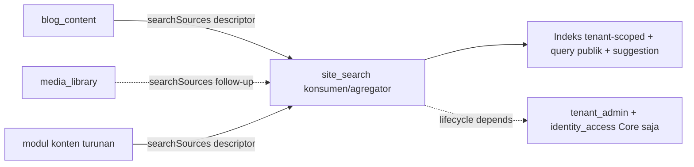

# ADR-0031 — Admission `site_search` (Official Optional Module): pencarian PostgreSQL FTS lewat search-source descriptor, DAG-safe inward

- **Status:** Accepted
- **Tanggal:** 2026-07-19
- **Pengambil keputusan:** @ahliweb
- **Terkait:** ADR-0025 (turunan scope website — §Konteks menuntut pencarian situs sebagai fitur website), ADR-0028 (admission `seo_distribution` — preseden contribution contract INWARD: modul konten adalah PENYEDIA, modul agregator KONSUMEN), ADR-0011 (capability ports), ADR-0012 (module admission & trusted registry boundary), ADR-0013 §1/§6 (lapisan ekstensi — modul tidak menulis ke tabel modul lain; kolaborasi lewat kontrak yang dideklarasikan modul pemilik), ADR-0009/0010 (rute publik tenant-scoped host/path), `docs/awcms-micro/21_module_admission_governance.md` (§3 pohon keputusan, §4.3 kategori Official Optional Module, §5 required vs optional capability), epic #261 (website-platform), issue #270 (ADR + runtime dalam satu PR)

## Konteks

ADR-0025 §Konteks menuliskan scope website menuntut modul **pencarian situs** — pencarian teks-penuh atas konten publik yang sudah terbit, tanpa layanan search eksternal sebelum ada bukti PostgreSQL tidak cukup. Hari ini AWCMS-Micro punya pencarian **per-modul** (`blog_content`'s `blog-search.ts` + `search_vector` di `awcms_micro_blog_posts`/`awcms_micro_blog_pages`, migration 028) tetapi **tidak** ada pencarian **lintas-konten, satu tenant** yang menyatukan post, halaman, artikel berita, dan (bila bermakna) metadata media dalam satu permukaan terindeks dengan suggestion, rebuild, dan rekonsiliasi.

Bila #270 hanya menambah rute pencarian ad-hoc tanpa kepemilikan eksplisit lebih dulu, setiap modul konten akan menumbuhkan versi indeks/relevansi/snippet-nya sendiri — persis drift lintas-modul yang ADR-0025 §5 larang dan yang ADR-0026/0028 baru saja bersusah payah membalik. Keputusan yang harus mengikat **sebelum** kode: siapa yang memiliki indeks pencarian, ke arah mana dependency mengalir, dan lewat seam apa modul konten menyumbang sumber-pencarian tanpa saling impor dan tanpa menulis ke tabel indeks orang lain.

Fakta grounding yang sudah ada dan **tidak** ditulis ulang oleh modul ini:

- `blog_content` (ADR-0009) sudah memiliki predikat "publik + terbit" tunggal (`status='published' AND visibility='public' AND deleted_at IS NULL AND published_at IS NOT NULL AND published_at <= now()`) dan `search_vector` tsvector `GENERATED ALWAYS ... STORED`. `site_search` mengonsumsi predikat & kolom itu lewat descriptor, bukan memodelkannya ulang.
- `tenant_domain` (ADR-0010) me-resolve tenant dari host untuk rute publik (`resolvePublicTenantFromRequest`). Halaman/endpoint pencarian publik memakainya persis seperti `/news`.
- `PublicContentPort` sudah membedakan **existence** dari **public-visibility**. `site_search` mewarisi semantik itu: indeks HANYA memuat resource yang benar-benar publik pada boundary sumber→indeks — indeks pencarian **bukan** sumber otorisasi.

## Keputusan

Kami mengadmisi **`site_search`** sebagai **Official Optional Module** (doc 21 §4.3 — fitur produk generik lintas domain website, opt-in per tenant), memakai **PostgreSQL full-text search sebagai default** (`tsvector`/GIN; `pg_trgm` HANYA untuk suggestion typeahead judul), dan mewujudkan kolaborasinya lewat **search-source contribution contract** — **bukan** impor internal lintas-modul dan **bukan** tulisan langsung ke shared table (ADR-0013 §6).

Arah kepemilikan dinyatakan tegas, meniru ADR-0028: **modul konten adalah PENYEDIA "search sources"; `site_search` adalah KONSUMEN/agregator.** Tidak ada modul yang sudah ada dibuat bergantung pada `site_search`, dan `site_search` tidak mengambil lifecycle dependency apa pun ke modul konten (hanya ke Core) — sehingga graf tetap DAG-safe.

Berbeda dari ADR-0028, dan **sesuai instruksi issue**, admission + runtime mendarat dalam **satu PR** (#270): ADR ini Accepted, descriptor `site_search` didaftarkan di `src/modules/index.ts` (naik hitungan base 19 → 20), dan kode runtime (skema indeks, engine, endpoint, UI) ada semuanya — karena kode-nya memang ditulis di issue yang sama (kontras #265 yang admission-only).

### 1. Parameter admission

| Parameter                        | Nilai                                                                                                                                              |
| -------------------------------- | -------------------------------------------------------------------------------------------------------------------------------------------------- |
| Nama                             | Site Search                                                                                                                                        |
| `key`                            | `site_search`                                                                                                                                      |
| Kategori (doc 21 §2)             | **Official Optional Module** — pencarian situs kebutuhan generik **setiap** situs publik lintas vertikal, opt-in per tenant, nilai produk langsung |
| `type` di kode                   | `domain` (sama seperti `blog_content`/`news_portal`/`seo_distribution`)                                                                            |
| `isCore`                         | tidak                                                                                                                                              |
| `status`                         | `active` — descriptor + kode runtime mendarat bersama (#270)                                                                                       |
| Lifecycle `dependencies`         | `["tenant_admin", "identity_access"]` **saja** — tidak ke `blog_content`/`news_portal`/`media_library`                                             |
| Kontribusi sumber-pencarian      | descriptor-list `ModuleDescriptor.searchSources` (§3) — **bukan** capability `provides` (>1 penyedia `provides` = `capability_provider_conflict`)  |
| Kelas kompatibilitas (doc 21 §6) | Indeks + query dari DB lokal = **offline-lan-safe**; layanan search eksternal (Elastic/OpenSearch/vector) = **di luar scope**, tidak diadmisi      |
| Pemilik                          | @ahliweb (`.github/CODEOWNERS`)                                                                                                                    |

Bukti "bukan Derived Application" (doc 21 §3 node Q3): pencarian situs adalah kebutuhan setiap situs publik — bukan spesifik retail/POS/pajak. Lolos kriteria generik yang sama yang membuat `blog_content`/`seo_distribution` layak base.

### 2. Arah dependency — kenapa panah menunjuk ke DALAM (DAG-safe)

| Modul                | Peran terhadap `site_search`                                                 | Lifecycle `dependencies`                             |
| -------------------- | ---------------------------------------------------------------------------- | ---------------------------------------------------- |
| `blog_content`       | **penyedia** search source (post `/news/:slug`, halaman `/:slug`)            | tidak berubah — tidak menambah edge ke `site_search` |
| `news_portal`        | menyusun post berita (bukan resource konten mandiri) — tidak source terpisah | tidak berubah                                        |
| `media_library`      | **penyedia** (opsional, follow-up) metadata media publik                     | tidak berubah                                        |
| modul konten turunan | **penyedia** (lewat descriptor `searchSources` yang sama)                    | tidak berubah                                        |
| `site_search`        | **konsumen/agregator** (memiliki indeks + query + suggestion)                | `["tenant_admin", "identity_access"]`                |

**Invariant yang dikunci (AC #270):** tidak ada modul yang sudah ada yang `dependencies`- atau `consumes`-nya menyebut `site_search`. Arah kontribusi dibalik dari desain naif "search mengimpor tiap modul konten": kalau `site_search` mengonsumsi port milik `blog_content`, agregator akan menyeret dependency ke setiap modul konten. Dengan membalik arah — konten **mendeklarasikan** search source, search menemukannya lewat `listModules()` — `site_search` tetap ignorant terhadap modul konten mana pun, dan modul konten tetap ignorant terhadap internal search.

### 3. Contribution contract — kenapa descriptor-list, BUKAN capability `provides`

ADR-0028 memodelkan `seo_facts` sebagai **satu** capability `provides` (hanya `blog_content` mendeklarasikannya, karena `module-composition.ts`'s `checkCapabilityBindings` menandai `capability_provider_conflict` bila >1 modul mendeklarasikan `provides` string yang sama). Untuk pencarian kita **memang** ingin banyak modul konten menyumbang → memodelkan `search_source` sebagai capability `provides` akan langsung memicu konflik itu.

Maka seam-nya adalah **descriptor-list** — persis pola `dataLifecycle`/`sodRules`/`reportingProjections`/`referenceData` yang sudah ada: setiap modul mendeklarasikan array `ModuleDescriptor.searchSources` **di `module.ts`-nya sendiri**, dan `site_search` mengagregasi lewat `listModules()` (`site-search/domain/search-source-registry.ts`, meniru `reporting/domain/projection-registry.ts` persis: flatten + validasi `ownerModuleKey` = key modul pendeklarasi + key unik). Karena descriptor mengalir lewat `listModules()`, sebuah modul **turunan** menyumbang source lewat `application-registry.ts`-nya sendiri **tanpa** mengedit registry base dan **tanpa** menulis ke tabel indeks (AC #270).

**`SearchSourceDescriptor` adalah DATA MURNI, bukan extractor executable** (security requirement #270: "tenants cannot define arbitrary SQL or executable extractors"). Descriptor mendeklarasikan, sebagai konstanta reviewed build-time: `resourceType`, tabel/kolom sumber (tabel, tenant, id, locale, updated_at, kolom title/summary/body/tags, kolom slug), template URL publik (`/news/:slug`), **publication filter deklaratif** (equals/notNull/isNull/timeReached), `weight` relevansi, dan `privacyClassification`. `site_search`'s engine generik (`application/search-index-engine.ts`) membangun query BER-PARAMETER dari descriptor — nilai selalu bound parameter; hanya IDENTIFIER (nama tabel/kolom) yang diinterpolasi, dan itu divalidasi ketat (`^[a-z_][a-z0-9_]*$`, tabel `awcms_micro_`) — **preseden persis `data_lifecycle`'s generic executionMode** (`assertSafeIdentifier` + interpolasi `tableName`/`cursorColumn`). Tidak ada tempat bagi tenant menyuntik SQL: descriptor 100% kode.

Ini sanksi ADR-0013 §6 yang sama seperti `data_lifecycle`: engine generik membaca tabel modul lain **lewat kontrak yang dideklarasikan modul pemilik** (descriptor), bukan akses skema liar. Bukan pula pelanggaran `module-boundary` (impor TypeScript lintas-`application`/`domain`) — engine membaca tabel lewat nama SQL biasa, bukan impor kode (preseden `reporting`'s rebuild membaca `awcms_micro_domain_events`).

### 4. Model indeks — proyeksi tenant-scoped, event-driven + reconcile deterministik

- **Tabel indeks** `awcms_micro_site_search_documents` (RLS FORCE, satu doc per `(tenant, source_key, resource_id, locale)`): menyimpan `title`/`summary`/`body_text` (dibatasi panjang untuk snippet) + `tags` + `url` + `source_updated_at` + `source_checksum`, dengan `search_vector tsvector GENERATED ALWAYS ... STORED` (`setweight` title=A/summary=B/tags=C/body=D) + index GIN. `pg_trgm` GIN pada `title` **hanya** untuk suggestion typeahead (justifikasi: prefix/fuzzy pada judul; query utama tetap FTS `websearch_to_tsquery`).
- **Pengisian indeks**: (a) **reconcile** deterministik (`reconcileTenantSearchIndex`) — mesin backbone: upsert semua doc publik saat ini (skip bila `source_checksum` cocok), hapus doc indeks yang resource-nya tidak lagi memenuhi predikat sumber (stale removal). Idempoten: menjalankan ulang saat sinkron = no-op; cocokkan hitungan/checksum sumber (AC "reconciliation matches source counts/checksums"). (b) **rebuild** penuh (`rebuildTenantSearchIndex`) idempoten (DELETE doc tenant → reconcile; hasil akhir identik apa pun state awal). (c) **reindex satu-resource** (`reindexSearchResource`) — primitive event-shaped: re-extract satu resource; publik → upsert, tidak publik (archive/delete/unpublish) → hapus dari indeks. Ini pertahanan **stale-leakage**: archive/delete/unpublish menghapus dari hasil publik tanpa sisa.
- **Event-driven**: base `blog_content` hari ini menerbitkan lifecycle sebagai **log line** (bukan event outbox `domain_event_runtime` nyata — hanya `sample.recorded` yang nyata), sama seperti `seo_distribution` #268 mencatat slug-change sebagai log line. Maka **reconcile terjadwal** (`site-search:reconcile`, per tenant, bounded) adalah backbone deterministik hari ini; `reindexSearchResource` + consumer domain-event terdaftar adalah seam yang aktif otomatis begitu modul konten (turunan, atau enhancement blog masa depan) menerbitkan event lifecycle nyata. `site_search` sendiri menerbitkan event indeks (`awcms-micro.site-search.document.*`, `awcms-micro.site-search.index.*`) sebagai log line terdokumentasi di AsyncAPI untuk observability.

### 5. Kontrak query publik + suggestion (yang wajib dihormati)

| Aspek                   | Invariant                                                                                                                                                                                         |
| ----------------------- | ------------------------------------------------------------------------------------------------------------------------------------------------------------------------------------------------- |
| **Tenant/locale scope** | Setiap query dibatasi `tenant_id` (RLS FORCE + predikat) DAN `locale`; tenant A / locale A **tidak pernah** mengembalikan record tenant B / locale tak tersedia.                                  |
| **Publication-state**   | Difilter di boundary sumber→indeks (indeks hanya memuat resource publik); query indeks **bukan** sumber otorisasi. Tidak ada draft/preview/private/deleted di hasil.                              |
| **Normalisasi query**   | Query dinormalisasi (trim, batas panjang min/max, kolaps whitespace) lalu ke `websearch_to_tsquery('simple', $1)` (bound param → tidak ada SQL injection).                                        |
| **Snippet/highlight**   | Dibangun via `ts_headline` dengan sentinel non-HTML, di-escape HTML seluruhnya, lalu sentinel diganti `<mark>`/`</mark>` — snippet **tidak pernah** mengembalikan markup mentah (pertahanan XSS). |
| **Pagination**          | Keyset cursor `(rank/id)`, `LIMIT` dibatasi (result caps).                                                                                                                                        |
| **Filter tipe**         | Hanya `resourceType` yang teradmisi (dari descriptor + tenant config).                                                                                                                            |
| **Suggestion**          | Bounded JSON typeahead judul via `pg_trgm`, tenant/locale-scoped, panjang & jumlah dibatasi.                                                                                                      |
| **Anonim**              | Rate limit per-IP (`checkRateLimit`), batas panjang query, `statement_timeout` sesi, result caps, monitoring abuse via metrics.                                                                   |
| **Cache key**           | `buildSearchCacheKey` menolak menyusun key tanpa `tenant_id`+`locale`+`query`-hash — cross-tenant/locale cache confusion secara struktural mustahil.                                              |

### 6. Konfigurasi tenant, admin, retensi/audit

- **Config tenant** (`awcms_micro_site_search_settings`, RLS FORCE, 1 baris/tenant, CHECK-bounded): `enabled`, `enabled_resource_types` (null=semua teradmisi), `result_limit`, `min_query_length`, `suggestions_enabled`, `analytics_enabled` (opt-in query logging).
- **Admin (permission, ABAC, audit, bounded, observable):** `site_search.index.{read,rebuild,reconcile}`, `site_search.settings.{read,update}`, `site_search.diagnostics.read`. Status/freshness indeks, rebuild, rekonsiliasi, dan diagnostik failed-item adalah aksi terotorisasi + teraudit (rebuild/reconcile/settings-update high-risk → idempotency-keyed + audit log).
- **Retensi (skill `awcms-micro-data-lifecycle`):** `awcms_micro_site_search_query_log` (opt-in, minimized — hash query + count, tanpa PII) dan `awcms_micro_site_search_index_failures` didaftarkan sebagai `HighVolumeTableDescriptor` `generic` (`GRANT SELECT, DELETE ... TO awcms_micro_worker`, index `(tenant, cursor)`).
- **Query logging** opt-in + minimized: strip parameter sensitif, hanya hash query + hitungan hasil + locale, ikut kebijakan retensi/privasi.

## Threat model (bagian dari acceptance)

| Ancaman                         | Kontrol                                                                                                                                                               |
| ------------------------------- | --------------------------------------------------------------------------------------------------------------------------------------------------------------------- |
| **SQL injection**               | Query & filter selalu bound parameter (`websearch_to_tsquery('simple', $1)`); descriptor IDENTIFIER divalidasi ketat sebelum interpolasi (preseden `data_lifecycle`). |
| **XSS lewat snippet**           | `ts_headline` sentinel non-HTML → escape HTML seluruh string → ganti sentinel `<mark>`; markup mentah tidak pernah keluar.                                            |
| **Draft/private leakage**       | Publication-filter deklaratif ditegakkan di boundary sumber→indeks; indeks hanya memuat resource publik; reindex menghapus yang jadi non-publik.                      |
| **Cross-tenant / cross-locale** | RLS FORCE + predikat `tenant_id`/`locale` di setiap query; cache key wajib memuat tenant+locale; uji isolasi integrasi.                                               |
| **Query abuse**                 | Rate limit per-IP, batas panjang query, `statement_timeout`, result caps, index bounded (LIMIT + keyset).                                                             |
| **Cache poisoning**             | `buildSearchCacheKey` tenant+locale+query-hash — menolak key tanpa komponen isolasi.                                                                                  |
| **Search sebagai authz source** | Indeks HANYA proyeksi konten publik; tidak pernah dipakai memutuskan akses; sumber kebenaran visibilitas tetap modul konten.                                          |

## Out of scope (ditegakkan)

Layanan search SaaS/Elasticsearch/OpenSearch, vector/semantic AI ranking, cross-tenant global search, mengindeks data privat/admin bisnis, dan memakai proyeksi search sebagai sumber otorisasi — **tidak** diadmisi (issue #270 §Out of scope). PostgreSQL FTS adalah default sampai ada bukti kuat ia tidak cukup.

## Strategi kepemilikan OpenAPI/AsyncAPI + generated-doc

- **REST** — dua endpoint publik anonim (`GET /api/v1/site-search/query`, `GET /api/v1/site-search/suggest`) + endpoint admin (`/api/v1/site-search/settings`, `/api/v1/site-search/index/*`) di fragment `openapi/modules/site-search.openapi.yaml` lalu `bun run openapi:bundle`. Endpoint publik anonim terdaftar di `ALLOWED_PUBLIC_OPERATIONS` (`scripts/api-spec-check.ts`).
- **Halaman search publik** (`/search`) adalah route Astro yang me-render HTML (seperti `/news`), **bukan** OpenAPI.
- **Event indeks** (`awcms-micro.site-search.*`) di AsyncAPI monolitik, log-line terdokumentasi (preseden `blog-content.post.*`).
- **Generated doc** `docs/awcms-micro/api-reference.md`, `repo-inventory.md`, `module-composition-inventory.json`, `work-class-registry.generated.json` diregenerasi di PR yang sama.

## Konsekuensi

**Positif.** Kepemilikan indeks pencarian eksplisit; satu otoritas relevansi/snippet/rebuild; tipe konten base **dan** turunan menyumbang lewat satu descriptor tanpa `site_search` mengenal satu pun secara spesifik dan tanpa modul konten mengenal internal search. DAG aman (search bergantung hanya pada Core). Publication-state, tenant/locale isolation, dan snippet-escaping dikunci sebagai kontrak sejak hari nol. PostgreSQL FTS lokal = offline-lan-safe, tanpa layanan eksternal.

**Negatif / trade-off yang diterima.** Indeks adalah proyeksi kedua (di atas `search_vector` per-modul yang sudah ada) → butuh reconcile/rebuild untuk konsistensi; biaya disengaja demi pencarian lintas-konten yang seragam. Karena base `blog_content` menerbitkan lifecycle sebagai log line (bukan event outbox nyata), indexing incremental low-latency menunggu event nyata; sampai itu, reconcile terjadwal deterministik adalah backbone. Metadata media dan tipe non-`blog_post` adalah **follow-up terdokumentasi** (seam descriptor sudah mendukungnya).

**Netral.** `site_search` menyentuh permukaan yang sama dengan `seo_distribution` (URL publik) dan `visitor_analytics` (query publik) — koordinasi lewat descriptor/log, bukan tabel bersama.

## Alternatif yang dipertimbangkan

- **Memodelkan `search_source` sebagai capability `provides`.** Ditolak: >1 penyedia = `capability_provider_conflict` (`module-composition.ts`); descriptor-list `listModules()` adalah seam yang benar untuk banyak penyedia + derived-safe (preseden `data_lifecycle`/`reporting`).
- **Extractor executable per modul (adapter yang di-wire di composition root, gaya `seo_facts`).** Ditolak untuk source-extraction: melanggar "tenants cannot define arbitrary SQL or executable extractors" lebih longgar dari perlu, dan menyulitkan modul turunan menyumbang tanpa seam registrasi extractor. Descriptor data murni + engine generik reviewed adalah paling aman.
- **Menyatukan pencarian ke `blog_content` yang sudah ada.** Ditolak: pencarian lintas-konten (post + halaman + berita + media + tipe turunan) bukan milik satu modul konten; agregator netral adalah tempat yang benar.
- **Layanan search eksternal (Elastic/OpenSearch/vector).** Ditolak (out of scope #270): tidak ada bukti PostgreSQL FTS tidak cukup untuk scope website; menambah ketergantungan operasional & permukaan lintas-tenant.
- **Modul konten menulis dokumen search ke tabel indeks bersama.** Ditolak: melanggar ADR-0013 §6 (tanpa shared-table write); descriptor + engine generik adalah seam yang benar.
