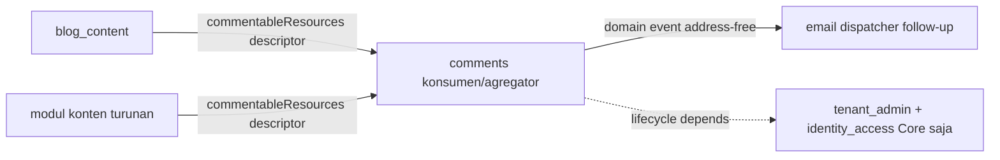

# ADR-0032 — Admission `comments` (Official Optional Module): komentar MODERATION-FIRST lewat commentable-resource descriptor, DAG-safe inward

- **Status:** Accepted
- **Tanggal:** 2026-07-20
- **Pengambil keputusan:** @ahliweb
- **Terkait:** ADR-0025 (turunan scope website — §Konteks menuntut komentar/moderasi sebagai fitur website), ADR-0031 (admission `site_search` — preseden PERSIS: contribution contract INWARD lewat descriptor-list `listModules()`, modul konten adalah PENYEDIA, modul agregator KONSUMEN), ADR-0028 (admission `seo_distribution` — preseden arah kontribusi inward + capability tunggal vs descriptor-list banyak-penyedia), ADR-0006 (provider opsional, di luar transaksi — honeypot/Turnstile/email dispatcher), ADR-0011 (capability ports), ADR-0012 (module admission & trusted registry boundary), ADR-0013 §1/§6 (lapisan ekstensi — modul tidak menulis ke tabel modul lain; kolaborasi lewat kontrak yang dideklarasikan modul pemilik), ADR-0009/0010 (rute publik tenant-scoped host/path), `docs/awcms-micro/21_module_admission_governance.md` (§3 pohon keputusan, §4.3 Official Optional Module, §5 required vs optional capability), epic #261 (website-platform), issue #271 (ADR + runtime dalam satu PR)

## Konteks

ADR-0025 §Konteks menuliskan scope website menuntut modul **komentar** — pengunjung membubuhkan komentar pada konten publik yang sudah terbit, dengan moderasi, anti-abuse, dan minimisasi PII. Hari ini AWCMS-Micro memiliki `blog_content`/`news_portal` (konten publik terbit) tetapi **tidak** ada permukaan komentar sama sekali: tidak ada thread, tidak ada moderasi, tidak ada anti-abuse.

Bila #271 hanya menambah tabel komentar ad-hoc yang di-`import` `blog_content`, setiap modul konten akan menumbuhkan versi thread/moderasi/anti-abuse-nya sendiri — persis drift lintas-modul yang ADR-0025 §5 larang dan yang ADR-0028/0031 baru saja bersusah payah membalik. Keputusan yang harus mengikat **sebelum** kode: siapa yang memiliki komentar, ke arah mana dependency mengalir, dan lewat seam apa modul konten menyumbang resource yang dapat dikomentari tanpa saling impor dan tanpa menulis ke tabel komentar orang lain.

Fakta grounding yang sudah ada dan **tidak** ditulis ulang oleh modul ini:

- `blog_content` (ADR-0009) sudah memiliki predikat "publik + terbit" tunggal (`status='published' AND visibility='public' AND deleted_at IS NULL AND published_at IS NOT NULL AND published_at <= now()`). `comments` mengonsumsi predikat & kolom itu lewat descriptor, bukan memodelkannya ulang.
- `tenant_domain` (ADR-0010) me-resolve tenant dari host untuk rute publik. Endpoint komentar publik memakainya persis seperti `/news`.
- `PublicContentPort` membedakan **existence** dari **public-visibility**. `comments` mewarisi semantik itu: sebuah komentar HANYA diterima/ditampilkan terhadap resource yang benar-benar publik pada boundary resource→thread — permukaan komentar **bukan** sumber otorisasi.
- `profile-identity`'s `normalizeIdentifier`/`hashIdentifier`/`maskIdentifier` sudah ada untuk minimisasi email; `data_lifecycle` sudah punya legal hold + generic purge; `domain_event_runtime` sudah punya outbox transaksional. `comments` memakai ulang semuanya.

## Keputusan

Kami mengadmisi **`comments`** sebagai **Official Optional Module** (doc 21 §4.3 — fitur produk generik lintas domain website, opt-in per tenant, default-OFF), **MODERATION-FIRST** (setiap submission diterima mulai `pending` secara default; anonymous SELALU dimoderasi), dan mewujudkan kolaborasinya lewat **commentable-resource contribution contract** — **bukan** impor internal lintas-modul dan **bukan** tulisan langsung ke shared table (ADR-0013 §6).

Arah kepemilikan dinyatakan tegas, meniru ADR-0031: **modul konten adalah PENYEDIA "commentable resources"; `comments` adalah KONSUMEN/agregator.** Tidak ada modul yang sudah ada dibuat bergantung pada `comments`, dan `comments` tidak mengambil lifecycle dependency apa pun ke modul konten (hanya ke Core) — sehingga graf tetap **DAG-safe inward leaf** (tidak ada yang bergantung padanya).

Sesuai instruksi issue, admission + runtime mendarat dalam **satu PR** (#271): ADR ini Accepted, descriptor `comments` didaftarkan di `src/modules/index.ts` (menaikkan hitungan base **20 → 21**), `MODULE_CONTRACT_VERSION` naik **1.3.0 → 1.4.0** (field kontrak baru `commentableResources` + tipe `CommentableResourceDescriptor`), dan kode runtime (skema, engine, endpoint, UI, job, event) ada semuanya.

### 1. Parameter admission

| Parameter                        | Nilai                                                                                                                                         |
| -------------------------------- | --------------------------------------------------------------------------------------------------------------------------------------------- |
| Nama                             | Comments                                                                                                                                      |
| `key`                            | `comments`                                                                                                                                    |
| Kategori (doc 21 §2)             | **Official Optional Module** — komentar/moderasi kebutuhan generik **setiap** situs publik lintas vertikal, opt-in per tenant, default-OFF    |
| `type` di kode                   | `domain` (sama seperti `blog_content`/`news_portal`/`site_search`)                                                                            |
| `isCore`                         | tidak                                                                                                                                         |
| `status`                         | `active` — descriptor + kode runtime mendarat bersama (#271)                                                                                  |
| Lifecycle `dependencies`         | `["tenant_admin", "identity_access"]` **saja** — tidak ke `blog_content`/`news_portal`/`email`                                                |
| Kontribusi commentable-resource  | descriptor-list `ModuleDescriptor.commentableResources` (§3) — **bukan** capability `provides` (>1 penyedia = `capability_provider_conflict`) |
| Email reply-notify               | DIKONSUMSI lewat domain event/outbox (§4), **bukan** hard dependency ke modul `email`                                                         |
| Kelas kompatibilitas (doc 21 §6) | Thread + moderasi dari DB lokal = **offline-lan-safe**; Turnstile/email = provider opsional (ADR-0006), no-op saat tak dikonfigurasi          |
| Pemilik                          | @ahliweb (`.github/CODEOWNERS`)                                                                                                               |

Bukti "bukan Derived Application" (doc 21 §3 node Q3): komentar adalah kebutuhan setiap situs publik — bukan spesifik retail/POS/pajak. Lolos kriteria generik yang sama yang membuat `blog_content`/`site_search` layak base.

### 2. Arah dependency — kenapa panah menunjuk ke DALAM (DAG-safe)

| Modul                | Peran terhadap `comments`                                          | Lifecycle `dependencies`                          |
| -------------------- | ------------------------------------------------------------------ | ------------------------------------------------- |
| `blog_content`       | **penyedia** commentable resource (`blog_post`, `/news/:slug`)     | tidak berubah — tidak menambah edge ke `comments` |
| modul konten turunan | **penyedia** (lewat descriptor `commentableResources` yang sama)   | tidak berubah                                     |
| `email` (opsional)   | consumer event reply-notify (dispatcher follow-up), bukan penyedia | tidak berubah                                     |
| `comments`           | **konsumen/agregator** (memiliki thread + moderasi + anti-abuse)   | `["tenant_admin", "identity_access"]`             |

**Invariant yang dikunci (AC #271):** tidak ada modul yang sudah ada yang `dependencies`- atau `consumes`-nya menyebut `comments`. Arah kontribusi dibalik dari desain naif "komentar mengimpor tiap modul konten": kalau `comments` mengonsumsi port milik `blog_content`, agregator akan menyeret dependency ke setiap modul konten. Dengan membalik arah — konten **mendeklarasikan** commentable resource, komentar menemukannya lewat `listModules()` — `comments` tetap ignorant terhadap modul konten mana pun, dan modul konten tetap ignorant terhadap internal komentar.

### 3. Contribution contract — kenapa descriptor-list, BUKAN capability `provides`

ADR-0028 memodelkan `seo_facts` sebagai **satu** capability `provides` (hanya satu modul mendeklarasikannya, karena `module-composition.ts`'s `checkCapabilityBindings` menandai `capability_provider_conflict` bila >1 modul mendeklarasikan `provides` string yang sama). Untuk komentar kita **memang** ingin banyak modul konten menyumbang resource yang dapat dikomentari → memodelkan `commentable_resource` sebagai capability `provides` akan langsung memicu konflik itu.

Maka seam-nya adalah **descriptor-list** — persis pola `searchSources` (ADR-0031)/`dataLifecycle`/`reportingProjections` yang sudah ada: setiap modul mendeklarasikan array `ModuleDescriptor.commentableResources` **di `module.ts`-nya sendiri**, dan `comments` mengagregasi lewat `listModules()` (`comments/domain/commentable-resource-registry.ts`, meniru `site-search/domain/search-source-registry.ts` persis: flatten + validasi `ownerModuleKey` = key modul pendeklarasi + key unik + `(tableName, resourceType)` unik). Karena descriptor mengalir lewat `listModules()`, sebuah modul **turunan** menyumbang resource lewat `application-registry.ts`-nya sendiri **tanpa** mengedit registry base dan **tanpa** menulis ke tabel komentar (AC #271).

**`CommentableResourceDescriptor` adalah DATA MURNI, bukan extractor executable** (security requirement #271: tenant tidak boleh mendefinisikan SQL/extractor arbitrer). Descriptor mendeklarasikan, sebagai konstanta reviewed build-time: `resourceType`, tabel/kolom sumber (tabel `awcms_micro_`, tenant, id, locale, slug), template URL publik (`/news/:slug`), **publication filter deklaratif** (equals/notNull/isNull/timeReached), dan `defaultPolicy`. `comments`'s engine generik (`application/commentable-resource-engine.ts`) membangun query BER-PARAMETER dari descriptor — nilai selalu bound parameter; hanya IDENTIFIER (nama tabel/kolom) yang diinterpolasi, dan itu divalidasi ketat (`assertSafeIdentifier`/`assertSafeTableName`, `^[a-z][a-z0-9_]*$`, tabel `awcms_micro_`) — **preseden persis `site_search`/`data_lifecycle`'s generic executionMode**. Tidak ada tempat bagi tenant menyuntik SQL.

Ini sanksi ADR-0013 §6 yang sama: engine generik membaca tabel modul lain **lewat kontrak yang dideklarasikan modul pemilik** (descriptor), bukan akses skema liar, dan bukan impor TypeScript lintas-`application`/`domain` (dijaga `module-boundary.test.ts`). Descriptor pertama adalah `blog_content.post` (`blog_post`, `awcms_micro_blog_posts`, `/news/:slug`, filter publik blog, `defaultPolicy: moderated-anonymous`); blog PAGES tidak disumbang (tak ada rute publik).

### 4. Model komentar — moderation-first, privacy-minimized, event-driven

- **Skema** (`sql/089`, semua RLS FORCE, `tenant_id` FK): `threads` (satu per `(resource, locale)` + policy + counter), `comments` (depth 0..4 CHECK, body plain-text, soft-delete `status='deleted'`, field penulis minimized), `moderation_events` (append-only), `reports` (dedup-bounded, `open→reviewed/dismissed`), `reply_subscriptions` (minimized/encrypted double-opt-in), `settings` (1 baris/tenant, CHECK-bounded), `abuse_events` (telemetry minimized). Permission seed di `sql/090`.
- **State machine** (`domain/comment-status.ts`): `pending→approved/rejected/spam/deleted`; `approved→rejected(+archive reserved reason)/spam/deleted`; `rejected/spam→pending(restore)/deleted`; `deleted` terminal. Satu-satunya tempat semantik transisi hidup; transisi ilegal dilempar.
- **Policy modes** (`domain/comment-policy.ts`): `disabled | authenticated-only | moderated-anonymous | moderated-registered`. Moderation-first: anonymous selalu `pending`; registered boleh auto-approve HANYA bila tenant mematikan `require_moderation` di thread `authenticated-only`/`moderated-registered`.
- **Email reply-notify DIKONSUMSI lewat event, bukan hard dependency:** notifikasi diterbitkan sebagai domain event (`domain_event_runtime` outbox, same-commit, ADR-0006) dengan payload **address-free** (id + resourceType/url + status). Dispatcher email (consumer follow-up terdokumentasi) me-resolve recipient TER-ENKRIPSI di send time, **DI LUAR** transaksi DB. Alamat tidak pernah ada di event/response/log.
- **Retention** (`bun run comments:retention`): sweep bounded per-tenant yang meng-anonymize (NULL identitas penulis) komentar lebih tua dari cutoff (default 365d) — menahan baris + body + history — dan menghapus subscription yang tak terkonfirmasi. **SKIP** tenant di bawah legal hold aktif pada `comments.comments`. `abuse_events` + `reply_subscriptions` stale di-age-out engine generik `data_lifecycle`.

### 5. Security spine (yang wajib dihormati)

| Aspek                   | Invariant                                                                                                                                                                                                                                                                               |
| ----------------------- | --------------------------------------------------------------------------------------------------------------------------------------------------------------------------------------------------------------------------------------------------------------------------------------- |
| **Tenant scope**        | Setiap query dibatasi `tenant_id` (RLS FORCE + predikat); hash tenant-salted (`sha256(tenantId:value)`) tak pernah bocor lintas tenant.                                                                                                                                                 |
| **Publication-state**   | Ditegakkan di boundary resource→thread lewat `publicationFilter` deklaratif (query ber-parameter, nilai bound, identifier tervalidasi). Draft/private/deleted tak pernah terima/tampil komentar. Permukaan komentar **bukan** sumber otorisasi.                                         |
| **XSS / stored HTML**   | Body disimpan raw plain text; render meng-escape SETIAP karakter HTML, lalu autolink HANYA URL http(s) polos (`rel="nofollow ugc noopener noreferrer"`). `javascript:`/`data:` tak pernah jadi live link. Public list mengembalikan SAFE HTML — tak ada jalur markup mentah ke browser. |
| **Public list minimal** | Hanya `approved`, non-deleted; TANPA moderation metadata (reason/actor/hash).                                                                                                                                                                                                           |
| **Anti-abuse**          | Server-side: honeypot, timing floor (HMAC token), blocked-terms, duplicate fingerprint (sha256), rate limit per-IP, link/length bounds, Turnstile opsional DI LUAR tx (ADR-0006).                                                                                                       |
| **PII penulis**         | Email tak pernah raw — sha256 hash + mask (`j***@e***`); ip/ua hashed; recipient reply-notify AES-256-GCM-encrypted, tak pernah di-exposed.                                                                                                                                             |

### 6. Konfigurasi tenant, admin, retensi/audit

- **Config tenant** (`awcms_micro_comments_settings`, RLS FORCE, 1 baris/tenant, CHECK-bounded): `default_policy_mode`, `require_moderation`, `allow_anonymous`, `edit_window_seconds`, `max_depth` (0..8, tightening hard cap 4), `max_length` (100..4000), `max_links_per_comment` (0..20), `min_submit_seconds` (0..600), `rate_limit_per_hour` (1..1000), `blocked_terms` (≤200), `turnstile_enabled`, `notify_on_reply`.
- **Admin (permission, ABAC, audit, idempotency, observable):** `comments.moderation.{read,approve,reject,archive,restore,delete}` + `comments.settings.{read,update}`. `reject` menggerbangi reject DAN mark-as-spam (spam = subtype rejection, dibedakan reason code teraudit — tidak menciptakan `AccessAction` `spam` baru). Mutasi high-risk (approve/restore/delete/settings) `Idempotency-Key`'d + teraudit dengan reason code. Navigation `admin.comments.nav_label → /admin/comments` gated `comments.moderation.read`.
- **Event** (AsyncAPI + `domain_event_runtime`): `awcms-micro.comments.comment.submitted`/`.approved`, `awcms-micro.comments.reply.created` (v1.0), address-free.
- **Metrics** (kardinalitas rendah): `comments_submissions_total`, `comments_moderation_total`, `comments_abuse_blocks_total`, `comments_reports_total`.

## Threat model (bagian dari acceptance)

| Ancaman                               | Kontrol                                                                                                                                                                |
| ------------------------------------- | ---------------------------------------------------------------------------------------------------------------------------------------------------------------------- |
| **XSS / stored HTML**                 | Store raw plain text, escape SETIAP karakter di render; hanya `<a>` http(s) aman + ` ` yang diemit; skema berbahaya tak pernah jadi live link.                      |
| **SQL injection**                     | Publication-check ber-parameter (nilai bound); descriptor IDENTIFIER divalidasi ketat sebelum interpolasi (preseden `site_search`/`data_lifecycle`).                   |
| **IDOR / cross-tenant**               | RLS FORCE + predikat `tenant_id` di setiap tabel; hash tenant-salted; author binding (user id / ip hash) — tak bisa edit/hapus komentar orang lain.                    |
| **Draft/private/deleted leakage**     | Publication-filter deklaratif di boundary resource→thread; thread hanya dibuka untuk resource publik; permukaan komentar bukan authz source.                           |
| **Spam / abuse**                      | Honeypot + timing floor + blocked-terms + duplicate fingerprint + rate limit per-IP + link/length bounds + Turnstile opsional; telemetry minimized (hash-only).        |
| **PII minimization**                  | Email hash+mask (tak pernah raw), ip/ua hashed, retention anonymize-in-place honor legal hold; public list tanpa moderation metadata.                                  |
| **Notification-address non-exposure** | Recipient AES-256-GCM-encrypted, TAK pernah di API/response/event/log; hanya dispatcher email mendekripsi di send time, di luar tx; sentinel unresolvable saat no-key. |

## Out of scope (ditegakkan)

Rich-text/HTML/Markdown komentar tersimpan, threading tak terbatas, komentar lintas-tenant, memakai permukaan komentar sebagai sumber otorisasi resource, dan mengeksfiltrasi alamat recipient — **tidak** diadmisi. Turnstile + email dispatcher adalah provider/consumer opsional (ADR-0006), no-op tanpa konfigurasi.

## Strategi kepemilikan OpenAPI/AsyncAPI + generated-doc

- **REST** — endpoint publik anonim (`GET/POST /api/v1/comments`, `/{id}/replies`, `PATCH /{id}`, `/{id}/report`, `/{id}/delete-request`) + admin (`/admin/queue`, `/admin/{id}/moderate|archive|restore`, `/admin/bulk-moderate`, `/admin/settings`) di fragment `openapi/modules/comments.openapi.yaml` lalu `bun run openapi:bundle`. Endpoint publik anonim terdaftar di `ALLOWED_PUBLIC_OPERATIONS`.
- **Halaman/island publik** (`CommentsSection.astro`, `/comments/demo`) me-render HTML, **bukan** OpenAPI.
- **Event komentar** (`awcms-micro.comments.*`) di AsyncAPI monolitik + `event-type-registry.ts`.
- **Generated doc** `docs/awcms-micro/api-reference.md`, `repo-inventory.md`, `module-composition-inventory.json`, `work-class-registry.generated.json` diregenerasi di PR yang sama; `EXPECTED_BASE_MODULE_COUNT` 20 → 21.

## Konsekuensi

**Positif.** Kepemilikan komentar eksplisit; satu otoritas moderasi/anti-abuse/render; tipe konten base **dan** turunan menyumbang lewat satu descriptor tanpa `comments` mengenal satu pun secara spesifik dan tanpa modul konten mengenal internal komentar. DAG aman (komentar bergantung hanya pada Core, tak ada yang bergantung padanya — inward leaf). Publication-state, tenant isolation, no-stored-HTML, dan minimisasi PII dikunci sebagai kontrak sejak hari nol. Thread + moderasi lokal = offline-lan-safe; Turnstile/email provider-optional.

**Negatif / trade-off yang diterima.** Moderation-first default menambah beban moderator (disengaja — keamanan publik di atas kenyamanan); tenant bisa melonggarkan per setting. Reply-notify email menunggu dispatcher consumer nyata (seam event sudah aktif). Turnstile + tipe resource tambahan (blog pages, media) + override policy per-tipe adalah **follow-up terdokumentasi** (seam descriptor sudah mendukungnya).

**Netral.** `comments` menyentuh permukaan yang sama dengan `site_search`/`seo_distribution` (URL publik konten terbit) — koordinasi lewat descriptor, bukan tabel bersama.

## Alternatif yang dipertimbangkan

- **Memodelkan `commentable_resource` sebagai capability `provides`.** Ditolak: >1 penyedia = `capability_provider_conflict` (`module-composition.ts`); descriptor-list `listModules()` adalah seam yang benar untuk banyak penyedia + derived-safe (preseden `site_search`/`reporting`).
- **Menyimpan HTML tersanitasi (allowlist tag) alih-alih plain text + escape-on-render.** Ditolak: menyimpan HTML = permukaan stored-XSS abadi; store-plaintext + escape-on-render menghilangkan seluruh kelas itu (meniru posture `theming` "reject, don't sanitize" + `site_search` "escape before any HTML is emitted").
- **Menyatukan komentar ke `blog_content`.** Ditolak: komentar lintas-konten (post + berita + tipe turunan) bukan milik satu modul konten; agregator netral adalah tempat yang benar, dan `blog_content` meng-`import` komentar akan membalik arah DAG.
- **Hard dependency ke modul `email` untuk reply-notify.** Ditolak: menyeret edge lifecycle + melanggar ADR-0006 (provider opsional, di luar transaksi). Event address-free + dispatcher consumer follow-up adalah seam yang benar.
- **Menyimpan alamat recipient plaintext / mem-broadcast-nya di event.** Ditolak: pelanggaran minimisasi PII; hanya hash + ciphertext AES-GCM disimpan, event address-free, dispatcher mendekripsi di send time.
