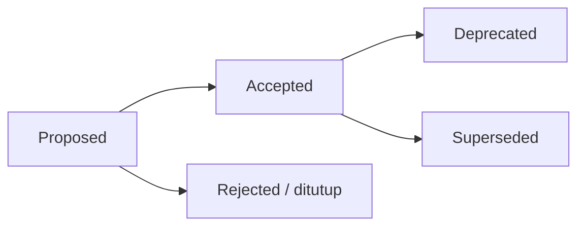

# Architecture Decision Records (ADR)

Folder ini menyimpan **catatan keputusan arsitektural** AWCMS-Micro. Setiap keputusan penting (arsitektur, runtime, kontrak, keamanan) dicatat sebagai satu berkas ADR agar konteks dan alasannya awet.

## Aturan

1. Satu keputusan = satu berkas `NNNN-judul-kebab.md` (nomor urut, nol di depan).
2. ADR **tidak dihapus**. Bila sebuah keputusan diganti, ADR lama ditandai `Status: Superseded by ADR-XXXX` dan ADR baru mereferensikannya.
3. Status yang valid: `Proposed`, `Accepted`, `Deprecated`, `Superseded`, dan — khusus repositori turunan ini — `Not ported to AWCMS-Micro` untuk ADR yang diwarisi dari basis standar upstream `ahliweb/awcms-mini` tetapi memutuskan sesuatu yang di luar scope website (lihat ADR-0025 §3). ADR ber-status itu dipertahankan sebagai rujukan historis dan **bukan** deskripsi repositori ini.
4. Perubahan standar yang mengikat (lihat [`GOVERNANCE.md`](../../GOVERNANCE.md)) wajib punya ADR.
5. Gunakan template di [`0000-template.md`](0000-template.md).

## Alur

## Indeks

| ADR                                                                                     | Judul                                                                                                                                                                                                                                                                                                                                                                                                                                                                                                                                                                                                                                                | Status                |
| --------------------------------------------------------------------------------------- | ---------------------------------------------------------------------------------------------------------------------------------------------------------------------------------------------------------------------------------------------------------------------------------------------------------------------------------------------------------------------------------------------------------------------------------------------------------------------------------------------------------------------------------------------------------------------------------------------------------------------------------------------------- | --------------------- |
| [0001](0001-modular-monolith-architecture.md)                                           | Modular monolith, microservice-ready                                                                                                                                                                                                                                                                                                                                                                                                                                                                                                                                                                                                                 | Accepted              |
| [0002](0002-bun-only-runtime.md)                                                        | Runtime & tooling Bun-only                                                                                                                                                                                                                                                                                                                                                                                                                                                                                                                                                                                                                           | Accepted              |
| [0003](0003-postgresql-rls-multi-tenant.md)                                             | PostgreSQL + RLS untuk isolasi multi-tenant                                                                                                                                                                                                                                                                                                                                                                                                                                                                                                                                                                                                          | Accepted              |
| [0004](0004-rbac-abac-default-deny.md)                                                  | RBAC + ABAC default-deny sebagai baseline akses                                                                                                                                                                                                                                                                                                                                                                                                                                                                                                                                                                                                      | Accepted              |
| [0005](0005-soft-delete-and-immutability.md)                                            | Soft delete untuk master/config, immutability untuk data posted                                                                                                                                                                                                                                                                                                                                                                                                                                                                                                                                                                                      | Accepted              |
| [0006](0006-offline-first-sync-outbox.md)                                               | Offline-first + transactional outbox + sync HMAC                                                                                                                                                                                                                                                                                                                                                                                                                                                                                                                                                                                                     | Accepted              |
| [0007](0007-openapi-asyncapi-contracts.md)                                              | OpenAPI & AsyncAPI sebagai kontrak wajib                                                                                                                                                                                                                                                                                                                                                                                                                                                                                                                                                                                                             | Accepted              |
| [0008](0008-independent-contract-and-module-versioning.md)                              | Versioning independen: package, kontrak API/event, module descriptor                                                                                                                                                                                                                                                                                                                                                                                                                                                                                                                                                                                 | Accepted              |
| [0009](0009-public-tenant-scoped-routes.md)                                             | Resolusi tenant untuk rute publik lewat path `tenantCode`, bukan subdomain                                                                                                                                                                                                                                                                                                                                                                                                                                                                                                                                                                           | Accepted              |
| [0010](0010-public-host-tenant-routing.md)                                              | Routing tenant publik berbasis host/domain — ekstensi online-public di atas ADR-0009                                                                                                                                                                                                                                                                                                                                                                                                                                                                                                                                                                 | Accepted              |
| [0011](0011-capability-ports-for-cross-module-collaboration.md)                         | Capability ports untuk kolaborasi lintas-modul (`blog_content`/`news_portal`)                                                                                                                                                                                                                                                                                                                                                                                                                                                                                                                                                                        | Accepted              |
| [0012](0012-module-admission-and-trusted-registry-boundary.md)                          | Kategori admission modul (Core/System/Optional/Derived/Integration) & batas trusted static registry                                                                                                                                                                                                                                                                                                                                                                                                                                                                                                                                                  | Accepted              |
| [0013](0013-extension-layers-and-boundary-model.md)                                     | Lapisan ekstensi platform (Core/System Foundation/Official Optional Business Foundation/SaaS Control Plane/ERP Extension/Derived Application), batas tenant vs legal entity vs organization unit, data-ownership matrix, dan kriteria evidence-based ekstraksi layanan                                                                                                                                                                                                                                                                                                                                                                               | Accepted              |
| [0014](0014-deterministic-build-time-module-composition.md)                             | Komposisi modul deterministik saat build-time — titik ekstensi `application-registry.ts`, taksonomi kegagalan komposisi, konvensi namespace migration, dan inventory komposisi untuk bukti CI/rilis                                                                                                                                                                                                                                                                                                                                                                                                                                                  | Accepted              |
| [0015](0015-derived-application-compatibility-manifest.md)                              | Manifest kompatibilitas aplikasi turunan, test kit, dan gerbang semantic-version — `bun run extension:check`, versioning module-contract/capability/manifest-schema, immutabilitas checksum migration                                                                                                                                                                                                                                                                                                                                                                                                                                                | Accepted              |
| [0016](0016-organization-structure-module-admission.md)                                 | Admission modul `organization_structure` (Official Optional Module) — legal entity/organization unit/hierarki efektif-tanggal/lokasi operasional/assignment, dependency `tenant_admin`+`identity_access`, provider `BusinessScopeHierarchyPort`                                                                                                                                                                                                                                                                                                                                                                                                      | Not ported (upstream) |
| [0017](0017-document-infrastructure-module-admission.md)                                | Admission modul `document_infrastructure` (Official Optional Module) — registry dokumen generik, versi immutable, klasifikasi/confidentiality, evidence, relasi resource generik, numbering sequence concurrency-safe                                                                                                                                                                                                                                                                                                                                                                                                                                | Not ported (upstream) |
| [0018](0018-data-exchange-module-admission.md)                                          | Admission modul `data_exchange` (Official Optional Module) — kerangka generik staged import/export CSV/JSON, capability port `DataExchangeAdapterPort`, commit asinkron idempoten via shared worker runner                                                                                                                                                                                                                                                                                                                                                                                                                                           | Not ported (upstream) |
| [0019](0019-integration-hub-module-admission.md)                                        | Admission modul `integration_hub` (System Foundation) — signed inbound webhook, outbound event subscription, replay protection, adapter health, dependency `tenant_admin`+`identity_access`+`domain_event_runtime`, provider `IntegrationAdapterPort`                                                                                                                                                                                                                                                                                                                                                                                                | Not ported (upstream) |
| [0020](0020-erp-extension-readiness-contracts.md)                                       | Kontrak kesiapan ekstensi ERP — business transaction/posting/period-lock/item/currency/UoM/inventory-movement/reconciliation/report-projection, arah kepemilikan base-mendefinisikan-vs-ekstensi-mengimplementasikan, tanpa tabel akuntansi/inventori/payroll/pajak di base                                                                                                                                                                                                                                                                                                                                                                          | Not ported (upstream) |
| [0021](0021-reference-data-module-admission.md)                                         | Admission modul `reference_data` (Official Optional Module) — value set/code efektif-tanggal dengan baseline global vs tenant-override, import tervalidasi, module-contributed catalogs, hubungan dengan `idn_admin_regions`                                                                                                                                                                                                                                                                                                                                                                                                                         | Not ported (upstream) |
| [0025](0025-website-scope-derivation-from-awcms-mini.md)                                | AWCMS-Micro sebagai turunan scope **website** dari standar AWCMS-Mini — basis/runtime/konvensi yang diadopsi utuh, registry 16 modul, tujuh modul ERP yang tidak diport, gap penomoran migrasi yang disengaja, dan aturan "pemangkasan harus tuntas sampai artefak generated + gate CI"                                                                                                                                                                                                                                                                                                                                                              | Accepted              |
| [0026](0026-media-library-module-admission.md)                                          | Admission `media_library` (System Foundation) lewat **ekstraksi** registry media generik dari `news_portal` — pembalikan arah kepemilikan, port `media_library` men-supersede `news_media`, tabel tidak di-rename, plus gap varian gambar/tipe non-gambar/admin browser                                                                                                                                                                                                                                                                                                                                                                              | Accepted              |
| [0027](0027-full-online-deployment-and-durable-storage-profiles.md)                     | Profil deployment full-online (`development`/`full_online_single_host`/`full_online_production`), penegasan `sync_storage` = object queue/outbox (bukan sync data bisnis offline), aturan durable storage (produksi tidak boleh FS ephemeral untuk media terkelola), matriks severity readiness, dan hubungan dengan label `offline-lan` turunan                                                                                                                                                                                                                                                                                                     | Accepted              |
| [0028](0028-seo-distribution-module-admission.md)                                       | Admission `seo_distribution` (Official Optional Module) lewat **contribution contract** sebelum baris kode runtime pertama — modul konten menyumbang "SEO facts" lewat port `seo_facts` (arah dependency ke dalam, DAG-safe, tanpa shared-table write), kontrak output publik (canonical/hreflang/metadata/OG/JSON-LD/sitemap/feed/redirect), resolusi tenant/domain/locale + kanonikalisasi default-domain, perilaku publication-state, kebijakan cache (key wajib tenant/host/locale), precedence redirect, threat model, dan keputusan **admission-only** (registry tetap 17; descriptor mendarat di #266)                                        | Accepted              |
| [0029](0029-theming-module-admission.md)                                                | Admission + implementasi `theming` (Official Optional Module) — tema build-time terpercaya + konfigurasi DATA-only tenant (design token/slot/asset tervalidasi), CSS security spine reject-not-sanitize, token sebagai stylesheet same-origin eksternal (CSP), immutability versi terbit, CONSUMER leaf (registry 18 → 19)                                                                                                                                                                                                                                                                                                                           | Accepted              |
| [0030](0030-optional-redis-readiness-foundation.md)                                     | Fondasi kesiapan Redis opsional — port cache/rate-limit/lock generik dengan adapter no-op default, tanpa dependency runtime wajib, offline/LAN tetap jalan tanpa Redis                                                                                                                                                                                                                                                                                                                                                                                                                                                                               | Accepted              |
| [0031](0031-site-search-module-admission.md)                                            | Admission + implementasi `site_search` (Official Optional Module) — index full-text PostgreSQL lintas-konten atas konten TERBIT, seam kontribusi `searchSources` (descriptor-list, bukan capability provides), publication-state di batas source→index, query publik ter-rate-limit + escaped snippet, CONSUMER/aggregator leaf (registry 19 → 20)                                                                                                                                                                                                                                                                                                   | Accepted              |
| [0032](0032-comments-module-admission.md)                                               | Admission + implementasi `comments` (Official Optional Module) — komentar MODERATION-FIRST atas resource TERBIT & PUBLIK, seam kontribusi `commentableResources` (descriptor-list, bukan capability provides), publication-state di batas resource→thread, security spine store-plaintext/escape-on-render (tanpa stored HTML), anti-abuse server-side (honeypot/timing/blocked-terms/duplicate/rate-limit), reply-notify via outbox event address-free, minimisasi PII penulis (hash + mask), CONSUMER/aggregator leaf (registry 20 → 21)                                                                                                           | Accepted              |
| [0033](0033-newsletter-module-admission.md)                                             | Admission + implementasi `newsletter` (Official Optional Module) — buletin CONSENT-FIRST + ANTI-ENUMERATION (respons generik identik pada semua alur publik, tanpa raw PII), double-opt-in token single-use konstan-waktu, suppression bounce/complaint/unsubscribe ditegakkan sebelum kirim, seam kontribusi `newsletterContentSources` (descriptor-list, bukan capability provides), publication-state di batas content-source, kampanye/digest freeze audience snapshot + delivery attempts resumable/idempotent, provider callback signature+replay, email dikonsumsi via outbox event address-free, CONSUMER/aggregator leaf (registry 21 → 22) | Accepted              |
| [0034](0034-template-repositioning-online-store-scope-and-derived-app-deprecation.md)   | AWCMS-Micro sebagai **TEMPLATE full-online website** dipakai LANGSUNG (bukan basis-turunan-wajib) — scope membentang hingga **toko online / e-commerce** (katalog, etalase, checkout online), **POS in-store dikecualikan** (lineage ERP `awcms`); jalur **aplikasi-turunan di-deprecate** jadi opsional-lawas (kode + `extension:check` tetap utuh, pelepasan = langkah evidence-gated terpisah); contoh domain retail/POS → website/toko-online; men-supersede sebagian ADR-0013/0014/0015/0025                                                                                                                                                    | Accepted              |
| [0035](0035-retain-module-composition-mechanism-reject-derived-pathway-code-removal.md) | Menutup "utang lanjutan (b)" ADR-0034: bukti kode menunjukkan mekanisme komposisi modul (`mergeModuleRegistries`/`application-registry.ts`/`modules:compose:check`, dipakai theming + sync + business-scope) adalah **infrastruktur base load-bearing**, bukan cabang mati. **Keputusan: pertahankan kode/gerbang, tolak pelepasan (won't-do)** — removal = rewrite invasif net-negatif yang memunculkan drift docs-vs-kode. Registry & gate CI tak berubah                                                                                                                                                                                          | Accepted              |

Detail rinci tiap keputusan tetap berada di paket dokumen `docs/awcms-micro/`; ADR merangkum **keputusan + alasan + konsekuensi**, bukan menggantikan dokumen teknis.
