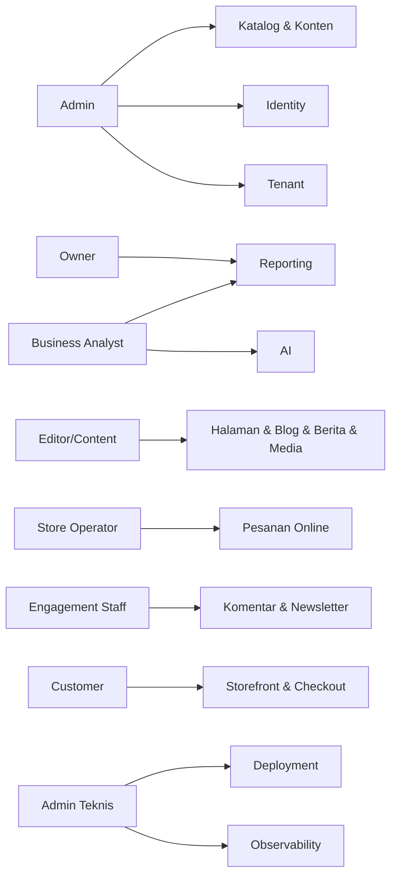
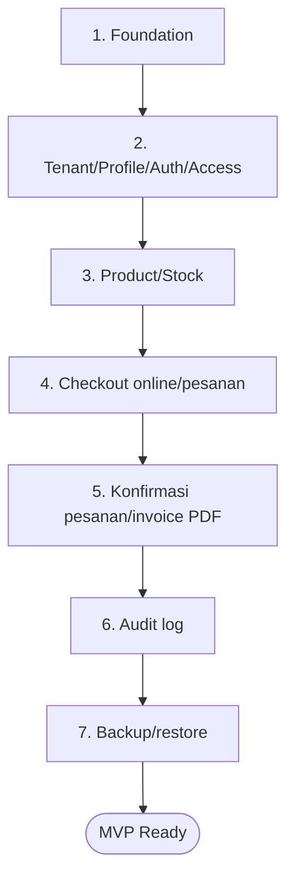

# Bagian 2 — PRD Detail Per Modul

> **Contoh domain (ilustratif).** Dokumen ini memakai domain **website / toko online** sebagai contoh berjalan — sesuai posisi AWCMS-Micro sebagai **template full-online website yang dipakai langsung** ([ADR-0034](../adr/0034-template-repositioning-online-store-scope-and-derived-app-deprecation.md)). **Pola & standar**-nya reusable; **entitas, endpoint, layar, dan istilah domain** (katalog, pesanan online, checkout, konten) diisi/disesuaikan **langsung di repo ini**. Contoh yang menyentuh **POS in-store, gudang, atau Coretax** adalah **lineage ERP `awcms` (dikecualikan)**, bukan scope base ini. Lihat [README paket dokumen](README.md) §"AWCMS-Micro sebagai standar pengembangan".

## Tujuan PRD

Dokumen ini menjelaskan kebutuhan produk AWCMS-Micro dari sisi bisnis, pengguna, fitur, prioritas, dan acceptance criteria per modul.

## Peta persona ke modul

## Persona utama

| Persona             | Kebutuhan (website / toko online)                                              |
| ------------------- | ------------------------------------------------------------------------------ |
| Owner               | Monitoring trafik, pesanan/penjualan online, konten, approval, risiko          |
| Admin               | Setup tenant, user, **katalog & konten**, konfigurasi                          |
| Editor/Content      | Kelola halaman, blog, berita, media, jadwal publikasi                          |
| Store Operator      | Proses & pemenuhan **pesanan online**, status pesanan, refund/retur online     |
| Engagement Staff    | Moderasi komentar, newsletter, notifikasi (menggantikan "CRM Staff")           |
| Business Analyst    | Laporan agregat + visitor analytics + AI insight aman                          |
| Customer/Pengunjung | Telusuri katalog, **checkout online**, lacak pesanan, kelola langganan/consent |
| Admin Teknis        | Deployment, backup, restore, troubleshooting                                   |

> Persona **Kasir** dilipat ke **Customer** (self-checkout online) + **Store Operator** (pemenuhan pesanan). Persona **Petugas Gudang** dan **Tax Officer** adalah lineage ERP `awcms` — dikecualikan ([ADR-0034 §3](../adr/0034-template-repositioning-online-store-scope-and-derived-app-deprecation.md)).

## Modul 1 — Tenant Admin

### Problem

AWCMS-Micro harus mendukung tenant, toko, cabang, office, gudang, dan lokasi fisik.

### Scope

- Tenant master.
- Office/cabang/toko/gudang.
- Physical location.
- Setup wizard awal.
- Setup lock.

### Acceptance criteria

- Tenant pertama dapat dibuat.
- Owner pertama dapat dibuat.
- Office pertama dapat dibuat.
- Setup tidak dapat dijalankan ulang setelah locked.
- Tenant inactive tidak dapat melakukan transaksi.
- Office/lokasi yang tidak dipakai dapat diarsipkan via soft delete tanpa menghapus riwayat transaksi.

## Modul 2 — Identity & Access

### Problem

Setiap user harus memiliki login dan hak akses sesuai tugas.

### Scope

- Identity login.
- Tenant user membership.
- Role.
- Permission.
- ABAC policy.
- Access decision log.

### Acceptance criteria

- Owner/admin/operator dapat login.
- ABAC default deny.
- Deny overrides allow.
- Store Operator tidak bisa akses konfigurasi tenant/ekspor data sensitif.
- Access denied tercatat.

## Modul 3 — Central Profile

### Problem

Data user, customer, kontak komentar, dan subscriber newsletter tidak boleh terduplikasi.

### Scope

- Profile person/organization.
- Identifier email, phone, WhatsApp (identifier bergaya NPWP/NIK bersifat opsional/ilustratif).
- Masked value.
- Entity link.
- Dedup/merge request.

### Acceptance criteria

- Customer bisa di-resolve dari email/WhatsApp.
- Identifier duplicate tidak membuat profile baru.
- Profile bisa di-link ke user/customer/subscriber.
- Merge high-risk membutuhkan approval.
- Profile/contact yang tidak aktif dapat diarsipkan; identifier sensitif tetap masked dan tidak dihapus fisik sebelum retention.

## Modul 4 — Katalog Produk (Toko Online)

> Contoh ILUSTRATIF permukaan website toko online (bukan modul base yang diadmit). Menunjukkan bagaimana pola reusable dipakai untuk katalog storefront.

### Problem

Storefront toko online membutuhkan master produk, harga, satuan, dan ketersediaan (availability).

### Scope

- Category.
- Brand.
- Unit.
- Product.
- Product price.
- Stock balance (ketersediaan/availability — light).
- Stock movement.

### Acceptance criteria

- Produk bisa dibuat dan tampil di storefront.
- SKU unik per tenant.
- Barcode/slug unik jika diisi.
- Produk inactive tidak bisa dipesan.
- Movement stok append-only.
- Produk/kategori/brand/unit dapat diarsipkan via soft delete jika tidak sedang dipakai pesanan aktif.

## Modul 5 — Storefront & Checkout Online

> Contoh ILUSTRATIF permukaan website toko online (bukan modul base yang diadmit). **POS in-store** (terminal kasir fisik, struk hardware, cash-drawer/shift) adalah lineage ERP `awcms` — dikecualikan ([ADR-0034 §3](../adr/0034-template-repositioning-online-store-scope-and-derived-app-deprecation.md)).

### Problem

Customer membutuhkan checkout online yang aman dan tidak dobel; Store Operator memproses & memenuhi pesanan online.

### Scope

- Checkout session (keranjang/cart online).
- Cart/line item.
- Payment (pembayaran online / payment gateway).
- Posting pesanan (online order).
- Idempotency.
- Stock lock (kunci ketersediaan saat posting).
- Sales document (pesanan online).
- Konfirmasi pesanan / invoice PDF (via email).

### Acceptance criteria

- Customer bisa checkout online.
- Total dihitung server-side.
- Posting mengurangi ketersediaan.
- Double click/submit tidak membuat pesanan ganda.
- Ketersediaan kurang menghasilkan error aman.
- Pesanan posted immutable.
- Cart/checkout draft dapat dibatalkan/diarsipkan; pesanan (sales document) posted tidak boleh di-soft-delete.

## Modul 6 — Shared Stock Routing

### Problem

Beberapa tenant toko online bisa berbagi ketersediaan produk dari pool yang sama, dengan pesanan online diarahkan ke tenant tertentu.

### Scope

- Stock pool.
- Stock pool member.
- Product mapping.
- Routing rule.
- Routing decision.
- Settlement guardrail.

### Acceptance criteria

- Stock pool memiliki member tenant.
- Routing rule memilih tenant penerima pesanan berdasarkan kondisi.
- Legal basis dicatat.
- Routing decision diaudit.
- Rule lama diarsipkan via soft delete agar histori routing tetap dapat diaudit.

## Modul 7 — Warehouse Management (lineage ERP `awcms` — dikecualikan)

> Operasi gudang fisik — warehouse/zone/bin/lot/serial, bin balance, transfer antar gudang, cycle count, stock adjustment — adalah **lineage ERP `awcms`** dan **dikecualikan** dari scope template AWCMS-Micro ([ADR-0034 §3](../adr/0034-template-repositioning-online-store-scope-and-derived-app-deprecation.md), ADR-0025). Toko online cukup memakai **ketersediaan produk (availability)** dari Modul 4; manajemen gudang fisik bukan permukaan website publik dan tidak dibangun di repo ini.

## Modul 8 — Accounting Tax/Coretax (lineage ERP `awcms` — dikecualikan)

> Faktur pajak / VAT posting, tax profile, NITKU, dan **Coretax batch export** adalah **lineage ERP `awcms`** dan **dikecualikan** dari scope template ini ([ADR-0034 §3](../adr/0034-template-repositioning-online-store-scope-and-derived-app-deprecation.md), ADR-0025). Masking identifier sensitif (mis. NPWP/NIK) tetap tersedia sebagai kapabilitas base generik (doc 04), tetapi posting pajak resmi bukan scope website.

## Modul 9 — Engagement (Komentar, Newsletter, Notifikasi)

> Menggantikan contoh "CRM Communication" bergaya POS. Dibangun di atas modul base nyata **comments**, **newsletter**, dan **email** — bukan struk WhatsApp/StarSender in-store. Notifikasi pesanan (konfirmasi/invoice) dikirim via **email outbox** base, bukan antrean struk WhatsApp.

### Problem

Pengunjung berinteraksi lewat komentar, berlangganan newsletter, dan menerima notifikasi (mis. konfirmasi pesanan) melalui email.

### Scope

- Moderasi komentar (comments).
- Langganan newsletter + consent.
- Contact/subscriber channel.
- Consent.
- Email outbox (notifikasi/newsletter — base).
- Mailketing adapter (email).
- Portal langganan/consent customer.

### Acceptance criteria

- Komentar tunduk moderasi sebelum tampil.
- Consent dicek sebelum mengirim.
- Kegagalan kirim masuk queue/retry (email outbox).
- Token portal/consent aman dan tidak sequential.
- Customer hanya melihat langganan/consent miliknya.
- Contact/channel dapat diarsipkan via soft delete; delivery log tetap mengikuti retention.

## Modul 10 — Sync Storage

### Problem

Node offline perlu sinkron ke server pusat saat online.

### Scope

- Sync node.
- Outbox/inbox.
- Push/pull.
- HMAC signature.
- Checkpoint.
- Conflict.
- Object queue/R2.

### Acceptance criteria

- Push/pull signed.
- Duplicate batch tidak dobel.
- Conflict immutable tercatat.
- File checksum diverifikasi.

## Modul 11 — AI Business Analyst

### Problem

Owner membutuhkan insight bisnis cepat tanpa membuka data mentah sensitif.

### Scope

- Safe aggregate views.
- Read-only tools.
- Tool policy.
- Tool call audit.
- Hermes adapter optional.

### Acceptance criteria

- AI tidak bisa raw SQL.
- AI tidak bisa mutation.
- AI tidak expose PII mentah.
- Semua tool call diaudit.

## Modul 12 — UI Experience

### Scope

- Admin shell.
- Storefront publik (katalog + checkout online).
- Customer order/subscription portal.
- Theme light/dark/system.
- Locale ID/EN awal.
- Navigation role-aware.

### Acceptance criteria

- Admin melihat dashboard.
- Customer checkout online mobile-friendly.
- Customer portal (pesanan/langganan) mobile-friendly.
- UI punya loading/empty/error state.

## Modul 13 — Observability, Pooling, Security

### Scope

- Structured log.
- Audit log.
- DB pool.
- Backpressure.
- Production security readiness.
- Go-live gates.

### Acceptance criteria

- Correlation ID tersedia.
- Secret diredaksi.
- Pool health dapat dicek.
- High-risk action approval.
- Critical security finding memblokir go-live.

## MVP prioritas

1. Foundation.
2. Tenant/profile/auth/access.
3. Katalog/ketersediaan produk.
4. Checkout online/posting pesanan.
5. Konfirmasi pesanan/invoice PDF.
6. Audit log.
7. Backup/restore.

## Out of scope MVP

- Integrasi payment gateway penuh.
- Native mobile app.
- Advanced BI.
- Posting pajak/Coretax (lineage ERP `awcms` — dikecualikan).
- Operasi gudang fisik (lineage ERP `awcms` — dikecualikan).
- AI mutation.
- Microservice split.
