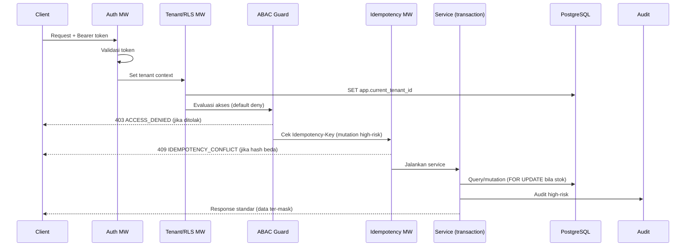
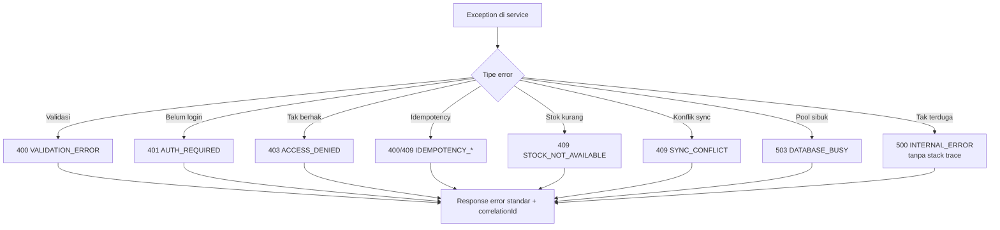

# Bagian 3 — SRS Detail Per Modul

> **Contoh domain (ilustratif).** Dokumen ini memakai domain **website / toko online** sebagai contoh berjalan — sesuai posisi AWCMS-Micro sebagai **template full-online website yang dipakai langsung** ([ADR-0034](../adr/0034-template-repositioning-online-store-scope-and-derived-app-deprecation.md)). **Pola & standar**-nya reusable; **entitas, endpoint, layar, dan istilah domain** (katalog, pesanan online, checkout, konten) diisi/disesuaikan **langsung di repo ini**. Contoh yang menyentuh **POS in-store, gudang, atau Coretax** adalah **lineage ERP `awcms` (dikecualikan)**, bukan scope base ini. Lihat [README paket dokumen](README.md) §"AWCMS-Micro sebagai standar pengembangan".

## Tujuan SRS

Dokumen ini menjabarkan kebutuhan teknis AWCMS-Micro per modul, mencakup functional requirement, non-functional requirement, validation, audit, security, dan integration point.

## Pipeline request lintas modul

## Requirement umum lintas modul

### Multi-tenant

- Semua tabel tenant-scoped wajib memiliki `tenant_id`.
- Semua query tenant-scoped wajib memfilter tenant aktif.
- RLS wajib aktif pada tabel tenant-scoped.
- Tenant context wajib diset dalam transaction.

### Security

- Auth wajib kecuali endpoint public eksplisit.
- ABAC default deny.
- Data sensitif wajib dimasking.
- Error response tidak boleh expose stack trace.
- Provider secret hanya dari environment.

### Transaction safety

- Mutation high-risk wajib `Idempotency-Key`.
- Transaksi checkout online wajib atomic.
- Stock/availability row yang berubah wajib dikunci.
- Posted sales document (pesanan online) immutable.
- Movement stok append-only.

### Soft delete

- Resource master/config/draft yang deletable wajib memakai soft delete: isi `deleted_at`, `deleted_by`, dan `delete_reason`; jangan `DELETE` fisik pada jalur operasional normal.
- Query list/detail default wajib `deleted_at IS NULL`; include archived/deleted hanya lewat permission eksplisit dan parameter API terdokumentasi.
- Restore dan purge adalah aksi high-risk: butuh ABAC, audit, dan idempotency bila endpoint mutation dapat diulang.
- Posted sales document (pesanan online), posted stock movement, audit log, security event, dan sync conflict tidak boleh di-soft-delete; koreksi lewat reversal/cancel/return/adjustment atau status lifecycle. (Entitas ERP seperti faktur pajak/Coretax batch juga immutable, tetapi dikecualikan dari scope base ini — [ADR-0034 §3](../adr/0034-template-repositioning-online-store-scope-and-derived-app-deprecation.md).)
- Soft-deleted record tetap tenant-scoped, tetap terkena RLS, dan tetap masuk retention/legal hold.

### Audit

Audit wajib untuk:

- Login failed/success.
- Access assignment.
- Profile merge.
- Product price change.
- Soft delete, restore, dan purge resource tenant-scoped.
- Pesanan online posted/cancel/return.
- Stock/availability adjustment.
- Sync conflict resolution.
- AI tool call.
- Security readiness decision.

## 1. Tenant Admin

### Functional requirement

- Sistem dapat membuat tenant pertama melalui setup wizard.
- Sistem dapat membuat office dengan tipe `head_office`, `branch`, `store`, `warehouse`, `other`.
- Sistem dapat mengunci setup setelah selesai.
- Sistem dapat menonaktifkan tenant/office.

### Validation

- `tenant_code` unik.
- `office_code` unik per tenant.
- Setup initialize ditolak jika setup locked.

### Security

- Endpoint setup hanya public sebelum setup locked.
- Setelah locked, setup initialize ditolak.
- Tenant inactive tidak dapat dipakai transaksi.

## 2. Identity & Access

### Functional requirement

- User dapat login.
- User terkait ke tenant melalui `tenant_user`.
- Role dapat diassign.
- ABAC mengevaluasi action berdasarkan module, activity, resource, context, dan environment.

### Validation

- Password wajib memenuhi policy.
- Login identifier unik.
- Tenant user inactive ditolak.

### Security

- Password disimpan dalam hash modern.
- Failed login dicatat.
- Default deny.
- Deny overrides allow.

## 3. Central Profile

### Functional requirement

- Membuat profile person/organization.
- Menambahkan identifier.
- Resolve profile berdasarkan email/phone/WhatsApp/NPWP/NIK/customer code.
- Link profile ke entity lintas modul.
- Merge profile melalui workflow.

### Validation

- Identifier dinormalisasi.
- Identifier hash unik per tenant/type.
- Profile merge tidak boleh source = target.

### Security

- Identifier sensitif dimasking.
- Raw value tidak tampil ke response umum.
- Merge high-risk diaudit dan membutuhkan approval.

## 4. Katalog Produk (Toko Online)

> Contoh ILUSTRATIF permukaan storefront (bukan modul base yang diadmit).

### Functional requirement

- CRUD produk.
- Product search di storefront by SKU, slug/barcode, nama.
- Harga aktif berdasarkan periode.
- Ketersediaan (availability) per office/pool.
- Stock movement append-only.

### Validation

- SKU unik per tenant.
- Barcode/slug unik jika ada.
- Quantity tidak boleh negatif kecuali movement delta yang valid.
- Product inactive tidak boleh dipesan.

### Security

- Price update butuh permission.
- Adjustment ketersediaan butuh reason dan audit.

## 5. Storefront & Checkout Online

> Contoh ILUSTRATIF permukaan website toko online (bukan modul base yang diadmit). **POS in-store** (terminal kasir fisik, struk hardware) adalah lineage ERP `awcms` — dikecualikan ([ADR-0034 §3](../adr/0034-template-repositioning-online-store-scope-and-derived-app-deprecation.md)).

### Functional requirement

- Membuat checkout (keranjang online).
- Menambahkan/mengubah/menghapus item.
- Menghitung total server-side.
- Menambahkan payment (pembayaran online / payment gateway).
- Posting pesanan (online order).
- Membuat sales document (pesanan), lines, payments, stock movements, audit, domain event.

### Validation

- Checkout status harus `draft` atau `held` sebelum posting.
- Payment cukup.
- Ketersediaan tersedia.
- Idempotency key wajib.

### Security

- Store Operator/Customer hanya akses scope sesuai ABAC.
- Discount mengikuti permission.
- Error ketersediaan user-friendly.
- Provider eksternal (payment/email) tidak dipanggil dalam DB transaction.

## 6. Shared Stock Routing

### Functional requirement

- Membuat stock pool.
- Menambahkan member tenant.
- Mapping product antar tenant.
- Routing pesanan online berdasarkan rule.
- Mencatat routing decision.

### Validation

- Rule harus punya legal basis.
- Effective date valid.
- Target tenant harus member pool.

### Security

- Routing rule create/approve butuh permission.
- Routing decision diaudit.

## 7. Warehouse Management (lineage ERP `awcms` — dikecualikan)

> Warehouse/zone/bin/lot/serial, bin balance, transfer order/shipment/receipt, in-transit balance, cycle count, dan stock adjustment request adalah **lineage ERP `awcms`** dan **dikecualikan** dari scope template AWCMS-Micro ([ADR-0034 §3](../adr/0034-template-repositioning-online-store-scope-and-derived-app-deprecation.md), ADR-0025). Storefront cukup memakai **ketersediaan produk (availability)** dari §4; operasi gudang fisik bukan permukaan website publik dan tidak diimplementasikan di repo ini.

## 8. Accounting Tax/Coretax (lineage ERP `awcms` — dikecualikan)

> Tax profile, NITKU, VAT invoice generate/validate, dan **Coretax XML batch export** adalah **lineage ERP `awcms`** dan **dikecualikan** dari scope template ini ([ADR-0034 §3](../adr/0034-template-repositioning-online-store-scope-and-derived-app-deprecation.md), ADR-0025). Masking identifier sensitif (mis. NPWP/NIK, doc 04) tetap kapabilitas base generik, tetapi posting pajak resmi bukan scope website.

## 9. Engagement (Komentar, Newsletter, Notifikasi)

> Menggantikan contoh "CRM Communication" bergaya POS. Dibangun di atas modul base nyata **comments**, **newsletter**, dan **email** — bukan struk WhatsApp/StarSender in-store.

### Functional requirement

- Moderasi komentar (comments).
- Kelola langganan newsletter.
- Queue email message (newsletter/notifikasi via email outbox base).
- Dispatch via provider saat online.
- Retry failed message.
- Portal langganan/consent tokenized.

### Validation

- Consent wajib aktif.
- Channel valid.
- Konten komentar tunduk moderasi sebelum tampil.

### Security

- Provider API key dari env.
- Phone/email dimasking.
- Token portal/consent tidak sequential.

## 10. Sync Storage

### Functional requirement

- Register sync node.
- Push/pull event.
- Store checkpoint.
- Detect conflict.
- Resolve conflict manual.
- Upload object queue to R2 optional.

### Validation

- HMAC valid.
- Timestamp anti replay.
- Duplicate event idempotent.

### Security

- Node inactive ditolak.
- Posted transaction immutable.
- Conflict high-risk butuh audit.

## 11. AI Business Analyst

### Functional requirement

- Chat endpoint.
- Safe aggregate tools.
- Tool policy.
- Audit tool call.

### Security

- Read-only.
- No raw SQL.
- No mutation.
- No raw PII/tax identity.

## 12. UI Experience

### Functional requirement

- Admin dashboard.
- Storefront publik (katalog + checkout online).
- Customer order/subscription portal.
- Navigation role-aware.
- Dark/light/system theme.
- i18n minimal EN/ID (default **EN**), string UI via katalog `.po` gettext (doc 14 §i18n).

### Security

- UI hiding bukan kontrol utama.
- Backend tetap validasi permission.

## 13. Observability, Pooling, Security

### Functional requirement

- Structured log.
- Audit log.
- Pool health.
- Backpressure.
- Security readiness.
- Go-live gates.

### Security

- Redaction wajib.
- Critical security control fail memblokir go-live.

## Error code standar

| Code                   | HTTP | Arti                        |
| ---------------------- | ---: | --------------------------- |
| `VALIDATION_ERROR`     |  400 | Data tidak valid            |
| `AUTH_REQUIRED`        |  401 | Belum login                 |
| `ACCESS_DENIED`        |  403 | Tidak punya akses           |
| `TENANT_REQUIRED`      |  400 | Tenant wajib                |
| `RESOURCE_NOT_FOUND`   |  404 | Resource tidak ditemukan    |
| `IDEMPOTENCY_REQUIRED` |  400 | Idempotency key wajib       |
| `IDEMPOTENCY_CONFLICT` |  409 | Key dipakai request berbeda |
| `STOCK_NOT_AVAILABLE`  |  409 | Stok tidak cukup            |
| `SYNC_CONFLICT`        |  409 | Konflik sync                |
| `DATABASE_BUSY`        |  503 | Pool/DB sibuk               |
| `INTERNAL_ERROR`       |  500 | Kesalahan internal          |

## Testing requirement minimum

- Unit test untuk business logic.
- Integration test untuk migration, RLS, posting pesanan online (checkout).
- API contract test untuk OpenAPI.
- AsyncAPI event validation.
- Security test untuk cross-tenant dan access denied.
- Performance test untuk checkout online concurrent dan DB pool.
