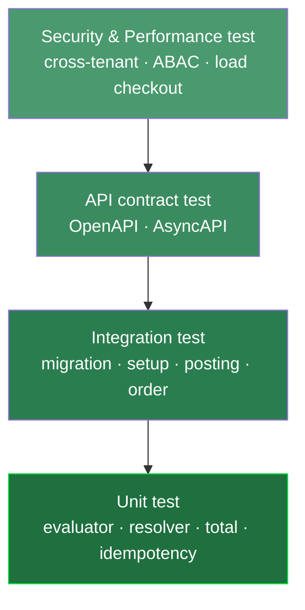
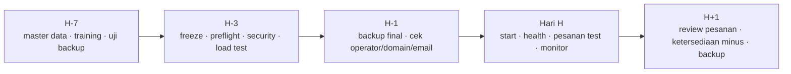

# Bagian 7 — Sprint Plan, Testing Checklist, dan Production Readiness

> **Contoh domain (ilustratif).** Dokumen ini memakai domain **website / toko online** sebagai contoh berjalan — sesuai posisi AWCMS-Micro sebagai **template full-online website yang dipakai langsung** ([ADR-0034](../adr/0034-template-repositioning-online-store-scope-and-derived-app-deprecation.md)). **Pola & standar**-nya reusable; **entitas, endpoint, layar, dan istilah domain** (katalog, pesanan online, checkout, konten) diisi/disesuaikan **langsung di repo ini**. Contoh yang menyentuh **POS in-store, gudang, atau Coretax** adalah **lineage ERP `awcms` (dikecualikan)**, bukan scope base ini. Lihat [README paket dokumen](README.md) §"AWCMS-Micro sebagai standar pengembangan".

## Tujuan

Dokumen ini menetapkan rencana sprint, strategi testing, migration checklist, production readiness, backup/restore SOP, dan go-live checklist AWCMS-Micro.

## Prinsip sprint

1. Satu sprint menghasilkan progress nyata.
2. Semua perubahan database lewat migration.
3. API baru update OpenAPI.
4. Event baru update AsyncAPI.
5. High-risk mutation idempotent.
6. High-risk action audit log.
7. Soft delete untuk resource deletable; posted/append-only tetap immutable.
8. Dokumentasi sesuai implementasi.

## Sprint Plan 1–12

```mermaid
gantt
  title Roadmap Sprint AWCMS-Micro
  dateFormat X
  axisFormat S%s
  section Foundation
  S1 Foundation            :s1, 0, 1
  section Core
  S2 Tenant/Identity/Profile :s2, after s1, 1
  S3 RBAC/ABAC/RLS         :s3, after s2, 1
  S4 Catalog & Availability :s4, after s3, 1
  S5 Storefront & Checkout :s5, after s4, 1
  section Reliability
  S6 Logging & Pooling     :s6, after s5, 1
  S7 Order Confirm & Engagement :s7, after s6, 1
  S8 Offline Sync & R2     :s8, after s7, 1
  section Website surfaces
  S9 Order Management      :s9, after s8, 1
  S10 Content & SEO        :s10, after s9, 1
  S11 UI/Reporting/AI      :s11, after s10, 1
  S12 Production Readiness  :s12, after s11, 1
```



| Sprint | Fokus                     | Output utama                                         |
| -----: | ------------------------- | ---------------------------------------------------- |
|      1 | Repository Foundation     | Skeleton, migration runner, OpenAPI/AsyncAPI, health |
|      2 | Tenant, Identity, Profile | Tenant, office, setup, login, profile resolver       |
|      3 | RBAC, ABAC, RLS           | Role, policy, evaluator, decision log                |
|      4 | Katalog & Ketersediaan    | Produk, harga, katalog, ketersediaan (availability)  |
|      5 | Storefront & Checkout     | Storefront, keranjang, checkout, pembayaran online, posting pesanan atomic |
|      6 | Logging & Pooling         | Structured log, audit, DB pool, backpressure         |
|      7 | Konfirmasi Pesanan & Engagement | Invoice/konfirmasi PDF pesanan, kontak, consent, newsletter/notifikasi/email outbox |
|      8 | Offline Sync & R2         | Sync push/pull, conflict, object queue               |
|      9 | Manajemen Pesanan         | Antrean pesanan online, status, pemenuhan, refund/retur online |
|     10 | Konten & SEO              | Halaman, blog/berita, site search, SEO/sitemap        |
|     11 | UI/UX, Reporting, AI      | Admin UI, storefront UI, reports, AI analyst         |
|     12 | Production Readiness      | Security readiness, deployment, handover             |

> **Catatan scope.** Contoh sprint gudang/pajak/Coretax (warehouse bin/lot, VAT invoice, Coretax batch) **bukan** bagian roadmap ini — itu **lineage ERP `awcms` (dikecualikan, [ADR-0034](../adr/0034-template-repositioning-online-store-scope-and-derived-app-deprecation.md) §3, [ADR-0025](../adr/0025-website-scope-derivation-from-awcms-mini.md))**. Katalog/checkout/pesanan online di atas tetap **ilustratif** (contoh cara membangun toko online di atas base) — bukan modul yang sudah masuk registry base.

## Sprint acceptance criteria ringkas

### Sprint 1

- `bun install` berhasil.
- `bun run build` berhasil.
- `bun run db:migrate` tersedia.
- `bun run api:spec:check` tersedia.
- `/api/v1/health` aktif.
- No secret committed.

### Sprint 2

- Tenant, office, owner dapat dibuat.
- Owner login berhasil.
- Profile resolver berjalan.
- Identifier dimasking.
- Setup locked.

### Sprint 3

- Role dan permission tersedia.
- ABAC default deny.
- Deny overrides allow.
- Decision log tercatat.
- Cross-tenant access blocked.

### Sprint 4

- Katalog produk CRUD/search berjalan.
- SKU unique.
- Ketersediaan (availability) dan movement berjalan.
- Produk inactive tidak bisa dipesan.
- Produk soft-deleted tidak muncul di list/search default dan tidak bisa dipesan.

### Sprint 5

- Storefront/keranjang/checkout berjalan.
- Posting pesanan online atomic.
- Idempotency same key aman.
- Idempotency conflict 409.
- Ketersediaan lock dan rollback diuji.

### Sprint 6

- Correlation ID tersedia.
- Log diredaksi.
- Audit helper berjalan.
- Audit soft delete/restore/purge berjalan.
- Pool health endpoint aktif.
- Pool saturation terdeteksi.

### Sprint 7

- Invoice/konfirmasi PDF pesanan dibuat.
- Kontak dan consent berjalan.
- Newsletter/notifikasi/email outbox berjalan.
- Customer order/invoice token aman.

### Sprint 8

- Sync HMAC valid.
- Push/pull event berjalan.
- Duplicate event aman.
- Conflict tercatat.
- Object checksum diverifikasi.

### Sprint 9

- Pesanan online diterima dan tampil di antrean Store Operator.
- Status pesanan bergerak (paid → diproses → dipenuhi/selesai).
- Refund/retur online di-request dan di-approve.
- Notifikasi status pesanan terkirim (email/newsletter base).

> Contoh gudang/transfer/cycle-count adalah **lineage ERP `awcms` (dikecualikan, [ADR-0034](../adr/0034-template-repositioning-online-store-scope-and-derived-app-deprecation.md) §3)** — bukan bagian sprint ini.

### Sprint 10

- Halaman/blog/berita dibuat dan dipublikasikan.
- SEO facts dan sitemap tersedia.
- Site search mengindeks konten.
- Data sensitif dimasking sesuai role.

> Contoh tax profile/VAT invoice/Coretax batch adalah **lineage ERP `awcms` (dikecualikan, ADR-0034 §3)** — bukan bagian sprint ini.

### Sprint 11

- Admin shell tampil.
- Storefront responsif dan mobile-first.
- Reports tenant-aware.
- AI read-only safe views.

### Sprint 12

- Security readiness pass.
- Go-live gate blocking critical fail.
- Backup/restore SOP dan deployment profile tersedia.

## Testing Strategy



Piramida: banyak unit test di dasar, sedikit end-to-end di puncak; security & performance test mengawal.

> **E2E browser sungguhan (Playwright + Bun).** Lapisan "sedikit end-to-end di puncak" di atas punya tooling nyata sejak `playwright.config.ts` + `tests/e2e/*.e2e.ts` ditambahkan — bukan sekadar aspirasi piramida. Beda test runner dari `bun test` (unit/integration/API-contract di atas): dijalankan lewat `bun run test:e2e`, butuh app+Postgres benar-benar hidup (bukan `bun test`'s `DATABASE_URL`-gated skip), dan baru mencakup `/login` sebagai contoh kerja. Lihat skill `awcms-micro-browser-test` untuk setup, konvensi penamaan (`*.e2e.ts`, sengaja tidak bentrok dengan discovery `bun test`), dan alasan kepatuhan Bun-only (`bun --bun playwright test`, AGENTS.md #14).

> **Base sudah punya test.** Runner = **`bun test`** (`bun:test`), berkas di `tests/`. Tooling repositori saat ini (`scripts/`) sudah mengikuti pola ini: logika murni `scripts/lib/docs-checks.mjs` diuji unit (`tests/docs-checks.test.mjs`), dan pemeriksa penuh diuji integration (`tests/check-docs-integration.test.mjs`). Daftar target di bawah bersifat **contoh domain** — aplikasi turunan menggantinya dengan target domainnya sendiri.

> **`blog_content` (epic #536) sebagai contoh nyata, bukan lagi ilustratif.** Berbeda dari target katalog/pesanan online di bawah (yang murni contoh ilustratif di repo ini), `blog_content` adalah modul domain yang benar-benar berjalan di repo base ini (ADR-0009) dan sudah punya test lengkap di `tests/integration/blog-content-*.integration.test.ts` (schema/RLS, admin API posts/pages/taxonomies/search, public routes, revisions, presentation extensions, dan admin-UI list/lookup functions — Issue #543). Jalankan `bun test tests/integration/blog-content-*.integration.test.ts` (butuh `DATABASE_URL`, lihat §Migration checklist) untuk suite khusus modul ini, atau `bun test` untuk seluruh suite termasuk yang lain.

### Unit test target

- ABAC evaluator.
- Profile resolver.
- Product price selection.
- Availability calculation.
- Checkout total calculation.
- Idempotency service.
- Order posting guard.
- Order status machine.
- HMAC signature.
- AI tool policy.

### Integration test target

- Migration dari database kosong.
- Setup wizard.
- Login owner/operator.
- Product create.
- Ketersediaan produk awal.
- Checkout/posting pesanan.
- Ketersediaan berkurang.
- Invoice/konfirmasi PDF pesanan.
- Sync outbox event.
- Update status pesanan.
- Retur/refund pesanan online.
- ABAC dan RLS.

### API contract test

- OpenAPI valid.
- Success/error response standard.
- Tenant header ada.
- Idempotency header ada.
- Pagination konsisten.
- `includeDeleted`/restore/purge contract konsisten untuk resource soft-deletable.
- Sensitive data tidak tampil penuh.

### Security test

- Tenant A tidak bisa baca Tenant B.
- Store Operator tidak bisa mengubah konfigurasi tenant.
- Store Operator tidak bisa assign role.
- Customer hanya bisa lihat pesanan/invoice miliknya.
- Soft-deleted record tenant lain tetap tidak terlihat; archive view butuh permission.
- Password/token/API key tidak masuk response/log.
- NPWP/NIK/phone/email dimasking.
- Sync HMAC invalid ditolak.
- AI raw PII/SQL ditolak.

### Performance test awal

| Area                    |               Target awal |
| ----------------------- | ------------------------: |
| Product search          |                  < 300 ms |
| Add item cart           |                  < 300 ms |
| Post pesanan online     |                   < 1.5 s |
| Invoice/konfirmasi PDF  |                     < 3 s |
| Laporan pesanan harian  | < 2 s data kecil-menengah |
| Pool acquire critical   |           < 500 ms normal |
| Sync push small batch   |                     < 2 s |

> **Suite performa representatif berbasis base generik (Issue #744, epic #738 `platform-evolution`).** Tabel di atas adalah target ilustratif domain toko online — repo base ini sendiri sekarang punya suite performa nyata dan berjalan: `bun run performance:suite`/`bun run performance:query-plan:check` (`src/lib/performance/`, lihat [`performance-suite.md`](performance-suite.md)) — fixture multi-tenant sintetik deterministik (skala `safe`/`standard`/`large`, satu tenant noisy-neighbor), skenario load/soak/mixed-workload/saturasi-dan-recovery per kelas kerja (`interactive`/`critical_transaction`/`reporting`/`background_sync`/`maintenance`, doc 16), dan budget regresi query-plan versioned (RLS/pagination, search, outbox-claim, retention-purge, reporting) yang gagal pada fixture regresi yang sengaja dibuat rusak. Subset aman (`safe`) berjalan di setiap PR (`.github/workflows/ci.yml`); lane penuh (`--full`, skala `large` + skenario soak) berjalan terjadwal/manual — lihat dokumen tersebut §Safe subset vs. full lane.

## Migration checklist

### Sebelum migration

- Backup database dibuat.
- Backup diverifikasi.
- Migration direview.
- Nomor migration benar.
- Tidak ada destructive SQL tanpa rencana.
- Soft-delete table memiliki kolom/index/partial unique yang benar bila diperlukan.
- RLS, index, constraint dicek.
- Recovery plan disiapkan.

### Saat migration

- Jalankan staging dulu.
- Jalankan berurutan.
- Catat start/end time.
- Stop jika error.

### Setelah migration

- Row count penting dicek.
- Constraint/index dicek.
- RLS aktif.
- API smoke test.
- Login test.
- Checkout/pesanan test.
- Backup baru dibuat.

Sejak Issue #684 (epic #679): `bun run production:preflight` sendiri
**read-only** (config/security/connectivity/spec/test/build/pool-health/
migration-plan — tidak ada stage yang menulis). Menerapkan migrasi adalah
langkah terpisah dan eksplisit (`--apply-migrations --backup-verified
--acknowledge-target=<APP_ENV>`), hanya berjalan bila verdict preflight
`GO-LIVE DIIZINKAN`. Prosedur rehearsal staging → bukti backup → apply →
rollback lengkap: `docs/awcms-micro/production-preflight-runbook.md`.

## Legacy migration checklist

- Backup legacy tersedia.
- Import ke schema `legacy` berhasil.
- Row count dihitung.
- Mapping table/field tersedia.
- Password legacy tidak digunakan ulang.
- Duplicate profile/product scan.
- Stock negative scan.
- Dry-run tanpa menulis final.
- Error/warning dicatat.

## Production readiness checklist

### Application

- Build pass.
- Migration pass (`migration:plan` stage bersih, dan apply — langkah
  terpisah, lihat §Migration checklist di atas — berhasil).
- API spec valid.
- Production preflight pass (`bun run production:preflight`, read-only
  sejak Issue #684; `APP_ENV=production` memblokir go-live bila
  `db:pool:health` skip).
- Setup wizard locked.
- Role default tersedia.
- ABAC default deny tested.
- RLS tested.
- Logging aktif.

### Database

- PostgreSQL version sesuai target.
- PostgreSQL tidak public.
- Least privilege DB user.
- Backup aktif.
- Restore tested.
- Index utama tersedia.
- Partial index soft delete tersedia untuk resource yang sering di-list.
- Pool sehat.
- Slow query monitoring.

### Security

- No hardcoded secret.
- `.env` permission aman.
- Password hash modern.
- Login lockout.
- RLS aktif.
- ABAC aktif.
- Audit log aktif.
- Soft delete/restore/purge audit aktif; purge dibatasi retention/legal.
- Data sensitif masking.
- Newsletter/comment consent opt-out.
- AI read-only.
- Sync HMAC jika hybrid.
- Error tidak expose stack trace.

## Backup SOP ringkas

Command contoh (konsep dasar; implementasi nyata sejak Issue 12.2 adalah
`deploy/backup/backup-postgres.sh`, dikeraskan Issue #691 dengan enkripsi +
manifest bertanda tangan — lihat `deploy/backup/README.md` untuk command
lengkap dan model keamanannya, jangan jalankan `pg_dump` polos di bawah ini
langsung terhadap production):

```bash
pg_dump --format=custom --file=/backup/awcms_micro_$(date +%Y%m%d_%H%M%S).dump "$DATABASE_URL"
```

Checklist:

- File backup terbentuk.
- Ukuran masuk akal.
- Checksum dibuat.
- Disimpan aman.
- Tidak public.
- Retention diterapkan.
- Restore diuji.

## Restore SOP ringkas

Command contoh (konsep dasar; implementasi nyata adalah
`deploy/backup/restore-postgres.sh`, yang sejak Issue #691 memverifikasi
manifest HMAC + checksum dump SEBELUM mutasi apa pun — lihat
`deploy/backup/README.md`):

```bash
createdb awcms_micro_restore_test
pg_restore --dbname=awcms_micro_restore_test --clean --if-exists /backup/awcms_micro_YYYYMMDD_HHMMSS.dump
```

Validasi:

- Tenant terbaca.
- User terbaca.
- Produk/ketersediaan/pesanan terbaca.
- Login test.
- Storefront/checkout smoke test.
- Report smoke test.

`deploy/backup/restore-drill.sh` (Issue #691) mengotomasi restore drill
terjadwal: backup → restore ke database disposable → verifikasi migrasi
schema, tenant isolation (RLS), dan sample record → laporan RTO/RPO.

`bun run resilience:dr-drill` (Issue #699, lihat
[`resilience-dr-verification.md`](resilience-dr-verification.md))
memperluas ini menjadi failure-injection terkontrol: disconnect
PostgreSQL (level klien), pool saturation, worker interruption (SIGTERM
nyata), dan partial provider outage (SSO/email — R2 cross-verified),
plus tier `--full` yang menjalankan `restore-drill.sh` di atas. Interlock
keamanannya menolak eksekusi secara default terhadap target mirip-produksi
tanpa kemungkinan override untuk `APP_ENV=production`.

## Go-live plan



### H-7

- Finalisasi master produk/katalog/user.
- Training admin/operator/editor.
- Uji backup restore.
- Uji storefront/checkout, konfirmasi pesanan.

### H-3

- Freeze fitur besar.
- Production preflight.
- Security readiness.
- Pool load test.
- Review critical finding.
- Rollback plan.

### H-1

- Backup final.
- Katalog & ketersediaan awal final.
- Cek user operator.
- Cek domain/email/PDF.
- Cek SOP darurat.

### Hari H

- Start aplikasi.
- Health check.
- Login admin/operator.
- Pesanan kecil test.
- Konfirmasi pesanan test.
- Monitor log/error/pool.

### H+1

- Review pesanan hari pertama.
- Review ketersediaan minus.
- Review konfirmasi/email gagal.
- Review sync conflict.
- Backup setelah hari pertama.

## Definition of MVP Ready

- Tenant setup.
- Owner/operator login.
- Produk dan ketersediaan awal.
- Checkout dan posting pesanan online.
- Ketersediaan berkurang.
- Idempotency berjalan.
- Invoice/konfirmasi PDF pesanan.
- Audit log.
- Backup/restore tested.

## Definition of Production Ready

- MVP selesai.
- Security readiness pass.
- No critical finding.
- Pool health pass.
- RLS dan ABAC tested.
- Konfirmasi pesanan/sync/engagement tested sesuai modul aktif.
- SOP dan handover selesai.
