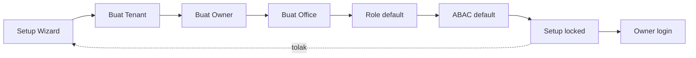
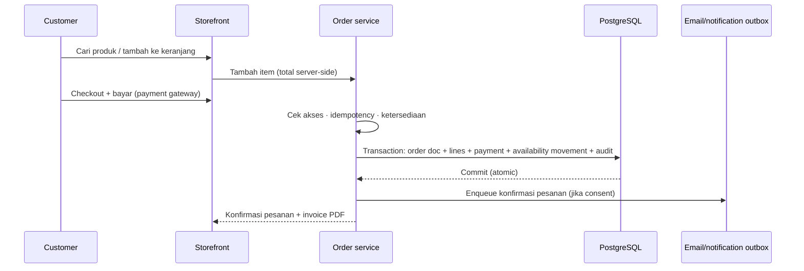
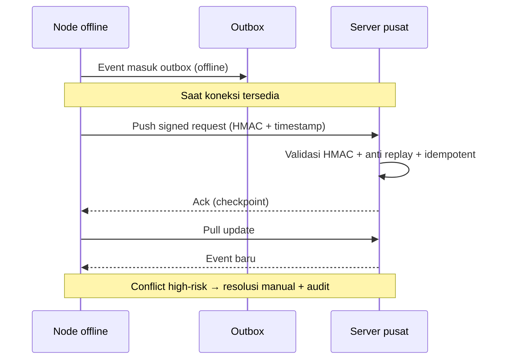
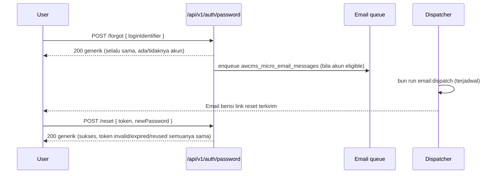

# Bagian 8 — SOP Operasional dan User Guide

> **Contoh domain (ilustratif).** Dokumen ini memakai domain **website / toko online** sebagai contoh berjalan — sesuai posisi AWCMS-Micro sebagai **template full-online website yang dipakai langsung** ([ADR-0034](../adr/0034-template-repositioning-online-store-scope-and-derived-app-deprecation.md)). **Pola & standar**-nya reusable; **entitas, endpoint, layar, dan istilah domain** (katalog, pesanan online, checkout, konten) diisi/disesuaikan **langsung di repo ini**. Contoh yang menyentuh **POS in-store, gudang, atau Coretax** adalah **lineage ERP `awcms` (dikecualikan)**, bukan scope base ini. Lihat [README paket dokumen](README.md) §"AWCMS-Micro sebagai standar pengembangan".

## Tujuan

Dokumen ini menjadi panduan operasional AWCMS-Micro untuk owner, admin, editor/content, store operator, engagement staff, business analyst, customer/pengunjung, dan admin teknis.

## Prinsip operasional

1. Semua user memakai akun masing-masing.
2. Akun tidak boleh dipakai bersama.
3. Transaksi posted tidak diedit langsung.
4. Koreksi melalui cancel, retur, reversal, atau adjustment.
5. Aktivitas penting tercatat audit log.
6. Aktivitas high-risk membutuhkan approval.
7. Data customer/tax sensitif dimasking sesuai role.
8. Hapus master data memakai arsip/soft delete; restore/purge hanya untuk role berizin.
9. Backup harus diuji restore.
10. Pengiriman ke provider eksternal (email, notifikasi, sync) lewat outbox di luar transaksi DB, tahan gangguan jaringan sementara.
11. Sync berjalan saat koneksi tersedia.

## SOP Instalasi awal

### Prasyarat minimum

| Komponen | Minimum             |
| -------- | ------------------- |
| CPU      | 2 core              |
| RAM      | 4 GB                |
| Storage  | 80 GB SSD           |
| OS       | Linux Mint / Ubuntu |
| Database | PostgreSQL          |
| Runtime  | Bun                 |

### Langkah development/local

```bash
git clone <repo-awcms-micro>
cd awcms-micro
bun install
cp .env.example .env
docker compose up -d db
bun run db:migrate
bun run api:spec:check
bun run build
bun run dev
```

### Checklist instalasi

- Repository berhasil di-clone.
- Bun terinstall.
- PostgreSQL aktif.
- `DATABASE_URL` benar.
- `.env` tidak masuk Git.
- Migration berhasil.
- Build berhasil.
- Health endpoint aktif.
- Log tidak menampilkan secret.

## SOP Setup Tenant Awal

Data yang disiapkan:

- Kode tenant.
- Nama tenant.
- Nama legal.
- Bahasa default.
- Theme default.
- Nama owner.
- Email owner.
- Password owner.
- Kode office.
- Nama office.
- Tipe office.

Alur:

```text
Setup Wizard → Tenant → Owner → Office → Role default → ABAC default → Setup locked → Owner login
```



Checklist:

- Tenant dibuat.
- Owner dibuat.
- Office dibuat.
- Role default dibuat.
- ABAC default dibuat.
- Setup locked.
- Owner login berhasil.

## SOP User, Role, dan Akses

### Role standar

| Role             | Fungsi                                                  |
| ---------------- | ------------------------------------------------------- |
| Owner            | Akses penuh dan approval utama                          |
| Admin            | Kelola sistem, katalog & konten, user, laporan          |
| Editor/Content   | Kelola halaman, blog, berita, media, jadwal publikasi   |
| Store Operator   | Proses & pemenuhan pesanan online, status, refund/retur |
| Engagement Staff | Moderasi komentar, newsletter, notifikasi               |
| Manager          | Approval pesanan/konten/operasional                     |
| Business Analyst | Laporan agregat dan AI analyst                          |
| Auditor          | Audit trail read-only                                   |

> Persona **Kasir** dilebur ke **Customer** (self-checkout online) + **Store Operator** (pemrosesan pesanan). Persona **Petugas Gudang** dan **Tax Officer** adalah **lineage ERP `awcms` (dikecualikan, [ADR-0034](../adr/0034-template-repositioning-online-store-scope-and-derived-app-deprecation.md) §3)**, tidak ada di scope base ini.

### Tambah user

1. Login owner/admin.
2. Buka User & Access.
3. Tambah user.
4. Isi nama, email/username, nomor HP jika perlu, office default.
5. Pilih role.
6. Simpan.
7. Sistem membuat profile, identity, tenant user, assignment, audit log.

### Nonaktifkan user

1. Buka detail user.
2. Klik nonaktifkan.
3. Isi alasan.
4. Sistem menolak login user tersebut.
5. Token dapat dicabut sesuai kebijakan.
6. Audit log tercatat.

### Arsipkan dan pulihkan master data

Gunakan arsip/soft delete untuk produk, office/lokasi, profile/contact, channel, atau kategori konten yang tidak dipakai. Jangan menghapus fisik data operasional harian.

1. Buka detail resource.
2. Pilih arsipkan/hapus.
3. Isi alasan.
4. Sistem menyembunyikan resource dari list default dan transaksi baru.
5. Sistem mencatat `deleted_at`, actor, alasan, dan audit log.
6. Untuk pulihkan, buka tampilan arsip, pilih restore, lalu sistem memvalidasi konflik kode/SKU/barcode dan permission.
7. Purge/anonymize hanya dilakukan untuk retention/legal oleh role berizin, biasanya melalui approval.

Larangan: jangan arsipkan pesanan posted, movement posted, audit log, security event, atau catatan append-only lain; gunakan cancel/return/reversal/adjustment/status lifecycle.

## SOP Central Profile

### Resolve customer dari storefront/checkout

1. Customer login/checkout, atau Store Operator memilih customer.
2. Masukkan email.
3. Sistem normalisasi identifier.
4. Jika profile ada, gunakan existing.
5. Jika tidak ada, buat profile baru.
6. Pesanan memakai `customer_profile_id`.

### Merge profile duplikat

1. Admin buka Profile Governance.
2. Pilih source dan target profile.
3. Review identifier/pesanan/konten/langganan.
4. Buat merge request.
5. Supervisor approve.
6. Entity links dipindahkan ke profile canonical.
7. Source menjadi `merged`.
8. Audit tercatat.

Larangan: jangan merge hanya karena nama mirip; jangan merge profil sensitif tanpa review.

## SOP Input Produk (Katalog Toko Online)

Data yang disiapkan:

- SKU.
- Barcode.
- Nama produk.
- Kategori.
- Brand.
- Satuan dasar.
- Harga jual.
- Status.

Langkah:

1. Login admin/editor katalog.
2. Buka Katalog → Produk.
3. Tambah produk.
4. Isi data.
5. Simpan.
6. Audit tercatat.

### Arsipkan produk

- Produk yang diarsipkan tidak muncul di search/list default dan tidak bisa dipesan.
- Produk yang pernah dipakai pesanan tetap ada untuk histori pesanan/report.
- Restore produk wajib dicek konflik SKU/barcode dan kategori.

## SOP Input Ketersediaan Awal

1. Buka Katalog → Ketersediaan Awal.
2. Pilih office.
3. Pilih produk.
4. Isi quantity.
5. Alasan: saldo awal implementasi.
6. Sistem membuat stock balance dan movement `opening_balance`.

> Operasi gudang bertingkat (warehouse/zone/bin, lot/serial, bin balance) adalah **lineage ERP `awcms` (dikecualikan, [ADR-0034](../adr/0034-template-repositioning-online-store-scope-and-derived-app-deprecation.md) §3, [ADR-0025](../adr/0025-website-scope-derivation-from-awcms-mini.md))** — toko online cukup menyimpan ketersediaan (availability) per produk.

## SOP Checkout Online & Pemrosesan Pesanan

### Alur checkout online (operasional)



### Checkout normal (Customer)

1. Customer membuka storefront (login opsional untuk guest checkout bila diizinkan).
2. Telusuri katalog.
3. Cari produk / tambah ke keranjang.
4. Ubah qty jika perlu.
5. Isi data pengiriman/kontak.
6. Pilih metode pembayaran online.
7. Checkout / konfirmasi bayar.
8. Sistem validasi akses, ketersediaan, total, idempotency.
9. Sistem membuat pesanan, mengurangi ketersediaan, membuat invoice/konfirmasi PDF.
10. Kirim konfirmasi pesanan (email) jika consent aktif.

### Pemrosesan pesanan (Store Operator)

1. Login store operator.
2. Buka antrean pesanan online.
3. Verifikasi pembayaran (status dari payment gateway).
4. Proses/pemenuhan pesanan.
5. Ubah status pesanan (paid → diproses → dipenuhi/selesai).
6. Sistem mengirim notifikasi status ke customer (email/newsletter base) dan mencatat audit.

### Jika ketersediaan tidak cukup

- Kurangi quantity.
- Hapus item.
- Hubungi admin/store operator.
- Jangan paksa ketersediaan minus tanpa policy/approval.

## SOP Hold, Cancel, Retur

### Hold

- Simpan keranjang.
- Isi catatan jika perlu.
- Checkout status `held`.
- Ketersediaan belum dikurangi.

### Cancel pesanan posted

1. Buka detail pesanan.
2. Request cancel.
3. Isi alasan.
4. Workflow dibuat.
5. Manager/owner approve/reject.
6. Jika approve, reversal/cancel record dibuat dan ketersediaan dikoreksi.

### Retur

1. Cari pesanan asal.
2. Pilih item retur.
3. Isi quantity.
4. Pilih kondisi: good/damaged/expired/wrong item.
5. Pilih alasan/tindakan refund.
6. Sistem membuat return document dan movement `return_in`.

## SOP Warehouse Transfer & Cycle Count — dikecualikan (lineage ERP `awcms`)

Warehouse transfer (draft → submitted → approved → picked → shipped → in_transit → received), operasi bin/lot/serial, receiving, dan cycle count/adjustment adalah **lineage ERP `awcms` (dikecualikan, [ADR-0034](../adr/0034-template-repositioning-online-store-scope-and-derived-app-deprecation.md) §3, [ADR-0025](../adr/0025-website-scope-derivation-from-awcms-mini.md))** — bukan scope base template ini. Toko online cukup melacak ketersediaan (availability) per produk dan koreksinya lewat movement/adjustment sederhana; koreksi pesanan lewat cancel/retur/refund (lihat §SOP Hold, Cancel, Retur).

## SOP Konfirmasi Pesanan (Email)

Prasyarat:

- Invoice/konfirmasi PDF pesanan ada.
- Customer profile ada.
- Channel email valid.
- Consent aktif.
- Provider configured.
- Jika provider butuh URL, PDF sudah online/R2.

Jika gagal:

- Cek channel.
- Cek consent.
- Cek file PDF/URL.
- Cek API key provider.
- Retry dari email outbox jika layak.

## SOP Customer Portal

Customer dapat:

- Buka link pesanan/invoice.
- Lihat ringkasan pesanan.
- Download PDF.
- Update consent email/newsletter.

Jika link invalid, tampilkan pesan sederhana tanpa detail teknis.

## SOP Sync Offline-Online



Alur:

1. Node offline membuat event.
2. Event masuk outbox.
3. Saat online, node push signed request.
4. Server validasi HMAC.
5. Server process event dan ack.
6. Node update checkpoint.
7. Node pull update dari server.

Conflict high-risk diselesaikan manual dengan reason dan audit.

Soft delete disinkronkan sebagai tombstone event. Node offline harus menyembunyikan resource yang sudah menerima tombstone, tetapi tidak melakukan physical delete sebelum retention terpenuhi.

## SOP Pajak/Coretax — dikecualikan (lineage ERP `awcms`)

Tax profile (NPWP/NITKU/ID TKU), party/product tax profile, VAT invoice/faktur pajak, dan Coretax batch export (XML + checksum) adalah **lineage ERP `awcms` (dikecualikan, [ADR-0034](../adr/0034-template-repositioning-online-store-scope-and-derived-app-deprecation.md) §3, [ADR-0025](../adr/0025-website-scope-derivation-from-awcms-mini.md))** — bukan scope base template full-online website ini. Untuk kebutuhan pajak toko online, integrasikan sistem pajak eksternal di luar scope base; base ini tidak membangun VAT posting maupun Coretax.

## SOP Modul Email (base, epic #492)

Berbeda dari §SOP Konfirmasi Pesanan (Email) di atas (contoh domain toko
online "kirim konfirmasi pesanan", historical issue #390) — bagian ini
adalah modul base generik (`src/modules/email/README.md`) untuk password
reset, system
announcement, dan workflow notification. Belum ada UI admin khusus;
seluruh alur ini API-only (`/api/v1/email/*`, `/api/v1/auth/password/*`,
`/api/v1/reports/email-health`).

### Password reset (end-user)



Catatan operasional: respons `POST /forgot` dan `POST /reset` **selalu**
identik terlepas hasil internalnya (anti-enumeration, Issue #496) — jangan
menyimpulkan "akun tidak ada" dari respons publik; gunakan audit log
(`password_reset_requested`/`_failed`/`_completed`) untuk diagnosis
internal oleh admin/support, bukan respons API publik. Token reset
berlaku `AUTH_PASSWORD_RESET_TOKEN_TTL_MIN` menit (default 30), sekali
pakai, dan sesi identity **dicabut penuh** setelah reset berhasil.

### Mengirim announcement/notification (admin)

1. (Opsional) Preview dulu: `POST /api/v1/email/announcements/preview`
   dengan `templateKey`/`variables`/`target` yang sama — mengembalikan
   `matchedCount` + sample render, **tidak pernah** daftar penerima nyata,
   tidak menulis apa pun ke antrean.
2. Kirim: `POST /api/v1/email/announcements` dengan header
   `Idempotency-Key` (wajib) — `target.type: "users"` untuk daftar
   eksplisit (butuh `email.notification.create`), `"role"`/`"tenant"`
   untuk bulk (butuh **tambahan** `email.announcement.create` — two-tier
   ABAC, Issue #497).
3. Setiap kirim tercatat di audit trail (`announcement_sent`) dengan
   `targetType`/`templateKey`/`recipientCount`/`correlationId` —
   tidak pernah daftar penerima.

### Memantau pengiriman dan menangani kegagalan (admin/operator)

1. **Kesehatan antrean**: `GET /api/v1/reports/email-health` —
   `queuedCount`/`retryWaitCount`/`failedCount`/`suppressedCount`,
   `isHealthy`. Jalankan berkala atau setelah insiden provider.
2. **Detail pesan gagal/tertunda**: `GET /api/v1/email/messages?status=failed`
   (atau `retry_wait`) — daftar per-pesan (kategori, `lastError`,
   `retryCount`, `toAddressMasked` — tidak pernah alamat mentah).
3. **Batalkan pengiriman yang belum terkirim** (mis. announcement salah
   target/template): `POST /api/v1/email/messages/{id}/cancel` untuk
   setiap baris `queued`/`retry_wait` dengan `correlationId` yang sama
   dengan hasil `POST /email/announcements` — baris yang sudah
   `sending`/`sent` tidak bisa dibatalkan (`409`).
4. **Kelola suppression list** (bounce/complaint/unsubscribe/manual):
   `GET /api/v1/email/suppressions` untuk melihat,
   `POST /api/v1/email/suppressions` untuk menambah manual (mis. permintaan
   opt-out lewat kanal lain), `DELETE /api/v1/email/suppressions/{id}`
   untuk mencabut. Penerima yang tersuppress otomatis dikecualikan dari
   target announcement berikutnya, dan dicek ulang oleh dispatcher tepat
   sebelum kirim (bila baru disuppress setelah enqueue).
5. **Provider outage**: dispatcher berhenti otomatis (circuit breaker,
   `email.dispatch.breaker_open` log) — tidak perlu intervensi manual,
   pesan tetap `queued`/`retry_wait` dan terkirim otomatis setelah
   provider pulih. Cek `bun run email:provider:health` untuk verifikasi
   cepat. Lihat `src/modules/email/README.md` §Incident response untuk
   runbook lengkap (provider outage, rotasi kredensial, accidental bulk
   send).

## SOP Modul Manajemen Modul (epic #510, Issue #511-#521)

Registry modul database-backed, tenant-aware (`src/modules/module-management/README.md`) — infrastruktur generik untuk mengelola modul lain, bukan fitur domain. Belum ada tabel "aksi eksekusi command" — job registry murni dokumentasi (lihat §Inspeksi job registry di bawah), sesuai batasan out-of-scope epic (tidak ada marketplace/instalasi plugin runtime).

### Sinkronisasi descriptor modul

1. `POST /api/v1/modules/sync` (butuh `module_management.modules.sync`) — menyamakan `awcms_micro_modules`/`_dependencies`/`_navigation`/`_jobs` dengan `listModules()` code saat ini. Idempoten — jalankan berulang aman, hasil kedua kali `unchanged`.
2. Modul yang hilang dari code (di-uninstall/dihapus) **ditandai** `lifecycle_status = 'disabled'`, tidak pernah dihapus — riwayat dependency/navigation/jobs tetap ada sebagai catatan historis.
3. Beberapa aksi lain (enable/disable modul, update settings, trigger health check) otomatis menjalankan sync ini lebih dulu di dalam transaction yang sama (FK ke `awcms_micro_modules`) — operator **tidak wajib** menjalankan sync manual sebelum aksi tersebut.

### Enable/disable modul untuk tenant

1. Cek status: `GET /api/v1/tenant/modules` (butuh `module_management.tenant_modules.read`) — daftar semua modul + status aktif/nonaktif untuk tenant pemanggil. Baris tanpa state eksplisit berarti aktif (default backward-compatible).
2. Aktifkan: `POST /api/v1/tenant/modules/{moduleKey}/enable` (butuh `.enable`).
3. Nonaktifkan: `POST /api/v1/tenant/modules/{moduleKey}/disable` (butuh `.disable`) dengan body `{ "reason": "..." }` — **wajib** diisi, tercatat di `disable_reason`.
4. Modul core (`isCore: true`, mis. `module_management` sendiri) **tidak bisa** dinonaktifkan — selalu `409 CORE_MODULE_CANNOT_BE_DISABLED`.
5. Menonaktifkan modul **tidak pernah menghapus data tenant** — hanya menulis baris `awcms_micro_tenant_modules`. Data modul yang dinonaktifkan tetap utuh, siap dipakai lagi begitu diaktifkan kembali.
6. Setiap enable/disable tercatat di audit trail (`tenant_module_enabled`/`tenant_module_disabled`, `resource_type: tenant_module`, `resource_id: moduleKey`).
7. **Efeknya nyata di seluruh endpoint modul tersebut**, bukan cuma status di halaman ini — guard bersama (`authorizeInTransaction`) menolak `403 MODULE_DISABLED` untuk request apa pun ke modul yang dinonaktifkan tenant tsb (lihat `src/modules/identity-access/README.md` §"Enforcement modul disabled").

### Update pengaturan modul (tenant)

1. `GET /api/v1/tenant/modules/{moduleKey}/settings` (butuh `.settings.read`) — mengembalikan `defaults` (bawaan code), `tenantOverride` (yang sudah diset tenant ini), dan `effective` (gabungan, override menang).
2. `PATCH /api/v1/tenant/modules/{moduleKey}/settings` (butuh `.settings.update`) — body JSON di-**merge dangkal** ke override yang ada (key yang tidak disebut tetap tidak berubah); **tidak** mengganti seluruh objek.
3. Key berbentuk secret (mengandung `password`/`token`/`secret`/`credential`/dll., daftar sama dengan redaksi log/audit) **ditolak** `400 SETTINGS_SENSITIVE_KEY_REJECTED` — secret provider selalu lewat environment variable/secret manager, tidak pernah lewat settings tenant. **Value** yang berbentuk credential (JWT, blok PEM private key, AWS access key id, header `Bearer`/`Basic` mentah, connection string dengan `user:pass@`) juga ditolak `400 SETTINGS_SECRET_SHAPED_VALUE_REJECTED` walau nama key-nya sendiri tidak mencurigakan (mis. `publicLabel`) — cek nama key saja tidak cukup kalau isinya tetap credential.
4. Setiap update tercatat di audit trail (`settings_updated`) dengan **diff key yang berubah saja** (`addedKeys`/`changedKeys`/`removedKeys`) — tidak pernah nilai settings itu sendiri.

### Inspeksi kesehatan modul

1. `GET /api/v1/modules/{moduleKey}/health` (butuh `.health.read`) — cepat, read-only, **tidak pernah** memanggil provider eksternal. Status `healthy`/`degraded`/`failed`/`unknown` dari sekumpulan sinyal (registry ter-sync, migrasi diterapkan, permission katalog sinkron, settings valid, jobs terdokumentasi, OpenAPI/AsyncAPI terdokumentasi).
2. `POST /api/v1/modules/{moduleKey}/health/check` (butuh `.health.check`) — sinyal sama seperti di atas **plus** live check ke provider eksternal bila modul punya satu (hanya `email` saat ini, timeout-bounded, tidak pernah memblokir transaksi bisnis normal). Hasilnya dicatat di `awcms_micro_module_health_checks` (riwayat instance-level) dan diaudit (`health_checked`).
3. Setiap `detail` sinyal adalah teks generik tetap — **tidak pernah** pesan error mentah, stack trace, atau nilai `DATABASE_URL`/secret.

### Interpretasi error validasi dependency

Kode error dari `POST .../enable` atau `.../disable` (semua `409` kecuali disebutkan lain):

| Kode                               | Arti                                                          | Tindakan                                                        |
| ---------------------------------- | ------------------------------------------------------------- | --------------------------------------------------------------- |
| `MODULE_NOT_FOUND` (`404`)         | Module key tidak terdaftar atau dinonaktifkan global (code)   | Cek ejaan/`GET /modules` untuk daftar valid                     |
| `MODULE_ALREADY_ENABLED`           | Sudah aktif untuk tenant ini                                  | Tidak perlu aksi                                                |
| `MODULE_ALREADY_DISABLED`          | Sudah nonaktif untuk tenant ini                               | Tidak perlu aksi                                                |
| `MODULE_DEPENDENCY_MISSING`        | Modul yang dibutuhkan tidak terdaftar sama sekali             | Periksa `dependencies` descriptor; kemungkinan bug authoring    |
| `MODULE_DEPENDENCY_DISABLED`       | Modul yang dibutuhkan nonaktif (global atau untuk tenant ini) | Aktifkan dependency-nya dulu, baru modul ini                    |
| `MODULE_REVERSE_DEPENDENCY_ACTIVE` | Modul lain yang masih aktif bergantung pada modul ini         | Nonaktifkan modul dependent dulu, atau batalkan rencana disable |
| `MODULE_DEPENDENCY_CYCLE`          | Terdeteksi circular dependency pada graph                     | Bug authoring descriptor — laporkan ke tim modul terkait        |
| `MODULE_VERSION_INCOMPATIBLE`      | `minAppVersion` modul lebih tinggi dari versi app saat ini    | Upgrade aplikasi dulu sebelum mengaktifkan modul ini            |
| `CORE_MODULE_CANNOT_BE_DISABLED`   | Modul core (`isCore: true`)                                   | Tidak bisa dinonaktifkan — ini bukan bug                        |

### Inspeksi job registry

1. `GET /api/v1/modules/{moduleKey}/jobs` (butuh `.jobs.read`) — daftar command operasional modul (`command`, `purpose`, `recommendedSchedule`, `environmentNotes`, `safeInOfflineLan`). **Dokumentasi murni** — tidak ada endpoint untuk menjalankan command dari sini, dan tidak akan pernah ada (lihat §Batasan keamanan epic ini di doc 20).
2. Untuk menjadwalkan command yang muncul di sini (mis. `bun run sync:objects:dispatch`, `bun run logs:audit:purge`), lihat `docs/awcms-micro/deployment-profiles.md` §Job registry lainnya.

### Insiden misconfiguration modul

1. **Modul tampak "degraded"/"failed" di health check**: baca `signals[].detail` untuk tahu sinyal mana yang gagal (mis. `db_registry_synced` gagal → jalankan `POST /modules/sync`; `permission_catalog_synced` gagal → migrasi permission belum diterapkan, cek migration terbaru).
2. **Tenant tidak sengaja menonaktifkan modul yang dibutuhkan modul lain**: dependency graph mencegah ini di sisi enable (`MODULE_DEPENDENCY_DISABLED`) — tapi jika sudah terlanjur (mis. dinonaktifkan sebelum dependent-nya ada), aktifkan kembali lewat `POST .../enable`, tidak ada data yang hilang.
3. **Tenant tidak sengaja mengisi settings dengan nilai salah**: `PATCH .../settings` dengan value yang benar untuk key yang sama — merge dangkal berarti hanya key tsb yang berubah.
4. **Curiga ada secret ter-input ke settings**: request akan **ditolak** di request time (`SETTINGS_SENSITIVE_KEY_REJECTED` untuk key bernama secret, `SETTINGS_SECRET_SHAPED_VALUE_REJECTED` untuk value berbentuk credential walau key-nya tidak — lihat §Update pengaturan modul di atas) — bila ada kebocoran nilai lewat jalur lain, audit `settings_updated` hanya berisi nama key (bukan nilai), jadi cek langsung baris `awcms_micro_module_settings` (admin DB) sebagai langkah forensik, lalu rotasi kredensial yang bersangkutan di environment variable/secret manager.
5. **Modul core ter-disable secara tidak sengaja**: tidak mungkin — enforced server-side (`CORE_MODULE_CANNOT_BE_DISABLED`), bukan cuma UI hint.

## SOP Modul Blog Content (epic #536, Issue #537-#543)

Modul domain pertama yang didaftarkan langsung di repo base ini, bukan aplikasi turunan (ADR-0009, `src/modules/blog-content/README.md`). Admin UI penuh di `/admin/blog` (Issue #543), API admin di `/api/v1/blog/*` (Issue #538-#542), rute publik anonim di `/blog/{tenantCode}/*` (Issue #540).

### Mengelola konten lewat admin UI

1. Buka `/admin/blog` — dasbor menampilkan ringkasan post/draft/scheduled/pages dan tautan cepat. Menu ini hanya tampil di sidebar untuk role yang punya `blog_content.posts.read`.
2. **Post baru**: `/admin/blog/posts/new` — isi title/slug/excerpt/content/visibility/SEO/kategori/tag/locale, simpan (status awal selalu `draft`). Slug bentrok (`409 SLUG_CONFLICT`) ditampilkan langsung di banner aksi.
3. **Menerbitkan post**: dari `/admin/blog/posts/{id}`, tombol "Publish"/"Schedule"/"Archive" hanya muncul kalau transisi status itu valid dari status saat ini **dan** role pemanggil punya permission aksi tsb (`blog_content.posts.publish`/`.schedule`/`.archive`) — semuanya minta konfirmasi dulu lalu mengirim `Idempotency-Key` baru, aman dari klik ganda.
4. **Riwayat revisi**: panel "Revision history" di editor post (bukan page — lihat §Keterbatasan di bawah) menampilkan setiap perubahan konten signifikan; tombol "Restore" (butuh `blog_content.revisions.restore` eksplisit — kepemilikan post tidak otomatis memberi izin ini) menulis kembali konten revisi lama **dan** menambah satu revisi baru mencatat pemulihan itu — riwayat tidak pernah hilang.
5. **Kategori vs tag**: `/admin/blog/categories` (boleh hierarki satu level) dan `/admin/blog/tags` (dua layar terpisah — layar tag secara struktural tidak punya field parent sama sekali, bukan disembunyikan).
6. **Pengaturan blog**: `/admin/blog/settings` — judul/deskripsi blog, jumlah post per halaman, aktif/nonaktifkan RSS dan sitemap, locale/visibility default, template judul SEO default, dan mode tema (override tenant, `light`/`dark`/`system`).
7. **Halaman statis**: `/admin/blog/pages` — CRUD saja, **tidak ada** tombol publish/schedule/archive (lihat §Keterbatasan). Visibilitas/status halaman diatur manual lewat field `visibility` yang ada, bukan lifecycle action.
8. **Layar lanjutan (opsional, aktif karena Issue #542 sudah masuk)**: `/admin/blog/templates`/`/widgets`/`/menus`/`/ads` — CRUD master data presentasi/monetisasi. `items` menu dan `placements` iklan diedit lewat textarea JSON berlabel (bukan editor visual) — baca teks bantuan di bawah tiap field sebelum menyimpan.

### Menonaktifkan RSS/sitemap per tenant

1. `/admin/blog/settings` — matikan centang "Enable RSS feed"/"Enable sitemap", simpan.
2. Verifikasi: `GET /blog/{tenantCode}/feed.xml` atau `.../sitemap-blog.xml` mengembalikan `404` yang identik dengan tenant tidak dikenal — tidak ada sinyal "fitur ada tapi dimatikan" yang bocor ke pengunjung publik.

### Menjadwalkan publikasi terjadwal (scheduled publishing)

1. `bun run blog:publish:scheduled` (`scripts/blog-scheduled-publish.ts`) — worker internal, **bukan** endpoint HTTP dan **bukan** dipicu dari tombol UI mana pun. Publikasikan setiap post `status='scheduled'` yang `scheduled_at` sudah lewat, per tenant aktif.
2. Jadwalkan lewat cron/systemd timer setiap 1-5 menit (lihat `docs/awcms-micro/deployment-profiles.md` §Job registry lainnya, sama pola `sync:objects:dispatch`/`logs:audit:purge`) — job ini juga muncul di `GET /api/v1/modules/blog_content/jobs` (Module Management job registry, dokumentasi murni, Issue #519) untuk operator yang memeriksa lewat API.
3. Idempoten by construction — run berulang di waktu yang sama adalah no-op murni (post yang sudah `published` atau `scheduled_at` masih di masa depan tidak match kondisi job).

### Keterbatasan yang perlu diketahui operator/editor

1. **Halaman statis (pages) tidak punya lifecycle action** — tidak ada tombol publish/schedule/archive/restore/purge untuk page, berbeda dari post. Permission-nya sudah diseed di database tapi belum ada endpoint yang memakainya (backlog terbuka, bukan bug).
2. **Tidak ada rute publik untuk halaman statis** — hanya post yang tampil di `/blog/{tenantCode}/...`; page yang sudah dibuat lewat admin UI belum bisa diakses lewat URL publik.
3. **Tidak ada rute publik untuk widget/iklan** — CRUD-nya sudah berfungsi penuh di admin UI, tapi belum ada placement nyata di halaman publik manapun yang menampilkannya.
4. **Editor konten memakai textarea JSON berlabel**, bukan editor visual/WYSIWYG — field "Content blocks (JSON)" mengharuskan format `{ "blocks": [...] }` valid (paragraph/heading/list/quote/gallery). Salah format ditolak sebelum submit (validasi klien) maupun di server.

## SOP Modul Data Lifecycle (epic platform-evolution #738, Issue #745)

Registry lintas-modul untuk tabel bervolume tinggi (retention/partition/archive/legal-hold/purge descriptors dideklarasikan oleh modul pemilik) plus mesin lifecycle yang menegakkannya. Belum ada layar admin UI khusus — operasional murni lewat API `/api/v1/data-lifecycle/*`.

- **Job terjadwal**: `bun run data-lifecycle:archive-purge` — harian via cron/systemd timer. Mengarsipkan (bila berlaku) dan mem-purge baris lewat retensi untuk tiap descriptor generic-execution; mencatat snapshot dry-run backlog untuk descriptor delegated (adopter lama). Operasi database + filesystem lokal murni, aman di profil offline/LAN.
- **Aksi manual/on-demand**: `GET/POST /api/v1/data-lifecycle/dry-run` untuk pratinjau dampak sebelum purge nyata; `POST /api/v1/data-lifecycle/legal-holds` membuat legal hold (menahan baris dari purge biasa) dan `POST /api/v1/data-lifecycle/legal-holds/{id}/release` melepasnya; `GET /api/v1/data-lifecycle/runs` untuk riwayat eksekusi job. Legal hold create/release wajib diaudit (lihat skill `awcms-micro-audit-log`).

## SOP Modul Reporting Projections (epic platform-evolution #738 Wave 3, Issue #753)

Mekanisme read-model projection berbasis kontribusi modul (incremental cursor-based dan domain-event-driven), melengkapi lima live view management reporting yang sudah ada. Admin UI: `/admin/reporting/projections`.

- **Job terjadwal**: `bun run reporting:projections:refresh` — setiap 2 menit, memperbarui tiap projection strategi `cursor_table` secara incremental dan melanjutkan rebuild yang sedang berjalan. `bun run reporting:exports:dispatch` — setiap 15 menit, menghasilkan artifact export baru untuk tiap scheduled export config yang jatuh tempo.
- **Aksi manual/on-demand**: dari `/admin/reporting/projections`, admin bisa memicu/melanjutkan full rebuild sebuah projection, membuat/menonaktifkan scheduled export config, dan memicu manual satu export run — semua operasi database murni, aman di profil offline/LAN.

## SOP Modul Identity Access — Business Scope & SoD (epic platform-evolution #738 Wave 2, Issue #746; hierarchy-aware matching Issue #794/#802/#804)

Business-scope assignment (legal entity/organization unit) dan Segregation-of-Duties (SoD) conflict exception, dibangun di atas `identity_access`. Admin UI: `/admin/business-scope` (assignment) dan `/admin/security` (SoD/access governance).

- **Job terjadwal**: `bun run identity-access:business-scope:expiry` — per jam, mentransisikan business-scope assignment dan SoD conflict exception yang `effective_to`-nya sudah lewat menjadi expired, mencatat lifecycle event. Operasi database murni.
- **Aksi manual/on-demand**: memberi/mencabut business-scope assignment, dan meninjau/menyetujui SoD conflict exception dari `/admin/business-scope`/`/admin/security` — keduanya wajib diaudit. SoD matching sudah hierarchy-aware untuk `same_scope_only` (lihat `checkHighRiskSoDConflicts`, PR #800/#804) — operator perlu paham cakupan efektif sebuah exception mengikuti hierarki organisasi, bukan hanya kecocokan scope persis.

## SOP Modul Domain Event Runtime (epic platform-evolution #738 Wave 1, Issue #742)

Outbox domain-event transaksional, versioned, multi-consumer — fondasi generic pengganti outbox single-purpose (`sync-storage`, `email`, `social-publishing`). Belum ada layar admin UI khusus — operasional lewat API `/api/v1/domain-events/*`.

- **Job terjadwal**: `bun run domain-events:dispatch` — setiap 30-60 detik, claim/execute/finalize delivery yang jatuh tempo dengan ordering per-order-key, exponential backoff, dan dead-letter. No-op aman bila tidak ada backlog jatuh tempo.
- **Aksi manual/on-demand**: `POST /api/v1/domain-events/deliveries/{id}/replay` untuk me-replay delivery yang dead-lettered (permission-gated, wajib alasan, idempotent, diaudit); `POST /api/v1/domain-events/consumers/{name}/pause` atau `.../resume` untuk menjeda/melanjutkan sebuah consumer per tenant.

## SOP Backup/Restore

Backup:

```bash
pg_dump --format=custom --file=/backup/awcms_micro_$(date +%Y%m%d_%H%M%S).dump "$DATABASE_URL"
```

Restore test:

```bash
createdb awcms_micro_restore_test
pg_restore --dbname=awcms_micro_restore_test --clean --if-exists /backup/awcms_micro_YYYYMMDD_HHMMSS.dump
```

Validasi restore:

- Tenant/user/produk/katalog/pesanan terbaca.
- Login test.
- Storefront/checkout smoke test.
- Report smoke test.

## Troubleshooting ringkas

### Aplikasi tidak bisa dibuka

- `systemctl status awcms-micro`
- `journalctl -u awcms-micro -n 100`
- Cek `.env`, database, disk, port.

### Database tidak terkoneksi

- `bun run db:pool:health`
- Cek PostgreSQL, DATABASE_URL, firewall, max connection, PgBouncer.

### Transaksi lambat

- Cek pool health.
- Cek slow query.
- Cek reporting berat.
- Cek sync batch besar.
- Cek disk I/O.

### Sync gagal

- Cek node ID.
- Cek HMAC secret.
- Cek jam server.
- Cek endpoint online.
- Cek conflict.

## Handover checklist

- README.
- Architecture guide.
- Deployment guide.
- Env guide.
- Migration guide.
- Backup restore SOP.
- Admin guide.
- Store operator guide.
- Editor/content guide.
- Engagement guide.
- Security guide.
- Troubleshooting guide.
- API docs.
- Production readiness report.
