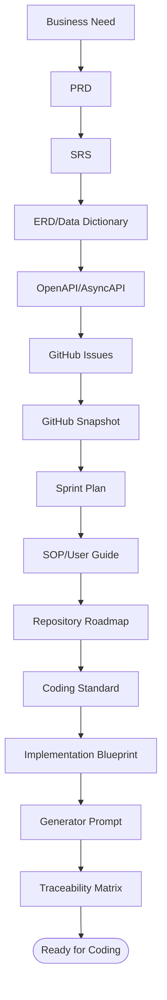

# Bagian 13 — Final Master Index dan Traceability Matrix

> **Contoh domain (ilustratif).** Dokumen ini memakai domain **website / toko online** sebagai contoh berjalan — sesuai posisi AWCMS-Micro sebagai **template full-online website yang dipakai langsung** ([ADR-0034](../adr/0034-template-repositioning-online-store-scope-and-derived-app-deprecation.md)). **Pola & standar**-nya reusable; **entitas, endpoint, layar, dan istilah domain** (katalog, pesanan online, checkout, konten) diisi/disesuaikan **langsung di repo ini**. Contoh yang menyentuh **POS in-store, gudang, atau Coretax** adalah **lineage ERP `awcms` (dikecualikan)**, bukan scope base ini. Lihat [README paket dokumen](README.md) §"AWCMS-Micro sebagai standar pengembangan".

## Tujuan

Dokumen ini menjadi master index final untuk seluruh paket dokumen AWCMS-Micro, sekaligus traceability matrix dari kebutuhan bisnis sampai implementasi, test, security, SOP, dan production readiness.

## Master index dokumen

| Bagian | File                                                                                                                | Fungsi                                                                                                                                                                                                                                                                                                                                                                                                                                                                                                                                                                                                                                                                                                                                                                                                                                                                                                   |
| -----: | ------------------------------------------------------------------------------------------------------------------- | -------------------------------------------------------------------------------------------------------------------------------------------------------------------------------------------------------------------------------------------------------------------------------------------------------------------------------------------------------------------------------------------------------------------------------------------------------------------------------------------------------------------------------------------------------------------------------------------------------------------------------------------------------------------------------------------------------------------------------------------------------------------------------------------------------------------------------------------------------------------------------------------------------- |
|      1 | `01_canvas_induk.md`                                                                                                | Canvas arsitektur dan fase pengembangan                                                                                                                                                                                                                                                                                                                                                                                                                                                                                                                                                                                                                                                                                                                                                                                                                                                                  |
|      2 | `02_prd_detail_per_modul.md`                                                                                        | Kebutuhan produk per modul                                                                                                                                                                                                                                                                                                                                                                                                                                                                                                                                                                                                                                                                                                                                                                                                                                                                               |
|      3 | `03_srs_detail_per_modul.md`                                                                                        | Spesifikasi teknis per modul                                                                                                                                                                                                                                                                                                                                                                                                                                                                                                                                                                                                                                                                                                                                                                                                                                                                             |
|      4 | `04_erd_data_dictionary.md`                                                                                         | ERD, data dictionary, RLS, index                                                                                                                                                                                                                                                                                                                                                                                                                                                                                                                                                                                                                                                                                                                                                                                                                                                                         |
|      5 | `05_openapi_asyncapi_detail.md`                                                                                     | API contract dan event contract                                                                                                                                                                                                                                                                                                                                                                                                                                                                                                                                                                                                                                                                                                                                                                                                                                                                          |
|      6 | `06_github_issues_detail.md`                                                                                        | Issue atomic siap copy-paste                                                                                                                                                                                                                                                                                                                                                                                                                                                                                                                                                                                                                                                                                                                                                                                                                                                                             |
|      7 | `07_sprint_testing_production_readiness.md`                                                                         | Sprint, testing, go-live                                                                                                                                                                                                                                                                                                                                                                                                                                                                                                                                                                                                                                                                                                                                                                                                                                                                                 |
|      8 | `08_sop_operasional_user_guide.md`                                                                                  | SOP operasional dan user guide                                                                                                                                                                                                                                                                                                                                                                                                                                                                                                                                                                                                                                                                                                                                                                                                                                                                           |
|      9 | `09_roadmap_repository_commit.md`                                                                                   | Roadmap repo, branch, commit, release                                                                                                                                                                                                                                                                                                                                                                                                                                                                                                                                                                                                                                                                                                                                                                                                                                                                    |
|     10 | `10_template_kode_coding_standard.md`                                                                               | Template kode dan coding standard                                                                                                                                                                                                                                                                                                                                                                                                                                                                                                                                                                                                                                                                                                                                                                                                                                                                        |
|     11 | `11_implementation_blueprint.md`                                                                                    | Skeleton dan blueprint per sprint                                                                                                                                                                                                                                                                                                                                                                                                                                                                                                                                                                                                                                                                                                                                                                                                                                                                        |
|     12 | `12_generator_prompt.md`                                                                                            | Prompt eksekusi coding agent                                                                                                                                                                                                                                                                                                                                                                                                                                                                                                                                                                                                                                                                                                                                                                                                                                                                             |
|     13 | `13_final_master_index_traceability.md`                                                                             | Master index dan traceability                                                                                                                                                                                                                                                                                                                                                                                                                                                                                                                                                                                                                                                                                                                                                                                                                                                                            |
|     14 | `14_ui_ux_design_system.md`                                                                                         | Design system, token, komponen, layar, a11y, i18n                                                                                                                                                                                                                                                                                                                                                                                                                                                                                                                                                                                                                                                                                                                                                                                                                                                        |
|     15 | `15_frontend_architecture_integration.md`                                                                           | Arsitektur frontend, API client, auth, offline-first                                                                                                                                                                                                                                                                                                                                                                                                                                                                                                                                                                                                                                                                                                                                                                                                                                                     |
|     16 | `16_backend_data_access_integration.md`                                                                             | Data access, pooling, RLS, transaction, outbox                                                                                                                                                                                                                                                                                                                                                                                                                                                                                                                                                                                                                                                                                                                                                                                                                                                           |
|     17 | `17_default_seed_rbac_abac.md`                                                                                      | Role default, permission matrix, ABAC policy, seed                                                                                                                                                                                                                                                                                                                                                                                                                                                                                                                                                                                                                                                                                                                                                                                                                                                       |
|     18 | `18_configuration_env_reference.md`                                                                                 | Referensi env, feature flag, topologi deployment                                                                                                                                                                                                                                                                                                                                                                                                                                                                                                                                                                                                                                                                                                                                                                                                                                                         |
|     19 | `19_glossary_terminology.md`                                                                                        | Glossary & terminologi lintas dokumen                                                                                                                                                                                                                                                                                                                                                                                                                                                                                                                                                                                                                                                                                                                                                                                                                                                                    |
|     20 | `20_threat_model_security_architecture.md`                                                                          | Threat model (STRIDE), trust boundary, kontrol keamanan berlapis (dokumen base)                                                                                                                                                                                                                                                                                                                                                                                                                                                                                                                                                                                                                                                                                                                                                                                                                          |
|     21 | `21_module_admission_governance.md`                                                                                 | Kategori modul, pohon keputusan admission, pemetaan registry, trusted registry policy                                                                                                                                                                                                                                                                                                                                                                                                                                                                                                                                                                                                                                                                                                                                                                                                                    |
|    ADR | `../adr/README.md`                                                                                                  | Architecture Decision Records (keputusan base + alasan) — termasuk `../adr/0013-extension-layers-and-boundary-model.md` (Issue #739, epic #738 `platform-evolution`): lapisan ekstensi Core/System Foundation/Official Optional Business Foundation/SaaS Control Plane/ERP Extension/Derived Application, batas tenant vs legal entity vs organization unit, data-ownership matrix, dan kriteria evidence-based ekstraksi layanan; `../adr/0014-deterministic-build-time-module-composition.md` (Issue #740, epic #738): titik ekstensi `application-registry.ts`, taksonomi kegagalan komposisi, dan konvensi namespace migration; dan `../adr/0020-erp-extension-readiness-contracts.md` (Issue #755, epic #738 Wave 4): kontrak business transaction/posting/period-lock/item/currency/UoM/inventory-movement/reconciliation/report-projection untuk ekstensi ERP, tanpa modul/tabel ERP baru di base |
|   Gov. | `../../GOVERNANCE.md`, `../../CONTRIBUTING.md`, `../../SECURITY.md`, `../../CODE_OF_CONDUCT.md`, `../../SUPPORT.md` | Tata kelola, kontribusi, keamanan, komunitas                                                                                                                                                                                                                                                                                                                                                                                                                                                                                                                                                                                                                                                                                                                                                                                                                                                             |
|     CI | `../../.github/workflows/`                                                                                          | CodeQL + CI: lint, docs-check, typecheck, unit test, hygiene (Bun-only, no-`.env`)                                                                                                                                                                                                                                                                                                                                                                                                                                                                                                                                                                                                                                                                                                                                                                                                                       |
|  Tools | `../../scripts/`, `../../tests/`                                                                                    | Pemeriksa docs Bun-native (`scripts/lib/docs-checks.mjs`) + unit/integration test (`bun test`)                                                                                                                                                                                                                                                                                                                                                                                                                                                                                                                                                                                                                                                                                                                                                                                                           |
| GitHub | `github/README.md`                                                                                                  | Snapshot issue aktual, label, milestone, dan proses refresh                                                                                                                                                                                                                                                                                                                                                                                                                                                                                                                                                                                                                                                                                                                                                                                                                                              |

## Executive summary final

AWCMS-Micro adalah standar modular monolith berbasis AWCMS-Micro dengan stack final:

```text
Bun-only backend + Astro 7 + PostgreSQL + Modular Monolith + Full-online website
```

Keputusan teknis:

1. PostgreSQL sebagai database utama.
2. Bun sebagai runtime dan backend platform; Node.js hanya boleh lewat pengecualian tertulis bila Bun belum mendukung capability yang diperlukan.
3. Astro 7 sebagai web framework.
4. Modular monolith, microservice-ready.
5. Full-online (online-first, ADR-0034); outbox/queue sebagai pola ketahanan base.
6. Optional online sync.
7. Optional Cloudflare R2.
8. Optional email (Mailketing) + newsletter.
9. Optional AI analyst via safe views.
10. RBAC + ABAC + RLS + Audit Log.
11. _(lineage ERP `awcms` — dikecualikan, ADR-0034 §3):_ Coretax-ready via staging/XML/checksum/approval/audit.
12. Soft delete tenant-safe untuk master/config/draft; posted/append-only entity tetap immutable.

## Rantai traceability


## Traceability — Business Need ke Modul

| Business Need                                             | Modul                         | Output                                |
| --------------------------------------------------------- | ----------------------------- | ------------------------------------- |
| Multi tenant situs/toko                                   | Tenant Admin                  | Tenant, office, physical location     |
| User login dan role                                       | Identity & Access             | Identity, tenant user, role           |
| Hak akses fleksibel                                       | Identity & Access             | RBAC, ABAC, decision log              |
| Profil terpusat                                           | Central Profile               | Profile, identifier, entity link      |
| Katalog produk toko online                                | Catalog Inventory             | Product, category, unit, price        |
| Arsip master data aman                                    | Semua modul master            | Soft delete, restore, purge policy    |
| Ketersediaan produk                                       | Catalog Inventory             | Availability, movement                |
| Pesanan online                                            | Online Store                  | Checkout, payment, pesanan online     |
| Posting aman                                              | Online Store + Inventory      | Idempotency, availability lock, audit |
| Ketersediaan lintas lokasi                                | Availability Routing          | Pool, routing rule, decision          |
| Multi gudang _(ERP `awcms` — dikecualikan, ADR-0034 §3)_  | Warehouse                     | Warehouse, bin, lot, transfer         |
| Konfirmasi pesanan online                                 | Engagement (email/newsletter) | PDF, email outbox, portal             |
| Offline sync                                              | Sync Storage                  | Outbox, inbox, conflict               |
| Data pajak _(ERP `awcms` — dikecualikan, ADR-0034 §3)_    | Accounting Tax                | Tax profile, NITKU, VAT invoice       |
| Coretax-ready _(ERP `awcms` — dikecualikan, ADR-0034 §3)_ | Accounting Tax                | XML batch, checksum, approval         |
| Dashboard                                                 | Reporting                     | Sales/stock/sync reports              |
| AI insight                                                | AI Analyst                    | Safe read-only tools                  |
| UI admin/operator                                         | UI Experience                 | Admin shell, storefront screen        |
| Audit/troubleshooting                                     | Observability                 | Logs, audit, security events          |
| DB reliability                                            | DB Connectivity               | Pool, queue, circuit breaker          |
| Go-live aman                                              | Production Security           | Readiness, findings, gates            |

## Traceability — PRD → SRS → ERD → API → Issue → Sprint → Test

| Need                                      | SRS Area              | Tabel                                                | API                                    | Issue            | Sprint | Test                 |
| ----------------------------------------- | --------------------- | ---------------------------------------------------- | -------------------------------------- | ---------------- | -----: | -------------------- |
| Setup tenant                              | Tenant Admin          | `awcms_micro_tenants`, `awcms_micro_offices`         | `/setup/initialize`                    | 12.1             |    1–2 | setup test           |
| Login                                     | Identity              | `awcms_micro_identities`, `awcms_micro_tenant_users` | `/auth/login`                          | 2.3              |      2 | login test           |
| Access control                            | ABAC                  | `awcms_micro_roles`, `awcms_micro_abac_policies`     | `/access/evaluate`                     | 2.4              |      3 | default deny         |
| Customer profile                          | Profile               | `awcms_micro_profiles`, identifiers                  | `/profiles/resolve`                    | 2.2              |      2 | resolver             |
| Produk katalog                            | Katalog toko online   | `awcms_micro_products`                               | `/inventory/products`                  | 3.1              |      4 | CRUD/search          |
| Soft delete master                        | Shared + modul domain | `deleted_at`, `deleted_by`                           | `DELETE/restore/includeDeleted`        | 0.1/0.3 + domain |    1–4 | archive/restore      |
| Ketersediaan                              | Katalog toko online   | `awcms_micro_stock_balances`, movements              | `/inventory/stock-balances`            | 3.2              |      4 | movement             |
| Checkout online                           | Toko Online           | `awcms_micro_checkout_sessions`                      | `/sales/checkout-sessions`             | 3.3              |      5 | checkout             |
| Posting pesanan online                    | Toko Online           | `awcms_micro_sales_documents`, idempotency           | `/sales/.../post`                      | 3.4              |      5 | idempotency/rollback |
| Konfirmasi pesanan                        | Engagement            | `awcms_micro_receipt_pdfs`                           | `/store/orders/{id}/confirmation/send` | 5.1              |      7 | PDF                  |
| Email/newsletter                          | Engagement            | `awcms_micro_message_outbox`                         | `/store/orders/{id}/confirmation/send` | 5.2/5.3          |      7 | provider mock        |
| Sync                                      | Sync                  | `awcms_micro_sync_outbox`, inbox                     | `/sync/push`                           | 6.1              |      8 | HMAC                 |
| Conflict                                  | Sync                  | `awcms_micro_sync_conflicts`                         | `/sync/conflicts/{id}/resolve`         | 6.2              |      8 | conflict             |
| Warehouse _(ERP `awcms`, dikecualikan)_   | WMS                   | `awcms_micro_warehouses`, bins                       | `/warehouses`                          | 4.1              |      9 | location             |
| Transfer _(ERP `awcms`, dikecualikan)_    | WMS                   | transfer tables                                      | `/warehouse-transfers`                 | 4.3              |      9 | transfer             |
| Cycle count _(ERP `awcms`, dikecualikan)_ | WMS                   | cycle count tables                                   | `/cycle-counts`                        | 4.4              |      9 | variance             |
| VAT invoice _(ERP `awcms`, dikecualikan)_ | Tax                   | `awcms_micro_vat_invoices`                           | `/tax/vat-invoices/generate`           | 7.3              |     10 | validation           |
| Coretax _(ERP `awcms`, dikecualikan)_     | Tax                   | `awcms_micro_coretax_batches`                        | `/tax/coretax/batches`                 | 7.4              |     10 | XML/checksum         |
| UI                                        | UI                    | UI registry                                          | `/ui/navigation`                       | 8.1/8.2          |     11 | render               |
| Reports                                   | Reporting             | report views                                         | `/reports/sales/daily`                 | 9.1              |     11 | tenant-aware         |
| AI                                        | AI                    | `awcms_micro_ai_tool_calls`                          | `/ai/business-analyst/chat`            | 9.2              |     11 | no PII/SQL           |
| Logs                                      | Observability         | `awcms_micro_log_events`                             | `/logs/recent`                         | 10.1             |      6 | redaction            |
| Pooling                                   | DB                    | `awcms_micro_db_pool_*`                              | `/database/pool/health`                | 10.2             |      6 | health/load          |
| Security                                  | Security              | `awcms_micro_security_*`                             | `/security/go-live-gates/evaluate`     | 10.3             |     12 | go-live gate         |

## Matrix Modul vs Migration

Sumber: `docs/awcms-micro/repo-inventory.md` §Migrations (GENERATED via
`bun run repo:inventory:generate`) dan `src/modules/index.ts`, keduanya
dibaca ulang saat menulis tabel ini. **77 file migration nyata** di
`sql/` (`001`..`092`, dengan celah nomor yang disengaja — jejak tujuh modul
scope ERP yang tidak diport, ADR-0025 §3), dipetakan ke **22 modul
terdaftar**. Tabel ini
menggantikan versi sebelumnya yang mengutip nama file fiktif (mis.
`003_awcms_micro_catalog_inventory_schema.sql`,
`004_awcms_micro_sales_pos_schema.sql`) dari sebuah sistem POS/retail yang
tidak pernah dibangun di repo base ini — berbeda dari tabel-tabel lain di
dokumen ini yang sengaja memakai domain website/toko online **ilustratif**
(lihat banner di puncak dokumen), tabel ini secara spesifik mendokumentasikan
struktur repo NYATA, sehingga mengikuti data real, bukan ilustrasi.

| Modul (`key`)                | Migration                                                                                                                                                                                                                                                                                                                                                                                                                                                                               |
| ---------------------------- | --------------------------------------------------------------------------------------------------------------------------------------------------------------------------------------------------------------------------------------------------------------------------------------------------------------------------------------------------------------------------------------------------------------------------------------------------------------------------------------- |
| _(Foundation, lintas-modul)_ | `001_awcms_micro_foundation_schema.sql`, `012_awcms_micro_idempotency_store_schema.sql`, `013_awcms_micro_enforce_rls_least_privilege.sql`, `045_awcms_micro_db_role_separation.sql`                                                                                                                                                                                                                                                                                                    |
| `tenant_admin`               | `002_awcms_micro_tenant_office_schema.sql`, `006_awcms_micro_setup_wizard_schema.sql`, `015_awcms_micro_tenant_settings_management_permission_schema.sql`, `016_awcms_micro_tenant_default_locale_english_schema.sql`                                                                                                                                                                                                                                                                   |
| `profile_identity`           | `003_awcms_micro_central_profile_management_schema.sql`, `059_awcms_micro_profile_identity_party_lifecycle_schema.sql`                                                                                                                                                                                                                                                                                                                                                                  |
| `identity_access`            | `004_awcms_micro_identity_login_schema.sql`, `005_awcms_micro_abac_access_control_schema.sql`, `022_awcms_micro_password_reset_schema.sql`, `034_awcms_micro_mfa_totp_schema.sql`, `035_awcms_micro_google_oidc_schema.sql`, `036_awcms_micro_tenant_oidc_sso_schema.sql`, `037_awcms_micro_tenant_oidc_sso_permissions.sql`, `061_awcms_micro_business_scope_assignments_schema.sql`, `062_awcms_micro_business_scope_permissions.sql`                                                 |
| `sync_storage`               | `007_awcms_micro_sync_storage_outbox_inbox_schema.sql`, `008_awcms_micro_sync_storage_conflict_schema.sql`, `009_awcms_micro_object_sync_queue_schema.sql`, `014_awcms_micro_sync_node_management_permission_schema.sql`, `017_awcms_micro_sync_queue_conflict_performance_indexes.sql`, `018_awcms_micro_object_sync_queue_dispatcher_schema.sql`                                                                                                                                      |
| `reporting`                  | `010_awcms_micro_management_reporting_permission_schema.sql`, `069_awcms_micro_reporting_projections_schema.sql`, `070_awcms_micro_reporting_projections_permissions.sql`                                                                                                                                                                                                                                                                                                               |
| `logging`                    | `011_awcms_micro_audit_logging_schema.sql`, `047_awcms_micro_observability_metrics_permission.sql`                                                                                                                                                                                                                                                                                                                                                                                      |
| `form_drafts`                | `019_awcms_micro_form_drafts_schema.sql`                                                                                                                                                                                                                                                                                                                                                                                                                                                |
| `email`                      | `020_awcms_micro_email_schema.sql`, `021_awcms_micro_email_template_i18n_schema.sql`, `023_awcms_micro_email_announcement_permission_schema.sql`, `024_awcms_micro_email_message_cancel_permission_schema.sql`                                                                                                                                                                                                                                                                          |
| `module_management`          | `025_awcms_micro_module_management_schema.sql` (epic #510, Issue #511-#521)                                                                                                                                                                                                                                                                                                                                                                                                             |
| `blog_content`               | `026_awcms_micro_blog_content_schema.sql`, `027_awcms_micro_blog_content_permissions.sql`, `028_awcms_micro_blog_content_search_vector.sql`, `029_awcms_micro_blog_content_presentation_schema.sql`, `030_awcms_micro_blog_content_presentation_permissions.sql`, `050_awcms_micro_blog_posts_seo_image.sql`, `051_awcms_micro_blog_content_internal_tag_links_schema.sql`, `052_awcms_micro_blog_content_internal_tag_links_permissions.sql` (epic #536, Issue #537-#543 + follow-ups) |
| `tenant_domain`              | `031_awcms_micro_tenant_domain_schema.sql`, `032_awcms_micro_tenant_domain_permissions.sql`, `033_awcms_micro_tenant_domain_lookup_function.sql`                                                                                                                                                                                                                                                                                                                                        |
| `visitor_analytics`          | `038_awcms_micro_visitor_analytics_permissions.sql`, `039_awcms_micro_visitor_analytics_schema.sql`, `040_awcms_micro_visitor_analytics_session_lookup_index.sql`                                                                                                                                                                                                                                                                                                                       |
| `media_library`              | `041_awcms_micro_news_media_object_registry_schema.sql`, `042_awcms_micro_news_media_permissions.sql`, `046_awcms_micro_news_media_orphan_lifecycle.sql`, `077_awcms_micro_media_library_permission_ownership.sql`, `078_awcms_micro_media_library_tenant_state_schema.sql`, `079_awcms_micro_media_library_enforcement_permissions.sql` (owns the tenant media registry — ADR-0026)                                                                                                    |
| `news_portal`                | `043_awcms_micro_news_portal_tenant_state_schema.sql`, `044_awcms_micro_news_portal_homepage_sections_schema.sql`, `049_awcms_micro_news_portal_ad_placements_schema.sql`                                                                                                                                                                                                                                                                                                               |
| `social_publishing`          | `053_awcms_micro_social_publishing_schema.sql`, `055_awcms_micro_social_publishing_verify_permission.sql`                                                                                                                                                                                                                                                                                                                                                                               |
| `domain_event_runtime`       | `056_awcms_micro_domain_event_runtime_schema.sql`                                                                                                                                                                                                                                                                                                                                                                                                                                       |
| `data_lifecycle`             | `057_awcms_micro_data_lifecycle_schema.sql`, `058_awcms_micro_data_lifecycle_permissions.sql`                                                                                                                                                                                                                                                                                                                                                                                           |

Empat migration di baris "Foundation, lintas-modul" tidak dipetakan ke
satu modul karena sifatnya benar-benar lintas-modul: `001` adalah
bootstrap murni (ledger migrasi + extension Postgres, sebelum modul
apa pun terdaftar); `012` adalah idempotency store generik
(`awcms_micro_idempotency_keys`) yang dipakai bersama oleh endpoint
mutation high-risk mana pun (slot ini semula direncanakan untuk workflow
approval, yang tidak diport — ADR-0025 §3); `013` dan `045` adalah
hardening keamanan lintas-tabel (RLS enforcement, pemisahan role DB
least-privilege) yang menyentuh tabel banyak modul sekaligus, bukan
schema satu modul — lihat
`docs/awcms-micro/20_threat_model_security_architecture.md`.

## Matrix Modul vs Security Control

| Control                                           | Modul                                                          |
| ------------------------------------------------- | -------------------------------------------------------------- |
| No hardcoded secrets                              | Semua                                                          |
| Password hashing                                  | Identity                                                       |
| Tenant isolation                                  | Semua tenant-scoped                                            |
| RBAC/ABAC                                         | Identity Access                                                |
| RLS                                               | Semua tenant-scoped                                            |
| Audit log                                         | Observability + semua high-risk                                |
| Idempotency                                       | Online Store, Engagement, Sync (+ ERP `awcms`: Warehouse, Tax) |
| Soft delete                                       | Master/config/draft tenant-scoped; restore/purge by permission |
| Input validation                                  | Semua API                                                      |
| Sensitive masking                                 | Profile, Engagement, Logs, AI (+ ERP `awcms`: Tax)             |
| Stock lock                                        | Inventory, Online Store (+ ERP `awcms`: Warehouse)             |
| Immutable transaction                             | Online Store (pesanan online)                                  |
| Sync HMAC                                         | Sync                                                           |
| File checksum                                     | Sync/R2 (+ ERP `awcms`: Tax export)                            |
| Consent                                           | Engagement (newsletter)                                        |
| AI read-only                                      | AI Analyst                                                     |
| Tax export approval _(ERP `awcms`, dikecualikan)_ | Tax                                                            |
| Go-live gate                                      | Production Security                                            |
| Backup/restore                                    | Deployment/Ops                                                 |

## Matrix Security Control vs Skill

| Control                                      | Skill penegak                                                                                              |
| -------------------------------------------- | ---------------------------------------------------------------------------------------------------------- |
| Tenant isolation + RBAC/ABAC + RLS           | `awcms-micro-abac-guard`                                                                                   |
| Idempotency high-risk                        | `awcms-micro-idempotency`                                                                                  |
| Audit log high-risk                          | `awcms-micro-audit-log`                                                                                    |
| Sensitive masking                            | `awcms-micro-sensitive-data`                                                                               |
| Sync HMAC + file checksum                    | `awcms-micro-sync-hmac`                                                                                    |
| Migration aman (RLS/index)                   | `awcms-micro-new-migration`                                                                                |
| Soft delete policy                           | `awcms-micro-new-migration`, `awcms-micro-new-endpoint`, `awcms-micro-abac-guard`, `awcms-micro-audit-log` |
| API/event contract                           | `awcms-micro-new-endpoint`, `awcms-micro-new-event`                                                        |
| Testing berlapis                             | `awcms-micro-testing`                                                                                      |
| Review keamanan                              | `awcms-micro-security-review` + agent `awcms-micro-security-auditor`                                       |
| Triase CodeQL code scanning                  | `awcms-micro-codeql-triage`                                                                                |
| Review PR / DoD                              | `awcms-micro-pr-review` + agent `awcms-micro-reviewer`                                                     |
| Go-live gate                                 | `awcms-micro-production-preflight`                                                                         |
| Profil deployment (LAN-first/Coolify)        | `awcms-micro-deploy`                                                                                       |
| UI/design system/a11y                        | `awcms-micro-ui-screen`                                                                                    |
| Form multi-step (wizard)                     | `awcms-micro-wizard-form`                                                                                  |
| Server-side draft persistence                | `awcms-micro-form-drafts`                                                                                  |
| Kirim email transaksional                    | `awcms-micro-email`                                                                                        |
| Kelola sistem Module Management              | `awcms-micro-module-management` (+ `awcms-micro-new-module` untuk scaffold field descriptor)               |
| Kerjakan epic blog_content (Issue #537-#543) | `awcms-micro-blog-content`                                                                                 |
| Rilis/CHANGELOG                              | `awcms-micro-release`                                                                                      |
| Implementasi issue                           | skill `awcms-micro-implement-issue` + agent `awcms-micro-coder`                                            |
| Snapshot docs GitHub                         | `awcms-micro-github-snapshot`                                                                              |

## Matrix Modul vs SOP

| SOP                                                   | Modul utama                   |
| ----------------------------------------------------- | ----------------------------- |
| Instalasi awal                                        | Deployment/Foundation         |
| Setup tenant                                          | Tenant Admin                  |
| Tambah user/role                                      | Identity + Profile            |
| Input katalog produk                                  | Inventory                     |
| Input ketersediaan awal                               | Inventory                     |
| Pesanan online                                        | Online Store                  |
| Cancel/retur pesanan                                  | Online Store                  |
| Penyesuaian ketersediaan                              | Inventory                     |
| Konfirmasi pesanan (email)                            | Engagement                    |
| Portal pelacakan pesanan                              | Engagement/UI                 |
| Offline sync                                          | Sync                          |
| Warehouse/Pajak/Coretax _(ERP `awcms`, dikecualikan)_ | Warehouse, Accounting Tax     |
| Reporting                                             | Reporting                     |
| AI Analyst                                            | AI                            |
| Backup/restore                                        | Deployment/Database           |
| Troubleshooting                                       | Observability/DB              |
| Manajemen modul                                       | Module Management (epic #510) |
| Blog/konten                                           | Blog Content (epic #536)      |
| Handover                                              | Semua                         |

## Matrix kesiapan implementasi

Kelengkapan dokumen per kebutuhan implementasi. "Design/spec ready" = cukup untuk mulai koding; DDL penuh & schema OpenAPI penuh sengaja diproduksi per-migration/per-endpoint saat implementasi (bukan pra-tulis).

| Kebutuhan                                   | Dokumen           | Status                                    |
| ------------------------------------------- | ----------------- | ----------------------------------------- |
| Arsitektur & fase                           | 01                | Ready                                     |
| Kebutuhan produk & teknis                   | 02, 03            | Ready                                     |
| ERD & data dictionary                       | 04                | Ready (ringkas; DDL penuh per-migration)  |
| Kontrak API/event                           | 05                | Ready (daftar; schema penuh per-endpoint) |
| Issue, sprint, testing                      | 06, 07            | Ready                                     |
| SOP operasional                             | 08                | Ready                                     |
| Roadmap, coding standard, blueprint, prompt | 09–12             | Ready                                     |
| **UI/UX design system & layar**             | 14                | Ready                                     |
| **Frontend & integrasi (offline-first)**    | 15                | Ready                                     |
| **Backend data access & DB integrasi**      | 16                | Ready                                     |
| **Seed, RBAC, ABAC policy**                 | 17                | Ready                                     |
| **Konfigurasi & environment**               | 18                | Ready                                     |
| Skill proyek                                | `.claude/skills/` | Ready                                     |

Diproduksi saat implementasi (bukan pra-tulis): DDL lengkap tiap tabel (via migration), schema request/response penuh tiap endpoint (via OpenAPI), string i18n aktual, dan aset UI final.

## Implementation start recommendation

Urutan coding paling aman:

1. Issue 0.1 — Repository skeleton.
2. Issue 0.2 — SQL migration runner.
3. Issue 0.3 — OpenAPI/AsyncAPI baseline.
4. Issue 12.1 — Initial setup wizard API.
5. Issue 2.1 — Tenant and office schema.
6. Issue 2.2 — Central profile schema.
7. Issue 2.3 — Identity login.
8. Issue 2.4 — RBAC/ABAC.
9. Issue 3.1 — Katalog produk toko online.
10. Issue 3.2 — Ketersediaan (stock balance/movement).
11. Issue 3.3 — Keranjang/checkout online.
12. Issue 3.4 — Posting pesanan online (atomic).

Alasan:

- Aplikasi domain tidak aman tanpa tenant/auth/profile/access.
- Pesanan online tidak boleh sebelum idempotency dan availability lock.
- Provider eksternal tidak boleh didahulukan.
- AI menunggu reporting safe views.
- _(ERP `awcms`, dikecualikan):_ Coretax menunggu sales posted dan tax profile.

## Minimal MVP Boundary

| Area               | Minimum                                        |
| ------------------ | ---------------------------------------------- |
| Tenant             | tenant, office, setup locked                   |
| Auth               | owner/admin/operator login                     |
| Access             | role dasar, ABAC default deny                  |
| Profile            | customer profile resolver                      |
| Product            | create/list/search produk katalog              |
| Stock              | ketersediaan, movement                         |
| Checkout online    | keranjang, payment online, post pesanan        |
| Transaction safety | idempotency, availability lock, rollback       |
| Konfirmasi pesanan | PDF local                                      |
| Audit              | transaction audit                              |
| Backup             | pg_dump + restore tested                       |
| Docs               | admin/operator SOP basic                       |
| Soft delete        | master data hidden by default, restore audited |

## Production-ready Boundary

- MVP usable selesai.
- RLS aktif dan diuji.
- ABAC default deny diuji.
- Audit high-risk aktif.
- Soft delete/restore/purge policy aktif untuk resource deletable.
- No critical security finding.
- Backup restore tested.
- Pool health OK.
- Checkout online concurrent test OK.
- Token pelacakan pesanan aman.
- Sync conflict policy tested jika hybrid.
- Newsletter opt-out respected jika engagement aktif.
- AI read-only jika AI aktif.
- _(ERP `awcms`, dikecualikan):_ Tax masking aktif jika modul tax aktif.
- SOP dan handover selesai.

## Repository artifact checklist

### Root

- `AGENTS.md`
- `README.md`
- `CHANGELOG.md` + `.changeset/` (versioning via Changesets)
- `.claude/skills/` (39 skill proyek + katalog README)
- `.claude/agents/` (3 subagent: coder, reviewer, security-auditor)
- `package.json`
- `astro.config.mjs`
- `tsconfig.json`
- `.env.example`
- `.gitignore`
- `docker-compose.yml`

### Folder standar

Tiap folder standar menyertakan `README.md` sebagai kontrak isi/aturan folder:

- `src/lib/README.md` — helper lintas-modul (`auth/`, `database/`, `errors/`, `files/`, `logging/`).
- `src/modules/_shared/README.md` — module contract, API response envelope, konvensi soft delete.
- `openapi/README.md` — kontrak OpenAPI publik dan kewajiban `api:spec:check`.
- `asyncapi/README.md` — kontrak AsyncAPI domain-event dan kewajiban pendaftaran channel.
- `deploy/README.md` — deployment profile (systemd, container, PgBouncer, backup) — Bun-only.
- `fixtures/README.md` — data uji sintetis; larangan data customer/dump/secret asli.

### Source modules

22 modul terdaftar nyata di `src/modules/index.ts` (`ls -d src/modules/*/`,
dikonfirmasi `bun run modules:dag:check` — "22 registered modules"). Tujuh
modul scope ERP upstream (`workflow`, `organization_structure`,
`document_infrastructure`, `data_exchange`, `integration_hub`,
`reference_data`, `idn_admin_regions`) **tidak diport** ke AWCMS-Micro —
website scope (ADR-0025 §3) — sehingga tidak punya folder di
`src/modules/`:

- `_shared` (bukan modul terdaftar — kontrak/helper lintas-modul)
- blog-content
- data-lifecycle
- domain-event-runtime
- email
- form-drafts
- identity-access
- logging
- media-library
- module-management
- news-portal
- profile-identity
- reporting
- social-publishing
- sync-storage
- tenant-admin
- tenant-domain
- visitor-analytics

### Docs

Semua file `docs/awcms-micro/01` sampai `19` harus menjadi acuan sebelum coding. Dokumen `14`–`18` (UI/UX, frontend, backend/DB, seed/RBAC/ABAC, konfigurasi) melengkapi kesiapan implementasi; `19` adalah glossary rujukan istilah. Snapshot issue GitHub aktual ada di `docs/awcms-micro/github/` dan wajib direfresh bila state issue berubah.

## Final coding instruction

> **Catatan status (base selesai, v0.23.5).** Urutan bootstrap di bawah adalah rencana asli membangun base generik dari nol dan seluruhnya sudah tuntas (18 issue backlog doc 06 + peningkatan M9) — arsip, bukan pekerjaan baru. Untuk kontribusi baru lihat [`../../AGENTS.md`](../../AGENTS.md) §Mulai dari sini dan [`README.md`](README.md) §Langkah berikutnya.

```text
Mulai dari Issue 0.1.
Jangan lompat ke toko online (katalog/checkout) sebelum foundation, tenant, profile, auth, dan ABAC selesai.
Jangan integrasi provider eksternal sebelum core checkout online aman.
Jangan integrasi AI sebelum reporting safe views siap.
Jangan mengaktifkan production sebelum security readiness pass.
Jangan commit secret, dump database, data customer asli, atau .env.
```

## Penutup

Rantai implementasi AWCMS-Micro lengkap:

```text
Business Need
→ PRD
→ SRS
→ ERD/Data Dictionary
→ OpenAPI/AsyncAPI
→ GitHub Issues
→ GitHub Snapshot
→ Sprint Plan
→ SOP/User Guide
→ Repository Roadmap
→ Coding Standard
→ Implementation Blueprint
→ Generator Prompt
→ Traceability Matrix
→ Ready for Coding
```


