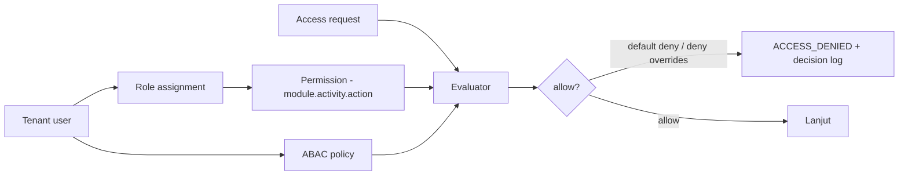
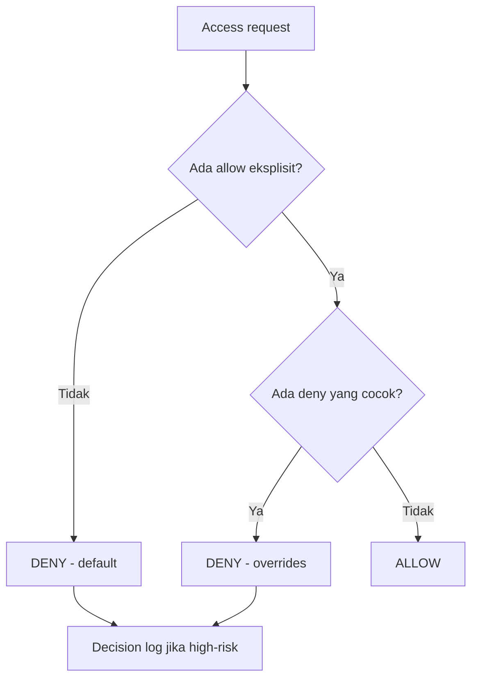
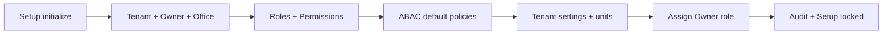

# Bagian 17 — Default Seed, RBAC, dan ABAC Policy

> **Contoh domain (ilustratif).** Dokumen ini memakai domain **website / toko online** sebagai contoh berjalan — sesuai posisi AWCMS-Micro sebagai **template full-online website yang dipakai langsung** ([ADR-0034](../adr/0034-template-repositioning-online-store-scope-and-derived-app-deprecation.md)). **Pola & standar**-nya reusable; **entitas, endpoint, layar, dan istilah domain** (katalog, pesanan online, checkout, konten) diisi/disesuaikan **langsung di repo ini**. Contoh yang menyentuh **POS in-store, gudang, atau Coretax** adalah **lineage ERP `awcms` (dikecualikan)**, bukan scope base ini. Lihat [README paket dokumen](README.md) §"AWCMS-Micro sebagai standar pengembangan".

## Tujuan

Dokumen ini melengkapi data awal yang diperlukan agar **Setup Wizard (Issue 12.1)** dan **RBAC/ABAC (Issue 2.4)** dapat diimplementasikan: registry module/activity, daftar permission, matriks role → permission, ABAC default policy, dan seed default. Tanpa ini, akses tidak dapat dievaluasi secara konkret.

Terkait: `03_srs_detail_per_modul.md` (aturan akses), `10_template_kode_coding_standard.md` (ABAC guard), skill `awcms-micro-abac-guard`.

## Model akses

- **RBAC** memberi baseline permission per role.
- **ABAC** menyaring lebih lanjut berdasarkan atribut (office scope, kepemilikan resource, environment) dengan **default deny** dan **deny overrides allow**.

## Registry module & activity

`module_key.activity_code` mengidentifikasi kemampuan. Contoh utama (baris `catalog_inventory`/`sales_pos`/`crm_communication` mengilustrasikan permukaan **toko online** in-scope — katalog, checkout/pesanan online, engagement; baris `warehouse_management`/`accounting_tax` adalah **lineage ERP `awcms`**, dikecualikan (ADR-0034 §3), ditampilkan hanya sebagai ilustrasi model permission):

| Module key                      | Activity code                | Action tersedia                                    |
| ------------------------------- | ---------------------------- | -------------------------------------------------- |
| `tenant_admin`                  | `office_management`          | read, create, update                               |
| `identity_access`               | `user_management`            | read, create, update, assign                       |
| `identity_access`               | `access_control`             | read, assign, configure                            |
| `identity_access`               | `business_scope_assignments` | read, create, revoke (Issue #746)                  |
| `identity_access`               | `business_scope_conflicts`   | read (Issue #746)                                  |
| `identity_access`               | `business_scope_exceptions`  | read, create, approve, reject, revoke (Issue #746) |
| `profile_identity`              | `profile_management`         | read, create, update, delete, restore              |
| `profile_identity`              | `profile_merge`              | read, approve                                      |
| `catalog_inventory`             | `product_management`         | read, create, update, delete, restore              |
| `catalog_inventory`             | `price_management`           | read, update                                       |
| `catalog_inventory`             | `stock_management`           | read, update, adjust                               |
| `sales_pos`                     | `checkout`                   | read, create, update                               |
| `sales_pos`                     | `transaction_posting`        | post                                               |
| `sales_pos`                     | `transaction_cancel`         | cancel, approve                                    |
| `sales_pos`                     | `discount`                   | update                                             |
| `warehouse_management`          | `transfer`                   | read, create, approve, send, receive               |
| `warehouse_management`          | `cycle_count`                | read, create, approve                              |
| `accounting_tax`                | `tax_profile`                | read, configure                                    |
| `accounting_tax`                | `vat_invoice`                | read, create                                       |
| `accounting_tax`                | `coretax_export`             | export, approve                                    |
| `crm_communication`             | `contact`                    | read, create, update, delete, restore              |
| `crm_communication`             | `receipt_delivery`           | read, send                                         |
| `sync_storage`                  | `sync`                       | read, configure                                    |
| `sync_storage`                  | `conflict_resolution`        | read, approve                                      |
| `ai_analyst`                    | `analysis`                   | analyze                                            |
| `management_reporting`          | `reports`                    | read                                               |
| `reporting`                     | `dashboard`                  | read                                               |
| `reporting`                     | `projections`                | read, rebuild, analyze (Issue #753)                |
| `reporting`                     | `exports`                    | read, configure, export (Issue #753)               |
| `observability_logging`         | `logs`                       | read                                               |
| `production_security_readiness` | `go_live`                    | read, approve                                      |
| `module_management`             | `modules`                    | read, sync                                         |
| `module_management`             | `tenant_modules`             | read, enable, disable                              |
| `module_management`             | `settings`                   | read, update                                       |
| `module_management`             | `permissions`                | read                                               |
| `module_management`             | `navigation`                 | read                                               |
| `module_management`             | `jobs`                       | read                                               |
| `module_management`             | `health`                     | read, check                                        |

> **Catatan (ADR-0025 §3).** Baris untuk `workflow_approval`, `organization_structure`, `document_infrastructure`, `data_exchange`, `integration_hub`, `reference_data`, dan `idn_admin_regions` **dihapus dari registry ini**: ketujuh modul scope ERP itu tidak diport ke awcms-micro, sehingga permission-nya tidak pernah di-seed migrasi mana pun di `sql/`. Permission `identity_access.business_scope_assignments.*`, `.business_scope_conflicts.read`, dan `.business_scope_exceptions.*` **tetap ada** — keduanya milik `identity_access` (di-seed `sql/062_awcms_micro_business_scope_permissions.sql`), bukan milik `organization_structure`; resolusi hierarki business-scope jatuh ke adaptor flat milik `identity_access` sendiri (ADR-0025 §3).

## Role default

| Role                       | Ringkasan akses                                                                    |
| -------------------------- | ---------------------------------------------------------------------------------- |
| Owner                      | Semua module, termasuk approval & go-live                                          |
| Admin                      | Setup, user, katalog, konten, laporan, konfigurasi (bukan approval tertentu)       |
| Store Operator             | Proses & pemenuhan **pesanan online**; **tanpa** Coretax/export/assign/approval    |
| Manager                    | Approval pesanan/stok/operasional                                                  |
| Inventory Staff            | Katalog produk, ketersediaan, adjustment terbatas                                  |
| Engagement Staff           | Moderasi komentar, newsletter, notifikasi                                          |
| Business Analyst           | Laporan & AI analyst (read-only)                                                   |
| Auditor                    | Audit trail & logs read-only                                                       |
| Petugas Gudang _(lineage)_ | Transfer, receiving, cycle count — lineage ERP `awcms`, dikecualikan (ADR-0034 §3) |
| Tax Officer _(lineage)_    | Pajak & Coretax — lineage ERP `awcms`, dikecualikan (ADR-0034 §3)                  |

## Matriks role → permission (ringkas)

Legenda action: R=read, C=create, U=update, P=post, X=cancel, A=approve, E=export, S=send, G=assign, N=analyze, F=configure, Y=sync, I=enable, D=disable, K=health check.

Permission `delete`, `restore`, dan `purge` untuk soft delete tidak tersirat dari `U`; seed harus memberikannya eksplisit per resource dan ABAC tetap default deny untuk archive/restore/purge.

| Module.activity                | Owner | Admin | Store Op | Manager | Gudang† | Inv. Staff | Tax† | Engmt | Analyst | Auditor |
| ------------------------------ | ----- | ----- | -------- | ------- | ------- | ---------- | ---- | ----- | ------- | ------- |
| tenant_admin.office            | RCU   | RCU   | –        | R       | –       | –          | –    | –     | –       | R       |
| identity_access.user           | RCUG  | RCUG  | –        | –       | –       | –          | –    | –     | –       | R       |
| identity_access.access_control | RGF   | RGF   | –        | –       | –       | –          | –    | –     | –       | R       |
| profile_identity.profile       | RCU   | RCU   | R        | R       | –       | R          | R    | RCU   | R       | R       |
| profile_identity.merge         | RA    | R     | –        | A       | –       | –          | –    | –     | –       | R       |
| catalog_inventory.product      | RCU   | RCU   | R        | R       | R       | RCU        | –    | –     | R       | R       |
| catalog_inventory.price        | RU    | RU    | R        | R       | –       | R          | –    | –     | R       | R       |
| catalog_inventory.stock        | RUadj | RUadj | R        | Radj    | RU      | RUadj      | –    | –     | R       | R       |
| sales_pos.checkout             | RCU   | RCU   | RCU      | R       | –       | –          | –    | –     | –       | R       |
| sales_pos.posting              | P     | P     | P        | P       | –       | –          | –    | –     | –       | R       |
| sales_pos.cancel               | XA    | X     | –        | XA      | –       | –          | –    | –     | –       | R       |
| sales_pos.discount             | U     | U     | U*       | U       | –       | –          | –    | –     | –       | R       |
| warehouse.transfer             | RCASR | RC    | –        | A       | RCSR    | RC         | –    | –     | –       | R       |
| warehouse.cycle_count          | RCA   | RC    | –        | A       | RC      | RC         | –    | –     | –       | R       |
| accounting_tax.tax_profile     | RF    | RF    | –        | –       | –       | –          | RF   | –     | –       | R       |
| accounting_tax.vat_invoice     | RC    | R     | –        | –       | –       | –          | RC   | –     | –       | R       |
| accounting_tax.coretax_export  | EA    | –     | –        | A       | –       | –          | E    | –     | –       | R       |
| crm.contact                    | RCU   | RCU   | R        | –       | –       | –          | –    | RCU   | –       | R       |
| crm.receipt_delivery           | RS    | RS    | S        | –       | –       | –          | –    | RS    | –       | R       |
| sync.sync                      | RF    | RF    | –        | –       | –       | –          | –    | –     | –       | R       |
| sync.conflict                  | RA    | R     | –        | A       | –       | –          | –    | –     | –       | R       |
| ai_analyst.analysis            | N     | –     | –        | –       | –       | –          | –    | –     | N       | –       |
| reporting.reports              | R     | R     | –        | R       | R       | R          | R    | R     | R       | R       |
| logs.logs                      | R     | R     | –        | –       | –       | –          | –    | –     | –       | R       |
| security.go_live               | RA    | R     | –        | –       | –       | –          | –    | –     | –       | R       |
| module_management.modules      | RY    | RY    | –        | –       | –       | –          | –    | –     | –       | R       |
| module_management.tenant       | RID   | RID   | –        | –       | –       | –          | –    | –     | –       | R       |
| module_management.settings     | RU    | RU    | –        | –       | –       | –          | –    | –     | –       | R       |
| module_management.permissions  | R     | R     | –        | –       | –       | –          | –    | –     | –       | R       |
| module_management.navigation   | R     | R     | –        | –       | –       | –          | –    | –     | –       | R       |
| module_management.jobs         | R     | R     | –        | –       | –       | –          | –    | –     | –       | R       |
| module_management.health       | RK    | RK    | –        | –       | –       | –          | –    | –     | –       | R       |

`*` Diskon operator dibatasi ABAC (batas nominal/persentase sesuai kebijakan).

`†` Kolom **Gudang** dan **Tax** (beserta baris `warehouse.*`/`accounting_tax.*`) adalah **lineage ERP `awcms` — dikecualikan** dari scope website base ini (ADR-0034 §3); ditampilkan hanya sebagai ilustrasi model permission, bukan modul yang diport ke base.

> **Catatan (ADR-0025 §3).** Baris `workflow.approval`, `workflow.definition`, `workflow.recovery`, dan `workflow.delegation` dihapus dari matriks ini bersama legenda action khususnya (B/T/J/Z/V) — modul `workflow` tidak diport, dan tidak ada satu pun permission `workflow.*` yang di-seed di `sql/`. Approval yang tetap ada di scope website dipegang modul lain: `profile_identity.profile_merge.approve` dan `identity_access.business_scope_exceptions.approve`/`.reject`.

## ABAC default policy

Prinsip: **default deny**, **deny overrides allow**, RLS tetap wajib.

| #   | Policy                     | Efek                                                                                                                                                                                                                             |
| --- | -------------------------- | -------------------------------------------------------------------------------------------------------------------------------------------------------------------------------------------------------------------------------- |
| 1   | Default                    | **Deny** semua yang tidak diizinkan eksplisit                                                                                                                                                                                    |
| 2   | Role allow                 | Allow sesuai matriks role → permission                                                                                                                                                                                           |
| 3   | Tenant isolation           | Deny bila `resource.tenant_id != context.tenant_id`                                                                                                                                                                              |
| 4   | Office scope               | Deny bila resource office di luar office user (kecuali role lintas-office)                                                                                                                                                       |
| 5   | Store-operator restriction | Deny `accounting_tax.*` (lineage), `coretax_export` (lineage), `identity_access.*` untuk Store Operator                                                                                                                          |
| 6   | Discount limit             | Deny diskon operator melebihi batas kebijakan                                                                                                                                                                                    |
| 7   | Self-approval              | Deny bila `approver == requester` pada aksi approval mana pun — mis. `profile_identity.profile_merge.approve`, `identity_access.business_scope_exceptions.approve` (rujukan modul `workflow` dihapus: tidak diport, ADR-0025 §3) |
| 8   | Tax masking                | Deny tampilkan tax identity penuh untuk non-tax role                                                                                                                                                                             |
| 9   | AI safety                  | Deny AI mengakses raw SQL/mutation/PII mentah                                                                                                                                                                                    |
| 10  | Export approval            | Deny Coretax export tanpa approval bila policy aktif                                                                                                                                                                             |
| 11  | Soft delete archive        | Deny `includeDeleted`, `restore`, atau `purge` tanpa permission eksplisit; deny delete untuk posted/append-only entity                                                                                                           |
| 12  | Business-scope fact        | Deny bila `resourceAttributes.requiredScopeType`/`.requiredScopeId` diset tapi subjek tidak punya business-scope fact yang cocok/resolved (Issue #746, `evaluateAccess`) — additive, default-deny konsisten                      |
| 13  | SoD conflict               | Deny high-risk action bila subjek memegang permission lain via business-scope assignment yang berkonflik (registry `SoDRuleDescriptor`) tanpa exception approved yang berlaku (Issue #746, `authorizeInTransaction`)             |

Setiap **deny high-risk** dicatat di `awcms_micro_abac_decision_logs` (doc 04).

## Seed default saat Setup Wizard

Setup wizard membuat data awal berikut (idempotent, sekali sebelum locked):

1. **Tenant** + owner **identity** + **tenant_user** owner.
2. **Office** pertama (`head_office`).
3. **Role default** (10 role di atas) + **permission** + **role_permission**.
4. **ABAC default policy** (11 policy di atas).
5. **Tenant settings**: `default_locale=en` (default bahasa English; min en+id, siap ms/ar — doc 14 §i18n), `default_theme=system`, timezone `Asia/Jakarta`, feature flag provider = off (doc 18).
6. **Unit dasar**: `pcs`, `box`, `kg`, `liter` (opsional, dapat ditambah).
7. **Assignment**: owner → role Owner.
8. **Audit**: `tenant.created`, `access.assignment` awal.

## Acceptance criteria

- Setup wizard menghasilkan tenant, owner, office, role default, permission, dan ABAC default; lalu terkunci.
- Evaluator menegakkan default deny & deny overrides allow sesuai matriks & policy.
- Store Operator ditolak akses Coretax/export/assign (lineage); cross-tenant & cross-office ditolak.
- Self-approval ditolak; export Coretax (lineage) butuh approval bila policy aktif.
- Soft delete/restore hanya untuk role berizin; archive view default deny untuk Store Operator.
- Deny high-risk tercatat di decision log.
- Seed idempotent; tidak dapat dijalankan ulang setelah locked.
