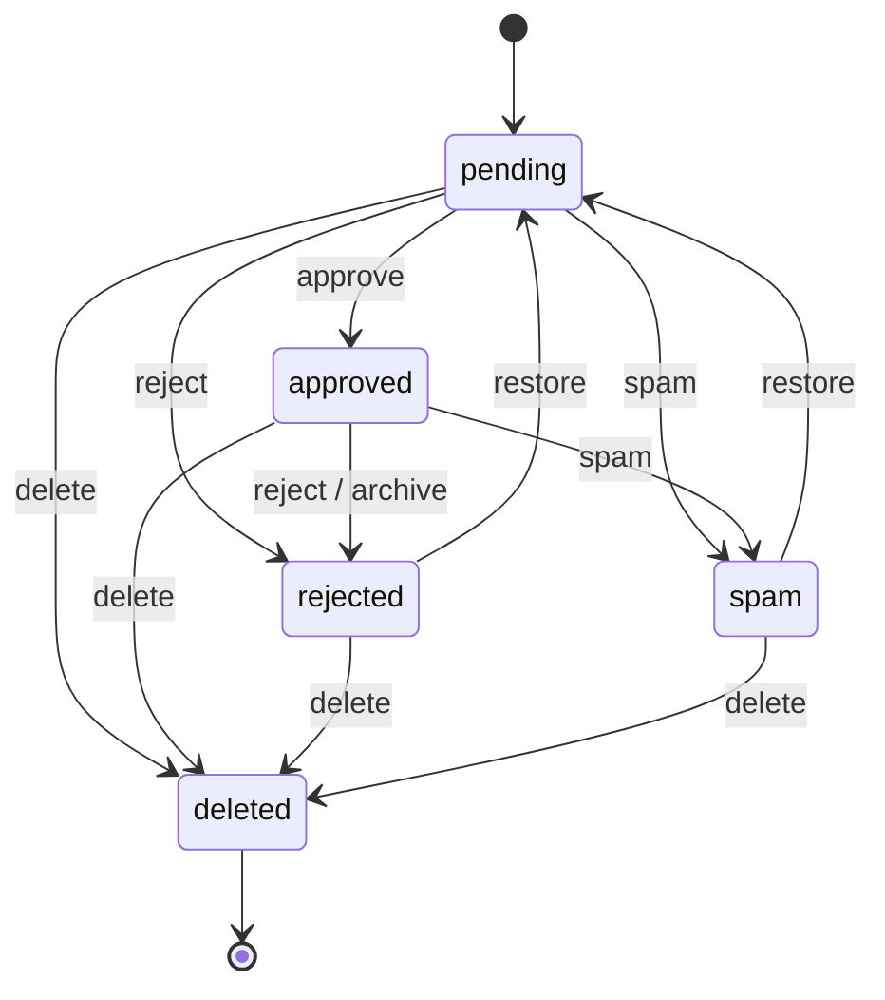

# Comments — moderation policy, privacy, admin/moderator/user guide (Issue #271, ADR-0032)

`comments` provides tenant-scoped, MODERATION-FIRST commenting over PUBLISHED, PUBLIC commentable resources. This document covers the moderation policy and status machine, the privacy/consent/retention matrix, the admin/moderator/user guide, the anti-abuse runbook, incident handling, and accessibility/i18n notes. Governance and dependency direction are in [ADR-0032](../adr/0032-comments-module-admission.md).

## Moderation policy

A thread's policy mode decides whether a submission is accepted and whether it needs moderation. Moderation-first: every accepted submission starts `pending` by default; anonymous submissions ALWAYS require moderation.

| Policy mode            | Who may submit     | Initial status                                              |
| ---------------------- | ------------------ | ----------------------------------------------------------- |
| `disabled`             | nobody             | — (all submissions rejected)                                |
| `authenticated-only`   | registered authors | `pending`, unless the tenant turns `require_moderation` off |
| `moderated-anonymous`  | anyone             | always `pending`                                            |
| `moderated-registered` | registered authors | always `pending`                                            |

Each commentable resource type opens its thread with the descriptor's `defaultPolicy` (`blog_post` → `moderated-anonymous`); the tenant's `default_policy_mode` overrides it. A comment is only ever accepted or shown against a resource that satisfies its source's declarative `publicationFilter` — a draft/private/deleted/scheduled resource never receives or exposes comments.

### Status machine

Only `approved`, non-soft-deleted comments are shown publicly. `archive` removes an approved comment from public view while retaining it for history (stored as `rejected` with the reserved `archived` reason code so the queue tells an archive from a plain reject). `deleted` is terminal. Illegal transitions are rejected by the pure `applyModerationAction` state machine, so no route can push a comment into an impossible state.

## Privacy, consent, retention matrix

| Data                   | Stored as                                                      | Exposed where                          | Retention                                                             |
| ---------------------- | -------------------------------------------------------------- | -------------------------------------- | --------------------------------------------------------------------- |
| Comment body           | raw plain text (escaped on render)                             | public list (approved only, safe HTML) | anonymized-in-place at cutoff; soft-delete on moderator/author action |
| Author display name    | plain text (≤120 chars)                                        | public list + admin queue              | NULLed by the retention sweep at the cutoff                           |
| Author email           | sha256 lookup hash + `j***@e***` mask — NEVER raw              | mask only, admin queue                 | hash + mask NULLed by the retention sweep at the cutoff               |
| Author IP / user-agent | tenant-salted sha256 hash — NEVER raw                          | never exposed                          | NULLed by the retention sweep at the cutoff                           |
| Reply-notify recipient | AES-256-GCM-encrypted (or unresolvable sentinel) + sha256 hash | NEVER (any API/response/event/log)     | unconfirmed deleted after the confirmation window; confirmed age out  |
| Moderation history     | append-only `..._moderation_events`                            | admin only                             | retained (append-only)                                                |
| Abuse telemetry        | ip/fingerprint HASHES + reason + counts                        | never exposed                          | `data_lifecycle` generic purge (default 30d)                          |

**Consent.** Reply-notify is opt-in and double-opt-in: a subscription is created unconfirmed and must be confirmed via the one-time unsubscribe/confirm token (only its hash is stored). No recipient address is ever returned by an API, carried in a domain event, or written to a log — only the email dispatcher decrypts it at send time (OUTSIDE any DB transaction). When no `COMMENTS_SUBSCRIBER_ENCRYPTION_KEY` is configured (offline/LAN default), reply-notify degrades to "cannot notify" rather than ever storing a plaintext address.

## Admin / moderator guide

The moderation queue at `/admin/comments` (permission `comments.moderation.read`) is the ONLY surface that exposes moderation metadata (reason codes, masked email, open report counts). It is status-filtered and keyset-paginated (`created_at DESC, id`).

- **Approve** (`POST /api/v1/comments/admin/{id}/moderate`, action `approve`, permission `comments.moderation.approve`) — publish a pending comment. High-risk: `Idempotency-Key` required, audited, publishes `comment.approved`.
- **Reject / mark spam** (same endpoint, action `reject` | `spam`, permission `comments.moderation.reject`) — deny publication; a reason code is required. `reject` gates BOTH rejecting and marking-as-spam (spam is a rejection subtype, distinguished by the audited reason code).
- **Archive** (`POST /admin/{id}/archive`, permission `comments.moderation.archive`) — remove an approved comment from public view, keep it for history.
- **Restore** (`POST /admin/{id}/restore`, permission `comments.moderation.restore`) — return a rejected/spam/archived comment to `pending` review. High-risk, audited.
- **Delete** (action `delete`, permission `comments.moderation.delete`) — soft-delete (retain the row, remove content from public view). High-risk, audited.
- **Bulk** (`POST /admin/bulk-moderate`) — apply one decision to many comments (tenant-bounded, per-item safe; each item that cannot transition is skipped, never failing the batch).
- **Settings** (`GET`/`PUT /admin/settings`, permissions `comments.settings.{read,update}`) — policy mode, `require_moderation`, `allow_anonymous`, edit window, max depth (0..8, tightening a hard cap of 4), max length (100..4000), max links (0..20), min-submit seconds (0..600), rate limit/hour (1..1000), blocked terms (≤200), Turnstile toggle, notify-on-reply. A settings update changes the public comment surface, so it is audited + `Idempotency-Key`'d regardless of not being classed high-risk.

Every mutation runs ABAC default-deny (RBAC + attribute checks, deny-overrides-allow) inside a tenant transaction (RLS FORCE). Open reports are resolved to `reviewed` when a decision (approve/reject/spam) is taken.

## User guide (public)

A visitor submits a comment from the `CommentsSection.astro` island on a published resource page (or the `/comments/demo` reference page). A logged-in visitor whose session matches the resolved tenant is attributed as a `registered` author; everyone else is `anonymous`. Within the edit window (`edit_window_seconds`, default 300s) an author may edit (`PATCH /{id}`) or delete-request (`POST /{id}/delete-request`) their OWN comment — bound by the registered user id or the anonymous author's IP hash, so no one can edit another's comment. A delete request within the window soft-deletes; past the window it files a report with reason `other` for a moderator, so threading/history stays coherent. Anyone may report a comment (`POST /{id}/report`, reasons `spam | abuse | offensive | other`), dedup-bounded to one open flag per `(comment, reporter ip, reason)`.

## Anti-abuse runbook

Server-side signals a client can never disable, evaluated in order on submit/reply:

1. **Policy gate** — mode + author kind + thread-closed.
2. **Body normalization/bounds** — length + max-links.
3. **Honeypot** — the hidden `website` field; any value = bot.
4. **Timing floor** — the HMAC-signed timing token measures elapsed time; a submit faster than `min_submit_seconds` (or a missing/invalid token when a floor is set) is blocked as `too_fast`.
5. **Blocked terms** — case-insensitive substring match against the tenant list.
6. **Bounded reply depth** — a reply beyond the effective max (min of tenant `max_depth` and the hard cap 4) is rejected.
7. **Duplicate fingerprint** — sha256 of normalized body + author within a 600s window.
8. **Per-IP rate limit** and **optional Turnstile** (verified OUTSIDE the DB transaction; no-op when unconfigured).

Every block writes ONE minimized `abuse_events` row (ip/fingerprint hashes + reason) and increments `comments_abuse_blocks_total`. Tuning lives in settings; raise `min_submit_seconds` / lower `rate_limit_per_hour` / extend `blocked_terms` under a spam wave. Because telemetry is hash-only, there is no raw PII to leak from the abuse log.

## Incident handling

- **Spam wave / abusive thread** — bulk-reject or bulk-spam from the queue; tighten settings (rate limit, min-submit, blocked terms); close the thread if needed. Reports auto-resolve to `reviewed` on decision.
- **Stored content concern** — soft-delete removes content from public view while retaining the row + append-only history for audit; there is no destructive delete path from the API.
- **Right-to-be-forgotten / retention** — run `bun run comments:retention` (or wait for its scheduled off-peak run) to anonymize aged author identity in place; a legal hold on `comments.comments` overrides retention (the sweep skips that tenant).
- **Escalation on legal hold** — place/lift the hold via `data_lifecycle`; while held, the retention sweep reports `skippedForLegalHold` and mutates nothing.

## Accessibility (WCAG AA)

The public `CommentsSection.astro` island degrades without JavaScript (a native comment form + server-rendered approved list). Interactive controls are keyboard accessible with visible focus, the submit control is disabled in-flight, and validation/blocked-submission feedback is announced via an `aria-live` region. Comment bodies render as escaped text with only safe `<a>`/` ` markup. The admin moderation queue meets AA contrast and is fully keyboard operable.

## Internationalization

UI strings ship in en + id (`admin.comments.nav_label` and the public island labels), following the gettext `.po` catalog convention (default en, min en + id). Every comment thread is locale-scoped (`(tenant, resource_type, resource_id, locale)`), so a resource's threads never mix locales.

## Security review follow-ups (PR #289 audit)

The admission review (reviewer + `awcms-micro-security-auditor`) returned **no Critical/High** findings. Two MEDIUM items were fixed in the admission PR: the anti-abuse fingerprint domain-separator is now a visible `\u0000` escape (the file stays reviewable UTF-8 text), and the public submit/reply acknowledgement is now **oracle-free** — an accepted-but-pending comment returns the SAME neutral `{ status: "received" }` (no `commentId`) as a blocked/unresolved submission, so `blocked_terms` / honeypot / timing evasion cannot be enumerated; only an immediately publicly-visible (approved) comment reveals `status: approved` + `commentId`. Moderators resolve pending comments via the authenticated admin queue, not the submitter's response.

The following LOW items are **accepted/deferred** and tracked here:

- **Timing-token secret** — `COMMENTS_TIMING_SECRET` has a dev fallback; durable/production storage profiles SHOULD set it so the soft submit-timing floor cannot be forged. (Mirrors the offline/LAN provider-optional posture; not an authorization control.)
- **`turnstile_enabled` is an inert seam** — the setting exists but no provider verification is wired yet; do not rely on it for bot protection until the adapter lands.
- **RLS `WITH CHECK`** — the `awcms_micro_comments_*` policies are `USING`-only (consistent with the existing base convention, e.g. `sql/080`/`sql/087`); every write already binds `tenant_id` from `withTenant`. A `WITH CHECK (tenant_id = current_setting('app.current_tenant_id')::uuid)` is a future defense-in-depth hardening for the whole base, not comments-specific.
- **`authorDisplayName`** is returned unescaped in JSON; the shipped island renders it via `textContent` (safe). Any alternate consumer MUST escape it before HTML-injecting.
- **Reply idempotency** — `POST /comments` requires an `Idempotency-Key`; `POST /comments/{id}/replies` relies on the 600s duplicate fingerprint instead. Consistency is a future nicety.
- **Anonymous author binding** is by tenant-salted IP hash; users behind shared NAT could edit/delete within the short edit window. Window-bounded, tenant-salted, low impact.
