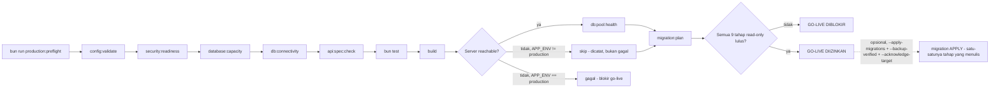

# Production Security Readiness

Dokumen ini mencatat implementasi Issue 10.3 (doc 07 §Production readiness
checklist, doc 03, doc 16, doc 20 threat model, ADR-0003 RLS, ADR-0004
RBAC/ABAC default-deny, ADR-0005 soft delete/immutability, dan skill
`awcms-micro-production-preflight`).

## Ringkasan



`config:validate` (Issue 12.2) jalan **paling pertama** — config harus
valid sebelum tahap manapun mencoba konek database
(`scripts/production-preflight.ts`'s `READ_ONLY_STAGES`). **Reworked oleh
Issue #684** (epic #679, platform-hardening) supaya seluruh 9 tahap ini
read-only secara default — lihat
`docs/awcms-micro/production-preflight-runbook.md` untuk urutan tahap yang
otoritatif dan selalu-terkini (dokumen ini memberi ringkasan konseptual,
bukan daftar tahap definitif).

Tiga skrip baru menjadi deliverable inti issue ini:

| Perintah                       | Skrip                             | Fungsi                                                                        |
| ------------------------------ | --------------------------------- | ----------------------------------------------------------------------------- |
| `bun run db:pool:health`       | `scripts/db-pool-health.ts`       | CLI wrapper `GET /api/v1/database/pool/health` (Issue 10.2)                   |
| `bun run security:readiness`   | `scripts/security-readiness.ts`   | Menjalankan checklist keamanan otomatis, exit non-zero bila ada critical fail |
| `bun run production:preflight` | `scripts/production-preflight.ts` | Orkestrasi seluruh tahap preflight + verdict go/no-go akhir                   |

Ketiganya murni CLI/script — **tidak ada perubahan OpenAPI/AsyncAPI** pada
issue ini (tidak ada endpoint atau event baru).

## 1. `db:pool:health`

Memanggil endpoint `GET /api/v1/database/pool/health` (Issue 10.2,
`src/pages/api/v1/database/pool/health.ts`) dari base URL yang bisa
dikonfigurasi lewat env `APP_URL` (default `http://localhost:4321`, sama
seperti yang sudah ada di `.env.example`). Semantik exit code mengikuti
3-tier status endpoint tersebut:

- `"healthy"` atau `"degraded"` → exit `0` (degraded tetap dianggap lulus —
  hanya peringatan untuk diselidiki sebelum go-live, sesuai desain endpoint
  Issue 10.2 sendiri).
- `"unhealthy"` → exit non-zero (hard failure).
- Fetch gagal total (server belum jalan, connection refused) → **juga** hard
  failure dengan pesan error yang jelas — tidak pernah terlihat seperti lulus
  diam-diam.

## 2. `security:readiness`

Menjalankan daftar tetap check bernama, masing-masing menghasilkan:

```ts
{
  name: string;
  severity: "critical" | "warning" | "info";
  status: "pass" | "fail";
  evidence: string;
}
```

Exit non-zero bila **ada satu saja** check `critical` berstatus `fail` —
persis diagram gate skill `awcms-micro-production-preflight`.

### Pemetaan checklist doc 07 → status implementasi

| Item checklist doc 07                         | Status                                                                                                                                                                                                                                                                                                                                                              |
| --------------------------------------------- | ------------------------------------------------------------------------------------------------------------------------------------------------------------------------------------------------------------------------------------------------------------------------------------------------------------------------------------------------------------------- |
| No hardcoded secret                           | **Otomatis** (critical) — heuristik grep `src/`, `scripts/`, config file yang di-track git                                                                                                                                                                                                                                                                          |
| `.env` tidak dikomit                          | **Otomatis** (critical) — `git ls-files` tidak boleh memuat `.env`                                                                                                                                                                                                                                                                                                  |
| Password hash modern                          | **Otomatis** (critical) — memanggil `hashPassword()` sungguhan, memeriksa awalan `$argon2id$`                                                                                                                                                                                                                                                                       |
| Login lockout                                 | **Otomatis** (critical) — memanggil `evaluateLoginAttempt()` dengan skenario 5x gagal                                                                                                                                                                                                                                                                               |
| RLS aktif                                     | **Otomatis** (critical) — query langsung `pg_class.relrowsecurity` per tabel `awcms_micro_%`                                                                                                                                                                                                                                                                        |
| ABAC aktif (default deny)                     | **Otomatis** (critical) — memanggil `evaluateAccess()` dengan permission kosong                                                                                                                                                                                                                                                                                     |
| Audit log aktif                               | **Otomatis** (critical) — `SELECT to_regclass('awcms_micro_audit_events')`                                                                                                                                                                                                                                                                                          |
| Soft delete/restore/purge audit aktif         | **Otomatis** (warning) — cek seed permission + grep `recordAuditEvent` di 3 endpoint profile                                                                                                                                                                                                                                                                        |
| Sync HMAC bila hybrid                         | **Otomatis** (warning/info) — cek env secret bukan placeholder `.env.example`, skip bila sync off                                                                                                                                                                                                                                                                   |
| Error tidak expose stack trace                | **Best-effort otomatis** (warning/info) — butuh server hidup; `info` bila tidak bisa dicek                                                                                                                                                                                                                                                                          |
| Restore/purge berizin dan diaudit             | Tercakup di baris "soft delete/restore/purge audit aktif" di atas (satu check gabungan)                                                                                                                                                                                                                                                                             |
| Tax data masking                              | **Out of scope** — lihat §Item di luar cakupan                                                                                                                                                                                                                                                                                                                      |
| CRM opt-out                                   | **Out of scope** — lihat §Item di luar cakupan                                                                                                                                                                                                                                                                                                                      |
| AI read-only                                  | **Out of scope** — lihat §Item di luar cakupan                                                                                                                                                                                                                                                                                                                      |
| PostgreSQL tidak public                       | **Manual** — lihat §Item di luar cakupan                                                                                                                                                                                                                                                                                                                            |
| Least-privilege DB user                       | **Otomatis sebagian** (critical, cakupan connection role — lihat "App DB connection role does not bypass RLS" di atas) + **manual** untuk provisioning grant/role menyeluruh                                                                                                                                                                                        |
| Backup aktif / restore tested                 | **Manual** (SOP + skrip sudah ada di `deploy/backup/{backup,restore}-postgres.sh` sejak Issue 12.2, dikeraskan Issue #691: enkripsi + manifest bertanda tangan + checksum-before-restore + restore drill terjadwal — lihat skill `awcms-micro-production-preflight` dan `deploy/backup/README.md`)                                                                  |
| PostgreSQL version sesuai target              | **Manual** — versi di-pin di `docker-compose.yml` (Issue 12.2, `postgres:18.4`), tidak diverifikasi ulang dari kode aplikasi                                                                                                                                                                                                                                        |
| Build pass / migration pass / API spec valid  | **Otomatis** — via `production:preflight` (bukan `security:readiness`), tahap `build`/`migration:plan`/`api:spec:check`. Sejak Issue #684, `migration:plan` hanya menghitung diff pending-vs-applied (read-only); benar-benar menjalankan migration adalah tahap `apply` terpisah yang eksplisit di-gate (lihat §3 di bawah)                                        |
| Setup wizard locked                           | Sudah diverifikasi live sejak Issue 12.1 (`awcms_micro_setup_state` singleton); tidak diulang sebagai check readiness terpisah di issue ini — di luar cakupan penambahan baru                                                                                                                                                                                       |
| Role default tersedia                         | Sudah diverifikasi live sejak Issue 12.1; tidak diulang sebagai check readiness terpisah                                                                                                                                                                                                                                                                            |
| Logging aktif                                 | Sudah ada sejak Issue 10.1 (`src/lib/logging/logger.ts`); tidak diulang sebagai check terpisah. Diperkuat Issue #687: `bun run logging:lint:check` (bagian dari `bun run check`) menggagalkan build kalau ada pola `console.error`/`console.warn` dengan raw error/`.message`/`.stack` tidak tersanitasi di `src/pages/admin`, `src/pages/api/v1`, atau `scripts/`. |
| Index utama / partial index soft delete       | Diverifikasi lewat test migration per issue (lihat `tests/*.test.ts` masing-masing); tidak diulang sebagai check runtime terpisah di sini                                                                                                                                                                                                                           |
| Pool sehat / slow query monitoring            | **Otomatis** via `db:pool:health` (pool); slow query monitoring di luar cakupan base ini (butuh `pg_stat_statements`/APM eksternal — deployment concern)                                                                                                                                                                                                            |
| Security response headers (CSP/HSTS/dst.)     | **Diperbarui Issue #437** (warning) — hit server nyata, cek `content-security-policy`/`x-content-type-options`/`x-frame-options`/`referrer-policy`/`permissions-policy` di respons `GET /login`                                                                                                                                                                     |
| Login rate limiting (sumber+tenant)           | **Diperbarui Issue #437** (warning) — `checkRateLimit()` murni, menegaskan percobaan ke-4 ditolak setelah `maxAttempts=3`                                                                                                                                                                                                                                           |
| Email provider config lengkap bila diaktifkan | **Ditambahkan Issue #499** (critical) — `checkEmailProviderConfigReady` menggunakan ulang `checkEmailConfig` (`validate-env.ts`, Issue #493) verbatim; skip (pass) bila `EMAIL_ENABLED` bukan `"true"`                                                                                                                                                              |

### Item di luar cakupan generic base ini

Dicetak eksplisit di laporan `security:readiness` sebagai bagian "Out of
scope for this generic base" — **tidak** disembunyikan atau dipaksakan jadi
check palsu:

| Item                      | Alasan                                                                                                                                                                                                                                                                                                                                                                                          |
| ------------------------- | ----------------------------------------------------------------------------------------------------------------------------------------------------------------------------------------------------------------------------------------------------------------------------------------------------------------------------------------------------------------------------------------------- |
| Tax data masking          | Tidak ada modul pajak/Coretax di base generik ini — concern domain aplikasi turunan (mis. AWPOS).                                                                                                                                                                                                                                                                                               |
| CRM opt-out               | Tidak ada modul CRM di base generik ini — concern domain aplikasi turunan.                                                                                                                                                                                                                                                                                                                      |
| AI read-only              | Tidak ada modul AI analyst/tool-calling di base generik ini — concern domain aplikasi turunan.                                                                                                                                                                                                                                                                                                  |
| PostgreSQL tidak public   | Concern deployment profile — `docker-compose.yml`/`deployment-profiles.md` ada sejak Issue 12.2, tapi eksposur jaringan nyata bergantung konfigurasi operator saat deploy, tidak bisa diverifikasi dari kode aplikasi saja. Manual.                                                                                                                                                             |
| Least-privilege DB user   | Role/grant DB diprovisi saat deploy. Connection role aplikasi sendiri (bukan superuser/bypass-RLS) sudah diverifikasi otomatis (lihat check di atas); grant/role lain tetap manual.                                                                                                                                                                                                             |
| Backup/restore tested     | Skrip `deploy/backup/{backup,restore}-postgres.sh` sudah ada sejak Issue 12.2, dikeraskan Issue #691 (enkripsi, manifest HMAC, checksum-before-restore, `deploy/backup/restore-drill.sh` terjadwal) — butuh dijalankan sungguhan terhadap environment terprovisi untuk membuktikan hasil restore (lihat SOP di skill `awcms-micro-production-preflight` dan `deploy/backup/README.md`). Manual. |
| PostgreSQL version pinned | Version pin ada di `docker-compose.yml` (`postgres:18.4`) sejak Issue 12.2, bukan diverifikasi dari kode aplikasi. Manual — konfirmasi versi server nyata (`SELECT version();`).                                                                                                                                                                                                                |

## 3. `production:preflight`

**Direwrite oleh Issue #684** (epic #679, platform-hardening) supaya
non-destructive by default. Perilaku LAMA yang diperbaiki: `db:migrate`
berjalan unconditional sebagai tahap awal, sebelum `api:spec:check`/
`test`/`build` — sehingga satu tahap belakangan yang gagal tetap
meninggalkan database target termutasi walau verdict akhirnya "GO-LIVE
DIBLOKIR". Sejak Issue #684, seluruh tahap di bawah **read-only**; migration
benar-benar diterapkan hanya lewat tahap `apply` terpisah yang eksplisit
di-gate (lihat di bawah).

Mengorkestrasi tahap berikut sebagai child process (`Bun.spawn`), berurutan,
mencatat pass/fail per tahap, lalu mencetak verdict akhir. **Daftar tahap
otoritatif dan selalu-terkini ada di
`docs/awcms-micro/production-preflight-runbook.md`** — ringkasan di bawah
ini bisa basi seiring skrip berkembang (mis. Issue #743 menambah tahap
`database:capacity`):

1. `config:validate` — **paling pertama** (Issue 12.2): config harus valid
   sebelum tahap manapun mencoba konek database.
2. `security:readiness`
3. `database:capacity` (Issue #743) — budget kapasitas koneksi, murni
   aritmetika config, tidak pernah konek database.
4. `db:connectivity` — konfirmasi `DATABASE_URL` reachable + ledger
   migration bisa di-query; hanya satu `SELECT`, tidak pernah menulis.
5. `api:spec:check`
6. `test`
7. `build`
8. `db:pool:health` — **hanya bila** probe `GET /api/v1/health`
   menunjukkan ada server yang menjawab; bila tidak, tahap ini dicatat
   `skipped` (bukan `failed`) dengan alasan eksplisit di laporan **kecuali**
   `APP_ENV=production`, yang membuat skip tersebut memblokir go-live
   (preflight produksi yang tidak bisa menjangkau metrik pool server hidup
   belum benar-benar memverifikasi kesiapan produksi).
9. `migration:plan` — diff pending-vs-applied read-only, sengaja diletakkan
   sebagai tahap read-only TERAKHIR, tepat sebelum keputusan apply.

`bun install` **sengaja tidak** dijalankan oleh skrip ini — itu langkah
setup environment (mengambil dependency), bukan readiness check, dan di luar
tanggung jawab skrip ini (skill `awcms-micro-production-preflight` mencantumkannya
sebagai langkah terpisah sebelum command list preflight).

Semua tahap read-only tetap dijalankan meskipun tahap sebelumnya gagal
(bukan fail-fast) — laporan akhir mendaftar **seluruh** tahap yang gagal,
bukan hanya yang pertama, supaya satu kegagalan tidak menyembunyikan masalah
lain.

Verdict tahap read-only: `GO-LIVE DIIZINKAN` (exit 0) jika tidak ada tahap
`fail`, `GO-LIVE DIBLOKIR` (exit non-zero) jika ada.

**Menerapkan migration** adalah langkah terpisah yang eksplisit di-gate —
bukan bagian daftar tahap di atas: hanya bisa dicoba bila verdict read-only
`true`, membutuhkan flag `--apply-migrations` (niat operator untuk
memutasi), `--backup-verified` (atestasi backup baru yang bisa direstore
sudah ada), dan `--acknowledge-target=<database-name>` (konfirmasi eksplisit
target agar tidak salah database). Lihat
`docs/awcms-micro/production-preflight-runbook.md` untuk detail flag dan
alasan tiap gate.

## Cara menjalankan sebelum go-live

```bash
bun install
bun run production:preflight
```

`production:preflight` menjalankan seluruh 9 tahap read-only di atas
sendiri (kecuali `bun install`, yang tetap langkah setup terpisah); jalankan
`bun run preview &` (atau `bun run dev`) sebelumnya bila ingin tahap
`db:pool:health` benar-benar mengukur pool server hidup alih-alih dicatat
`skipped`. Untuk benar-benar menerapkan migration setelah verdict read-only
lulus, lihat flag `--apply-migrations`/`--backup-verified`/
`--acknowledge-target` di
`docs/awcms-micro/production-preflight-runbook.md` — **jangan** jalankan
`bun run db:migrate` secara manual sebagai bagian rehearsal preflight; itu
persis bug yang diperbaiki Issue #684.

## Test

`tests/security-readiness.test.ts` menutup logika murni yang tidak butuh
koneksi DB/server sungguhan: heuristik `scanLineForHardcodedSecret`
(termasuk kasus negatif — placeholder, member-expression, baca dari
`process.env`), `checkAbacDefaultDeny`, `checkLoginLockoutImplemented`, dan
`checkSyncHmacSecretNotDefault` (ketiga cabang: sync off, sync on dengan
placeholder, sync on dengan secret asli).

Check yang butuh Postgres sungguhan (`checkRlsEnabled`,
`checkAuditLogTableReachable`, sebagian `checkSoftDeletePermissionsSeededAndAudited`)
**tidak** di-unit-test dengan DB palsu — itu akan menguji mock, bukan query
sungguhan. Pembuktiannya ada di verifikasi live (lihat
`docs/awcms-micro/AUDIT_STANDAR_PENGEMBANGAN_2026-07-04.md` entri Issue 10.3),
termasuk skenario RLS sengaja dimatikan untuk membuktikan gate benar-benar
memblokir, bukan sekadar skrip yang selalu mencetak "pass".

## Gap yang belum ditutup

- Slow query monitoring (`pg_stat_statements`/APM) tidak diverifikasi
  otomatis — butuh tooling observability eksternal di luar cakupan base ini.
- `checkErrorsDontLeakStackTraces` best-effort: hanya menguji satu bentuk
  request (POST `/sync/push` tanpa header HMAC) terhadap satu daftar
  substring stack-trace yang umum; bukan jaminan menyeluruh seluruh endpoint.
- Item deployment (PostgreSQL tidak public, least-privilege user menyeluruh,
  backup/restore, version pinned) tetap verifikasi **manual** terhadap
  environment terprovisi — `docker-compose.yml`/deployment profile/skrip
  backup sudah ada sejak Issue 12.2, tapi eksposur jaringan nyata, hasil
  restore, dan versi server yang benar-benar berjalan tidak bisa dibuktikan
  dari kode aplikasi saja.
- Security headers (Issue #437) hanya dicek **kehadirannya** (nama header
  ada di respons), bukan validitas isi CSP secara mendalam — lihat
  `docs/awcms-micro/20_threat_model_security_architecture.md` §Matrix
  kepatuhan untuk verifikasi CSP yang lebih lengkap (headless-Chrome/CDP).
- Rate limiter login (Issue #437) in-memory per-proses, tidak dibagi antar
  instance pada deployment multi-instance — lihat
  `src/lib/security/rate-limit.ts` untuk detail keterbatasan ini.
- Email observability/security/incident-response detail (Issue #499:
  structured log per tahap, audit event, `GET /reports/email-health`,
  catatan insiden provider outage/rotasi kredensial/accidental bulk send)
  didokumentasikan di `src/modules/email/README.md` §Observability,
  security tests, and production readiness — tidak diduplikasi di sini.
