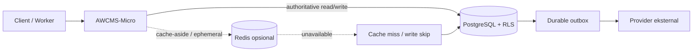
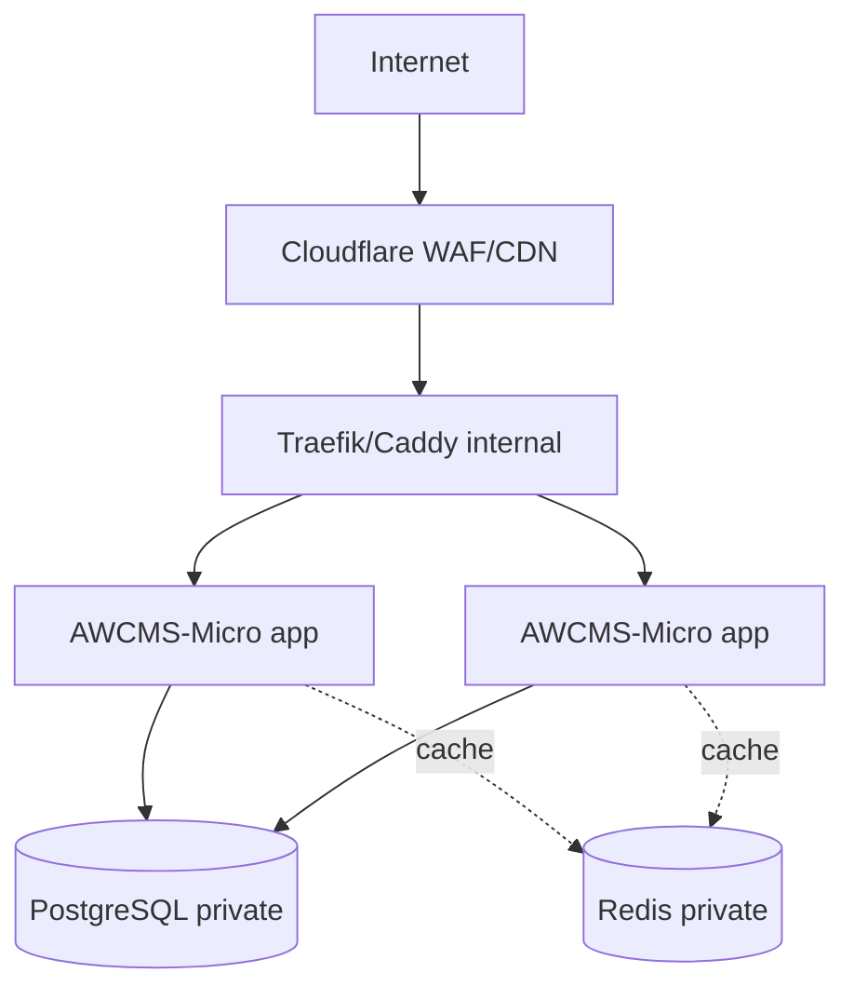

# Redis Readiness — Kapabilitas Opsional AWCMS-Micro

> **Status:** fondasi opsional untuk Issue #284. Redis **nonaktif secara default** dan tidak mengubah PostgreSQL sebagai sumber kebenaran.

## 1. Ringkasan keputusan

AWCMS-Micro menyiapkan Redis untuk website full-online yang mulai memiliki beban baca tinggi atau berjalan pada beberapa instance. Implementasinya memakai `RedisClient` native Bun agar konsisten dengan kebijakan Bun-only dan tidak menambah package runtime pihak ketiga.

Redis adalah **lapisan akselerasi dan koordinasi sementara**. PostgreSQL + RLS tetap authoritative untuk data tenant, identity, session, permission, audit, idempotency, durable outbox, domain event, dan seluruh state transaksional.



## 2. Prinsip yang mengikat

1. **Default disabled** — tanpa `REDIS_ENABLED=true`, aplikasi tidak membuat koneksi Redis.
2. **Fail-open untuk cache** — error/timeout Redis menjadi cache miss atau write skip.
3. **PostgreSQL authoritative** — semua hasil dapat direkonstruksi dari PostgreSQL/object storage.
4. **Tenant-aware key** — data tenant wajib menyertakan `tenantId` pada `buildRedisKey()`.
5. **TTL wajib** — helper cache hanya menulis dengan `SET ... EX`.
6. **Di luar transaksi DB** — command Redis tidak dipanggil dalam callback transaksi PostgreSQL.
7. **No secret logging** — URL diagnostik meredaksi credential; payload/key tenant tidak dicetak.
8. **Internal network** — Redis tidak boleh memiliki port publik.
9. **Least privilege** — dedicated ACL user dibatasi pada prefix aplikasi dan command yang diperlukan.
10. **Aplikasi tetap start saat Redis gagal** — overlay tidak menjadikan Redis dependency startup aplikasi.

## 3. Komponen implementasi

| Komponen                                               | Fungsi                                                                             |
| ------------------------------------------------------ | ---------------------------------------------------------------------------------- |
| `src/lib/redis/config.ts`                              | Parsing config, validasi shape/range, redaksi URL, tenant-aware key builder        |
| `src/lib/redis/client.ts`                              | Singleton `RedisClient` native Bun, timeout, reconnect terbatas, lifecycle, health |
| `src/lib/redis/cache.ts`                               | Helper JSON cache read/write/delete dan pola cache-aside fail-open                 |
| `scripts/redis-health.ts`                              | Validasi + PING operasional tanpa membocorkan credential                           |
| `config/redis.env.example`                             | Contoh env opt-in terpisah dari profil default                                     |
| `docker-compose.redis.yml`                             | Overlay Redis hardened, ACL, persistence, dan no public port                       |
| `tests/unit/redis-foundation.test.ts`                  | Test tanpa koneksi Redis/network hidup                                             |
| `docs/adr/0030-optional-redis-readiness-foundation.md` | Keputusan dan invariant arsitektur                                                 |

Tidak ada migration database, endpoint REST, atau event baru.

## 4. Konfigurasi

| Variable                      |       Default | Ketentuan                                                    |
| ----------------------------- | ------------: | ------------------------------------------------------------ |
| `REDIS_ENABLED`               |       `false` | Hanya literal `true`/`false`; URL wajib ketika `true`        |
| `REDIS_URL`                   |        kosong | `redis://`, `rediss://`, atau skema native Bun yang didukung |
| `REDIS_KEY_PREFIX`            | `awcms-micro` | 2–64 karakter: huruf, angka, `.`, `_`, `-`                   |
| `REDIS_CONNECTION_TIMEOUT_MS` |        `2000` | 100–30.000 ms                                                |
| `REDIS_COMMAND_TIMEOUT_MS`    |        `1000` | 50–30.000 ms                                                 |
| `REDIS_MAX_RETRIES`           |           `3` | 0–20                                                         |
| `REDIS_CACHE_DEFAULT_TTL_SEC` |         `300` | 1–86.400 detik                                               |
| `REDIS_PASSWORD`              |     tidak ada | Secret overlay; URL-safe dan disimpan di secret manager      |
| `REDIS_MAXMEMORY`             |       `256mb` | Batas awal; sesuaikan berdasarkan observasi                  |
| `REDIS_MAXMEMORY_POLICY`      |  `noeviction` | Memory penuh menjadi write failure yang terlihat/fail-open   |

`REDIS_URL` adalah secret karena dapat memuat username/password. Jangan memasukkannya ke issue, log, screenshot, atau telemetry.

## 5. Key namespacing

Format key:

```text
<prefix>:<version>:<namespace>:tenant:<tenant-id>:<key>
<prefix>:<version>:<namespace>:global:<key>
```

```ts
const key = buildRedisKey({
  namespace: "seo",
  tenantId,
  key: `sitemap:${locale}`
});
```

Scope `global` hanya untuk state platform yang benar-benar lintas tenant dan non-sensitif. Jangan membuat key tenant secara manual, memakai email/NIK/token pada key, atau memilih global hanya untuk menghindari kewajiban `tenantId`.

## 6. Pola cache-aside

```ts
const key = buildRedisKey({
  namespace: "reporting",
  tenantId,
  key: `visitor-summary:${range}`
});

const summary = await redisCacheAside(
  key,
  () => loadVisitorSummaryFromPostgres(tenantId, range),
  { ttlSec: 60 }
);
```

Alur:

1. baca Redis di luar transaksi;
2. bila hit, gunakan nilai cache;
3. bila miss/error, query PostgreSQL melalui jalur tenant/RLS normal;
4. tulis hasil ke Redis best-effort dengan TTL;
5. kegagalan tulis tidak mengubah hasil domain.

Invalidation dilakukan **setelah** mutation sumber data berhasil commit. TTL tetap wajib sebagai safety net bila invalidation gagal.

## 7. Lima contoh adopsi relevan

1. **Homepage portal berita:** cache daftar artikel published per tenant/locale selama 30–60 detik; publish/unpublish menghapus key setelah commit.
2. **Sitemap dan feed:** cache XML/RSS/Atom dengan key tenant, host, locale, dan versi; TTL 60–300 detik.
3. **Tema publik:** cache tema published dan token CSS tervalidasi; draft/preview memakai namespace terpisah dan publish/rollback menginvalidasi cache.
4. **Visitor analytics:** cache ringkasan 24 jam/7 hari/30 hari yang mahal dihitung dan tidak dipakai untuk billing atau keputusan keamanan authoritative.
5. **Metadata tenant/domain:** cache host → tenant atau canonical domain dengan TTL pendek dan fallback PostgreSQL.

## 8. Penggunaan yang memerlukan issue terpisah

- distributed rate limiting lintas instance;
- distributed lock;
- pub/sub invalidation;
- queue/delayed jobs;
- session storage;
- token/replay store;
- leader election;
- cache data sensitif.

Setiap penggunaan membutuhkan threat model, atomicity/concurrency test, failure policy fail-open/fail-closed, observability, serta rollback. Helper cache generik tidak boleh langsung dipakai sebagai kontrol keamanan.

## 9. Penggunaan yang dilarang

Redis tidak boleh menggantikan PostgreSQL/RLS, RBAC/ABAC, session authoritative, audit/security log, idempotency record, durable outbox/inbox/domain event, content/media authoritative, backup, atau transaksi atomic lintas tabel. Data Redis harus dianggap dapat hilang kapan saja dan dapat direkonstruksi.

## 10. Menjalankan secara lokal/LAN

```bash
cp config/redis.env.example .env.redis
```

Ganti `REDIS_PASSWORD` dengan secret acak panjang, lalu jalankan:

```bash
docker compose \
  --env-file .env \
  --env-file .env.redis \
  -f docker-compose.yml \
  -f docker-compose.redis.yml \
  up --build
```

Periksa health:

```bash
bun run redis:health
```

Saat Redis dinonaktifkan, status adalah `disabled` dan exit sukses. Saat diaktifkan tetapi konfigurasi invalid atau PING gagal, exit code non-zero.

## 11. Deployment production/Coolify



Ketentuan:

- jangan expose `6379` ke public network;
- tempatkan app, PostgreSQL, dan Redis pada private network Coolify;
- simpan `REDIS_PASSWORD`/`REDIS_URL` sebagai secret;
- gunakan ACL user unik per aplikasi;
- managed Redis di luar private network memakai TLS (`rediss://`) dan network allow-list;
- pisahkan production, staging, dan development;
- jangan berbagi prefix antarproduk;
- pantau memory, latency, reconnect, timeout, serta hit/miss.

Untuk immutable production:

```bash
docker compose \
  --env-file .env \
  --env-file .env.redis \
  -f docker-compose.prod.yml \
  -f docker-compose.redis.yml \
  up -d --build
```

Overlay tidak menambahkan `depends_on` Redis pada app. Bila Redis gagal, aplikasi tetap start dan membaca PostgreSQL; health Redis dilaporkan terpisah.

## 12. Security baseline overlay

- user `default` dimatikan;
- user `awcms_app` memakai password hash SHA-256 di ACL file;
- key dibatasi ke `<REDIS_KEY_PREFIX>:*`;
- application user hanya mendapat `PING`, read/write umum, dan tidak mendapat command dangerous;
- port tidak dipublikasikan dan protected mode aktif;
- capability container di-drop dan `no-new-privileges` aktif;
- resource limit serta `maxmemory` diterapkan;
- AOF + snapshot diaktifkan sebagai operational convenience.

Persistence Redis **bukan** durability domain. Kehilangan volume hanya menghasilkan cold cache; recovery authoritative tetap dari PostgreSQL dan object storage.

## 13. Capacity, recovery, dan observability

Default `noeviction` membuat memory penuh menjadi write failure yang terlihat dan ditangani fail-open, bukan silent eviction. Sebelum mengubah policy, ukur jumlah key per tenant, ukuran payload rata-rata/p95, TTL window, overhead, dan headroom.

Prosedur gangguan:

1. aplikasi fallback ke PostgreSQL;
2. operator menjalankan `bun run redis:health` dan memeriksa container;
3. restart/recreate Redis;
4. cache warm kembali secara natural;
5. bila credential compromise, rotasi ACL secret dan flush prefix aplikasi;
6. verifikasi PostgreSQL, outbox, audit, dan object storage tetap sehat.

Modul adopter menambahkan metrik agregat non-sensitif: hit/miss, error, timeout, latency p50/p95/p99, estimated bytes/key count per namespace, fallback duration, dan stampede indicator. Jangan gunakan payload, full URL, data pribadi, token, atau key tenant mentah sebagai log/label.

Rollback cukup dengan `REDIS_ENABLED=false` atau menjalankan Compose tanpa overlay. Tidak ada rollback migration.

## 14. Pemetaan standar dan regulasi

| Kerangka                | Implementasi praktis                                                                                                                    |
| ----------------------- | --------------------------------------------------------------------------------------------------------------------------------------- |
| ISO/IEC 27001 & 27002   | Least privilege ACL, secure configuration, network segregation, secret management, logging, monitoring, backup/recovery ownership       |
| ISO/IEC 27005           | Risiko outage, leakage, cache poisoning, cross-tenant collision, memory exhaustion, dan credential compromise dianalisis sebelum adopsi |
| ISO/IEC 27017           | Private cloud network, pemisahan environment, shared responsibility managed Redis                                                       |
| ISO/IEC 27018 & 27701   | Data minimization, TTL, larangan cache data pribadi tanpa kebutuhan dan kontrol penghapusan                                             |
| ISO/IEC 20000-1         | Health check, incident/change/rollback, capacity monitoring, dan service ownership                                                      |
| ISO 22301               | Redis bukan single point of failure; operasi berlanjut lewat PostgreSQL                                                                 |
| ISO/IEC 15408           | Redis bukan authorization boundary; ACL adalah defense-in-depth infrastruktur                                                           |
| OWASP ASVS/API Security | Secure defaults, no secret leakage, validation, resource limits, dependency isolation                                                   |
| UU PDP & PP PSTE        | Pembatasan data pribadi di cache, keamanan pemrosesan, pemulihan layanan, audit authoritative di PostgreSQL                             |

Pemetaan ini adalah panduan engineering, bukan sertifikasi otomatis atau opini hukum final.

## 15. Roadmap adopsi

1. **Tahap 0:** readiness foundation; belum ada modul produksi memakai Redis.
2. **Tahap 1:** satu cache read-heavy berisiko rendah seperti sitemap/feed/reporting; tetapkan TTL, invalidation, metrik, dan chaos test Redis down.
3. **Tahap 2:** multi-instance cache coherence; versioned key, invalidation event, dan mitigasi stampede.
4. **Tahap 3:** koordinasi ephemeral hanya dengan atomicity test dan failure policy khusus.
5. **Tahap 4:** evaluasi managed Redis, replica, Sentinel, atau Cluster berdasarkan kebutuhan nyata; adapter/ADR baru diperlukan karena fondasi native Bun awal tidak mendukung Sentinel/Cluster.

## 16. Checklist adopsi modul

- [ ] nilai dapat dihitung ulang dari PostgreSQL/object storage;
- [ ] key memakai `buildRedisKey()` dan `tenantId`;
- [ ] TTL bounded dan staleness terdokumentasi;
- [ ] invalidation dilakukan setelah commit;
- [ ] Redis outage test membuktikan fungsi utama tetap berjalan;
- [ ] tidak ada data pribadi/secret tanpa review khusus;
- [ ] tidak ada Redis command dalam transaksi DB;
- [ ] metrik hit/miss/error tersedia;
- [ ] rollback cukup disable/omit overlay;
- [ ] perubahan mempunyai test dan dokumentasi atomik.
