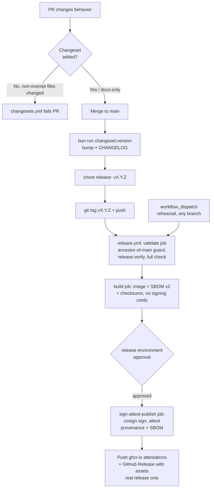

# Release Process — Changesets, SBOM, Signing, Provenance

Issue #692 (epic #679, platform-hardening). Before this issue, Changesets
managed version bumps and `CHANGELOG.md` (doc 09 §Versioning dengan
Changesets, skill `awcms-micro-release`), but nothing enforced the
changeset policy automatically, and no workflow produced a verifiable
image, SBOM, signature, or provenance for a tagged release. This document
describes the two workflows that now do that —
[`.github/workflows/changesets.yml`](../../.github/workflows/changesets.yml)
and [`.github/workflows/release.yml`](../../.github/workflows/release.yml)
— and how to verify their output as a consumer.

## Pipeline overview



Both triggers run the exact same `validate` job — the rehearsal path is
not a shortcut around the quality gate, only around the tag-ancestor
guard and `release:verify` (both explicitly `if: github.event_name ==
'push'`; `bun run check` itself always runs).

## 1. PR-time gate: `changesets.yml`

`scripts/changeset-policy-check.ts` (`bun run changesets:policy:check`)
decides whether a PR needed a new changeset, using this repo's own merged-
PR history as the ground truth for what counts as "docs-only/chore" (doc 09
§Versioning: "Perubahan docs-only/chore boleh tanpa changeset"):

- **Exempt** (no changeset required): `docs/**`, `.claude/**`,
  `.changeset/**`, any `*.md` file — matches PR #595/#585, which merged
  with zero changesets after touching only those paths.
- **Not exempt** (changeset required): everything else, including
  `.github/**` workflow files, `scripts/**`, `src/**`, `sql/**`,
  `openapi/**`, `asyncapi/**`, `package.json`, `Dockerfile*`,
  `docker-compose*.yml`, and test files — matches PR #707/#701/#609, which
  all carried a changeset alongside CI/workflow/script changes.

If a new `.changeset/*.md` file was added, its frontmatter is validated
(`"awcms-micro": major|minor|patch` — this is a single-package repo, so no
other package name is valid). A one-off path exemption list
(`CHANGESET_POLICY_PATH_EXEMPTIONS` in the script) exists for a genuine
false positive, mirroring the `CONFIG_EXEMPTIONS`/`LOGGING_LINT_EXEMPTIONS`
pattern already used elsewhere in this repo — empty as of this issue.

This check runs as its own workflow (`changesets.yml`), not as an
additional step inside `ci.yml`'s `quality` job or `bun run check`,
because it is inherently PR-diff-shaped (it needs `origin/main`'s tip to
diff against) — every other step in `check` is self-contained and safe to
run against a single checkout with no network/git-history dependency.

## 2. Tag-time release: `release.yml`

Two entry points, both converging on the same job graph:

| Trigger                        | Effect                                                                                                                                   |
| ------------------------------ | ---------------------------------------------------------------------------------------------------------------------------------------- |
| `push` a tag matching `v*.*.*` | **Real release.** Publishes an image, GitHub Release, and moves `:latest`.                                                               |
| `workflow_dispatch` (any ref)  | **Rehearsal.** Runs the identical pipeline against a `dryrun-<sha>` image tag. No GitHub Release is created, `:latest` is never touched. |

### `validate` job (read-only)

1. **Ancestor-of-main guard** (real release only) — `git merge-base
--is-ancestor HEAD origin/main`. `main` **is now branch-protected** (as of
   2026-07-17, see [`branch-protection.md`](branch-protection.md) §Status:
   APPLIED — six required status checks, `strict: true`,
   `enforce_admins: true`), so a tag's underlying commit already had to
   pass through a protected-branch PR merge. This guard stays as
   defense-in-depth against tagging a stray unmerged commit (e.g. a local
   branch never pushed through a PR): a tag whose commit isn't part of
   `origin/main`'s history is refused before anything is built, regardless
   of branch-protection state.
2. **`bun run release:verify`** (real release only,
   `scripts/release-verify.ts`) — confirms the pushed tag's version
   matches `package.json`, that `CHANGELOG.md` has a `## [X.Y.Z]` section
   for it, and that no changeset files remain unconsumed in `.changeset/`.
   The bracketed heading is written automatically: `bun run
changeset:version` chains `scripts/changelog-heading-brackets.ts` after
   `changeset version`, because `@changesets/cli` itself always emits a
   bare `## X.Y.Z` heading (the `changelog` entry in
   `.changeset/config.json` only shapes each entry's bullet body, not the
   heading) — running `changeset version` directly, bypassing the `bun
run` script, skips this and will fail this check at tag-push time. This
   is exactly what happened to `v0.3.0`, the first real tag-push release
   ever attempted for this repo (2026-07-18): nothing in the pipeline had
   ever exercised this path before, so the mismatch went undetected until
   the checked commit reached a real tag push. See §Rollback below for
   what recovering from that looked like in practice.
3. **`bun run check`** (against a real, migrated Postgres service) — the
   full quality gate, re-verified at release time rather than trusted from
   a possibly-stale CI run. This is **stricter** than `ci.yml`'s own
   `quality` job, not identical to it: `ci.yml`'s `quality` job does not
   currently run five of the twenty steps `bun run check` runs —
   `i18n:pot:check`, `config:docs:check`, and `logging:lint:check`
   (reviewer finding on PR #715), plus `api:docs:check` and
   `repo:inventory:check` (same category of gap, confirmed directly
   against `.github/workflows/ci.yml`) — those five checks only run here,
   so an i18n `.pot` drift, config-docs drift, raw-error-logging
   violation, API-docs drift, or repo-inventory drift could in principle
   merge to `main` via a green PR and only surface at tag-push time.
   Closing that `ci.yml` gap so the two gates are actually identical is
   tracked as a separate follow-up, out of this issue's scope — see
   [`branch-protection.md`](branch-protection.md) §Why `bun run check` and
   CI must stay the same source of truth for the full step-by-step
   comparison.

   `extension:check` (Issue #741, epic #738 `platform-evolution`,
   ADR-0015 — derived-application compatibility manifest) is deliberately
   **not** part of the gap above: it was added to both `package.json`'s
   `check` composite AND as an explicit named step in `ci.yml`'s
   `quality` job in the same PR, precisely to avoid reproducing this
   exact class of drift for a brand-new check (see ADR-0015 §6). A tagged
   release of a derived repository that has published its own
   `extension.manifest.json` is therefore verified against this
   repository's actual current SemVer, module-contract version,
   capability versions, and migration checksums as part of this same
   step, with no separate release-time gate to configure.

### `build` job (unprivileged: `contents: read`, `packages: write` only)

Runs identically for a real release and a rehearsal. Deliberately holds
no signing/attestation credential (`id-token`/`attestations`) — see
below.

1. Build `Dockerfile.production` with Docker Buildx, push to
   `ghcr.io/ahliweb/awcms-micro` tagged `<version>` (or `dryrun-<sha>` for a
   rehearsal) and `sha-<commit>`; `:latest` is added only for a real
   release.
2. **SBOM** — two separate CycloneDX JSON SBOMs via
   [`anchore/sbom-action`](https://github.com/anchore/sbom-action) (Syft
   under the hood): one for the **source tree** (`bun.lock` + workspace,
   `sbom-source.cdx.json`) and one for the **built container image**
   (`sbom-image.cdx.json`) — the issue explicitly asks for both, and they
   can differ (the image SBOM also reflects the base image's own OS
   packages, not just `bun.lock`).
3. **Checksums** — `CHECKSUMS.txt` (SHA-256) covering both SBOMs and a
   `git archive` source tarball.
4. Uploads all of the above as a short-lived (1-day) workflow artifact for
   the next job to download.

### `sign-attest-publish` job (`environment: release`)

Gated behind a GitHub Environment named `release` (see
[§Environment approval](#environment-approval-manual-maintainer-step)
below). Split into its own job from `build` (security-auditor High
finding on PR #715): `id-token`/`attestations` permissions are
JOB-scoped in GitHub Actions, so every step in a job holding them can
mint its own OIDC token — keeping the third-party `anchore/sbom-action`
entirely out of this job means a hypothetical supply-chain compromise of
that action never has an OIDC/attestation credential to abuse. Runs
identically for a real release and a rehearsal:

1. **Signing** — `cosign sign --yes` against the image digest produced by
   the `build` job, **keyless OIDC** (no signing key ever exists; the
   identity is this workflow run itself, backed by GitHub's Actions OIDC
   token and Sigstore's Fulcio/Rekor).
2. **Attestation/provenance** — `actions/attest-build-provenance` for the
   image digest (pushed to the registry too) and for the three source
   artifacts (`CHECKSUMS.txt`, `sbom-source.cdx.json`, the source
   tarball); `actions/attest-sbom` associates `sbom-image.cdx.json` with
   the image digest specifically. All are GitHub's own SLSA-compatible
   attestation store — no separate infrastructure to run or maintain.
3. **Publish** (real release only) — extracts this version's section from
   `CHANGELOG.md` as the release body and runs `gh release create`,
   attaching `CHECKSUMS.txt` and both SBOMs plus the source tarball as
   release assets.

## Why `anchore/sbom-action` (Syft) for SBOM generation

- Produces CycloneDX **and** SPDX (this pipeline uses CycloneDX for both
  scans — a single format is simpler for a consumer to diff/tool against;
  either satisfies the issue's "CycloneDX or SPDX" acceptance criterion).
- Self-contained composite action wrapping a single statically-linked Go
  binary (Syft) — it does not invoke `npm`/`node` against this repository
  or require a Node.js-based SBOM generator (`@cyclonedx/cyclonedx-npm`
  and similar tools are npm-ecosystem-only and would conflict with
  AGENTS.md rule 14, Bun-only). It only reads `bun.lock`/the filesystem/
  the built image — it never executes this project's own code.
- One action covers both scan targets (`path:` for the source tree,
  `image:` for the built container), so there is exactly one new
  third-party action to pin and audit, not two different tools.

## Environment approval (manual maintainer step)

`sign-attest-publish` declares `environment: release` (`build` does not —
it holds no signing/attestation credential, so gating it behind approval
would only add friction with no security benefit). Referencing an
environment name in a workflow **auto-creates an unprotected environment
record** on first run if it doesn't already exist — it does **not**, by
itself, pause the job for approval. Configuring **required reviewers** on
that environment is a repo-admin, shared-state change (same reasoning as
[`branch-protection.md`](branch-protection.md)'s own required-status-
checks section) and is deliberately left for a maintainer to apply
explicitly:

**Via the GitHub UI:** Settings → Environments → New environment → name it
exactly `release` → **Required reviewers** → add at least one maintainer
→ Save protection rules. Every run of `release.yml`'s publish job (real
release **and** rehearsal) will then pause at
"Waiting for review" until an approved reviewer clicks **Approve and
deploy**.

**Equivalent `gh api`** (run by a repo admin; replace `<reviewer-user-id>`
with the numeric GitHub user id of each required reviewer, from
`gh api users/<login> --jq .id`):

```bash
gh api -X PUT repos/ahliweb/awcms-micro/environments/release \
  -f 'reviewers[][type]=User' \
  -F 'reviewers[][id]=<reviewer-user-id>'
```

Until this is applied, `release.yml` still runs end-to-end (both entry
points) without pausing — every other control in this document (ancestor-
of-main guard, `release:verify`, full quality gate, least-privilege
per-job permissions, pinned-by-SHA actions) is independent of this step
and already enforced today.

## Dry-run / rehearsal path

Trigger `release.yml` manually — GitHub UI: **Actions → Release → Run
workflow** (pick any branch; `main` is the sensible default), or:

```bash
gh workflow run release.yml --repo ahliweb/awcms-micro --ref main
```

This exercises the **entire** pipeline for real — image build, both
SBOMs, checksums, keyless signing, provenance/SBOM attestation, and the
`release` environment approval gate (once configured) — against a
throwaway `ghcr.io/ahliweb/awcms-micro:dryrun-<short-sha>` tag. It never
creates a GitHub Release and never moves `:latest`, so it cannot be
mistaken for (or accidentally become) a production release. Rehearse this
at least once, with a reviewer actually approving the environment gate,
before the first real `vX.Y.Z` tag is pushed.

Rehearsal images accumulate in the `ghcr.io/ahliweb/awcms-micro` package
under `dryrun-*` tags; a maintainer can delete old ones periodically via
the package's **Manage versions** page or `gh api -X DELETE
/orgs/ahliweb/packages/container/awcms-micro/versions/<id>` — not
automated by this pipeline, since automatic deletion needs
`packages: delete`, a permission no job here otherwise requires.

## Verification (consumer side — no repository secrets needed)

Every check below uses only public data (the registry, GitHub's public
attestation API, Sigstore's public transparency log) — none require access
to this repository's secrets or CI environment.

```bash
# 1. Verify the image's SLSA build provenance attestation
gh attestation verify oci://ghcr.io/ahliweb/awcms-micro:vX.Y.Z \
  --owner ahliweb

# 2. Verify the image's SBOM attestation
gh attestation verify oci://ghcr.io/ahliweb/awcms-micro:vX.Y.Z \
  --owner ahliweb --predicate-type https://cyclonedx.org/bom

# 3. Verify the keyless cosign signature directly (no gh CLI required)
cosign verify ghcr.io/ahliweb/awcms-micro:vX.Y.Z \
  --certificate-identity-regexp "^https://github.com/ahliweb/awcms-micro/.github/workflows/release.yml@refs/tags/v.*" \
  --certificate-oidc-issuer https://token.actions.githubusercontent.com

# 4. Verify provenance for the downloadable source artifacts
gh attestation verify CHECKSUMS.txt --owner ahliweb
gh attestation verify sbom-source.cdx.json --owner ahliweb

# 5. Verify checksums for anything downloaded from the GitHub Release
sha256sum -c CHECKSUMS.txt
```

`gh attestation verify` and `cosign verify` both work against a public,
anonymous GitHub/Sigstore identity — no `GITHUB_TOKEN`, no repository
secret, no maintainer credential is required for any of the five commands
above.

## Rollback / yank guidance

Neither Changesets nor this pipeline ever deletes or rewrites a published
version — consistent with the append-only spirit of AGENTS.md rule 12
(applied here to release artifacts, not domain data). To recover from a
bad release:

1. **Do not delete the git tag, the GitHub Release, or the `ghcr.io`
   image/tag.** Consumers may have already pulled it; removing it breaks
   their ability to even diagnose what they have.
2. **Mark the GitHub Release as a pre-release** (`gh release edit vX.Y.Z
--prerelease`) and add a note at the top of its body pointing to the
   fixed version, so `gh release view --repo ahliweb/awcms-micro` and the
   releases page both surface the warning immediately.
3. **Cut a new patch release** (`vX.Y.Z+1`) through the normal path
   (changeset → `changeset:version` → tag → `release.yml`) with the fix.
   Do not force-push a corrected tag over the same version number — image
   digests and attestations already issued for the old tag would then
   silently point at different bytes than the tag name implies, which
   defeats the entire point of the checksum/signature/provenance chain
   this document describes.
4. If the image was already deployed, redeploy pinned to the new
   version's **digest** (`ghcr.io/ahliweb/awcms-micro@sha256:...`, from
   `CHECKSUMS.txt` or `docker buildx imagetools inspect`), not a floating
   tag, to guarantee the exact fixed bytes are what actually runs.

**Exception: a `validate`-job failure never published anything.** The
guidance above (steps 1-4) is for a release that reached the `build`/
`sign-attest-publish` jobs — i.e. an image, SBOM, or GitHub Release
actually exists somewhere. If the tag failed at the `validate` job
(ancestor guard, `release:verify`, or `bun run check`), `gh release view
vX.Y.Z` will report "release not found" and no `ghcr.io` tag was pushed —
there is nothing for a consumer to have pulled. The git tag object itself
still exists (a tag, unlike a release/image, cannot be scoped to "only
after validate passes"), but is otherwise inert. Rule 1 ("do not delete
the git tag") still applies — leave it in place rather than force-pushing
a corrected tag over it — but there is no step 2 (nothing to mark
pre-release) or step 4 (nothing deployed) to do; only step 3 applies: cut
`vX.Y.Z+1` with the fix. This is what happened with `v0.3.0` (2026-07-18,
the CHANGELOG-heading-format bug described in §2 above): it failed at
`release:verify`, before the `build` job ran, so `v0.3.1` shipped the fix
with `v0.3.0`'s tag simply left as an inert marker in tag history.

## Lihat juga

- [`09_roadmap_repository_commit.md`](09_roadmap_repository_commit.md) —
  SemVer policy and the Changesets flow this pipeline automates.
- [`branch-protection.md`](branch-protection.md) — required status
  checks now enforced on `main` (applied 2026-07-17); this document's
  ancestor-of-main guard and environment-approval step follow the same
  "document the manual admin step, don't apply it ourselves" pattern that
  applied before that.
- [`production-preflight-runbook.md`](production-preflight-runbook.md) —
  the equivalent gated-apply pattern (`--apply-migrations`/
  `--backup-verified`/`--acknowledge-target`) this pipeline's
  `release:verify` + environment approval gate is modeled on.
- `.claude/skills/awcms-micro-release/SKILL.md` — the manual Changesets
  procedure this issue automates end-to-end from the tag onward.
- `.github/workflows/changesets.yml` / `.github/workflows/release.yml` —
  the actual workflow definitions this document describes.
- `scripts/changeset-policy-check.ts` / `scripts/release-verify.ts` — the
  pure-function policy checks backing both workflows, unit-tested in
  `tests/unit/changeset-policy-check.test.ts` /
  `tests/unit/release-verify.test.ts`.
- [`performance-suite.md`](performance-suite.md) — before a release that
  touches a critical query path or connection/work-class sizing, run the
  full performance lane (`bun run performance:suite -- --full`) against a
  staging/isolated environment and compare its JSON report against the
  previous release's, per that document's §Comparing two releases/commits
  (Issue #744, epic #738 `platform-evolution`).
