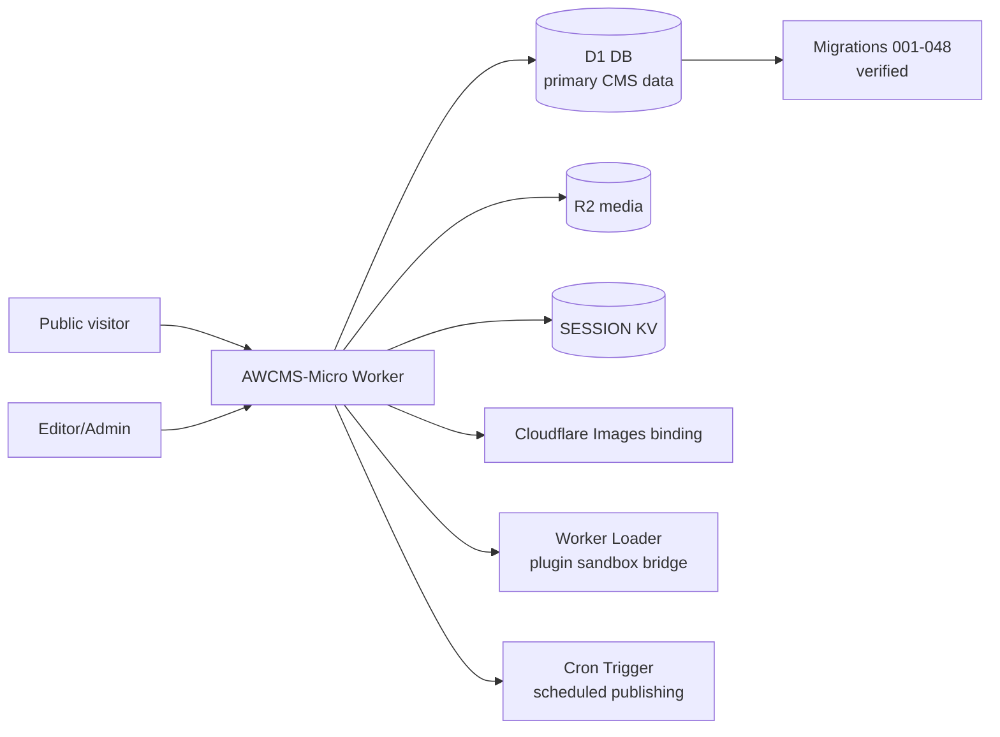
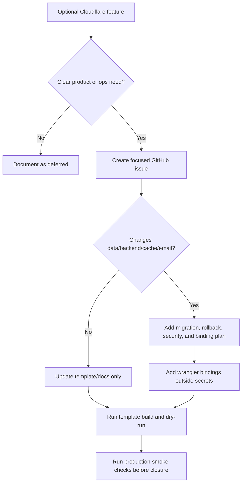

# EmDash 0.26.0 Cloudflare Architecture Decisions

This document records the AWCMS-Micro decision for Cloudflare-related EmDash 0.20.0-0.26.0 additions.

## Scope

- Issue: #222
- Upstream snapshot: EmDash `0.26.0` at `90ffe40a1a31193b2f29ef92202e4f339a2487fa`
- Template: `awcmsmicro-dev/templates/awcms-micro-default-cloudflare/`
- Production Worker: `awcms-micro`
- Production database: Cloudflare D1 `awcms-micro-d1-20260530`

## Decision Summary

AWCMS-Micro keeps the current Cloudflare production architecture as D1 + R2 + Workers + session KV + Images + Worker Loader. EmDash's new Cloudflare capabilities remain available through upstream packages, but the AWCMS-Micro reference template does not silently add new production bindings or change database backends during the 0.26.0 sync.



## Feature Decisions

| Upstream feature | AWCMS-Micro decision | Reason | Binding/config impact |
| --- | --- | --- | --- |
| D1 adapter improvements and request-scoped sessions | Adopt current D1 path | Matches AWCMS-Micro ADR: Micro is EmDash-based on Cloudflare D1 + R2 | Existing `DB` binding remains |
| Cloudflare media image endpoint and image runtime improvements | Adopt through upstream sync | Additive media serving/runtime improvement; current template already has `images.binding = "IMAGES"` and build/dry-run pass | Existing `IMAGES` binding remains |
| LiveSearch route templates and public search suggestions | Adopt where already wired | Both default templates already use EmDash LiveSearch in the public layout | No new binding |
| Media LQIP placeholder improvements | Adopt through upstream sync | Additive public rendering improvement from EmDash core/media components | No new binding |
| Durable Object SQLite production database adapter | Delay | It is a database-backend change. AWCMS-Micro production remains D1 + R2, and switching would require a new migration, rollback, backup, cost, and data-preservation plan | Do not add `durable_objects`/DO database migrations to the reference template in this sync |
| Hyperdrive PostgreSQL adapter and cached binding | Delay / optional only outside Micro default | Hyperdrive targets existing Postgres/MySQL-compatible databases, while AWCMS-Micro ADR keeps Micro on D1. Upstream also notes sandboxed plugin bridge constraints for Hyperdrive deployments | Do not add `hyperdrive` bindings to the reference template |
| KV-backed EmDash object cache | Delay pending measured need | Useful for high-read public content pressure, but it adds a new KV namespace, cache staleness/invalidation behavior, and operational validation requirements | Do not add `CACHE` KV binding until a performance issue justifies it |
| Cloudflare Cache API route cache provider | Delay pending cache strategy | Requires zone/cache purge token decisions and careful public/authenticated response separation | Do not add cache provider or cache purge secrets in this sync |
| Cloudflare Email Sending provider plugin | Delay pending transactional-email design | Cloudflare Email Service is appropriate for transactional email, not bulk/marketing workflows. AWCMS-Micro Email Mailketing needs its own security, deliverability, consent, and binding review before use | Do not add `send_email` binding in this sync |

## Optional Adoption Gate

Future adoption of an optional Cloudflare feature must be issue-driven and must not change production bindings silently.



## Binding Rules

- Keep `DB`, `MEDIA`, `SESSION`, `IMAGES`, `LOADER`, cron triggers, and current `AWCMS_MICRO_*` variables as the accepted production template shape.
- Do not add `HYPERDRIVE`, `HYPERDRIVE_CACHED`, `DB_DO`, `CACHE`, or `EMAIL` bindings without a focused issue and acceptance criteria.
- If object cache is adopted later, create a dedicated KV namespace and document key prefix, TTL, timeout, invalidation behavior, and rollback.
- If Cloudflare Email Sending is adopted later, onboard the sender domain first, restrict sender addresses where practical, and keep `send_email` binding changes with email security and deliverability docs.
- If Durable Object SQLite is adopted later, treat it as a database migration project, not a template toggle.
- If Hyperdrive is adopted later, treat it as a product-line exception because it moves Micro away from the D1 production baseline.

## Validation

This decision does not require template source or `wrangler.jsonc` changes. The current Cloudflare template must still validate unchanged:

```bash
pnpm --dir awcmsmicro-dev/templates/awcms-micro-default-cloudflare test
pnpm --dir awcmsmicro-dev/templates/awcms-micro-default-cloudflare build
pnpm --dir awcmsmicro-dev/templates/awcms-micro-default-cloudflare exec wrangler deploy --dry-run
```

## Status

Issue #222 is complete when this decision document, compatibility matrix, deployment runbook, sync status, root README, root AGENTS, root docs index, root version, and GitHub issue comments all point to the same architecture decision.

