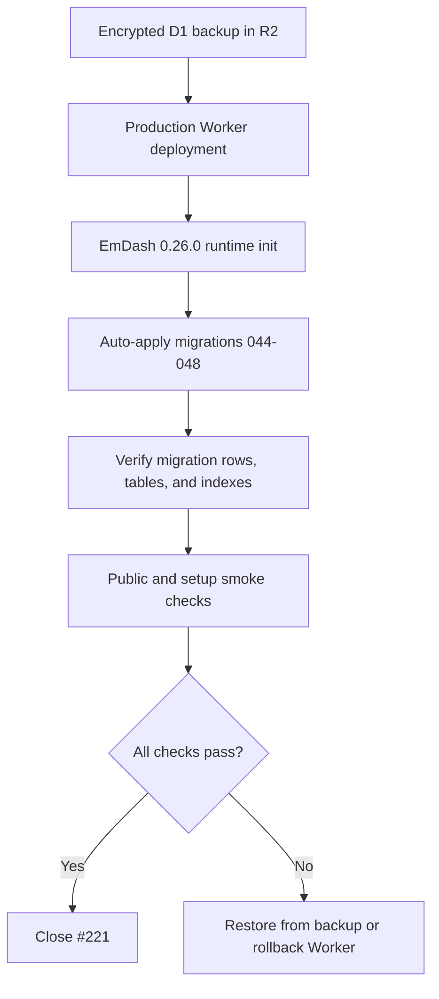

# EmDash 0.26.0 D1 Migration Verification

This document records the production D1 verification for the EmDash 0.26.0 synchronization.

## Scope

- Production Worker: `awcms-micro`
- Production site: `https://awcms-micro.ahlikoding.com`
- D1 database: `awcms-micro-d1-20260530`
- D1 database ID: `90a77136-8ad0-4247-bd48-7f728c2c0a0c`
- Pre-sync backup: `r2://awcms-micro-backups/backups/db/backup-20260702-100524.sql.enc`
- Verified deployment version: `5be81778-b5ba-45e5-aa1c-164655845a5d`
- Deployment time: `2026-07-02T04:14:49.517603Z`

## Migration Impact

| Migration | Impact | Production verification |
| --- | --- | --- |
| `044_comment_reactions` | Adds `_emdash_comment_reactions` plus reaction lookup indexes | table and all three indexes present |
| `045_taxonomy_parent_group` | Rewrites `taxonomies.parent_id` from locale-bound parent row ID to parent `translation_group` when safe | production had 4 taxonomy rows, 0 rows with `parent_id`, so no row rewrite was needed |
| `046_media_usage_index` | Adds `_emdash_media_usage_sources`, `_emdash_media_usage`, and media usage indexes | both tables and all usage indexes present; row counts are currently 0 |
| `047_restore_taxonomy_parent_index` | Restores `idx_taxonomies_parent` | index present |
| `048_restore_content_taxonomies_term_index` | Restores `idx_content_taxonomies_term` | index present |



## Verification Commands

The commands below load Cloudflare credentials through the safe local backup config loader. Do not print token values.

```bash
source scripts/backup/load-config.sh >/dev/null 2>&1

wrangler d1 execute awcms-micro-d1-20260530 --remote --command \
  "SELECT name, timestamp FROM _emdash_migrations ORDER BY name DESC LIMIT 10;"

wrangler d1 execute awcms-micro-d1-20260530 --remote --command \
  "SELECT name, type, tbl_name FROM sqlite_master
   WHERE type IN ('table','index')
     AND name IN (
       '_emdash_comment_reactions',
       'idx_comment_reactions_unique',
       'idx_comment_reactions_comment',
       'idx_comment_reactions_voter',
       '_emdash_media_usage_sources',
       '_emdash_media_usage',
       'idx__emdash_media_usage_sources_content',
       'idx__emdash_media_usage_sources_variant',
       'idx__emdash_media_usage_sources_locale',
       'idx__emdash_media_usage_sources_deleted',
       'idx__emdash_media_usage_sources_translation_group',
       'idx__emdash_media_usage_unique_occurrence',
       'idx__emdash_media_usage_media_id',
       'idx__emdash_media_usage_provider_asset',
       'idx__emdash_media_usage_source_generation',
       'idx_taxonomies_parent',
       'idx_content_taxonomies_term'
     )
   ORDER BY type, name;"

wrangler d1 execute awcms-micro-d1-20260530 --remote --command \
  "SELECT COUNT(*) AS migration_count,
          MIN(name) AS first_migration,
          MAX(name) AS last_migration
     FROM _emdash_migrations;
   SELECT COUNT(*) AS reaction_rows FROM _emdash_comment_reactions;
   SELECT COUNT(*) AS media_usage_sources FROM _emdash_media_usage_sources;
   SELECT COUNT(*) AS media_usage_rows FROM _emdash_media_usage;"
```

## Verified Results

- `_emdash_migrations` contains 47 rows, from `001_initial` through `048_restore_content_taxonomies_term_index`.
- Migration rows 044-048 were recorded at:
  - `044_comment_reactions`: `2026-07-02T04:15:35.215Z`
  - `045_taxonomy_parent_group`: `2026-07-02T04:15:35.581Z`
  - `046_media_usage_index`: `2026-07-02T04:15:38.100Z`
  - `047_restore_taxonomy_parent_index`: `2026-07-02T04:15:38.503Z`
  - `048_restore_content_taxonomies_term_index`: `2026-07-02T04:15:38.876Z`
- New tables present:
  - `_emdash_comment_reactions`
  - `_emdash_media_usage_sources`
  - `_emdash_media_usage`
- New or restored indexes present:
  - `idx_comment_reactions_unique`
  - `idx_comment_reactions_comment`
  - `idx_comment_reactions_voter`
  - `idx__emdash_media_usage_sources_content`
  - `idx__emdash_media_usage_sources_variant`
  - `idx__emdash_media_usage_sources_locale`
  - `idx__emdash_media_usage_sources_deleted`
  - `idx__emdash_media_usage_sources_translation_group`
  - `idx__emdash_media_usage_unique_occurrence`
  - `idx__emdash_media_usage_media_id`
  - `idx__emdash_media_usage_provider_asset`
  - `idx__emdash_media_usage_source_generation`
  - `idx_taxonomies_parent`
  - `idx_content_taxonomies_term`
- Current row counts:
  - `_emdash_comment_reactions`: 0
  - `_emdash_media_usage_sources`: 0
  - `_emdash_media_usage`: 0
- Taxonomy parent rewrite exposure:
  - taxonomy rows: 4
  - rows with `parent_id`: 0
  - rows eligible for rewrite by migration 045: 0

## Smoke Checks

The following public and setup routes returned HTTP 200 after migration and deployment:

```txt
/ 200
/posts 200
/news 200
/about 200
/sitemap.xml 200
/id 200
/id/posts 200
/services 200
/_emdash/api/setup/status 200
/_emdash/api/auth/mode 200
```

Protected admin APIs correctly returned 401 for anonymous requests.

## Rollback Guidance

Use forward recovery first where possible. If a data-layer rollback is required, restore from the encrypted R2 backup rather than running destructive down migrations:

```txt
r2://awcms-micro-backups/backups/db/backup-20260702-100524.sql.enc
```

If the Worker release itself must be rolled back, use Cloudflare Worker version rollback to the previous known-good deployment and then re-run smoke checks before declaring recovery complete.

## Status

Issue #221 is complete for the observed production state: migrations 044-048 are applied, required schema objects exist, public smoke checks pass, and rollback guidance points to the pre-sync encrypted D1 backup.
