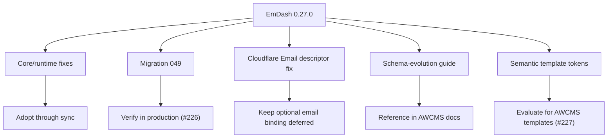
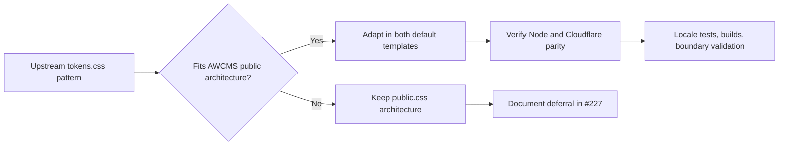

# EmDash 0.27.0 Cloudflare and Template Decisions

## Summary

EmDash 0.27.0 keeps AWCMS-Micro on the existing D1 + R2 + session KV + Images + Worker Loader topology. The sync adopts upstream runtime fixes directly and tracks template architecture changes separately because AWCMS-Micro default templates are protected downstream boundaries.

## Adopted Directly

- Admin branding fallback to the configured Site Title when no build-time `admin.siteName` is configured.
- Slug-change 301 redirects for published entries whose slug changes through the draft/revision publish path.
- `--no-content` seed/setup behavior now also skips sample bylines and taxonomy terms.
- Cloudflare/Vite dependency optimizer hardening for first-party packages and setup/image/content paths.
- Indonesian admin translation completion from upstream PR #1713.
- D1 migration `049_taxonomies_name_locale_index`, verified in production in #226.
- Upstream schema-evolution documentation for deployed sites.

## Deferred or Tracked

Cloudflare Email Sending remains optional and deferred for AWCMS-Micro production defaults. EmDash 0.27.0 improves the provider so `cloudflareEmail()` returns a bundlable plugin descriptor, but adopting it still requires sender-domain onboarding, consent/notification policy, deliverability checks, and a `send_email` Worker binding. This stays under the existing Cloudflare architecture deferral policy unless a focused email issue reopens it.

D1 read replica sessions remain disabled by default for AWCMS-Micro templates. EmDash 0.27.0 documents that D1 Sessions API modes are incompatible with the `global_fetch_strictly_public` compatibility flag. The current AWCMS-Micro D1-first topology does not add replica sessions in this sync.

The upstream semantic theme-token architecture for built-in blog, marketing, and portfolio templates is tracked in #227. The AWCMS-Micro default templates use protected CMS-sourced public page architecture and must not be silently reshaped by upstream built-in-template changes.

## Template Decision Flow

## Current Decision

- Adopt 0.27.0 core/runtime/database changes through upstream sync.
- Keep migration 049 verification evidence in `EMDASH_0_27_D1_MIGRATION_VERIFICATION.md`.
- Defer Cloudflare Email binding adoption until a dedicated email implementation issue exists.
- Track semantic template-token adoption in #227 before changing protected template styling.
