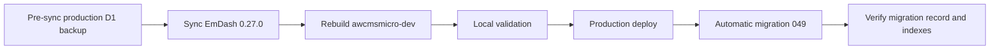

# EmDash 0.27.0 D1 Migration 049 Verification

## Scope

EmDash 0.27.0 adds migration `049_taxonomies_name_locale_index`, which creates a composite taxonomy lookup index and drops the superseded single-column taxonomy-name index.



## Pre-Sync Backup

- Backup command: `bash scripts/backup/backup-db.sh --type d1`
- Database: `awcms-micro-d1-20260530`
- Backup object: `r2://awcms-micro-backups/backups/db/backup-20260703-051234.sql.enc`
- Retention: 7 backups

## Migration Details

Migration `049_taxonomies_name_locale_index`:

- creates `idx_taxonomies_name_locale` on `taxonomies(name, locale)`;
- drops `idx_taxonomies_name`;
- keeps `idx_taxonomies_locale` for locale-only lookups;
- is idempotent and safe to retry after a partial apply.

The migration is performance-oriented. It does not add tables, remove content rows, or change public API shape.

## Verification Queries

Run after production deployment:

```sql
SELECT name
FROM _emdash_migrations
WHERE name = '049_taxonomies_name_locale_index';

SELECT name, sql
FROM sqlite_master
WHERE type = 'index'
  AND tbl_name = 'taxonomies'
  AND name IN ('idx_taxonomies_name_locale', 'idx_taxonomies_name', 'idx_taxonomies_locale')
ORDER BY name;
```

Expected:

- `_emdash_migrations` contains `049_taxonomies_name_locale_index`;
- `idx_taxonomies_name_locale` exists and covers `name, locale`;
- `idx_taxonomies_name` is absent;
- `idx_taxonomies_locale` remains present.

## Current Status

- Local upstream snapshot: `932f4ba3adef8be21abc39b4cc7612609895e88c`
- Local rebuild: completed through `bash scripts/update-awcmsmicro-dev.sh continuation`
- Tracking issue: #226, closed after production verification
- Production Worker version: `d369494d-96b1-4ba1-8af6-6056e79c94c6`
- Deployment created: 2026-07-02T22:23:14.118Z
- Production verification: completed

## Production Query Evidence

Migration record:

```json
[
  {
    "name": "049_taxonomies_name_locale_index"
  }
]
```

Migration timestamp from `_emdash_migrations`:

```json
[
  {
    "name": "049_taxonomies_name_locale_index",
    "timestamp": "2026-07-02T22:23:34.027Z"
  }
]
```

Taxonomy indexes after migration:

```json
[
  {
    "name": "idx_taxonomies_locale",
    "sql": "CREATE INDEX \"idx_taxonomies_locale\" on \"taxonomies\" (\"locale\")"
  },
  {
    "name": "idx_taxonomies_name_locale",
    "sql": "CREATE INDEX \"idx_taxonomies_name_locale\" on \"taxonomies\" (\"name\", \"locale\")"
  }
]
```

The superseded `idx_taxonomies_name` index was absent from the filtered index query.

## Post-Deploy Smoke Evidence

Public and API route smoke checks after deploying Worker version `d369494d-96b1-4ba1-8af6-6056e79c94c6`:

| Route | Status |
| --- | --- |
| `/` | 200 |
| `/posts` | 200 |
| `/news` | 200 |
| `/about` | 200 |
| `/sitemap.xml` | 200 |
| `/id` | 200 |
| `/id/posts` | 200 |
| `/services` | 200 |
| `/_emdash/api/setup/status` | 200 |
| `/_emdash/api/auth/mode` | 200 |

## Scheduled Publishing Continuity

Scheduled publishing was re-verified after the 0.27.0 production deployment:

- Scheduled test row: `schedtest_publish_20260702222728`
- Unschedule guard row: `schedtest_unschedule_20260702222728`
- Scheduled time: `2026-07-02T22:29:28Z`
- Result: scheduled row became `published`, `scheduled_at` became `NULL`, and `published_at` remained `2026-07-02T22:29:28Z`
- Guard result: guard row stayed `draft` with `scheduled_at = NULL` and `published_at = NULL`
- Public route: `/posts/scheduled-publish-test-20260702222728` returned `200` before cleanup
- Cleanup: temporary content rows and generated revision `01KWJF7CNR0N0GDDF5JG84ZGTY` were removed; the route returned `404` after cleanup
