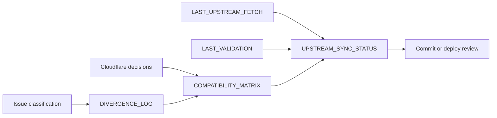

# Upstream Sync Tracking

This folder tracks how the parent repository follows upstream EmDash and how AWCMS-Micro-specific additions remain isolated from the upstream baseline.

## Purpose

- record the current upstream sync target and validation state
- document known divergence that is intentional for AWCMS-Micro
- provide a repeatable validation record after sync operations
- make operational review easier before committing or deploying changes

## Files

- `UPSTREAM_SYNC_STATUS.md`: current sync target, operator metadata, and validation status
- `LAST_UPSTREAM_FETCH.md`: exact upstream commit copied into `emdash-latest/`
- `DIVERGENCE_LOG.md`: intentional AWCMS-Micro additions or deviations from upstream EmDash
- `COMPATIBILITY_MATRIX.md`: feature-level compatibility review between upstream EmDash and AWCMS-Micro usage
- `EMDASH_0_26_CLOUDFLARE_ARCHITECTURE_DECISIONS.md`: Cloudflare architecture adoption and deferral decisions for EmDash 0.20.0-0.26.0 features
- `EMDASH_0_26_D1_MIGRATION_VERIFICATION.md`: production D1 migration 044-048 verification for the EmDash 0.26.0 sync
- `LAST_VALIDATION.md`: latest validation run template and results
- `ISSUE_CLASSIFICATION_DOWNSTREAM_VS_UPSTREAM.md`: triage guide for deciding whether an issue should be fixed downstream or upstream
- `UPSTREAM_PR_PLAN_ADMIN_SIDEBAR_ORDERING.md`: narrow upstream PR plan for consuming plugin sidebar ordering metadata in the global admin sidebar

## Reading Order

1. Read `UPSTREAM_SYNC_STATUS.md` for the current summary.
2. Read `LAST_UPSTREAM_FETCH.md` for the exact upstream revision.
3. Read `LAST_VALIDATION.md` for the latest validation result.
4. Read `COMPATIBILITY_MATRIX.md` for feature-level adoption and adaptation notes.
5. Read `EMDASH_0_26_CLOUDFLARE_ARCHITECTURE_DECISIONS.md` before changing optional Cloudflare bindings in the AWCMS-Micro template.
6. Read `EMDASH_0_26_D1_MIGRATION_VERIFICATION.md` before reviewing production migration 044-048 state.
7. Read `DIVERGENCE_LOG.md` for downstream decisions that intentionally differ from a plain upstream checkout.
8. Read `ISSUE_CLASSIFICATION_DOWNSTREAM_VS_UPSTREAM.md` before deciding whether a finding belongs in downstream boundaries or upstream EmDash core.
9. Read `UPSTREAM_PR_PLAN_ADMIN_SIDEBAR_ORDERING.md` before preparing the upstream sidebar ordering PR plan.

## Operating Rule

Use this folder only for parent-repository governance and sync tracking. Do not use it to justify modifying EmDash core inside `emdash-latest/`.
